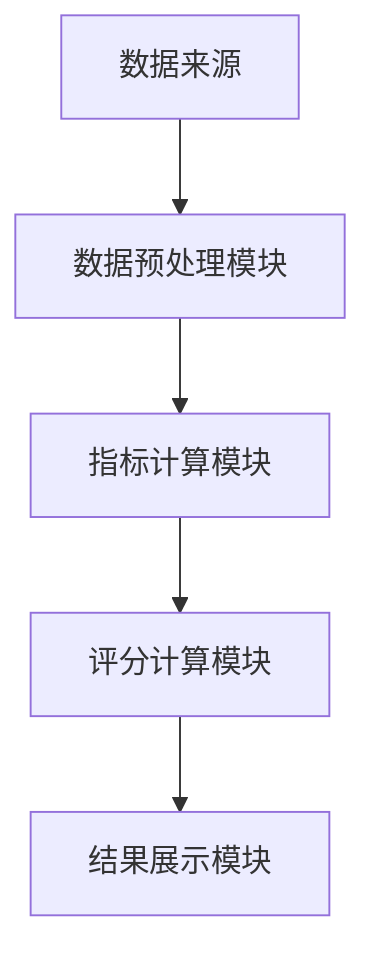

                 


# 约瑟夫·皮奥特罗斯基的价值投资评分卡：系统化选股方法

## 关键词：价值投资，评分卡，约瑟夫·皮奥特罗斯基，系统化选股，投资策略

## 摘要：约瑟夫·皮奥特罗斯基的价值投资评分卡是一种系统化选股方法，通过综合评估多个财务和非财务指标，帮助投资者识别具有投资价值的股票。本文详细介绍了评分卡的核心概念、数学模型、系统架构以及实际应用，为投资者提供了一种科学、可靠的选股工具。

---

## 第1章: 价值投资的基本概念

### 1.1 价值投资的定义与核心理念

#### 1.1.1 价值投资的起源与发展

价值投资是一种长期投资策略，起源于20世纪初，由本杰明·格雷厄姆和戴维·多德等人提出。它基于对股票内在价值的深入分析，寻找市场价格低于内在价值的股票进行投资。随着时间的推移，价值投资策略不断完善，逐渐成为投资领域的重要方法之一。

#### 1.1.2 价值投资的核心理念与原则

价值投资的核心理念是购买低于其内在价值的股票，并长期持有，等待其价值回归。其基本原则包括：

1. **安全边际**：购买价格远低于内在价值的股票，以降低投资风险。
2. **长期视角**：关注企业的长期盈利能力，而非短期市场波动。
3. **基本面分析**：通过分析企业的财务状况、行业地位和竞争优势，评估其内在价值。

#### 1.1.3 价值投资与其它投资策略的对比

与其他投资策略相比，价值投资注重基本面分析，强调安全边际和长期持有。与成长投资不同，价值投资更关注低估值的股票，而不是高增长的公司。

---

### 1.2 约瑟夫·皮奥特罗斯基的贡献

#### 1.2.1 约瑟夫·皮奥特罗斯基的生平简介

约瑟夫·皮奥特罗斯基（Joseph Piotroski）是一位著名的投资专家，以其创新的价值投资方法而闻名。他提出了价值投资评分卡的概念，为价值投资领域提供了新的工具和方法。

#### 1.2.2 皮奥特罗斯基在价值投资领域的创新

皮奥特罗斯基的创新主要体现在以下几个方面：

1. **量化评估**：将定性分析转化为定量指标，使选股过程更加系统化。
2. **多指标分析**：综合考虑多个财务和非财务指标，全面评估企业的投资价值。
3. **动态调整**：根据市场变化和企业状况，动态调整评分卡的权重和指标。

#### 1.2.3 皮奥特罗斯基评分卡的提出背景

在传统价值投资中，投资者主要依赖财务报表分析和行业经验进行选股。然而，这种方法主观性较强，难以量化和系统化。皮奥特罗斯基评分卡的提出，旨在克服这些局限性，提供一种更加客观、系统化的选股方法。

---

## 第2章: 价值投资评分卡的核心概念

### 2.1 评分卡的基本框架

#### 2.1.1 评分卡的定义与作用

价值投资评分卡是一种用于评估股票投资价值的工具，通过量化多个指标，综合计算出一个总分，帮助投资者快速筛选出具有投资潜力的股票。

#### 2.1.2 评分卡的核心要素与指标

评分卡的核心要素包括：

1. **财务指标**：如盈利能力、成长能力、偿债能力等。
2. **非财务指标**：如行业地位、管理团队、竞争优势等。
3. **权重分配**：不同指标在总分中的权重不同，反映了其重要性。

#### 2.1.3 评分卡的权重分配与计算方法

权重分配是评分卡设计的关键步骤，通常基于指标的重要性、相关性和可量化性。计算方法包括加权平均法和层次分析法等。

---

### 2.2 评分卡的指标体系

#### 2.2.1 财务指标的选择与权重

财务指标是评分卡的重要组成部分，常见的指标包括：

1. **盈利能力**：如净利润率、ROE（净资产收益率）。
2. **成长能力**：如收入增长率、净利润增长率。
3. **偿债能力**：如资产负债率、流动比率。

#### 2.2.2 非财务指标的引入与评估

非财务指标提供了企业内在价值的重要信息，如：

1. **行业地位**：企业在行业中的排名和竞争优势。
2. **管理团队**：管理层的经验和能力。
3. **竞争优势**：企业的专利、品牌和市场地位。

#### 2.2.3 指标之间的关联性分析

指标之间的关联性分析有助于优化评分卡的设计，避免指标之间的重复和冗余。常用的方法包括相关性分析和主成分分析。

---

## 第3章: 评分卡的数学模型与评分系统

### 3.1 评分卡的数学模型

#### 3.1.1 指标权重的确定方法

指标权重的确定方法包括：

1. **层次分析法（AHP）**：通过构建判断矩阵，计算各指标的权重。
2. **熵值法**：基于信息熵原理，确定指标权重。

#### 3.1.2 综合评分的计算公式

综合评分的计算公式如下：

$$
\text{综合评分} = \sum_{i=1}^{n} w_i \times s_i
$$

其中，\( w_i \) 是第 \( i \) 个指标的权重，\( s_i \) 是第 \( i \) 个指标的评分。

#### 3.1.3 模型的验证与优化

模型的验证可以通过历史数据回测和实证分析进行。优化方法包括调整指标权重和引入新的指标。

---

### 3.2 评分卡的评分系统设计

#### 3.2.1 评分等级的划分标准

评分等级通常分为五个等级，从A（最优）到E（最差）。

#### 3.2.2 不同评分等级的投资策略

根据评分等级，投资者可以制定不同的投资策略，如：

- **A级**：强烈买入，长期持有。
- **B级**：买入，定期跟踪。
- **C级**：观望，等待机会。
- **D级**：卖出，避免投资。
- **E级**：清仓，避免损失。

#### 3.2.3 评分系统的动态调整机制

评分系统需要定期调整，以适应市场变化和企业状况。调整方法包括更新指标权重和引入新的指标。

---

## 第4章: 评分卡的系统架构与实现

### 4.1 系统架构设计

#### 4.1.1 系统功能模块划分

系统功能模块包括：

1. **数据获取模块**：获取股票数据和企业信息。
2. **数据预处理模块**：清洗和转换数据。
3. **指标计算模块**：计算各指标的评分。
4. **评分计算模块**：综合计算总分并生成评分等级。
5. **结果展示模块**：展示评分结果和投资建议。

#### 4.1.2 系统数据流图

系统数据流图如下：



#### 4.1.3 系统架构的优缺点分析

优点：模块化设计，便于维护和扩展；缺点：对数据质量和及时性要求较高。

---

### 4.2 系统实现细节

#### 4.2.1 数据获取与预处理

数据获取可以通过API或数据库实现。预处理包括数据清洗和标准化。

#### 4.2.2 指标计算与评分生成

指标计算需要根据公式进行，评分生成基于综合评分公式。

#### 4.2.3 评分结果的可视化展示

结果展示可以通过仪表盘或报告形式呈现，便于投资者理解和使用。

---

## 第5章: 评分卡的项目实战

### 5.1 环境搭建与数据准备

#### 5.1.1 开发环境的安装与配置

推荐使用Python和相关库（如Pandas、NumPy）进行开发。

#### 5.1.2 数据来源与数据清洗

数据来源包括金融数据库和API。数据清洗包括处理缺失值和异常值。

#### 5.1.3 数据存储与管理

数据可以存储在数据库中，便于后续处理和分析。

---

### 5.2 系统核心实现

#### 5.2.1 指标计算模块的实现

代码示例：

```python
def calculate_profitability(revenue, net_income):
    return (net_income / revenue) * 100
```

#### 5.2.2 评分计算模块的实现

代码示例：

```python
def calculate_total_score(weights, scores):
    return sum(w * s for w, s in zip(weights, scores))
```

#### 5.2.3 评分结果展示模块的实现

代码示例：

```python
def display_result(stock_name, total_score):
    print(f"股票名称: {stock_name}")
    print(f"综合评分: {total_score}")
```

---

## 第6章: 评分卡的最佳实践与总结

### 6.1 最佳实践 tips

#### 6.1.1 评分卡使用的注意事项

- 定期更新数据和模型。
- 结合市场环境和行业趋势进行调整。

#### 6.1.2 评分卡的优化建议

- 引入更多的指标和数据源。
- 增强模型的适应性和灵活性。

#### 6.1.3 不同市场环境下的评分卡调整

根据市场环境的变化，适当调整指标权重和评分标准。

---

### 6.2 项目总结与展望

#### 6.2.1 项目成果回顾

通过本文的介绍，读者可以系统地了解约瑟夫·皮奥特罗斯基的价值投资评分卡，并掌握其实际应用方法。

#### 6.2.2 评分卡的局限性分析

评分卡的局限性包括：

- 受数据质量和模型假设的影响。
- 无法完全预测市场波动。

#### 6.2.3 未来研究方向与改进空间

未来可以研究以下方向：

- 引入机器学习算法，提高评分的准确性。
- 结合实时数据，增强评分的动态性。

---

## 作者：AI天才研究院/AI Genius Institute & 禅与计算机程序设计艺术 /Zen And The Art of Computer Programming

