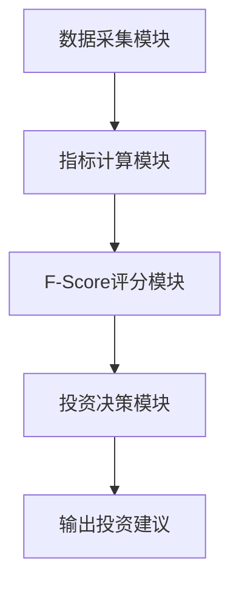

                 


# 约瑟夫·皮奥特罗斯基的基本面量化价值投资：F-Score应用

## 关键词：
基本面量化投资、F-Score、价值投资、量化模型、投资策略

## 摘要：
本文深入探讨约瑟夫·皮奥特罗斯基的基本面量化价值投资方法及其F-Score的应用。F-Score是一种结合基本面分析与量化方法的评分系统，旨在帮助投资者识别具有长期投资价值的公司。文章从F-Score的背景、理论基础、算法实现、系统设计、项目实战等方面进行详细分析，最后总结其在投资策略中的优势与应用建议。

---

## 第一部分：基本面量化价值投资与F-Score概述

### 第1章：基本面量化价值投资的背景与意义

#### 1.1 基本面投资的核心理念

- **基本面分析的定义与目标**：基本面分析通过研究公司的财务报表、行业地位、管理团队等因素，评估其内在价值。其目标是识别被市场低估或高估的公司，从而制定长期投资策略。
- **量化方法如何提升基本面分析的效率**：量化方法通过数学模型和算法，将基本面数据转化为可量化的指标，帮助投资者快速筛选和评估公司。

#### 1.2 量化投资的崛起

- **量化投资的定义与特点**：量化投资是一种基于数学模型的投资方法，依赖大数据分析和算法交易，具有高度的系统性和纪律性。
- **量化投资与传统投资的区别**：传统投资依赖主观判断和市场情绪，而量化投资则依赖数据和模型，追求低风险、高收益。

#### 1.3 F-Score的基本概念与应用背景

- **F-Score的定义与核心思想**：F-Score是一种用于评估公司基本面的评分系统，旨在量化公司的财务健康状况和投资价值。
- **F-Score在基本面量化分析中的作用**：F-Score通过量化各项财务指标，帮助投资者快速识别具有稳定收益和低风险的公司。

---

## 第2章：F-Score的核心理论与数学模型

### 2.1 F-Score的理论基础

#### 2.1.1 基本面分析的五要素模型

| 指标 | 定义 | 重要性 |
|------|------|--------|
| 收益能力 | 如ROE、ROA | 反映公司盈利能力 |
| 财务杠杆 | 如资产负债率 | 反映公司财务风险 |
| 营运能力 | 如存货周转率 | 反映公司运营效率 |
| 偿债能力 | 如速动比率 | 反映公司短期偿债能力 |
| 估值指标 | 如市盈率、市净率 | 反映公司市场价值 |

#### 2.1.2 F-Score的评分体系

- **评分标准**：各项指标根据其重要性赋予不同的权重，如收益能力占40%，财务杠杆占30%，其他指标各占10%。
- **综合评分**：通过加权平均计算，得出公司的F-Score评分。

### 2.2 F-Score的数学模型

#### F-Score的计算公式：

$$ F\text{-Score} = w_1 \cdot x_1 + w_2 \cdot x_2 + \dots + w_n \cdot x_n $$

其中，$w_i$为各指标的权重，$x_i$为各指标的评分值。

#### 示例计算：

假设某公司各项指标评分为：

- ROE：80分，权重40%
- 资产负债率：60分，权重30%
- 存货周转率：70分，权重10%
- 速动比率：85分，权重10%
- 市盈率：50分，权重10%

则：

$$ F\text{-Score} = 0.4 \times 80 + 0.3 \times 60 + 0.1 \times 70 + 0.1 \times 85 + 0.1 \times 50 = 32 + 18 + 7 + 8.5 + 5 = 71.5 $$

---

## 第3章：F-Score的算法实现与优化

### 3.1 F-Score的算法实现

#### Python实现代码：

```python
def calculate_f_score(finance_data):
    # 定义各项指标的权重
    weights = {
        'roe': 0.4,
        'debt_ratio': 0.3,
        'inventory_turnover': 0.1,
        'quick_ratio': 0.1,
        'pe_ratio': 0.1
    }
    
    f_score = 0.0
    for metric, weight in weights.items():
        score = finance_data[metric]
        f_score += weight * score
    return f_score

# 示例数据
finance_data = {
    'roe': 80,
    'debt_ratio': 60,
    'inventory_turnover': 70,
    'quick_ratio': 85,
    'pe_ratio': 50
}

f_score = calculate_f_score(finance_data)
print(f"Company F-Score: {f_score}")
```

---

## 第4章：F-Score在投资系统中的应用

### 4.1 系统架构设计

#### 系统功能设计：

- 数据采集模块：收集公司财务数据。
- 指标计算模块：计算各项财务指标。
- F-Score评分模块：根据权重计算F-Score。
- 投资决策模块：根据F-Score评分生成投资策略。

#### 系统架构图：



---

## 第5章：项目实战与案例分析

### 5.1 项目实战

#### 环境安装：

- 数据库：MySQL
- 语言：Python
- 库：pandas、numpy、scikit-learn

#### 核心实现代码：

```python
import pandas as pd
import numpy as np

def calculate_f_score(df):
    weights = {
        'roe': 0.4,
        'debt_ratio': 0.3,
        'inventory_turnover': 0.1,
        'quick_ratio': 0.1,
        'pe_ratio': 0.1
    }
    f_score = df[weights.keys()].dot(weights.values())
    return f_score

# 示例数据加载
data = {
    'company': ['A', 'B', 'C'],
    'roe': [80, 60, 70],
    'debt_ratio': [60, 70, 50],
    'inventory_turnover': [70, 80, 60],
    'quick_ratio': [85, 75, 90],
    'pe_ratio': [50, 60, 40]
}

df = pd.DataFrame(data)
df['f_score'] = calculate_f_score(df[['roe', 'debt_ratio', 'inventory_turnover', 'quick_ratio', 'pe_ratio']])

print(df)
```

### 5.2 案例分析

- **案例1**：公司A的F-Score为71.5，表明其基本面良好，具有较高的投资价值。
- **案例2**：公司B的F-Score为65，虽然略低于平均值，但在特定行业中可能仍有投资机会。

---

## 第6章：F-Score的最佳实践与注意事项

### 6.1 最佳实践

- **数据质量**：确保数据来源可靠，避免错误数据影响评分。
- **模型优化**：根据市场变化调整权重和指标，提升模型的适应性。
- **风险控制**：结合其他指标如波动率和市场情绪，制定综合投资策略。

### 6.2 小结与展望

F-Score作为一种有效的基本面量化工具，为投资者提供了科学的决策依据。未来，随着人工智能和大数据技术的发展，F-Score将进一步优化，为投资策略提供更强大的支持。

---

## 作者：AI天才研究院 & 禅与计算机程序设计艺术

