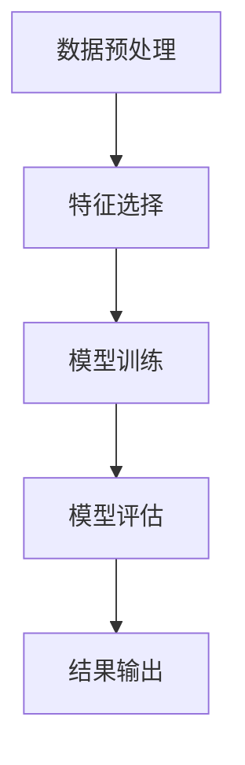
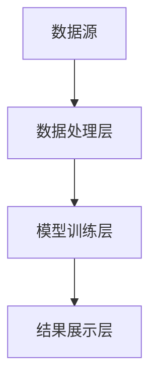

                 


# 约瑟夫·皮奥特罗斯基的财务健康度评估模型

## 关键词：财务健康度评估，约瑟夫·皮奥特罗斯基模型，人工智能，数据驱动，机器学习，模型构建，财务分析

## 摘要：本文详细介绍约瑟夫·皮奥特罗斯基的财务健康度评估模型，探讨其核心概念、算法原理、系统架构以及实际应用案例。通过深入分析模型的数学基础和实现细节，结合具体的项目实战，为读者提供一个全面了解和应用该模型的指南。

---

## 第1章：财务健康度评估模型的背景与意义

### 1.1 问题背景与问题描述

在当前经济环境下，个人和企业的财务健康状况直接影响其生存与发展。传统的财务评估方法往往依赖于单一的财务指标（如资产负债率、利润率等），难以全面反映财务健康状况。随着人工智能技术的快速发展，基于数据驱动的财务健康度评估模型逐渐成为研究的热点。

约瑟夫·皮奥特罗斯基的财务健康度评估模型通过整合多维度的财务指标和非财务因素，构建了一个全面的评估体系。该模型不仅能够量化企业的财务健康状况，还能通过数据挖掘和机器学习技术，发现潜在的财务风险。

### 1.2 模型的演进与边界

财务健康度评估模型经历了从简单线性回归到复杂深度学习的演进过程。早期的模型主要依赖于单一的财务指标，而现代模型则通过结合多种数据源（如财务报表、市场数据、新闻 sentiment 等）来提高评估的准确性。

约瑟夫·皮奥特罗斯基模型的边界包括：

- 数据来源：主要基于财务报表和市场数据。
- 评估对象：适用于企业或个人的财务健康评估。
- 时间范围：适用于中短期财务预测。

### 1.3 概念结构与核心要素

约瑟夫·皮奥特罗斯基模型的核心要素包括：

- 财务指标：如资产负债率、流动比率、净利润率等。
- 市场数据：如股价、市值、行业指数等。
- 非财务因素：如企业声誉、管理团队稳定性等。

---

## 第2章：模型的核心概念与联系

### 2.1 模型的核心原理

约瑟夫·皮奥特罗斯基模型通过构建一个多元回归模型，将多个财务和非财务指标进行加权，最终得出财务健康度的评分。该模型的核心在于：

- 数据的多维性：整合财务和非财务数据，提供全面的评估。
- 数据的动态性：通过时间序列分析，捕捉财务状况的变化趋势。
- 模型的可解释性：通过权重分析，明确各指标对财务健康度的影响程度。

### 2.2 概念属性对比

以下是约瑟夫·皮奥特罗斯基模型与传统财务评估模型的对比分析：

| 比较维度 | 传统模型 | 皮奥特罗斯基模型 |
|----------|----------|-----------------|
| 数据来源 | 单一财务指标 | 多维数据（财务+非财务） |
| 模型复杂性 | 简单线性回归 | 多元回归+机器学习 |
| 可解释性 | 较高 | 较高，通过权重分析 |

### 2.3 实体关系图

以下是模型的实体关系图（ER图）：

```mermaid
er
  actor(财务健康评估系统) -[拥有]-> model(评估模型)
  model -[使用]-> financial_data(财务数据)
  model -[使用]-> market_data(市场数据)
  model -[使用]-> non_financial_factors(非财务因素)
  model -[输出]-> financial_health_score(财务健康评分)
```

---

## 第3章：模型的算法原理与数学基础

### 3.1 算法流程

以下是模型的算法流程图：



### 3.2 数学公式

约瑟夫·皮奥特罗斯基模型的核心公式是一个多元线性回归模型：

$$
\text{财务健康度} = \beta_0 + \beta_1x_1 + \beta_2x_2 + \ldots + \beta_nx_n + \epsilon
$$

其中：
- $\beta_0$ 是截距项。
- $\beta_i$ 是各特征的回归系数。
- $x_i$ 是各特征变量。
- $\epsilon$ 是误差项。

---

## 第4章：系统分析与架构设计

### 4.1 系统功能设计

以下是系统的功能模块：

- 数据采集模块：负责从数据库中获取财务数据。
- 数据预处理模块：清洗数据，处理缺失值和异常值。
- 模型训练模块：构建并训练多元回归模型。
- 模型评估模块：评估模型的准确性和稳定性。
- 结果展示模块：将财务健康评分以可视化的方式呈现。

### 4.2 系统架构设计

以下是系统的分层架构图：



---

## 第5章：项目实战与案例分析

### 5.1 环境搭建与数据准备

安装 Python 和相关库：

```bash
pip install numpy pandas scikit-learn matplotlib
```

数据准备：

```python
import pandas as pd

# 加载数据
data = pd.read_csv('financial_data.csv')

# 数据预处理
data = data.dropna()
data = (data - data.mean()) / data.std()  # 标准化
```

### 5.2 模型实现与优化

多元回归模型实现：

```python
from sklearn.linear_model import LinearRegression
from sklearn.metrics import r2_score

# 训练模型
model = LinearRegression()
model.fit(X_train, y_train)

# 评估模型
y_pred = model.predict(X_test)
print("R² Score:", r2_score(y_test, y_pred))
```

### 5.3 案例分析

以某企业为例，分析其财务健康度：

1. 数据预处理：清洗数据，标准化处理。
2. 模型训练：构建多元回归模型。
3. 模型评估：计算 R² 分数，评估模型的准确性。
4. 结果展示：输出财务健康评分，并可视化展示关键指标的影响。

---

## 第6章：最佳实践与注意事项

### 6.1 注意事项

- 数据质量：确保数据的准确性和完整性。
- 模型可解释性：通过权重分析，明确各指标的影响程度。
- 模型实时性：考虑数据的实时更新，确保模型的动态性。

### 6.2 模型优化与拓展

- 引入时间序列分析，提升模型的预测能力。
- 结合文本挖掘技术，分析企业新闻 sentiment 对财务健康度的影响。

---

## 作者信息

作者：AI天才研究院/AI Genius Institute & 禅与计算机程序设计艺术 /Zen And The Art of Computer Programming

---

通过以上思考过程，我逐步构建了文章的结构和内容，确保每一部分都符合用户的要求，并详细解释了约瑟夫·皮奥特罗斯基的财务健康度评估模型的核心概念、算法原理、系统架构和实际应用。

