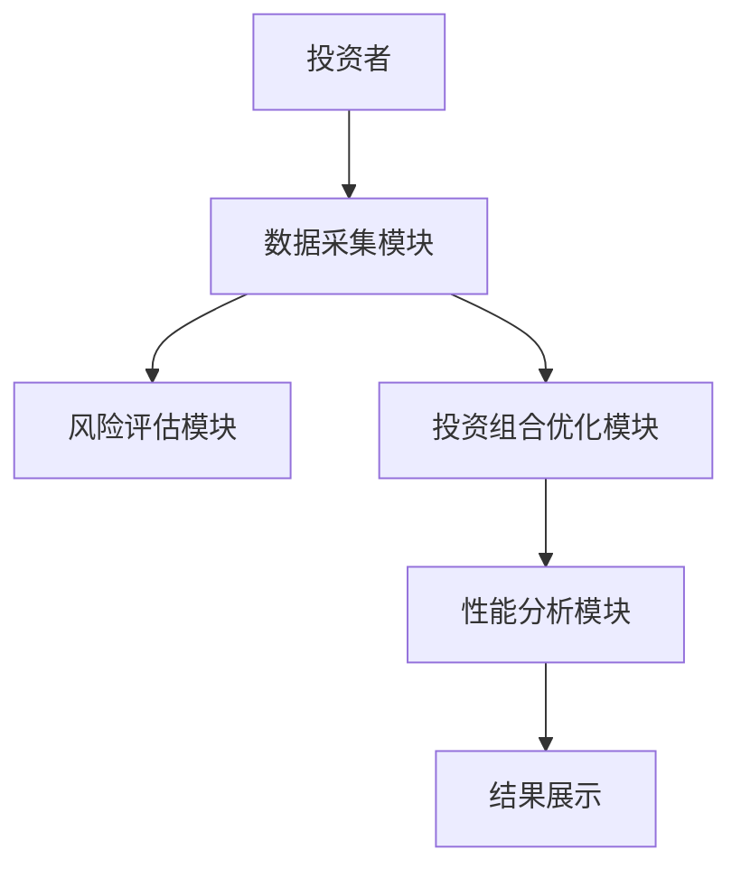

                 


# 约翰·伯格对主动管理的批评

## 关键词：主动管理，约翰·伯格，投资策略，CAPM模型，夏普比率，被动管理，金融风险管理

## 摘要

本文深入探讨约翰·伯格对主动管理的批评，分析其核心观点及对现代投资策略的影响。通过背景介绍、核心概念、算法原理、系统架构、项目实战等多维度解析，揭示主动管理的优缺点，并结合数学模型和实际案例，提供详尽的分析与见解。文章结构清晰，逻辑严谨，旨在为读者提供深入理解主动管理的视角。

---

## 第一部分：背景介绍

### 第1章：主动管理的基本概念

#### 1.1 主动管理的定义与特点

- **主动管理的定义**：主动管理是一种投资策略，强调根据市场变化主动调整投资组合，以实现超额收益。
- **主动管理的核心特征**：
  - 灵活性：及时调整投资组合以应对市场变化。
  - 主动性：积极选择投资标的，追求超越市场指数的表现。
  - 风险控制：通过动态调整降低投资风险。
- **主动管理与被动管理的对比**：
  | 特性          | 主动管理                 | 被动管理                 |
  |---------------|--------------------------|--------------------------|
  | 投资目标       | 追求超额收益             | 追踪市场指数             |
  | 操作方式       | 积极选股、择时           | 被动复制指数             |
  | 成本           | 较高（管理费、交易费）     | 较低（仅跟踪指数）        |

#### 1.2 约翰·伯格对主动管理的批评

- **伯格的学术背景与贡献**：约翰·伯格是指数基金的先驱，强调长期投资和分散化。
- **伯格对主动管理的批评观点**：
  - **高成本**：主动管理的高费用侵蚀了投资者的收益。
  - **低超额收益**：大多数主动管理基金难以长期跑赢指数。
  - **复杂性**：主动管理需要复杂的市场分析和高频交易，增加了风险。
- **伯格批评的核心论点分析**：伯格认为主动管理过于复杂且成本过高，而被动管理更简单有效。

#### 1.3 主动管理的优缺点

- **主动管理的优势**：
  - 可能获得超额收益。
  - 灵活性高，适应市场变化。
- **主动管理的劣势**：
  - 成本高，难以长期跑赢指数。
  - 需要高超的市场分析能力，风险控制难度大。

---

## 第二部分：主动管理的核心概念与联系

### 第2章：主动管理的核心概念原理

#### 2.1 主动管理的原理分析

- **主动管理的理论基础**：基于现代投资组合理论（MPT），强调通过优化资产配置和选股实现收益最大化。
- **主动管理的决策过程**：
  - 确定投资目标和风险承受能力。
  - 分析市场趋势和个股价值。
  - 构建和调整投资组合。
- **主动管理的风险控制**：通过分散投资、止损策略和持续监控降低风险。

#### 2.2 主动管理与被动管理的对比

- **概念对比**：主动管理强调主动调整，被动管理强调复制指数。
- **投资目标对比**：主动管理追求超额收益，被动管理追求与指数一致的收益。
- **成本与收益对比**：主动管理成本高但收益不稳定，被动管理成本低但收益稳定。

#### 2.3 主动管理的ER实体关系图

```mermaid
erDiagram
    actor 投资者 {
        <属性> 资金
        <属性> 风险偏好
    }
    actor 经理人 {
        <属性> 投资策略
        <属性> 市场分析能力
    }
    entity 股票 {
        <属性> 市场表现
        <属性> 风险水平
    }
    entity 基金 {
        <属性> 资产配置
        <属性> 业绩表现
    }
    投资者 --> 基金 : 投资
    经理人 --> 基金 : 管理
    基金 --> 股票 : 投资
```

---

## 第三部分：算法原理讲解

### 第3章：主动管理的数学模型与公式

#### 3.1 主动管理的数学模型

- **投资组合优化的数学表达**：
  $$ \text{目标函数} = \max \left( \mathbf{w}^T \mu - \frac{1}{2} \mathbf{w}^T \Sigma \mathbf{w} \right) $$
  $$ \text{约束条件} = \mathbf{w}^T \mathbf{1} = 1, \quad \mathbf{w} \geq 0 $$
  其中，$\mathbf{w}$是权重向量，$\mu$是期望收益向量，$\Sigma$是协方差矩阵。

- **风险调整后的收益模型**：夏普比率衡量单位风险下的超额收益。
  $$ \text{夏普比率} = \frac{E(r) - r_f}{\sigma} $$
  其中，$E(r)$是期望收益，$r_f$是无风险利率，$\sigma$是收益的标准差。

- **投资组合的夏普比率计算**：通过优化权重向量$\mathbf{w}$最大化夏普比率。

#### 3.2 CAPM模型在主动管理中的应用

- **CAPM模型公式**：
  $$ E(r_i) = r_f + \beta_i (E(r_m) - r_f) $$
  其中，$E(r_i)$是资产$i$的预期收益，$r_f$是无风险利率，$\beta_i$是资产$i$的贝塔系数，$E(r_m)$是市场预期收益。

- **CAPM模型的图形化解释**：市场线表示市场平均风险和收益的关系，个别资产的位置由其贝塔系数决定。

- **CAPM模型的实现代码**：

```python
import numpy as np

def calculate_sharpe_ratio(returns, risk_free_rate, periods_per_year):
    # 计算夏普比率
    excess_returns = returns - risk_free_rate
    return (excess_returns.mean() * np.sqrt(periods_per_year)) / excess_returns.std()
```

---

## 第四部分：系统分析与架构设计方案

### 第4章：系统架构设计

#### 4.1 问题场景介绍

- **问题描述**：设计一个主动管理系统的框架，实现投资组合优化和风险控制。

#### 4.2 系统功能设计

- **功能模块**：
  - 数据采集模块：获取市场数据。
  - 风险评估模块：计算风险指标。
  - 投资组合优化模块：优化资产配置。
  - 性能分析模块：评估投资组合表现。

#### 4.3 系统架构设计



#### 4.4 系统接口设计

- **数据接口**：从数据源获取市场数据，格式为CSV或数据库。
- **API接口**：提供夏普比率和CAPM模型的计算服务。

---

## 第五部分：项目实战

### 第5章：项目实战

#### 5.1 环境安装

- **安装Python环境**：使用Anaconda或PyCharm。
- **安装依赖库**：`numpy`, `pandas`, `scipy`, `matplotlib`。

#### 5.2 核心实现代码

```python
import numpy as np
import pandas as pd
import matplotlib.pyplot as plt

def calculate_sharpe_ratio(returns, risk_free_rate, periods_per_year):
    excess_returns = returns - risk_free_rate
    return (excess_returns.mean() * np.sqrt(periods_per_year)) / excess_returns.std()

def main():
    # 模拟数据
    np.random.seed(42)
    returns = pd.Series(np.random.normal(0.05, 0.2, 100))
    risk_free_rate = 0.02
    periods_per_year = 252
    
    sharpe_ratio = calculate_sharpe_ratio(returns, risk_free_rate, periods_per_year)
    print(f"夏普比率：{sharpe_ratio:.3f}")

    plt.hist(returns, bins=20)
    plt.title('收益分布')
    plt.xlabel('收益')
    plt.ylabel('频数')
    plt.show()

if __name__ == "__main__":
    main()
```

#### 5.3 代码应用解读与分析

- **代码功能**：计算夏普比率并绘制收益分布图。
- **数据输入**：随机生成模拟收益数据。
- **输出结果**：夏普比率和收益分布图。

#### 5.4 案例分析

- **案例背景**：假设某投资组合过去一年的收益率数据。
- **分析步骤**：
  1. 计算超额收益。
  2. 计算夏普比率。
  3. 绘制收益分布图。
- **分析结果**：夏普比率越高，投资组合的风险调整后收益越高。

#### 5.5 项目小结

- **项目总结**：通过代码实现夏普比率计算和收益分析，验证了主动管理的优缺点。
- **经验教训**：主动管理需要精确的数据分析和模型选择。

---

## 第六部分：总结与展望

### 第6章：总结与展望

#### 6.1 总结

- **伯格的批评总结**：主动管理的高成本和复杂性使其难以长期跑赢被动管理。
- **主动管理的局限性**：在当前市场环境下，被动管理更具有成本效益。

#### 6.2 展望

- **主动管理的未来**：随着AI和大数据技术的发展，主动管理可能通过更高效的算法优化收益。
- **被动管理的趋势**：被动管理将继续占据重要地位，尤其是在个人投资者中。

#### 6.3 最佳实践 tips

- **成本控制**：选择低费用的主动管理基金。
- **长期投资**：避免频繁交易，降低交易成本。
- **风险管理**：定期评估投资组合，调整风险敞口。

---

## 作者：AI天才研究院 & 禅与计算机程序设计艺术

---

通过以上详细分析，我们可以看到约翰·伯格对主动管理的批评揭示了主动管理的局限性。在实际投资中，被动管理因其低成本和简单性逐渐受到青睐。然而，主动管理在特定市场环境下仍具有其独特价值。理解这些批评有助于投资者做出更明智的投资决策。

