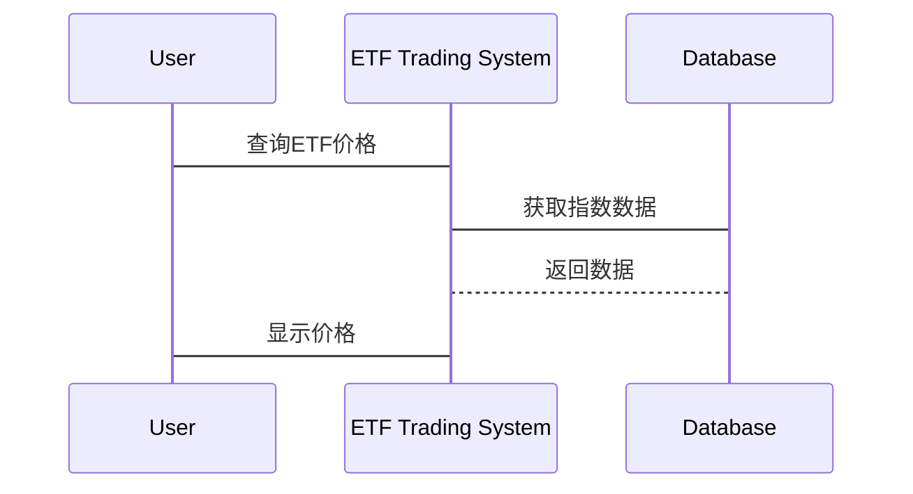

                 


# 约翰·伯格的ETF革命：新一代指数投资工具

## 关键词：ETF, 指数投资, 约翰·伯格, 投资工具, 金融创新

## 摘要：ETF（交易所交易基金）作为新一代指数投资工具，彻底改变了传统投资方式。本文将探讨约翰·伯格对ETF的贡献，分析其核心概念、数学模型、系统架构及实际应用，帮助读者深入了解ETF的投资价值和运作机制。

---

## 第一部分: ETF革命的背景与起源

### 第1章: ETF的起源与发展

#### 1.1 ETF的起源

##### 1.1.1 传统投资工具的局限性
传统的主动管理型基金依赖基金经理的专业知识和市场判断，但其高费用率和不稳定的业绩表现常常让投资者失望。此外，许多投资者难以通过个人能力实现有效的资产配置。

##### 1.1.2 ETF的诞生背景
20世纪70年代，随着金融理论的发展和计算机技术的进步，指数投资逐渐兴起。投资者开始意识到，通过跟踪市场指数可以实现稳定的投资收益，同时费用较低。

##### 1.1.3 约翰·伯格的贡献
约翰·伯格是指数基金的先驱，他于1975年创立了 Vanguard集团，并推出了第一只低成本指数基金。虽然这只基金并不是ETF，但他的理念为后来ETF的发展奠定了基础。

#### 1.2 ETF的发展历程

##### 1.2.1 ETF的早期发展
1993年，第一只ETF——标普500指数ETF在美国推出，标志着ETF时代的开始。初期，ETF主要跟踪大盘指数，品种相对单一。

##### 1.2.2 ETF的快速扩张
随着技术的进步和市场需求的增加，ETF的种类迅速增加。从宽基指数到行业指数、甚至Smart Beta ETF，ETF逐渐成为投资者的重要工具。

##### 1.2.3 当前ETF市场的现状
截至2023年，全球ETF市场规模已超过10万亿美元。ETF品种繁多，涵盖股票、债券、商品等多种资产类别，为投资者提供了丰富的选择。

### 第2章: ETF在投资中的地位

#### 2.1 ETF的核心优势

##### 2.1.1 低成本投资
ETF的管理费用通常远低于主动管理型基金，使投资者能够以较低成本获得市场平均收益。

##### 2.1.2 分散风险
通过跟踪指数，ETF可以分散个股风险，降低投资组合的波动性。

##### 2.1.3 透明性
ETF的持仓透明，投资者可以随时了解其投资组合的构成，避免黑箱操作的风险。

#### 2.2 ETF的主要类型

##### 2.2.1 标准指数ETF
跟踪如标普500等广泛市场指数，分散风险，适合长期投资。

##### 2.2.2 行业ETF
专注于特定行业或板块，适合具有明确投资目标的投资者。

##### 2.2.3 智能Beta ETF
通过特定的因子筛选股票，如高股息率、低波动率等，优化投资组合的风险收益比。

---

## 第二部分: ETF的核心概念与运作机制

### 第3章: ETF的核心概念

#### 3.1 ETF的定义与特点

##### 3.1.1 ETF的定义
ETF是一种在交易所上市交易的基金，其份额净值与指数成分股的总和直接相关，可以在二级市场买卖。

##### 3.1.2 ETF与传统基金的区别
| 特性 | ETF | 传统基金 |
|------|------|----------|
| 交易方式 | 交易所上市交易 | 按当日收盘价买卖 |
| 价格波动 | 受市场供需影响 | 按净值定价 |
| 成立方式 | 投资者购买ETF份额 | 基金公司发起设立 |

##### 3.1.3 ETF的优势与劣势
- **优势**：透明、低费用、分散风险。
- **劣势**：市场风险不可规避。

#### 3.2 ETF的运作机制

##### 3.2.1 ETF的结构
ETF由基金管理公司管理，持有指数成分股和少量现金，投资者通过购买基金份额间接持有这些资产。

##### 3.2.2 ETF的申购与赎回
- **申购**：机构投资者可以用一篮子股票申购ETF，获得ETF份额。
- **赎回**：同样，用ETF份额赎回为一篮子股票，保持市场套利。

##### 3.2.3 ETF的市场套利机制
当ETF市场价格偏离指数价值时，套利者会通过申购或赎回来获利，最终使价格回归合理。

### 第4章: ETF的投资策略与风险管理

#### 4.1 ETF的投资策略

##### 4.1.1 指数投资策略
通过长期持有ETF，获得市场平均收益，避免个股波动风险。

##### 4.1.2 定期再平衡策略
定期调整投资组合，确保与指数权重一致，降低偏离风险。

##### 4.1.3 智能Beta策略
通过特定因子筛选，优化投资组合的收益与风险比。

#### 4.2 ETF的风险管理

##### 4.2.1 市场风险
市场整体波动会影响ETF的价格，投资者需关注宏观经济因素。

##### 4.2.2 利率风险
利率上升会增加债券ETF的再投资风险，影响基金净值。

##### 4.2.3 汇率风险
对于跨国投资，汇率波动会直接影响ETF的价值。

---

## 第三部分: ETF的数学模型与算法原理

### 第5章: ETF的数学模型

#### 5.1 ETF的定价模型

##### 5.1.1 指数复制模型
ETF的价格应与指数成分股的加权平均价格一致。设$P$为ETF价格，$w_i$为成分股$i$的权重，$p_i$为成分股$i$的价格，则$P = \sum_{i=1}^n w_i p_i$。

##### 5.1.2 市场中性模型
通过做空高估资产，做多低估资产，构建中性组合。设$weights$为权重，$position$为头寸，$sum(weights) = 0$，即中性。

##### 5.1.3 风险调整模型
利用CAPM模型，调整各资产的风险溢价，构建风险调整后的指数。

#### 5.2 ETF的风险管理模型

##### 5.2.1 Value at Risk (VaR) 模型
计算在一定置信水平下，投资组合的最大损失。例如，95%置信水平下，1天的VaR为$100万。

##### 5.2.2 Conditional Value at Risk (CVaR)
在VaR的基础上，计算超过VaR的平均损失，提供更保守的风险度量。

---

## 第四部分: ETF的系统分析与架构设计

### 第6章: ETF系统架构设计

#### 6.1 系统功能设计

##### 6.1.1 用户需求分析
投资者需要实时价格、历史数据、交易功能和风险管理工具。

##### 6.1.2 功能模块
- **数据采集**：获取指数成分股数据。
- **价格计算**：根据权重计算ETF理论价格。
- **交易系统**：支持投资者买卖ETF。
- **风险管理**：监控市场风险，提供预警。

#### 6.2 系统架构设计

##### 6.2.1 模块化设计
- **数据层**：数据库存储指数数据。
- **计算层**：实时计算ETF价格。
- **应用层**：用户界面和交易功能。
- **服务层**：提供API接口。

##### 6.2.2 交互流程


---

## 第五部分: ETF项目实战

### 第7章: 项目实战

#### 7.1 环境安装

##### 7.1.1 安装Python
```bash
python --version
pip install pandas numpy matplotlib
```

#### 7.2 核心代码实现

##### 7.2.1 ETF价格计算
```python
import pandas as pd
import numpy as np

# 假设index_weights是各成分股的权重，prices是成分股价格
index_prices = np.dot(index_weights, prices)
print(f"ETF理论价格为：{index_prices}")
```

##### 7.2.2 市场套利机制
```python
def market_arbitrage(etf_price, index_price):
    if etf_price > index_price * 1.01:
        return "申购ETF"
    elif etf_price < index_price * 0.99:
        return "赎回ETF"
    else:
        return "价格合理"
```

#### 7.3 案例分析
以标普500 ETF为例，分析其价格与指数的相关性，验证套利机制的有效性。

---

## 第六部分: 最佳实践

### 第8章: 最佳实践

#### 8.1 小结
ETF通过低成本、高透明度和分散风险，成为现代投资的重要工具。

#### 8.2 注意事项
- 定期再平衡，避免跟踪误差。
- 注意市场风险，尤其是在波动性高的市场中。

#### 8.3 扩展阅读
推荐阅读约翰·伯格的《投资常识》和《指数投资：专业人士的非专业投资者指南》。

---

## 作者：AI天才研究院/AI Genius Institute & 禅与计算机程序设计艺术 /Zen And The Art of Computer Programming

