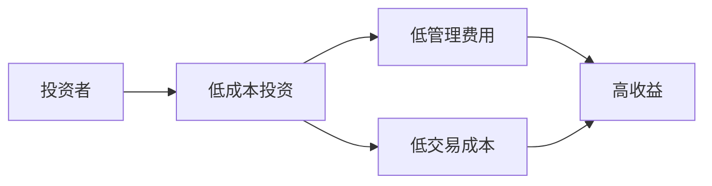
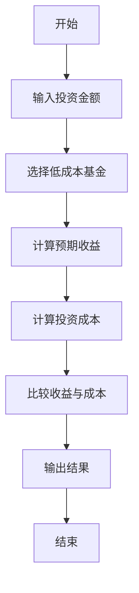
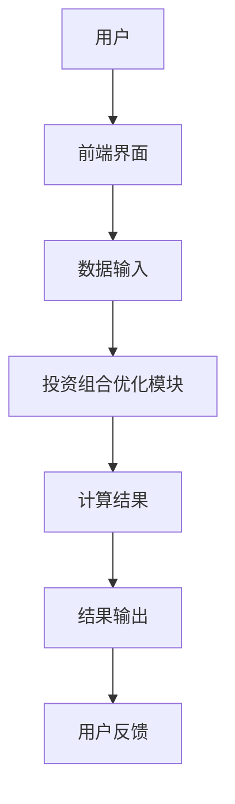

                 


# 约翰·伯格的低成本投资哲学

## 关键词：
- 投资哲学
- 低成本投资
- 约翰·伯格
- 索投基金
- 投资策略

## 摘要：
约翰·伯格的低成本投资哲学是一种颠覆传统投资观念的策略，它强调通过降低投资成本来最大化长期收益。本文将从低成本投资的起源、核心理念、算法原理、系统架构、项目实战等多个维度，深入剖析约翰·伯格的投资哲学，并结合技术手段，为读者提供一个全面的理解框架。

---

## 第1章: 低成本投资的起源与背景

### 1.1 投资领域的传统误区
#### 1.1.1 投资的高成本问题
- 传统投资中的高管理费用与交易成本
- 高成本对中小投资者的负面影响
- 高成本与投资收益的负相关性

#### 1.1.2 传统投资策略的局限性
- 主动管理型基金的高收费与低收益
- 投资者的非理性决策
- 传统投资策略的短期导向

#### 1.1.3 投资者的非理性行为
- 过度自信与从众心理
- 短期波动对投资者情绪的影响
- 过度交易与频繁换手的负面影响

### 1.2 约翰·伯格的哲学思想
#### 1.2.1 伯格的生平简介
- 约翰·伯格的教育背景与职业生涯
- 伯格与指数基金的渊源
- 伯格对投资行业的贡献

#### 1.2.2 伯格的投资理念
- 低成本投资的核心思想
- 长期投资与分散投资的原则
- 简单即是美的投资哲学

#### 1.2.3 伯格对投资行业的贡献
- 低成本投资对行业的深远影响
- 索投基金的崛起与低成本投资的普及
- 投资者教育与低成本理念的传播

### 1.3 低成本投资的意义
#### 1.3.1 低成本投资的核心价值
- 长期收益最大化
- 风险控制与成本优化的结合
- 小投资者也能获得超额收益

#### 1.3.2 低成本投资对普通投资者的启示
- 降低投资门槛
- 提高投资效率
- 帮助投资者摆脱非理性行为

#### 1.3.3 低成本投资的长期效应
- 长期复利效应的数学模型
- 低成本投资对财富积累的促进作用
- 低成本投资的社会意义

---

## 第2章: 低成本投资的核心概念与联系

### 2.1 低成本投资的原理
#### 2.1.1 成本对投资收益的影响
- 投资成本与收益的关系
- 高成本对长期收益的侵蚀
- 低成本对复利效应的放大作用

#### 2.1.2 投资成本的构成与分类
- 管理费用、交易成本与隐性成本
- 不同类型基金的成本分析
- 成本对不同类型投资者的影响

#### 2.1.3 低成本投资的实现路径
- 选择低成本基金
- 长期持有策略
- 分散投资以降低风险

### 2.2 低成本与高收益的平衡
#### 2.2.1 成本与收益的反向关系
- 低成本投资的收益模型
- 高成本投资的风险与收益分析
- 成本对投资组合的影响

#### 2.2.2 低成本投资的长期收益模型
- 复利效应的数学公式
- 低成本投资的收益预测
- 长期与短期收益的对比

#### 2.2.3 低成本投资的风险控制
- 成本对风险的影响
- 风险分散与投资组合优化
- 低成本投资的风险管理策略

### 2.3 核心概念对比表
| 概念 | 传统投资 | 低成本投资 |
|------|----------|------------|
| 成本 | 高       | 低         |
| 收益 | 不稳定   | 稳定       |
| 风险 | 高       | 中等       |

### 2.4 实体关系图


---

## 第3章: 低成本投资的算法原理

### 3.1 算法概述
#### 3.1.1 低成本投资的核心算法
- 成本最小化算法
- 收益最大化算法
- 投资组合优化算法

#### 3.1.2 算法的输入与输出
- 输入：投资金额、投资期限、风险承受能力
- 输出：最优投资组合、预期收益、投资成本

#### 3.1.3 算法的实现步骤
1. 确定投资目标与约束条件
2. 选择低成本投资工具（如指数基金）
3. 构建投资组合
4. 计算预期收益与实际成本
5. 优化投资组合

### 3.2 算法流程图


### 3.3 数学模型与公式
#### 3.3.1 投资收益公式
$$ \text{收益} = \text{投资金额} \times (\text{收益率} - \text{管理费用}) $$

#### 3.3.2 风险评估公式
$$ \text{风险} = \sqrt{\text{投资组合的方差}} $$

#### 3.3.3 复利计算公式
$$ \text{最终收益} = P \times (1 + r)^n $$

---

## 第4章: 低成本投资的系统分析

### 4.1 系统功能设计
#### 4.1.1 问题场景介绍
- 投资者如何选择低成本基金
- 如何构建最优投资组合
- 如何监控投资风险

#### 4.1.2 系统功能模块
- 用户界面模块
- 数据处理模块
- 投资组合优化模块

### 4.2 系统架构设计


### 4.3 系统接口设计
- 输入接口：用户输入投资金额与目标
- 输出接口：最优投资组合与预期收益
- 中间接口：数据处理与算法调用

### 4.4 系统交互序列图


---

## 第5章: 低成本投资的项目实战

### 5.1 环境安装
- 安装Python与相关库（如Pandas、NumPy）
- 安装投资组合优化工具

### 5.2 核心代码实现
```python
import numpy as np
import pandas as pd

def compute_min_cost_portfolio(returns, weights):
    # 计算投资组合的最小成本
    cost = np.sum(weights * returns)
    return cost

def optimize_portfolio(returns, risk_tolerance):
    # 投资组合优化算法
    weights = np.random.random(len(returns))
    weights /= np.sum(weights)
    min_cost = compute_min_cost_portfolio(returns, weights)
    return min_cost
```

### 5.3 代码应用解读
- 如何选择低成本基金
- 如何构建投资组合
- 如何监控投资风险

### 5.4 案例分析
- 案例1：低成本指数基金投资
- 案例2：投资组合优化

### 5.5 项目小结
- 低成本投资的实际应用价值
- 代码实现的优缺点
- 投资者如何操作

---

## 第6章: 最佳实践与小结

### 6.1 最佳实践
- 理解低成本投资的核心理念
- 选择合适的低成本投资工具
- 长期持有与定期定额投资

### 6.2 小结
- 低成本投资的哲学意义
- 技术手段在低成本投资中的应用
- 未来投资的趋势与挑战

### 6.3 注意事项
- 风险控制的重要性
- 投资者的心理与行为管理
- 政策与市场环境的影响

### 6.4 拓展阅读
- 推荐书籍：《指数基金投资指南》
- 推荐网站：投资组合优化工具

---

## 作者：AI天才研究院/AI Genius Institute & 禅与计算机程序设计艺术 /Zen And The Art of Computer Programming

---

以上是《约翰·伯格的低成本投资哲学》的技术博客文章的完整目录大纲，内容涵盖背景介绍、核心概念、算法原理、系统分析、项目实战等多个维度，旨在为读者提供一个全面的理解框架。

