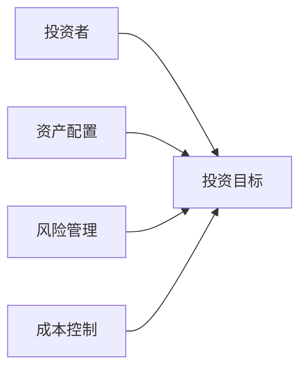

                 


# 约翰·伯格的低成本投资策略

> 关键词：低成本投资，约翰·伯格，投资策略，投资组合优化，数学模型，系统架构

> 摘要：本文深入探讨了约翰·伯格的低成本投资策略，从投资的基本概念、核心要素，到投资组合优化的算法原理，以及系统架构设计，全面分析了低成本投资的理论基础和实际应用。通过详细的数学模型和系统设计，结合实际案例分析，为读者提供了一套完整的低成本投资解决方案。

---

## 第一部分: 背景介绍与低成本投资策略概述

### 第1章: 低成本投资的背景与意义

#### 1.1 投资的基本概念
- **投资的定义与分类**
  - 投资是将资金投入特定资产或项目，以获取未来收益的行为。
  - 主要分类包括股票、债券、房地产、黄金等。
- **投资的基本原则**
  - 风险与收益成正比。
  - 长期投资优于短期投机。
  - 分散投资以降低风险。
- **低成本投资的背景与重要性**
  - 随着金融市场的成熟，投资者逐渐意识到交易成本和管理费用对投资收益的影响。
  - 低成本投资策略通过降低各项费用，提高净收益，尤其适合长期投资。

#### 1.2 约翰·伯格的贡献
- **约翰·伯格的生平简介**
  - 约翰·伯格是低成本投资的倡导者，致力于降低投资成本。
  - 创办了 Vanguard 集团，推动指数基金的发展。
- **伯格的投资理念与方法**
  - 强调长期投资和分散投资。
  - 通过指数基金实现低成本投资。
- **伯格对低成本投资的推动作用**
  - 通过技术创新和规模效应降低管理费用。
  - 提供透明的基金运作信息，增强投资者信任。

### 第2章: 低成本投资的核心概念

#### 2.1 核心概念与定义
- **成本在投资中的重要性**
  - 成本包括交易费用、管理费、托管费等。
  - 成本的高低直接影响投资收益。
- **低成本投资的定义与特征**
  - 定义：通过降低各项成本，实现更高的净收益。
  - 特征：低管理费用、透明运作、长期持有。
- **低成本投资与高成本投资的对比**
  - 成本：低成本投资通常管理费用更低。
  - 风险：低成本投资风险分散，高成本投资可能因高费用而降低实际收益。

#### 2.2 低成本投资的核心要素
- **投资成本的构成**
  - 交易成本：买卖证券的手续费。
  - 管理费用：基金管理人的收费。
  - 托管费用：保管资产的费用。
- **交易成本的影响**
  - 频繁交易会显著增加交易成本。
  - 长期投资者应尽量减少交易次数。
- **管理费用的控制**
  - 选择低费用基金或指数基金。
  - 通过规模效应降低管理费用。

#### 2.3 低成本投资的边界与外延
- **低成本投资的适用范围**
  - 适合长期投资者，尤其是被动投资者。
  - 适合大资金，通过规模效应降低单位成本。
- **低成本投资的局限性**
  - 对于小资金投资者，可能难以显著降低交易成本。
  - 在极端市场情况下，低成本策略可能无法及时应对风险。
- **低成本投资与其他投资策略的关系**
  - 主动投资策略可能在短期获得更高收益，但长期来看，低成本投资更具稳定性。
  - 组合投资策略可以通过分散投资降低风险，同时结合低成本投资策略。

### 第3章: 低成本投资的核心要素与结构

#### 3.1 核心要素分析
- **投资目标的设定**
  - 明确投资目标是低成本投资的前提。
  - 目标包括保值、增值、收益等。
- **资产配置的重要性**
  - 合理配置资产可以降低风险。
  - 股票、债券、现金等的合理比例。
- **风险管理的策略**
  - 通过分散投资降低市场风险。
  - 使用止损策略控制风险。

#### 3.2 核心概念的属性特征对比
- **成本与收益的对比**
  - 成本降低通常意味着收益增加，但需权衡成本降低与收益增加的边际效应。
- **短期与长期投资的对比**
  - 长期投资更容易通过复利效应放大低成本的优势。
- **主动与被动管理的对比**
  - 被动管理（如指数基金）通常成本更低，但主动管理可能在特定市场环境中表现更好。

#### 3.3 实体关系图


---

## 第二部分: 投资组合优化的算法原理

### 第4章: 投资组合优化的数学模型

#### 4.1 算法原理概述
- **均值-方差模型的原理**
  - Markowitz的有效前沿理论是投资组合优化的基础。
  - 通过优化投资组合的收益和风险，找到最优配置。
- **Markowitz有效前沿的构建**
  - 通过计算各资产的预期收益、方差和协方差，构建有效前沿。
  - 有效前沿代表在特定风险水平下，收益最高的组合。
- **成本在优化中的影响**
  - 将交易成本和管理费用纳入优化模型，调整各资产的权重。

#### 4.2 数学模型与公式
- **投资组合的收益与风险模型**
  $$ E(r_p) = \sum_{i=1}^n w_i E(r_i) $$
  $$ Var(r_p) = \sum_{i=1}^n \sum_{j=1}^n w_i w_j Cov(r_i, r_j) $$

- **成本最小化模型**
  $$ \text{Minimize} \sum_{i=1}^n w_i c_i $$
  $$ \text{Subject to} \sum_{i=1}^n w_i = 1 $$

---

## 第三部分: 系统分析与架构设计方案

### 第5章: 系统架构设计

#### 5.1 项目介绍
- **项目名称**
  - 基于约翰·伯格低成本投资策略的投资管理系统。
- **项目目标**
  - 实现低成本投资策略的自动化管理。
  - 提供投资组合优化、风险评估和成本分析功能。

#### 5.2 系统功能设计
- **领域模型设计**
  ```mermaid
  classDiagram
    class 投资者 {
      资金: float
      投资目标: string
      风险偏好: int
    }
    class 资产配置 {
      资产: list
      权重: list
    }
    class 风险管理 {
      止损点: float
      风险敞口: list
    }
    class 成本控制 {
      交易成本: float
      管理费用: float
    }
    投资者 --> 资产配置
    资产配置 --> 风险管理
    风险管理 --> 成本控制
  ```

- **系统架构设计**
  ```mermaid
  architecture
    A[投资者] --> B[资产配置模块]
    B --> C[风险管理模块]
    C --> D[成本控制模块]
    D --> E[输出结果]
  ```

#### 5.3 系统接口设计
- **投资者输入**
  - 资金金额、投资目标、风险偏好。
- **系统输出**
  - 优化后的投资组合。
  - 成本分析报告。

---

## 第四部分: 项目实战

### 第6章: 项目实战

#### 6.1 环境安装
- **工具**
  - Python编程语言。
  - NumPy和Pandas库用于数据处理。
  - Matplotlib用于可视化。

#### 6.2 核心实现代码
```python
import numpy as np
import pandas as pd

# 示例数据：资产的预期收益和协方差矩阵
returns = pd.DataFrame({
    '股票': [0.08, 0.09, 0.07],
    '债券': [0.03, 0.04, 0.05],
    '现金': [0.01, 0.01, 0.01]
})

cov_matrix = pd.DataFrame({
    '股票': [0.02, 0.015, 0.01],
    '债券': [0.015, 0.03, 0.02],
    '现金': [0.01, 0.02, 0.0]
})

# 计算有效前沿
def calculate_efficient_frontier(returns, cov_matrix):
    n = len(returns.columns)
    mu = returns.mean()
    sigma = cov_matrix.values
    # 使用优化算法计算有效前沿（简化版）
    # 实际应用中需要考虑更多复杂性
    pass

# 示例调用
calculate_efficient_frontier(returns, cov_matrix)
```

#### 6.3 实际案例分析
- **案例：构建低成本股票组合**
  - 使用指数基金降低管理费用。
  - 通过定期定额投资降低交易成本。

---

## 第五部分: 最佳实践与小结

### 第7章: 最佳实践

#### 7.1 小结
- 低成本投资策略通过降低各项成本，提高净收益。
- 投资者应根据自身需求选择合适的投资工具和策略。
- 长期持有和分散投资是实现低成本投资的关键。

#### 7.2 注意事项
- **风险管理**
  - 定期评估投资组合，及时调整。
- **市场波动**
  - 低成本策略在长期有效，短期波动需耐心应对。
- **费用透明**
  - 选择透明的基金管理人，避免隐藏费用。

#### 7.3 拓展阅读
- 马科维茨的《投资学原理》。
- 约翰·伯格的《投资之道》。

---

## 作者：AI天才研究院 & 禅与计算机程序设计艺术

---

**结束语**  
通过本文的详细分析，读者可以深入了解约翰·伯格的低成本投资策略，并将其应用于实际投资中。希望本文能为投资者提供有价值的参考和指导。

