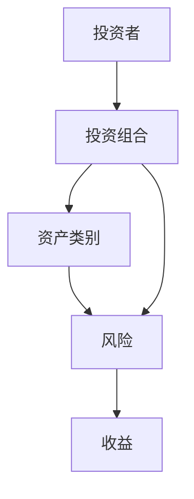
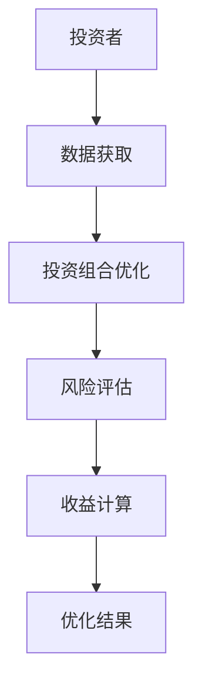
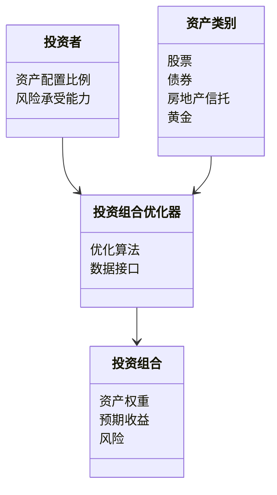
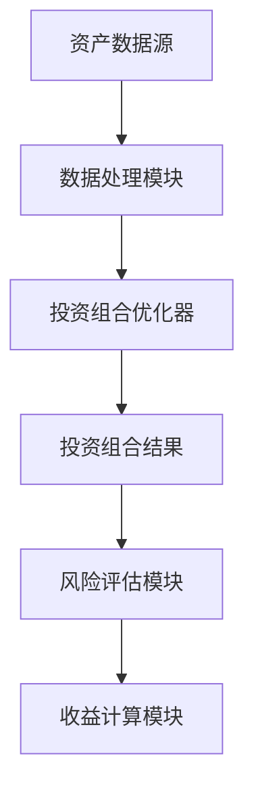
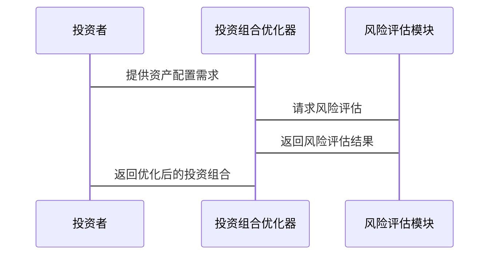

                 


# 约翰·伯格的全球多元化投资理念

> 关键词：约翰·伯格，多元化投资，指数基金，现代投资组合理论，风险管理，投资策略

> 摘要：本文深入探讨了约翰·伯格的全球多元化投资理念，分析了其核心概念、算法原理、系统架构设计以及项目实战。通过详细讲解投资组合优化、风险控制和资产配置策略，本文为投资者提供了科学的投资方法论。

---

# 第1章: 投资理念的背景与问题背景

## 1.1 问题背景

### 1.1.1 投资者面临的多样化挑战

在当今的金融市场中，投资者面临着前所未有的挑战。市场的波动性、经济周期的变化以及全球化的背景下，单一资产的投资往往难以应对各种风险。投资者需要一种能够分散风险、稳定收益的投资策略，而多元化投资正是解决这一问题的关键。

### 1.1.2 现代投资理论的局限性

现代投资组合理论（MPT）虽然提出了分散投资的概念，但在实际应用中存在一些局限性。例如，MPT假设资产之间的相关性是恒定的，而实际上市场相关性会随时间变化。此外，MPT对交易成本和税费等因素未予充分考虑。

### 1.1.3 多元化投资的重要性

多元化投资通过将资金分配到不同的资产类别或地区，降低了投资组合的整体风险。这种策略尤其适合那些无法准确预测市场走势的投资者，因为它减少了对单一资产的依赖，从而提高了投资组合的稳定性。

---

## 1.2 投资者行为与市场波动

### 1.2.1 投资者的心理偏差

投资者的心理偏差（如过度自信、损失厌恶）常常导致非理性的投资决策。例如，投资者可能在市场高点时追涨，而在市场低点时恐慌抛售，这种行为往往损害投资收益。

### 1.2.2 市场波动对投资决策的影响

市场波动性是投资者必须面对的现实。短期市场波动可能导致投资者情绪波动，进而影响其长期投资策略。如何在波动中保持理性，是投资者需要掌握的重要技能。

### 1.2.3 理性投资与非理性决策的对比

理性投资强调长期策略和分散投资，而非理性决策则往往基于短期情绪和市场炒作。通过多元化投资，投资者可以减少非理性决策的影响，从而更接近理性的投资行为。

---

# 第2章: 约翰·伯格投资理念的核心要素

## 2.1 多元化投资的定义与特点

### 2.1.1 多元化投资的定义

多元化投资是指将资金分配到不同的资产类别、行业或地理区域，以降低投资组合的整体风险。这种策略通过分散投资，减少了单一资产波动对整体投资组合的影响。

### 2.1.2 多元化投资的核心特点

- **风险分散**：通过投资多种资产，降低特定资产的风险。
- **收益稳定**：多元化投资能够在不同市场环境下实现相对稳定的收益。
- **长期增长**：通过分散投资，投资者能够捕捉不同资产的长期增长潜力。

### 2.1.3 多元化投资与传统投资的区别

传统的单一资产投资风险较高，而多元化投资通过分散投资降低了风险。此外，多元化投资注重长期收益，而传统投资可能更关注短期收益。

---

## 2.2 约翰·伯格投资理念的边界与外延

### 2.2.1 多元化投资的边界

多元化投资的边界包括资金分配的比例、资产类别的选择以及投资期限的长短。例如，投资者可以根据自身的风险承受能力确定不同资产的配置比例。

### 2.2.2 多元化投资的外延

多元化投资不仅包括资产类别和地理区域的分散，还包括投资工具的多样化，如股票、债券、房地产信托等。此外，定期再平衡投资组合也是多元化投资的重要组成部分。

### 2.2.3 多元化投资与其他投资策略的对比

与其他投资策略相比，多元化投资更加注重风险控制和长期收益。例如，与集中投资相比，多元化投资的风险较低，但收益可能略低。

---

## 2.3 约翰·伯格投资理念的概念结构与核心要素组成

### 2.3.1 理念的核心要素

- **资产分配**：根据投资者的风险承受能力和目标，确定不同资产的配置比例。
- **风险控制**：通过分散投资降低整体风险。
- **长期投资**：避免频繁交易，捕捉资产的长期增值潜力。

### 2.3.2 理念的层次结构

- **战略层**：确定长期投资目标和策略。
- **战术层**：根据市场变化调整资产配置。
- **操作层**：执行投资决策并进行定期再平衡。

### 2.3.3 理念的实践应用

通过具体案例分析，展示如何将约翰·伯格的理念应用于实际投资中。例如，假设一个投资者将资金分配到股票、债券、房地产信托和黄金等不同资产，以实现风险分散和收益稳定。

---

# 第3章: 约翰·伯格投资理念的核心概念与联系

## 3.1 核心概念原理

### 3.1.1 现代投资组合理论（MPT）

MPT由哈里·马科维茨提出，强调通过分散投资降低风险。其核心在于通过优化资产配置实现投资组合的最大化收益，同时最小化风险。

### 3.1.2 多元化投资的数学模型

投资组合的收益和风险可以用数学模型进行量化。例如，投资组合的期望收益可以通过权重和资产收益的加权平均计算，而风险则通过方差和协方差矩阵计算。

### 3.1.3 约翰·伯格投资理念的独特性

约翰·伯格的理念在MPT的基础上进一步强调长期持有和定期再平衡，同时注重低成本投资工具的选择。

---

## 3.2 核心概念属性特征对比表格

| 投资策略 | 风险 | 收益 | 时间跨度 |
|----------|------|------|----------|
| 集中投资 | 高   | 高   | 短期     |
| 多元化投资 | 中等 | 中等 | 长期     |

---

## 3.3 ER实体关系图架构



---

# 第4章: 约翰·伯格投资理念的算法原理

## 4.1 算法原理讲解

### 4.1.1 投资组合优化算法



### 4.1.2 算法数学模型与公式

#### 4.1.2.1 投资组合收益公式

$$ E(r_p) = \sum_{i=1}^{n} w_i E(r_i) $$

#### 4.1.2.2 投资组合风险公式

$$ Var(r_p) = \sum_{i=1}^{n} \sum_{j=1}^{n} w_i w_j Cov(r_i, r_j) $$

---

## 4.2 算法数学模型与公式

### 4.2.1 投资组合收益公式

$$ E(r_p) = \sum_{i=1}^{n} w_i E(r_i) $$

### 4.2.2 投资组合风险公式

$$ Var(r_p) = \sum_{i=1}^{n} \sum_{j=1}^{n} w_i w_j Cov(r_i, r_j) $$

### 4.2.3 现代投资组合理论优化公式

$$ \min_{w} w^T \Sigma w $$

---

# 第5章: 系统分析与架构设计方案

## 5.1 系统架构设计

### 5.1.1 系统功能设计（领域模型Mermaid类图）



---

## 5.2 系统架构设计（Mermaid架构图）



---

## 5.3 系统交互设计（Mermaid序列图）



---

# 第6章: 项目实战

## 6.1 环境安装

### 6.1.1 安装Python环境

```bash
python --version
pip install numpy pandas matplotlib
```

---

## 6.2 系统核心实现源代码

### 6.2.1 数据获取与处理

```python
import pandas as pd
import numpy as np

# 数据获取
def get_data():
    data = {
        '股票': [10, 20, 30, 40, 50],
        '债券': [5, 10, 15, 20, 25],
        '房地产信托': [8, 16, 24, 32, 40],
        '黄金': [15, 30, 45, 60, 75]
    }
    return pd.DataFrame(data)
```

### 6.2.2 投资组合优化

```python
def portfolio_optimization(weights):
    # 计算收益
    expected_return = np.sum(weights * returns)
    # 计算风险
    portfolio_variance = np.dot(weights.T, np.dot(cov_matrix, weights))
    return -portfolio_variance
```

---

## 6.3 代码应用解读与分析

### 6.3.1 数据获取与处理

通过获取不同资产的历史数据，计算它们的收益和风险。这一步是投资组合优化的基础。

### 6.3.2 投资组合优化

使用优化算法（如均值-方差优化）计算最优资产权重，以最小化投资组合的风险，同时最大化收益。

---

## 6.4 实际案例分析和详细讲解剖析

### 6.4.1 案例分析

假设一个投资者有100万美元，希望将资金分配到股票、债券、房地产信托和黄金中。通过优化算法，得到最优资产配置为：股票60%，债券20%，房地产信托15%，黄金5%。这种配置在不同市场环境下表现出较低的风险和稳定的收益。

---

## 6.5 项目小结

通过实际案例分析，展示了如何将约翰·伯格的投资理念应用于实际投资中。投资者可以根据自身的风险承受能力和目标，调整资产配置比例，实现长期稳定的收益。

---

# 第7章: 总结与最佳实践

## 7.1 最佳实践 tips

- **长期投资**：避免短期交易，捕捉资产的长期增值潜力。
- **定期再平衡**：定期调整投资组合，以适应市场变化。
- **成本控制**：选择低成本的投资工具，降低投资成本。

---

## 7.2 小结

约翰·伯格的全球多元化投资理念为投资者提供了一种科学的投资方法。通过分散投资、长期持有和定期再平衡，投资者可以在不同市场环境下实现风险可控、收益稳定的长期投资目标。

---

## 7.3 注意事项

- **风险提示**：投资有风险，投资者需根据自身情况谨慎决策。
- **过度分散**：避免过度分散投资，以免增加交易成本和复杂性。
- **市场变化**：市场环境不断变化，投资者需要及时调整投资策略。

---

## 7.4 拓展阅读

- 《指数基金投资策略》
- 《投资学基础》
- 《约翰·伯格的投资哲学》

---

# 作者：AI天才研究院/AI Genius Institute & 禅与计算机程序设计艺术 /Zen And The Art of Computer Programming

