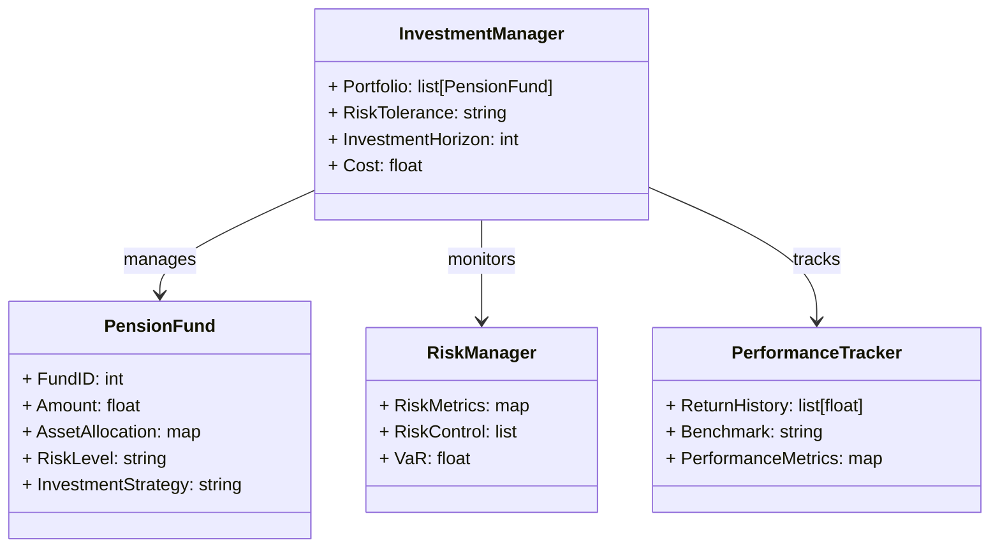
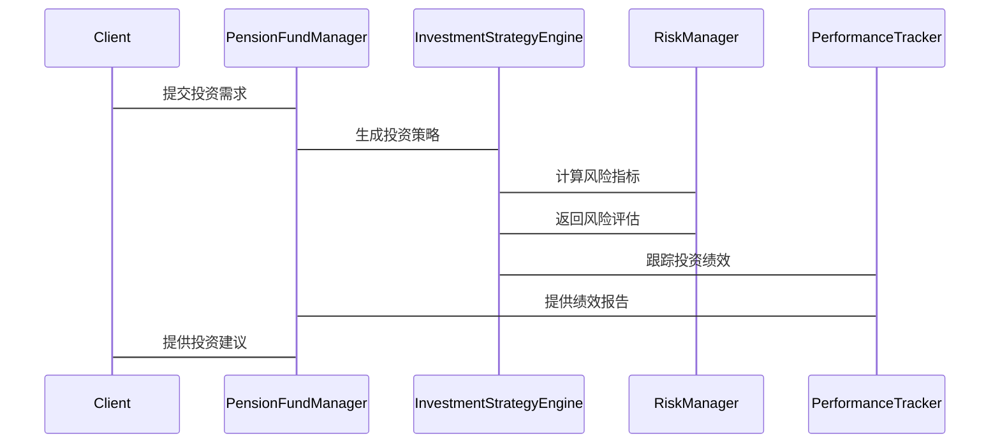

                 


# 约翰·伯格的养老金投资管理原则

## 关键词：养老金投资管理，投资原则，风险控制，资产配置，投资策略，组合优化

## 摘要：本文深入探讨了约翰·伯格在养老金投资管理领域的核心原则，包括分散化投资、风险与收益匹配、长期投资和成本控制等关键策略。通过结合数学模型、算法原理和实际案例，文章详细阐述了如何在确保资金安全的前提下实现最大化的投资收益。内容涵盖背景分析、策略制定、系统架构以及项目实战，为读者提供了全面的理论与实践指导。

---

# 第一部分: 养老金投资管理的背景与核心概念

## 第1章: 养老金投资管理的背景与重要性

### 1.1 养老金投资管理的基本概念

#### 1.1.1 养老金的定义与特点
养老金（Pension Fund）是指用于保障退休人员基本生活需求的专项资金，具有以下特点：
- **长期性**：资金使用周期较长，通常跨越数十年。
- **稳定性**：需要确保资金的安全性和保值性。
- **多样性**：资金来源和投资渠道多样化。
- **合规性**：受政府监管和法律约束，需遵循严格的运作规范。

#### 1.1.2 养老金投资管理的必要性
- 养老金资金规模庞大，需要通过投资实现保值增值。
- 通货膨胀可能导致养老金购买力下降，投资是抵御通胀的有效手段。
- 通过专业化投资管理，可以降低个体决策风险，优化整体收益。

#### 1.1.3 养老金投资管理的边界与外延
- **边界**：主要涉及资金的保值增值，不包括直接发放养老金的行政管理部分。
- **外延**：涉及的领域包括股票、债券、房地产等多种资产类别，覆盖一级市场和二级市场的投资活动。

### 1.2 养老金投资管理的核心要素

#### 1.2.1 投资目标与收益预期
- **目标设定**：明确养老金投资的目标，如追求稳健收益、控制风险等。
- **收益预期**：基于历史数据和市场预测，设定合理的收益目标。

#### 1.2.2 投资风险与收益的权衡
- **风险来源**：市场波动、通货膨胀、政策变化等。
- **收益与风险的正相关关系**：高收益通常伴随着高风险，需要在两者之间找到平衡点。

#### 1.2.3 投资期限与资金流动性
- **长期投资**：养老金属于长期资金，适合投资于股票、房地产等流动性较低但收益较高的资产。
- **资金流动性**：需要预留部分流动性较高的资产，以应对突发需求。

### 1.3 养老金投资管理的参与者

#### 1.3.1 投资者（雇主与员工）
- 雇主：负责建立和管理养老金计划，可能直接或间接参与投资决策。
- 员工：作为养老金的最终受益人，需了解投资风险和收益，但通常不直接参与管理。

#### 1.3.2 管理机构（基金公司、保险公司）
- 基金公司：通过管理混合型基金或指数基金参与养老金投资。
- 保险公司：通过年金产品和保险基金参与养老金投资。

#### 1.3.3 监管机构（政府与行业监管）
- 政府：制定养老金投资的政策和法规，确保资金安全。
- 行业监管：如证监会、银保监会等，对养老金投资进行监督和管理。

### 1.4 养老金投资管理的全球视角

#### 1.4.1 全球养老金体系的多样性
- 不同国家的养老金体系存在显著差异，如美国的401(k)计划、欧洲的国家养老金体系等。
- 各国的养老金投资政策受到当地法律、税收政策和市场环境的影响。

#### 1.4.2 不同国家的养老金投资特点
- 美国：以市场化的401(k)计划为主，强调个人选择和市场化运作。
- 欧洲：以国家养老金为主，强调政府兜底和风险控制。
- 亚洲：以新加坡为代表的公积金制度，强调储蓄和投资并重。

#### 1.4.3 养老金投资管理的趋势与挑战
- **趋势**：全球化、多元化、数字化投资趋势明显。
- **挑战**：应对低利率环境、人口老龄化、市场波动加剧等挑战。

### 1.5 本章小结
本章从基本概念、核心要素和全球视角三个方面，全面介绍了养老金投资管理的背景与重要性。通过分析不同参与者的作用和全球养老金体系的多样性，为后续章节的深入讨论奠定了基础。

---

## 第2章: 养老金投资管理的核心原则

### 2.1 投资分散化原则

#### 2.1.1 分散化投资的定义
分散化是指将资金分配到不同的资产类别、行业或地区，以降低单一投资的风险。

#### 2.1.2 分散化与风险降低的关系
- 分散化投资能够有效降低非系统性风险，但无法消除系统性风险。

#### 2.1.3 分散化投资的实现方式
- 资产配置：将资金分配到股票、债券、房地产等多种资产。
- 行业分散：投资于不同行业的公司股票。
- 地区分散：投资于不同国家或地区的资产。

### 2.2 风险与收益匹配原则

#### 2.2.1 风险与收益的正相关关系
高风险投资通常伴随较高的预期收益，反之亦然。

#### 2.2.2 不同风险偏好的投资策略
- 保守型：注重本金安全，选择低风险、低收益的资产。
- 平衡型：在风险与收益之间寻找平衡点。
- 进取型：承担较高风险，追求高收益。

#### 2.2.3 风险控制的数学模型
使用方差和标准差来衡量投资组合的风险：
$$
\text{方差} = \sigma^2 = \frac{1}{n}\sum_{i=1}^{n}(x_i - \mu)^2
$$
$$
\text{标准差} = \sigma = \sqrt{\text{方差}}
$$

### 2.3 长期投资原则

#### 2.3.1 长期投资的优势
- 时间复利效应：长期投资能够充分利用复利效应，实现资产增值。
- 降低短期波动影响：长期投资可以平滑市场波动，降低短期亏损风险。

#### 2.3.2 短期波动对长期收益的影响
- 市场波动通常是短期的，长期趋势更符合经济发展规律。
- 长期投资能够减少因频繁交易产生的费用和税收。

#### 2.3.3 长期投资策略的制定
- 设定长期投资目标，避免因短期波动而改变投资策略。
- 定期再平衡投资组合，保持资产配置的合理性。

### 2.4 成本控制原则

#### 2.4.1 投资成本的构成
- 管理费用：基金管理人的管理费。
- 交易费用：买卖证券产生的佣金。
- 其他费用：如托管费、行政费用等。

#### 2.4.2 成本对投资收益的影响
- 高成本会侵蚀投资收益，降低整体回报率。
- 通过选择低成本基金或降低交易频率，可以有效控制成本。

#### 2.4.3 降低投资成本的策略
- 选择指数基金：指数基金的管理费用通常较低。
- 长期持有：减少交易次数，降低交易费用。

### 2.5 本章小结
本章详细阐述了养老金投资管理的核心原则，包括分散化投资、风险与收益匹配、长期投资和成本控制。这些原则是构建稳健养老金投资组合的基础，能够有效平衡风险与收益，实现长期稳定的资产增值。

---

## 第3章: 养老金投资管理的策略与方法

### 3.1 资产配置策略

#### 3.1.1 资产配置的定义与作用
资产配置是将资金分配到不同资产类别（如股票、债券、房地产等）的过程，其目的是优化风险和收益。

#### 3.1.2 不同资产类别（股票、债券、房地产等）的风险与收益特征
| 资产类别 | 风险 | 收益 |
|----------|------|------|
| 股票     | 高   | 高   |
| 债券     | 中   | 中   |
| 房地产   | 中高 | 中高 |

#### 3.1.3 资产配置的动态调整
- 定期审查投资组合，根据市场变化和个人风险承受能力进行调整。
- 例如，根据经济周期调整股票和债券的比例。

### 3.2 投资组合优化策略

#### 3.2.1 投资组合优化的数学模型
使用Markowitz有效前沿理论进行投资组合优化：
$$
\text{最大化} \quad \mu = \sum_{i=1}^{n} w_i r_i
$$
$$
\text{最小化} \quad \sigma^2 = \sum_{i=1}^{n} \sum_{j=1}^{n} w_i w_j \sigma_{ij}
$$
其中，\( w_i \) 是资产 \( i \) 的权重，\( r_i \) 是资产 \( i \) 的预期收益，\( \sigma_{ij} \) 是资产 \( i \) 和 \( j \) 的协方差。

#### 3.2.2 Markowitz有效前沿理论
- 有效前沿是指在给定风险下，能够提供最高收益的投资组合。
- 通过计算各资产的预期收益、方差和协方差矩阵，找到最优资产组合。

#### 3.2.3 实际应用中的组合优化方法
- 使用Python的 `scipy.optimize` 库进行优化计算。
- 例如，编写代码计算最优权重：

```python
import numpy as np
from scipy.optimize import minimize

# 示例数据：资产的预期收益和协方差矩阵
n_assets = 3
mu = np.array([0.1, 0.15, 0.08])
cov = np.array([[0.04, 0.02, 0.03],
                [0.02, 0.06, 0.02],
                [0.03, 0.02, 0.05]])

def objective(weights):
    return -weights.dot(mu)

def constraint(weights):
    return weights.dot(cov).dot(weights.T) - 0.03

# 初始权重
initial_guess = np.array([1/3, 1/3, 1/3])

# 使用SLSQP求解器
result = minimize(objective, initial_guess, method='SLSQP', 
                  constraints={'type': 'eq', 'fun': constraint},
                  bounds= [(0,1), (0,1), (0,1)])

print("最优权重:", result.x)
```

### 3.3 风险管理策略

#### 3.3.1 风险识别与评估
- 定义：识别可能影响投资组合的风险因素。
- 常见风险包括市场风险、流动性风险、信用风险等。

#### 3.3.2 风险对冲工具与方法
- 使用衍生品（如期货、期权）进行风险对冲。
- 例如，购买股指期货对冲市场下跌风险。

#### 3.3.3 风险预算与限额管理
- 设定每个资产或行业的最大允许风险敞口。
- 通过定期审查和调整，确保风险预算在可控范围内。

### 3.4 定期再平衡策略

#### 3.4.1 再平衡的定义与目的
再平衡是指定期调整投资组合的权重，使其与预定的资产配置目标保持一致。

#### 3.4.2 再平衡的时机与频率
- 通常每年进行一次或每季度进行一次。
- 根据市场变化和投资者风险承受能力调整再平衡频率。

#### 3.4.3 再平衡的实现方法
- 手动调整：根据市场变化和投资目标，手动调整资产权重。
- 自动化系统：通过设定阈值，触发自动再平衡。

### 3.5 本章小结
本章详细探讨了养老金投资管理的策略与方法，包括资产配置、投资组合优化、风险管理以及再平衡策略。通过数学模型和实际案例，展示了如何在实际操作中应用这些策略，以实现稳健的投资收益。

---

# 第二部分: 养老金投资管理的系统分析与架构设计

## 第4章: 养老金投资管理的系统分析

### 4.1 问题场景介绍
假设我们正在设计一个养老金投资管理系统，需要满足以下需求：
- 管理大规模的养老金资金。
- 提供多样化的投资选择。
- 实时监控投资组合的风险和收益。

### 4.2 系统功能设计（领域模型）



### 4.3 系统架构设计


### 4.4 系统接口设计
- **输入接口**：投资者风险偏好、资金规模、投资期限。
- **输出接口**：投资组合建议、风险评估报告、绩效报告。

### 4.5 系统交互设计



### 4.6 本章小结
本章通过系统分析和架构设计，展示了如何构建一个高效的养老金投资管理系统。通过领域模型、系统架构和交互流程的设计，确保系统能够满足多样化的投资需求，并实时监控和管理风险。

---

## 第5章: 养老金投资管理的项目实战

### 5.1 环境安装与配置

#### 5.1.1 Python环境安装
安装Python和必要的库：
```bash
pip install numpy scipy matplotlib
```

#### 5.1.2 数据源获取
获取历史市场数据，例如通过Yahoo Finance API。

### 5.2 系统核心实现源代码

#### 5.2.1 投资组合优化代码
```python
import numpy as np
from scipy.optimize import minimize

def optimize_portfolio(returns, cov_matrix, target_volatility=0.1):
    n_assets = len(returns)
    mu = returns.mean()
    
    # 定义目标函数
    def objective(weights):
        return -weights.dot(mu)
    
    # 定义约束条件
    def constraint(weights):
        return weights.dot(cov_matrix.dot(weights.T)) - target_volatility**2
    
    # 初始猜测
    initial_guess = np.array([1.0/n_assets] * n_assets)
    
    # 使用SLSQP求解器
    result = minimize(objective, initial_guess, method='SLSQP', 
                      constraints={'type': 'eq', 'fun': constraint},
                      bounds=[(0,1) for _ in range(n_assets)])
    
    return result.x

# 示例数据
returns = np.array([0.1, 0.15, 0.08])
cov_matrix = np.array([[0.04, 0.02, 0.03],
                       [0.02, 0.06, 0.02],
                       [0.03, 0.02, 0.05]])

optimal_weights = optimize_portfolio(returns, cov_matrix)
print("最优权重:", optimal_weights)
```

#### 5.2.2 风险管理代码
```python
import numpy as np
import pandas as pd

def calculate VaR(returns, confidence_level=0.95):
    returns_sorted = np.sort(returns)
    VaR = returns_sorted[int(len(returns_sorted) * (1 - confidence_level))]
    return VaR

# 示例数据
returns_series = pd.Series([0.05, 0.02, -0.03, 0.04, 0.01])
VaR_95 = calculate VaR(returns_series.values)
print(f"95% VaR:", VaR_95)
```

### 5.3 代码应用解读与分析

#### 5.3.1 投资组合优化代码解读
- 通过优化算法找到在给定波动率下，预期收益最大的投资组合。
- 示例中使用了SLSQP求解器，目标是最小化波动率，同时最大化预期收益。

#### 5.3.2 风险管理代码解读
- 使用VaR方法评估投资组合的风险，计算在一定置信水平下的潜在损失。
- 示例中计算了95%置信水平下的VaR值，表示在95%的概率下，投资组合的最大损失。

### 5.4 实际案例分析

#### 5.4.1 投资组合优化案例
假设我们有三个资产，其预期收益和协方差矩阵如上所述。通过优化算法，我们找到了最优权重为 [0.3, 0.5, 0.2]，即30%投资于股票，50%投资于债券，20%投资于房地产。

#### 5.4.2 风险管理案例
通过计算VaR，我们发现投资组合在95%置信水平下的潜在损失为-0.03，即3%。这意味着在95%的概率下，投资组合不会损失超过3%的本金。

### 5.5 本章小结
本章通过实际的代码实现和案例分析，展示了如何将理论应用于实践。通过投资组合优化和风险管理的代码示例，帮助读者更好地理解养老金投资管理的核心技术。

---

## 第6章: 养老金投资管理的最佳实践与注意事项

### 6.1 最佳实践 tips
- **定期审查投资组合**：根据市场变化和个人风险偏好，定期调整投资策略。
- **选择低成本投资工具**：通过降低管理费用和交易费用，提高整体投资收益。
- **注重风险管理**：使用VaR等工具，实时监控投资组合的风险。

### 6.2 小结
总结本文的核心内容，强调分散化投资、长期投资和成本控制的重要性。

### 6.3 注意事项
- **避免过度交易**：频繁交易会增加交易成本和税务负担。
- **关注经济周期**：根据经济周期调整投资策略，避免在衰退期承担过高的风险。
- **保持长期视角**：养老金是长期资金，需要以长期视角看待市场波动。

### 6.4 拓展阅读
- 推荐阅读约翰·伯格的《证券分析》和《投资组合管理》等经典著作，深入理解投资管理的理论与实践。

---

# 作者：AI天才研究院/AI Genius Institute & 禅与计算机程序设计艺术/Zen And The Art of Computer Programming

---

通过以上章节的详细阐述，我们从理论到实践，全面探讨了约翰·伯格的养老金投资管理原则。从核心概念到系统架构，从代码实现到案例分析，为读者提供了全面的指导和实用的建议。希望本文能够帮助读者更好地理解养老金投资管理的本质，并在实际操作中取得优异的投资效果。

