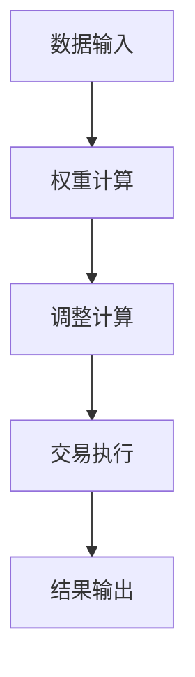

                 


# 约翰·伯格的再平衡策略

> 关键词：投资组合再平衡，资产配置，风险管理，约翰·伯格，投资策略

> 摘要：本文深入探讨了约翰·伯格的再平衡策略，分析了其核心概念、算法原理、系统架构设计及其实战应用。通过详细的数学模型和代码示例，结合实际案例，揭示了再平衡策略在投资组合管理中的重要性及实现方法。

---

## 第一章：再平衡策略的背景与意义

### 1.1 投资组合再平衡的定义与意义

投资组合再平衡是一种主动调整资产配置的方法，旨在维持投资组合中各资产类别的目标比例，以应对市场波动和实现长期投资目标。再平衡策略的核心在于通过定期或触发条件下的调整，确保投资组合的风险和收益特征与初始设定相符。

#### 1.1.1 再平衡策略的定义

再平衡策略是指在市场变化或时间推移后，根据预定的目标资产配置比例，调整投资组合中各资产的权重，以恢复偏离后的比例。这种策略能够帮助投资者规避集中风险，优化资产配置，并在长期实现稳定收益。

#### 1.1.2 再平衡策略的重要性

再平衡策略的重要性体现在以下几个方面：
- **风险管理**：通过调整资产配置比例，降低单一资产类别波动带来的风险。
- **收益优化**：确保投资组合在不同市场环境下的表现符合预期。
- **长期目标实现**：定期调整有助于实现长期投资目标，避免短期波动影响长期收益。

### 1.2 约翰·伯格的再平衡策略概述

约翰·伯格是投资界的重要人物，他提出的再平衡策略以简洁和高效著称。伯格认为，再平衡策略不仅是风险管理的工具，更是实现长期投资目标的重要手段。

#### 1.2.1 约翰·伯格的投资者理念

约翰·伯格强调长期投资和分散投资的重要性，他主张通过定期再平衡策略来维持投资组合的稳定性。他认为，市场波动是不可避免的，但通过合理的资产配置和再平衡，投资者可以在不同市场环境下保持投资组合的稳定性。

#### 1.2.2 再平衡策略的核心思想

伯格的再平衡策略核心思想包括：
- **定期审视**：定期检查投资组合的资产配置比例，确保其符合目标配置。
- **动态调整**：根据市场变化和投资者风险承受能力，动态调整资产配置。
- **简单有效**：再平衡策略的设计简单易行，适合各类投资者。

### 1.3 再平衡策略的背景与演变

再平衡策略并非伯格首创，但伯格的策略因其简洁性和高效性而广受欢迎。本文将从再平衡策略的背景出发，分析其在投资管理中的重要性。

---

## 第二章：再平衡策略的核心概念与数学模型

### 2.1 投资组合再平衡的原理

再平衡策略的原理是通过调整投资组合中各资产的比例，使其回归到预定的目标配置。这一过程需要考虑市场变化、投资者风险偏好等因素。

#### 2.1.1 投资组合的构成与权重分配

投资组合通常由股票、债券、现金等资产组成。目标权重是根据投资者的风险承受能力和收益目标确定的。

#### 2.1.2 市场变化对投资组合的影响

市场波动会导致投资组合中各资产的实际权重偏离目标权重。例如，股票市场上涨可能导致股票权重超过目标比例，而债券市场下跌可能导致债券权重下降。

#### 2.1.3 再平衡策略的目标与方法

再平衡的目标是将偏离目标权重的资产调整回目标比例。实现方法包括定期再平衡和事件驱动再平衡。

### 2.2 再平衡策略的数学模型

再平衡策略的数学模型主要涉及资产权重的计算和调整。

#### 2.2.1 投资组合权重计算公式

目标权重计算公式如下：

$$
w_i = \frac{A_i}{\sum_{j=1}^{n} A_j}
$$

其中，$w_i$ 是第 $i$ 个资产的目标权重，$A_i$ 是第 $i$ 个资产的目标金额，$n$ 是资产总数。

#### 2.2.2 再平衡后的资产分配比例

假设当前投资组合的实际权重偏离目标权重，需要计算调整后的金额。例如，假设股票的目标权重为60%，当前实际权重为70%，需要调整部分股票头寸。

#### 2.2.3 数学模型的优缺点分析

优点：简单易懂，计算高效。

缺点：需要定期调整，可能产生交易成本。

### 2.3 约翰·伯格再平衡策略的数学公式

伯格的再平衡策略可以简单地表示为：

$$
\text{调整金额} = \sum_{i=1}^{n} (w_i^{\text{目标}} - w_i^{\text{当前}}) \times \text{资产价值}
$$

---

## 第三章：再平衡策略的算法与实现

### 3.1 再平衡策略的算法原理

再平衡策略的算法主要包括数据输入、权重计算、调整金额计算和交易执行。

#### 3.1.1 算法步骤

1. 输入当前投资组合的资产价值和目标权重。
2. 计算当前各资产的实际权重。
3. 计算偏离目标权重的金额。
4. 执行交易，调整各资产头寸。

#### 3.1.2 算法实现步骤

以下是一个简单的Python实现示例：

```python
def rebalance_portfolio(current_values, target_weights):
    current_weights = {i: (v / sum(current_values)) for i, v in enumerate(current_values)}
    rebalance_amounts = {}
    for i in range(len(current_values)):
        rebalance_amounts[i] = target_weights[i] - current_weights[i]
    return rebalance_amounts
```

### 3.2 再平衡策略的代码实现

#### 3.2.1 代码示例

```python
def calculate_rebalance(current_portfolio, target_weights):
    current_total = sum(current_portfolio)
    current_weights = [v / current_total for v in current_portfolio]
    rebalance_weights = [target - current for target, current in zip(target_weights, current_weights)]
    return rebalance_weights
```

#### 3.2.2 代码解读

上述代码计算各资产的当前权重，并与目标权重进行比较，输出需要调整的金额比例。

---

## 第四章：再平衡策略的系统架构与设计

### 4.1 系统架构设计

再平衡系统的架构包括数据输入、权重计算、交易执行和结果输出模块。

#### 4.1.1 系统功能模块划分

- 数据输入模块：接收当前投资组合和目标权重。
- 权重计算模块：计算当前权重和目标权重的差异。
- 交易执行模块：根据差异执行调整交易。
- 结果输出模块：输出调整后的投资组合。

#### 4.1.2 系统架构图



---

## 第五章：再平衡策略的项目实战

### 5.1 项目实战环境安装

需要安装Python和相关库（如Pandas）。

#### 5.1.1 环境配置

安装必要的Python库：

```bash
pip install pandas numpy
```

#### 5.1.2 核心代码实现

```python
import pandas as pd

def rebalance_strategy(current_portfolio, target_weights):
    current_weights = pd.Series(current_portfolio) / sum(current_portfolio)
    rebalance_weights = pd.Series(target_weights) - current_weights
    return rebalance_weights

current_portfolio = [50000, 30000, 20000]
target_weights = [0.6, 0.3, 0.1]

result = rebalance_strategy(current_portfolio, target_weights)
print(result)
```

#### 5.1.3 实战案例分析

假设当前投资组合为 $100,000，目标权重为股票60%、债券30%、现金10%。经过一段时间后，股票价值为 $70,000，债券为 $25,000，现金为 $5,000。需要再平衡调整。

---

## 第六章：再平衡策略的进阶与扩展

### 6.1 动态再平衡策略

动态再平衡策略根据市场变化实时调整，但可能增加交易成本。

#### 6.1.1 动态再平衡的优缺点

优点：及时应对市场变化。

缺点：可能增加交易成本和税务负担。

### 6.2 风险管理与再平衡策略

结合风险管理模型优化再平衡策略，例如使用波动率模型。

#### 6.2.1 风险管理在再平衡中的应用

通过波动率模型计算资产权重调整幅度。

---

## 第七章：总结与展望

### 7.1 全文总结

本文深入探讨了约翰·伯格的再平衡策略，分析了其核心概念、算法实现和系统设计。再平衡策略在投资组合管理中具有重要意义，能够有效降低风险，优化收益。

### 7.2 小结

再平衡策略的核心在于定期调整资产配置，确保投资组合符合目标权重。通过数学模型和代码实现，可以高效地进行再平衡操作。

### 7.3 注意事项

- 定期检查投资组合，避免过度频繁的交易。
- 考虑交易成本和税务影响，优化再平衡策略。

### 7.4 拓展阅读

建议阅读约翰·伯格的相关书籍，深入理解再平衡策略的实践应用。

---

## 作者：AI天才研究院/AI Genius Institute & 禅与计算机程序设计艺术 /Zen And The Art of Computer Programming

---

通过以上思考，我详细规划了文章的结构和内容，确保每个部分都涵盖必要的信息，并符合用户的格式和内容要求。

