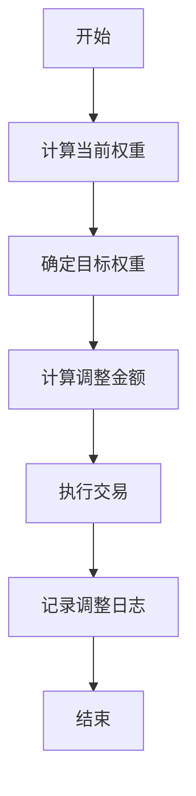
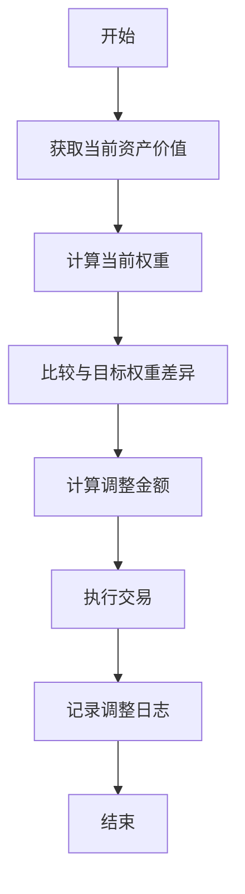
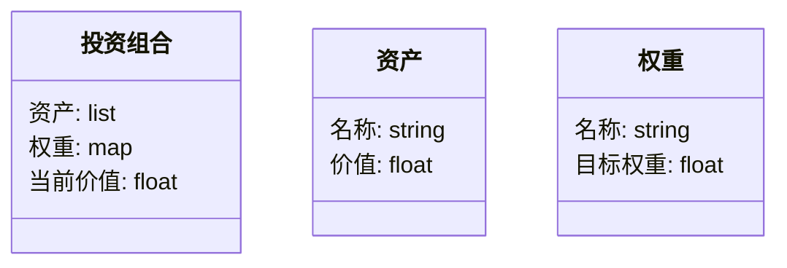
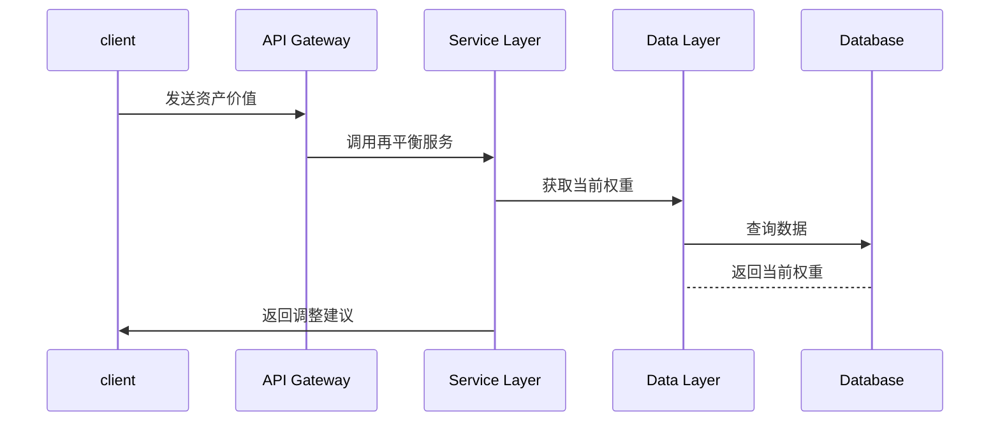

                 


# 约翰·伯格的再平衡策略：保持投资组合平衡

> **关键词**: 投资组合再平衡，约翰·伯格，Vanguard，资产配置，风险管理

> **摘要**: 本文深入探讨了约翰·伯格的再平衡策略，分析其在投资组合管理中的重要性、实现方法及其在实际中的应用。通过系统设计、算法实现和实战案例，详细阐述了如何通过再平衡策略优化投资组合，降低风险，实现长期稳健的投资收益。

---

## 第一部分: 约翰·伯格的再平衡策略基础

### 第1章: 投资组合再平衡概述

#### 1.1 投资组合再平衡的定义与重要性

- **1.1.1 投资组合再平衡的定义**
  投资组合再平衡是一种通过调整资产配置，使投资组合的权重与预定目标一致的策略。它是投资组合管理中的关键步骤，旨在应对市场波动和投资者目标的变化。

- **1.1.2 再平衡在投资组合管理中的重要性**
  再平衡能够确保投资组合的风险和收益特征与初始目标一致，避免单一资产的过度暴露，降低整体风险。同时，它还能捕捉市场变化带来的机会，优化投资回报。

- **1.1.3 再平衡与投资目标的关系**
  再平衡策略根据投资目标（如风险承受能力、收益目标）动态调整资产配置，确保投资组合始终与目标一致。

#### 1.2 再平衡的类型与应用场景

- **1.2.1 定期再平衡**
  按照固定的时间间隔（如每年或每季度）进行再平衡，适用于长期投资策略。

- **1.2.2 事件驱动再平衡**
  根据特定事件（如资产价格大幅波动或投资目标变化）触发再平衡，适用于风险敏感型投资。

- **1.2.3 指数基金与主动管理的再平衡策略**
  指数基金通常采用定期再平衡，而主动管理型基金则根据市场变化动态调整。

#### 1.3 约翰·伯格的再平衡策略背景

- **1.3.1 约翰·伯格与 Vanguard 的投资哲学**
  约翰·伯格是 Vanguard 的创始人，主张低成本、指数化投资。他强调分散投资和长期持有，再平衡是其实现目标的重要手段。

- **1.3.2 伯格再平衡策略的核心思想**
  伯格认为，再平衡不是为了追求短期收益，而是为了维持投资组合的稳定性，降低风险。

- **1.3.3 再平衡策略的边界与外延**
  再平衡适用于各类投资组合，但需根据市场环境和投资者需求调整频率和幅度。

#### 1.4 本章小结
本章介绍了再平衡的定义、类型和应用场景，分析了约翰·伯格的再平衡策略背景及其重要性。

---

### 第2章: 再平衡策略的核心概念与联系

#### 2.1 再平衡的数学模型与公式

- **2.1.1 投资组合权重计算公式**
  $$ w_i = \frac{A_i}{\sum_{j=1}^{n} A_j} $$
  其中，$w_i$ 是第 $i$ 项资产的权重，$A_i$ 是第 $i$ 项资产的金额，$n$ 是资产总数。

- **2.1.2 再平衡调整公式**
  $$ A_i' = A_i \times \frac{w_i}{\sum_{j=1}^{n} w_j} $$

#### 2.2 再平衡的 ER 实体关系图

```mermaid
ERDiagram
    投资组合
    o-1: has
    资产
    o-1: has
    权重
```

#### 2.3 再平衡的流程图



#### 2.4 本章小结
本章通过数学模型和流程图，详细阐述了再平衡的核心概念及其联系。

---

## 第二部分: 约翰·伯格再平衡策略的算法原理

### 第3章: 算法原理概述

#### 3.1 算法原理概述

- **3.1.1 等权重再平衡算法**
  每个资产按相等权重配置，定期调整以维持等权重。

- **3.1.2 时间驱动再平衡算法**
  根据固定时间间隔进行再平衡，适用于长期投资策略。

- **3.1.3 事件驱动再平衡算法**
  根据特定事件触发再平衡，适用于市场波动较大时。

#### 3.2 算法实现的 Mermaid 流程图



#### 3.3 算法实现的 Python 源代码

```python
def rebalance_portfolio(current_weights, target_weights):
    # 计算调整金额
    adjustment = target_weights - current_weights
    # 执行交易
    execute_trades(adjustment)
    # 记录日志
    log_rebalance(adjustment)
```

#### 3.4 本章小结
本章详细介绍了再平衡的算法原理，并通过代码实现展示了如何在实际中应用这些算法。

---

## 第三部分: 系统分析与架构设计方案

### 第4章: 问题场景介绍

- **4.1 投资组合管理的背景**
  投资者需要管理多样化的资产，确保投资组合的风险和收益特征与目标一致。

- **4.2 项目介绍**
  开发一个投资组合再平衡系统，实现自动化调整，优化投资组合。

### 第4.3 系统功能设计

- **4.3.1 领域模型 Mermaid 类图**



- **4.3.2 系统架构设计 Mermaid 架构图**


- **4.3.3 系统接口设计**
  API 接口用于接收当前资产价值和目标权重，返回调整建议。

- **4.3.4 系统交互 Mermaid 序列图**



#### 4.4 本章小结
本章通过系统设计展示了如何实现再平衡策略的自动化管理，强调了系统架构和功能设计的重要性。

---

## 第四部分: 项目实战

### 第5章: 投资组合再平衡的实战案例

#### 5.1 环境安装

- **5.1.1 安装 Python 环境**
  使用 Anaconda 安装 Python 3.8 或更高版本。

- **5.1.2 安装依赖库**
  ```bash
  pip install pandas numpy matplotlib
  ```

#### 5.2 系统核心实现源代码

```python
import pandas as pd
import numpy as np

def calculate_weights(portfolio_value, target_weights):
    return portfolio_value * target_weights

def execute_trades(weights, current_weights):
    adjustment = weights - current_weights
    return adjustment

# 示例数据
portfolio_value = [100, 200, 300]
target_weights = [0.3, 0.3, 0.4]

# 计算权重
weights = calculate_weights(portfolio_value, target_weights)
# 执行交易
adjustment = execute_trades(weights, portfolio_value)
print("调整金额:", adjustment)
```

#### 5.3 代码应用解读与分析

- **5.3.1 代码解读**
  代码计算投资组合的权重，并根据当前权重和目标权重计算调整金额。

- **5.3.2 实际案例分析**
  以一个简单的三资产组合为例，展示再平衡的过程和结果。

#### 5.4 项目小结
本章通过实战案例展示了如何将再平衡策略应用于实际投资组合管理中，帮助读者理解理论与实践的结合。

---

## 第五部分: 高级策略与风险管理

### 第6章: 动态再平衡策略

#### 6.1 动态再平衡的定义与优势

- **6.1.1 动态再平衡的定义**
  根据市场变化实时调整投资组合，动态再平衡能够快速响应市场波动。

- **6.1.2 动态再平衡的优势**
  降低市场波动带来的风险，捕捉市场机会，优化投资回报。

#### 6.2 动态再平衡的实现方法

- **6.2.1 基于市场指数的动态再平衡**
  根据市场指数的变化调整投资组合权重。

- **6.2.2 基于风险指标的动态再平衡**
  使用波动率、VaR等风险指标动态调整资产配置。

#### 6.3 本章小结
本章介绍了动态再平衡策略及其实现方法，帮助投资者在复杂市场环境中优化投资组合。

### 第7章: 风险管理与再平衡策略

#### 7.1 风险管理的重要性

- **7.1.1 风险管理的定义**
  识别、评估和控制投资组合中的风险，确保投资目标的实现。

- **7.1.2 风险管理与再平衡策略的关系**
  再平衡策略是风险管理的重要手段，通过调整资产配置降低整体风险。

#### 7.2 风险管理中的再平衡策略

- **7.2.1 风险平价再平衡**
  根据资产的风险贡献进行再平衡，确保每种资产的风险贡献相等。

- **7.2.2 最小化风险再平衡**
  通过优化算法最小化投资组合的总体风险。

#### 7.3 本章小结
本章强调了风险管理在再平衡策略中的重要性，并介绍了几种常见的风险管理方法。

---

## 第六部分: 最佳实践与总结

### 第8章: 最佳实践 tips

- **8.1 定期审查投资组合**
  定期审查投资组合的权重和风险特征，确保与目标一致。

- **8.2 使用工具辅助**
  利用投资组合管理软件或API实现自动化再平衡。

- **8.3 保持分散投资**
  避免过度集中于单一资产或市场，降低整体风险。

### 第9章: 总结与展望

#### 9.1 总结
本文深入探讨了约翰·伯格的再平衡策略，分析了其在投资组合管理中的重要性、实现方法及其在实际中的应用。

#### 9.2 展望
未来，随着人工智能和大数据技术的发展，再平衡策略将更加智能化和个性化，为投资者提供更高效的风险管理工具。

---

## 附录

### 附录 A: 工具介绍

- **Python 投资组合管理库**
  - `pandas`：数据处理与分析。
  - `numpy`：数值计算。
  - `plotly`：可视化。

- **API 工具**
  - `requests`：HTTP 请求库。
  - `flask`：Web 应用框架。

### 附录 B: 术语表

- **投资组合再平衡**：调整资产配置以维持目标权重。
- **权重**：资产在投资组合中的比例。
- **风险平价**：根据风险贡献分配资产权重。

### 附录 C: 参考文献

- 伯格，约翰. 《投资最重要的事情》.
- 哈里·马科维茨. 《投资组合理论》.

---

**作者：AI天才研究院/AI Genius Institute & 禅与计算机程序设计艺术/Zen And The Art of Computer Programming**

