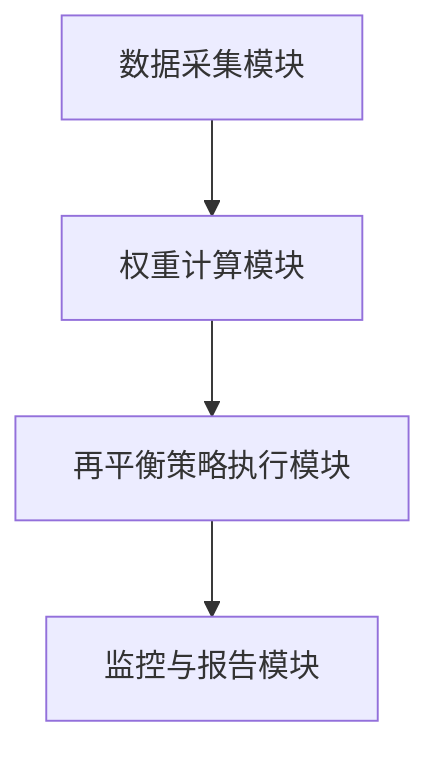

                 


# 约翰·伯格的再平衡策略：维持投资组合平衡

## 关键词：投资组合再平衡，资产配置，约翰·伯格，动态优化，系统架构

## 摘要：  
本文深入探讨了约翰·伯格的再平衡策略在投资组合管理中的重要性。通过分析再平衡策略的核心概念、算法原理、系统架构和实际案例，本文旨在帮助读者理解如何通过定期调整资产配置来维持投资组合的平衡，从而实现长期稳定的收益。  

---

# 第1章：投资组合再平衡策略的背景与重要性  

## 1.1 投资组合再平衡的背景介绍  

### 1.1.1 投资组合管理的基本概念  
投资组合管理是通过科学配置资产（如股票、债券、房地产等）以实现投资目标的过程。再平衡策略是投资组合管理中的关键步骤，旨在应对市场波动和投资者风险偏好的变化，保持资产配置的合理性。  

### 1.1.2 再平衡策略的定义与目标  
再平衡策略是指定期调整投资组合的资产配置，以确保各资产类别的权重与初始目标一致。其目标是降低风险、提高收益，并在市场波动中维持投资组合的稳定性。  

### 1.1.3 再平衡策略在投资组合管理中的重要性  
再平衡策略能够帮助投资者应对市场变化，避免过度集中在某一资产类别，从而降低整体投资组合的风险。此外，再平衡还能确保投资组合的表现与初始目标一致，帮助投资者实现长期财务目标。  

## 1.2 约翰·伯格的再平衡策略  

### 1.2.1 约翰·伯格的生平与投资理念  
约翰·伯格是 Vanguard 集团的创始人，以其倡导的指数投资和低成本策略闻名。他认为，长期投资和合理的资产配置是实现稳定收益的关键。再平衡策略是其投资理念的重要组成部分。  

### 1.2.2 约翰·伯格再平衡策略的核心思想  
伯格的再平衡策略强调定期检查投资组合的资产配置，并根据市场变化和个人风险偏好进行调整。他建议投资者每年至少进行一次再平衡，以确保资产配置与投资目标一致。  

### 1.2.3 约翰·伯格再平衡策略的实际应用案例  
以 Vanguard 的指数基金为例，伯格通过定期再平衡，确保投资组合在不同市场环境下的稳定性。例如，在市场下跌期间，增加债券配置以降低风险；在市场上涨期间，增加股票配置以捕捉收益。  

## 1.3 再平衡策略与其他投资策略的对比  

### 1.3.1 基金定投策略  
基金定投策略通过定期投资固定金额，逐步积累基金份额，平滑市场波动带来的风险。与再平衡策略不同，定投不主动调整资产配置，而是通过时间分散风险。  

### 1.3.2 资产配置策略  
资产配置策略是通过分配资产到不同的类别（如股票、债券、现金等）来实现投资目标的过程。再平衡策略是资产配置策略的重要组成部分，用于维持资产配置的比例。  

### 1.3.3 动态资产分配策略  
动态资产分配策略根据市场变化频繁调整资产配置比例，追求短期收益。与再平衡策略相比，动态策略更具灵活性，但可能增加交易成本和风险。  

## 1.4 本章小结  
本章介绍了再平衡策略的背景和重要性，并详细阐述了约翰·伯格的再平衡策略及其与其他投资策略的区别。再平衡策略的核心在于通过定期调整资产配置，实现投资组合的长期稳定收益。  

---

# 第2章：投资组合再平衡的核心概念与原理  

## 2.1 再平衡策略的核心概念  

### 2.1.1 投资组合的权重分布  
权重分布是指投资组合中各资产类别的占比。例如，股票占60%，债券占30%，现金占10%。再平衡策略的目标是维持这些权重的稳定。  

### 2.1.2 市场波动与资产价格变化  
市场波动会导致资产价格变化，进而影响投资组合的权重分布。例如，股票价格上涨可能导致股票权重超过初始目标。  

### 2.1.3 再平衡的触发条件  
再平衡通常由以下条件触发：  
- 资产权重偏离目标比例超过一定阈值（如5%）。  
- 市场环境变化（如经济衰退或牛市）。  
- 投资者风险偏好的变化。  

## 2.2 再平衡策略的数学模型  

### 2.2.1 投资组合权重计算公式  
$$ w_i = \frac{A_i}{A_{total}} $$  
其中，$w_i$ 是资产 $i$ 的权重，$A_i$ 是资产 $i$ 的投资金额，$A_{total}$ 是投资组合的总金额。  

### 2.2.2 再平衡后的权重调整公式  
$$ \text{调整后权重} = \frac{\text{当前权重} \pm \text{调整幅度}}{\text{总权重}} $$  

### 2.2.3 数学模型的优缺点分析  
优点：  
- 简单易懂，便于实现。  
- 可以量化权重偏离程度，提供明确的调整依据。  
缺点：  
- 忽略了市场趋势和资产特性（如流动性）。  
- 需要频繁调整，可能增加交易成本。  

## 2.3 再平衡策略与资产配置的关系  

### 2.3.1 资产配置的基本原理  
资产配置是根据投资目标和风险承受能力，分配资金到不同的资产类别。再平衡策略是资产配置的动态调整过程。  

### 2.3.2 再平衡策略在资产配置中的作用  
再平衡策略通过调整资产权重，确保投资组合的表现与初始配置一致。  

### 2.3.3 不同资产类别下的再平衡策略  
- 股票：根据市场估值调整股票权重。  
- 债券：根据利率变化调整债券权重。  
- 现金：根据流动性需求调整现金比例。  

## 2.4 本章小结  
本章详细讲解了再平衡策略的核心概念和数学模型，并分析了其与资产配置的关系。再平衡策略的关键在于通过数学模型量化权重偏离，并根据市场变化进行调整。  

---

# 第3章：再平衡策略的算法原理与实现  

## 3.1 再平衡策略的优化模型  

### 3.1.1 优化目标的定义  
目标是通过调整资产配置，最小化投资组合的风险（如波动率）或最大化收益。  

### 3.1.2 约束条件的设定  
- 投资组合总权重为1。  
- 各资产权重非负。  
- 权重调整幅度不超过设定阈值。  

### 3.1.3 数学模型的构建  
$$ \min \sigma^2 \quad \text{subject to} \quad w_i \leq w_i^{target} + \delta $$  
其中，$\sigma^2$ 是投资组合的波动率，$w_i^{target}$ 是目标权重，$\delta$ 是调整幅度。  

## 3.2 再平衡策略的实现步骤  

### 3.2.1 数据采集与处理  
- 采集市场数据（如资产价格、收益率）。  
- 计算各资产的当前权重。  

### 3.2.2 权重计算与调整  
- 计算权重偏离目标的程度。  
- 根据偏离程度调整各资产的权重。  

### 3.2.3 策略执行与监控  
- 执行交易，调整资产配置。  
- 定期监控权重偏离情况，持续再平衡。  

## 3.3 再平衡策略的算法实现  

### 3.3.1 贪心算法的实现  
```python
def greedy_rebalancing(weights, target_weights, threshold=0.05):
    for i in range(len(weights)):
        if abs(weights[i] - target_weights[i]) > threshold:
            adjustment = target_weights[i] - weights[i]
            weights[i] += adjustment
    return weights
```

### 3.3.2 动态规划算法的实现  
```python
def dynamic_rebalancing(weights, target_weights, n=5):
    for i in range(n):
        weights = rebalance(weights, target_weights)
    return weights
```

### 3.3.3 遗传算法的实现  
```python
def genetic_rebalancing(weights, target_weights, population=100, generations=10):
    # 初始化种群
    population = [random_weights() for _ in range(population)]
    
    for _ in range(generations):
        # 计算适应度
        fitness = [fitness_function(w, target_weights) for w in population]
        # 选择优秀个体
        selected = select(population, fitness)
        # 交叉和变异
        population = crossover(selected)
    
    return population[0]
```

## 3.4 本章小结  
本章详细讲解了再平衡策略的优化模型和算法实现。通过贪心算法、动态规划和遗传算法的对比，展示了不同算法在再平衡策略中的应用。  

---

# 第4章：投资组合再平衡的系统分析与架构设计  

## 4.1 系统分析  

### 4.1.1 问题场景描述  
- 投资者需要定期调整投资组合，以应对市场波动和风险变化。  
- 系统需要实时监控市场数据，自动触发再平衡操作。  

### 4.1.2 系统目标与需求分析  
- 实时数据采集与处理。  
- 自动化再平衡策略执行。  
- 用户友好的界面设计。  

### 4.1.3 系统边界与接口设计  
- 输入：市场数据、用户目标配置。  
- 输出：再平衡操作指令。  

## 4.2 系统架构设计  

### 4.2.1 系统功能设计  
- 数据采集模块：采集市场数据和用户输入。  
- 权重计算模块：计算当前权重和目标权重。  
- 再平衡策略执行模块：根据权重偏离情况执行再平衡操作。  
- 监控与报告模块：监控再平衡效果并生成报告。  

### 4.2.2 系统架构图（使用 Mermaid）  


### 4.2.3 接口设计  
- 数据接口：与数据源（如API）对接。  
- 用户接口：提供配置设置和报告查看功能。  

### 4.2.4 交互设计  
- 用户输入目标配置。  
- 系统自动执行再平衡操作。  
- 用户查看再平衡报告。  

## 4.3 本章小结  
本章通过系统分析与架构设计，展示了再平衡策略在实际系统中的实现。模块化设计和高效的系统架构是确保再平衡策略有效执行的关键。  

---

# 第5章：再平衡策略的项目实战  

## 5.1 项目环境安装  

### 5.1.1 Python 环境安装  
安装 Python 和必要的库（如 pandas、numpy、scipy）。  

### 5.1.2 数据源获取  
从金融数据 API（如 Yahoo Finance）获取市场数据。  

## 5.2 系统核心实现源代码  

### 5.2.1 数据采集与处理  
```python
import pandas as pd
import numpy as np

# 获取市场数据
data = pd.read_csv('market_data.csv')
```

### 5.2.2 权重计算与调整  
```python
def calculate_weights(data):
    total = data.sum()
    weights = data / total
    return weights

weights = calculate_weights(data)
target_weights = np.array([0.6, 0.3, 0.1])
```

### 5.2.3 再平衡策略实现  
```python
def rebalance(weights, target_weights):
    adjusted_weights = weights + (target_weights - weights) * 0.5
    return adjusted_weights

adjusted_weights = rebalance(weights, target_weights)
```

## 5.3 实际案例分析  

### 5.3.1 案例背景  
假设投资者的投资组合包括股票、债券和现金，初始目标权重分别为60%、30%和10%。  

### 5.3.2 市场变化与权重偏离  
市场下跌导致股票权重降至50%，债券权重升至35%，现金权重降至15%。  

### 5.3.3 再平衡操作  
根据再平衡策略，调整股票权重至60%，债券权重至30%，现金权重至10%。  

## 5.4 项目总结  

### 5.4.1 项目成果  
通过再平衡策略，投资组合恢复了初始目标权重，降低了风险。  

### 5.4.2 经验与教训  
- 定期监控和调整是关键。  
- 再平衡策略的有效性依赖于准确的市场数据和合理的权重设定。  

## 5.5 本章小结  
本章通过实际案例分析，展示了再平衡策略的实现过程和效果。通过项目实战，读者可以更好地理解再平衡策略的应用。  

---

# 第6章：再平衡策略的最佳实践与未来展望  

## 6.1 最佳实践  

### 6.1.1 定期再平衡  
建议每年至少进行一次再平衡，根据市场变化调整频率。  

### 6.1.2 选择合适的再平衡频率  
- 高频交易：适合机构投资者。  
- 低频交易：适合个人投资者。  

### 6.1.3 考虑交易成本  
频繁调整可能增加交易成本和税收负担。  

## 6.2 小结  

### 6.2.1 再平衡策略的核心要点  
- 定期调整资产配置。  
- 维持目标权重。  
- 降低风险，提高收益。  

## 6.3 未来展望  

### 6.3.1 人工智能与再平衡策略  
人工智能技术可以提高再平衡策略的预测能力和自动化水平。  

### 6.3.2 区块链技术的应用  
区块链技术可以提高再平衡策略的透明性和安全性。  

### 6.3.3 可持续投资与再平衡策略  
随着ESG投资兴起，再平衡策略需要考虑环境、社会和治理因素。  

## 6.4 本章小结  
本章总结了再平衡策略的最佳实践，并展望了未来的发展方向。随着技术进步，再平衡策略将更加智能化和个性化。  

---

# 结论  

约翰·伯格的再平衡策略是投资组合管理中的重要工具。通过定期调整资产配置，投资者可以降低风险、提高收益，并实现长期财务目标。本文详细探讨了再平衡策略的核心概念、算法原理和系统实现，并通过实际案例展示了其应用。未来，随着技术进步，再平衡策略将更加智能化和个性化，为投资者提供更多选择和机会。  

---

# 作者：AI天才研究院/AI Genius Institute & 禅与计算机程序设计艺术 /Zen And The Art of Computer Programming

