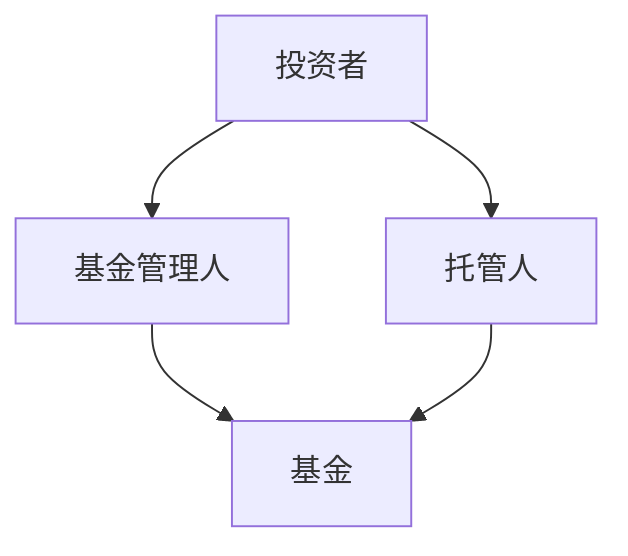
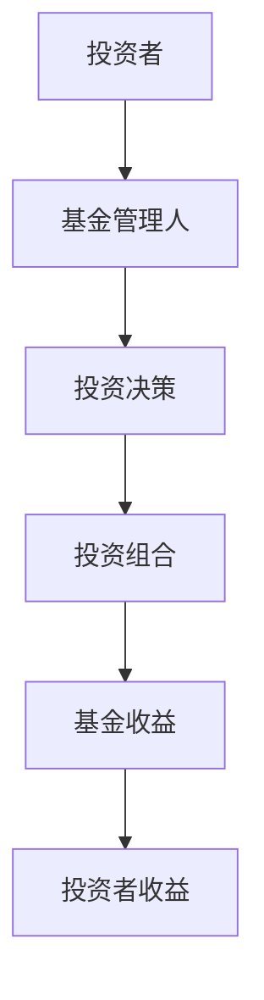
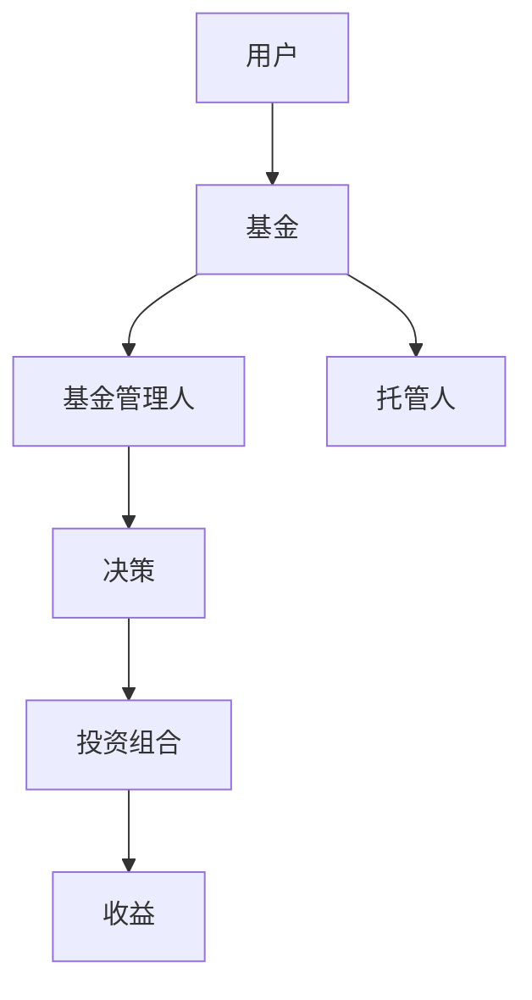

                 


# 《约翰·伯格的基金业批评》

## 关键词：基金行业、约翰·伯格、投资理念、指数基金、主动管理、投资者教育

## 摘要：  
本文深入探讨了基金行业当前存在的问题，并结合约翰·伯格的批评观点，分析了传统基金行业的局限性及其对投资者的潜在影响。文章从基金行业的核心概念、伯格的投资理念、系统架构设计、案例分析及实战应用等多个维度展开，详细阐述了伯格对基金行业的批评及其解决方案。通过本文，读者将能够理解基金行业的现状、伯格的批评理论及其实际应用，从而更好地做出投资决策。

---

## 第一部分：引言

### 第1章：基金行业的现状与问题

#### 1.1 基金行业的定义与背景

基金行业是金融领域的重要组成部分，主要通过集合投资者的资金，由专业管理人进行投资运作，以实现资产增值。基金行业起源于20世纪初，随着金融市场的不断发展，逐渐成为个人和机构投资者的重要投资工具。基金行业涵盖股票型基金、债券型基金、混合型基金等多种类型，市场规模庞大，涉及众多投资者和机构。

#### 1.2 基金行业的核心问题

当前，基金行业面临多重问题：

1. **高昂的费用**：基金管理人的管理费和托管费往往较高，显著侵蚀了投资者的收益。
2. **短期主义**：许多基金管理人追求短期收益，导致投资行为短期化，忽视长期价值。
3. **主动管理的局限性**：大多数主动管理型基金的表现难以超越市场指数，且波动性较大。
4. **信息不对称**：投资者难以全面了解基金的实际运作情况，容易受到管理人的误导。

#### 1.3 约翰·伯格的背景与贡献

约翰·伯格是 Vanguard 集团的创始人，也是指数基金的倡导者。他通过长期投资和价值投资的理念，批评了传统基金行业的许多做法。伯格的贡献包括：

1. **指数基金的推广**：伯格提出了指数基金的概念，认为指数基金能够以较低的成本实现市场的平均收益。
2. **投资者教育**：伯格强调投资者教育的重要性，认为大多数投资者缺乏必要的金融知识，容易被误导。
3. **长期投资理念**：伯格主张买入并持有策略，认为长期投资能够有效降低风险并实现稳定收益。

---

## 第二部分：基金行业的核心概念与联系

### 第2章：基金行业的核心概念

#### 2.1 基金的核心概念

基金的核心概念包括：

1. **基金类型**：基金可以分为股票型、债券型、混合型、货币市场基金等。
2. **基金运作**：基金通过汇集投资者的资金，由管理人进行投资运作，托管人负责资金托管。
3. **基金费用**：基金的费用包括管理费、托管费、申购费等，这些费用会直接影响投资者的收益。

#### 2.2 基金行业的实体关系图

以下是基金行业的实体关系图：



#### 2.3 基金运作的流程图



---

## 第三部分：约翰·伯格的批评理论

### 第3章：伯格的批评理论

#### 3.1 伯格的投资理念

伯格的投资理念以价值投资和长期投资为核心：

1. **价值投资**：伯格认为，投资应注重企业的内在价值，而非市场的短期波动。
2. **长期投资**：通过长期持有优质资产，投资者能够规避市场的短期波动风险，实现稳定收益。

#### 3.2 对传统基金行业的批评

伯格对传统基金行业的批评主要集中在以下几点：

1. **主动管理的低效性**：大多数主动管理型基金的表现不如市场指数，且费用较高。
2. **短期主义的危害**：基金行业的短期导向使得投资者容易追涨杀跌，难以实现长期收益。
3. **信息不对称**：投资者难以获取基金运作的详细信息，容易受到管理人的误导。

#### 3.3 伯格的解决方案

伯格提出了以下解决方案：

1. **推广指数基金**：通过投资指数基金，投资者可以以较低的成本获得市场的平均收益。
2. **加强投资者教育**：提高投资者的金融素养，帮助其做出明智的投资决策。
3. **鼓励长期投资**：通过长期持有优质资产，规避市场的短期波动风险。

---

## 第四部分：基金行业的系统分析与架构设计

### 第4章：基金行业的系统分析

#### 4.1 基金行业的项目介绍

1. **项目目标**：分析基金行业的现状及其存在的问题。
2. **项目范围**：涵盖基金行业的运作机制、存在问题及解决方案。
3. **项目利益相关者**：投资者、基金管理人、托管人、监管机构等。

#### 4.2 基金行业的系统架构设计



---

## 第五部分：基金行业的案例分析

### 第5章：基金行业的典型案例

#### 5.1 成功案例分析

1. **指数基金的成功案例**： Vanguard 的指数基金通过低成本和长期稳定的收益，赢得了投资者的信赖。
2. **长期投资的成功案例**：伯格通过长期持有优质资产，实现了稳定的收益。

#### 5.2 失败案例分析

1. **主动管理失败的案例**：许多主动管理型基金的表现不佳，费用却较高。
2. **短期主义导致的失败案例**：投资者因追涨杀跌而遭受损失。

---

## 第六部分：约翰·伯格批评的实战应用

### 第6章：指数基金的实战应用

#### 6.1 环境安装与配置

1. **投资工具的选择**：选择低成本的指数基金。
2. **数据源的获取**：获取市场指数的历史数据。
3. **分析工具的安装**：安装数据分析工具，如 Python 的 pandas 库。

#### 6.2 核心实现源代码

```python
import pandas as pd
import matplotlib.pyplot as plt

# 获取指数数据
data = pd.read_csv('index_data.csv')

# 计算指数收益
data['Return'] = data['Close'].pct_change()

# 绘制收益曲线
plt.plot(data['Date'], data['Return'])
plt.title('指数收益曲线')
plt.xlabel('日期')
plt.ylabel('收益')
plt.show()
```

---

## 第七部

