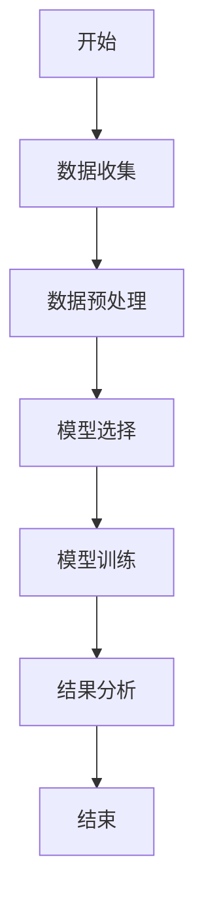
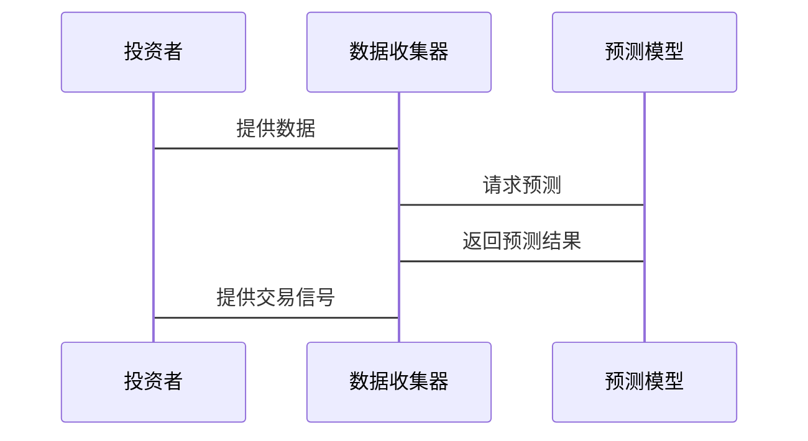

                 


# 约翰·伯格的市场预测批评

> 关键词：约翰·伯格、市场预测、均值回归、技术分析、金融风险管理

> 摘要：本文深入探讨了约翰·伯格对传统市场预测方法的批评，分析了他的理论基础和预测模型，结合实际案例，详细讲解了伯格方法的应用及其实战技巧，帮助读者理解其在现代金融投资中的重要性。

---

# 第一部分：约翰·伯格的市场预测批评背景介绍

## 第1章：市场预测的核心概念

### 1.1 问题背景与描述

#### 1.1.1 传统市场预测方法的局限性
传统市场预测方法通常依赖于历史价格数据和财务指标，假设市场是有效的，即价格反映了所有可用信息。然而，这种方法在实际操作中常常失败，原因包括：
- **数据的片面性**：仅依赖历史数据，忽视了市场情绪和投资者行为等不可量化的因素。
- **模型的过度简化**：传统模型假设市场参与者理性且行为一致，但实际情况往往复杂多变。
- **预测的不确定性**：市场受到外部事件（如政策变化、经济危机等）的影响，增加了预测的难度。

#### 1.1.2 约翰·伯格的市场预测批评
约翰·伯格是金融市场的著名分析师，他批评传统市场预测方法的不足，认为：
- **市场非有效**：价格并未完全反映所有信息，存在短期波动和市场情绪的影响。
- **预测的局限性**：任何预测方法都存在局限性，无法准确预测市场的长期走势。
- **风险管理的重要性**：预测本身并非最终目标，而是为了更好地进行风险管理。

#### 1.1.3 问题解决的思路与方法
伯格的思路是通过结合技术分析和基本面分析，同时注重风险控制，来改进市场预测的准确性。他强调：
- **短期波动的关注**：通过技术分析捕捉短期市场波动。
- **长期趋势的把握**：结合基本面分析，识别市场的长期趋势。
- **风险控制的优先性**：无论预测如何，风险控制是投资成功的关键。

### 1.2 核心概念与联系

#### 1.2.1 核心概念原理
伯格的核心理论是“均值回归”（Mean Reversion），即市场价格会围绕其内在价值波动，最终回归到均值水平。这一理论认为，短期价格波动可以通过技术分析识别，而长期趋势则需要基本面分析的支持。

#### 1.2.2 市场预测的核心要素对比表格
| 要素       | 描述 | 伯格方法 |
|------------|------|----------|
| 数据来源   | 历史价格、财务报表 | 强调技术分析和短期波动 |
| 模型假设   | 市场有效、理性预期 | 假设市场非有效，关注短期波动 |
| 预测目标   | 价格趋势、波动性 | 短期波动和长期趋势结合 |

#### 1.2.3 市场预测的ER实体关系图
```mermaid
erDiagram
    投资者 {
        <属性> 历史价格
        <属性> 财务数据
        <属性> 市场情绪
    }
    预测模型 {
        <属性> 模型参数
        <属性> 预测结果
    }
    投资者 --> 预测模型 : 提供数据
    预测模型 --> 投资者 : 提供预测
```

---

# 第二部分：约翰·伯格的市场预测批评

## 第2章：约翰·伯格的预测方法

### 2.1 核心概念与联系

#### 2.1.1 约翰·伯格的理论基础
伯格的预测方法基于以下几点：
- **均值回归理论**：市场价格会在长期回归到均值水平。
- **技术分析**：通过价格图表和成交量分析识别短期趋势。
- **风险管理**：通过头寸管理和止损策略控制风险。

#### 2.1.2 伯格预测方法的属性特征对比
| 特性       | 描述 | 伯格方法 |
|------------|------|----------|
| 数据驱动   | 基于历史数据 | 强调均值回归和短期波动 |
| 模型假设   | 市场非有效 | 关注市场情绪和技术指标 |
| 预测目标   | 短期波动和长期趋势 | 结合技术分析和基本面分析 |

#### 2.1.3 伯格方法的流程


### 2.2 伯格预测方法的算法原理

#### 2.2.1 均值回归策略
均值回归策略的核心思想是，价格会围绕某个均值波动，当价格偏离均值时，会回归到均值水平。伯格通过技术分析识别价格偏离的情况，并在价格接近均值时进行交易。

#### 2.2.2 算法实现
以下是一个简单的均值回归策略的Python代码示例：

```python
import pandas as pd
import numpy as np

# 示例数据
data = pd.DataFrame({'价格': [100, 105, 98, 101, 103, 100]})

# 计算20天的移动平均线
data['MA'] = data['价格'].rolling(window=20).mean()

# 判断价格是否偏离均值
data['偏离'] = (data['价格'] - data['MA']).apply(lambda x: '是' if abs(x) > 5 else '否')

print(data)
```

#### 2.2.3 数学模型
均值回归模型的数学公式可以表示为：
$$ P_t = \mu + \epsilon_t $$
其中：
- \( P_t \) 是当前价格
- \( \mu \) 是均值水平
- \( \epsilon_t \) 是随机误差项

---

# 第三部分：系统分析与架构设计

## 第3章：系统分析与架构设计

### 3.1 问题场景介绍
在金融市场上，投资者需要实时监控市场波动，及时做出决策。伯格的预测方法可以帮助投资者识别短期波动，同时控制风险。

### 3.2 系统功能设计

#### 3.2.1 领域模型


#### 3.2.2 系统架构


#### 3.2.3 系统接口设计
- **输入接口**：接收历史价格数据和市场情绪指标。
- **输出接口**：提供预测结果和交易信号。

#### 3.2.4 系统交互


---

# 第四部分：项目实战

## 第4章：项目实战

### 4.1 环境安装
需要安装以下工具：
- Python
- Pandas
- NumPy
- Matplotlib

### 4.2 核心代码实现
以下是一个简单的均值回归策略的Python代码示例：

```python
import pandas as pd
import numpy as np

# 示例数据
data = pd.DataFrame({'价格': [100, 105, 98, 101, 103, 100]})

# 计算20天的移动平均线
data['MA'] = data['价格'].rolling(window=20).mean()

# 判断价格是否偏离均值
data['偏离'] = (data['价格'] - data['MA']).apply(lambda x: '是' if abs(x) > 5 else '否')

print(data)
```

### 4.3 代码解读与分析
- **数据收集**：从数据源获取历史价格数据。
- **数据预处理**：计算移动平均线（MA）。
- **模型训练**：判断价格是否偏离均值。
- **结果分析**：输出交易信号。

### 4.4 实际案例分析
以某股票为例，分析其价格波动并应用伯格的方法进行预测。

### 4.5 项目小结
通过实际案例分析，验证伯格方法的有效性，并总结经验教训。

---

# 第五部分：最佳实践与总结

## 第5章：最佳实践

### 5.1 小结
伯格的市场预测批评提供了新的视角，强调了技术分析和风险管理的重要性。

### 5.2 注意事项
- **数据质量**：确保数据的准确性和完整性。
- **模型选择**：根据实际情况选择合适的预测模型。
- **风险控制**：始终将风险控制放在首位。

### 5.3 拓展阅读
- 《投资学》
- 《技术分析的理论与实践》

---

# 作者信息

作者：AI天才研究院/AI Genius Institute & 禅与计算机程序设计艺术 /Zen And The Art of Computer Programming

