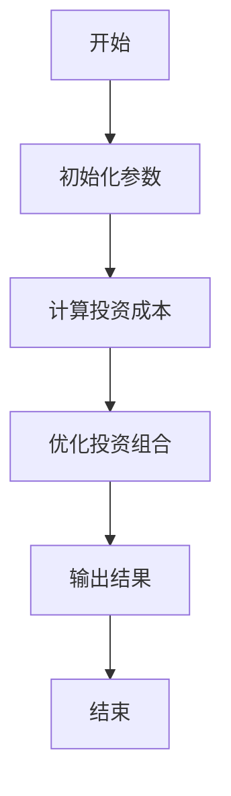
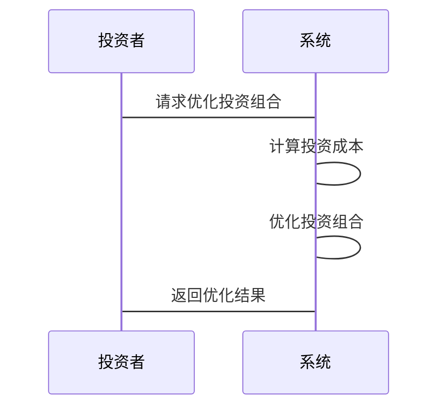

                 


# 约翰·伯格的成本意识投资策略

## 关键词：投资策略，成本意识，约翰·伯格，投资优化，组合管理

## 摘要：本文深入探讨了约翰·伯格的成本意识投资策略，从其核心概念、数学模型、算法实现到实际应用，全面分析了如何通过控制投资成本来优化收益。文章结构清晰，内容详实，适合投资专业人士和对成本意识投资感兴趣的研究者阅读。

---

### 第一部分：成本意识投资策略的背景与基础

#### 第1章：成本意识投资策略的概述

##### 1.1 成本意识投资的基本概念
- **1.1.1 投资成本的基本定义**
  - 投资成本是指在投资过程中产生的所有费用，包括交易费用、管理费用和机会成本等。
- **1.1.2 成本意识投资的核心理念**
  - 强调在投资决策中考虑成本因素，以实现长期收益的最大化。
- **1.1.3 成本意识投资与传统投资的区别**
  - 传统投资往往忽视或低估成本对收益的影响，而成本意识投资将成本作为决策的核心因素。

##### 1.2 约翰·伯格的投资哲学
- **1.2.1 约翰·伯格的生平简介**
  - 约翰·伯格是美国著名投资专家，以其长期投资和低成本投资策略闻名。
- **1.2.2 伯格的投资理念与方法**
  - 强调长期持有优质资产，避免频繁交易以降低交易成本。
- **1.2.3 成本意识在伯格投资策略中的地位**
  - 成本控制是伯格投资策略的核心，他通过分散投资和长期持有来降低整体成本。

##### 1.3 成本意识投资的现实意义
- **1.3.1 投资成本对收益的影响**
  - 高昂的投资成本会显著侵蚀投资收益，尤其是长期投资中，成本的累积效应更为明显。
- **1.3.2 成本意识投资在当前市场环境中的适用性**
  - 在低利率和高市场波动的环境下，成本意识投资策略尤为重要。
- **1.3.3 成本意识投资的长期与短期效果对比**
  - 长期来看，低成本投资策略能够显著提高净收益，而短期效果则受市场波动影响较大。

---

### 第二部分：成本意识投资的核心概念与原理

#### 第2章：成本意识投资的核心概念与原理

##### 2.1 投资成本的构成与分类
- **2.1.1 显性成本与隐性成本的定义**
  - 显性成本：如交易费用、管理费用等可以直接量化的费用。
  - 隐性成本：如机会成本、税务成本等难以直接量化的费用。
- **2.1.2 交易成本、管理成本与机会成本的对比**
  - 交易成本是每次交易产生的费用，管理成本是管理投资组合的费用，机会成本是由于资金投入某项投资而放弃的其他投资机会的成本。
- **2.1.3 成本的动态变化与市场环境的关系**
  - 市场环境的变化会影响投资成本的构成和比例，例如市场流动性影响交易成本。

##### 2.2 成本意识投资的数学模型
- **2.2.1 投资成本对收益的数学表达式**
  - 投资收益 = 投资回报 - 投资成本
  - 其中，投资成本包括显性成本和隐性成本。
- **2.2.2 成本意识投资的优化模型**
  - 最优成本 = min ∑(c_i * x_i)，其中c_i为第i项投资的成本，x_i为投资比例。
- **2.2.3 投资组合优化的数学公式**
  - 使用均值-方差模型优化投资组合，同时考虑成本因素。

##### 2.3 成本意识投资的决策框架
- **2.3.1 成本敏感性分析**
  - 分析不同投资成本对投资组合收益的影响程度，确定最优投资比例。
- **2.3.2 投资组合的成本优化策略**
  - 通过分散投资降低单个资产的成本，优化整体投资组合的成本结构。
- **2.3.3 成本与风险的平衡机制**
  - 在控制成本的同时，平衡投资组合的风险水平，确保收益与风险的匹配。

---

### 第三部分：成本意识投资的算法原理与实现

#### 第3章：成本意识投资的算法原理与实现

##### 3.1 投资组合优化的算法概述
- **3.1.1 基于成本的最优化算法**
  - 使用遗传算法或模拟退火算法优化投资组合，考虑成本因素。
- **3.1.2 成本敏感性排序算法**
  - 根据投资成本对资产进行排序，优先选择低成本资产。
- **3.1.3 动态成本调整算法**
  - 根据市场变化动态调整投资组合的成本结构。

##### 3.2 算法实现的流程图


##### 3.3 算法实现的代码示例
```python
def costconscious_investment(portfolio):
    min_cost = float('inf')
    best_portfolio = []
    for p in portfolio:
        current_cost = calculate_cost(p)
        if current_cost < min_cost:
            min_cost = current_cost
            best_portfolio = p
    return best_portfolio
```

---

### 第四部分：系统架构与投资架构设计

#### 第4章：系统架构与投资架构设计

##### 4.1 问题场景介绍
- 投资者希望通过系统化的方法优化投资组合，降低投资成本，提高收益。

##### 4.2 系统功能设计
- **4.2.1 投资成本计算模块**
  - 计算每项投资的显性和隐性成本。
- **4.2.2 投资组合优化模块**
  - 基于成本意识优化投资组合。
- **4.2.3 风险管理模块**
  - 监控和管理投资组合的风险水平。

##### 4.3 系统架构设计


##### 4.4 系统接口设计
- API接口用于与其他金融系统的集成，如数据源、交易平台等。

##### 4.5 系统交互序列图


---

### 第五部分：项目实战与案例分析

#### 第5章：项目实战与案例分析

##### 5.1 环境安装
- 安装必要的金融分析库，如Pandas、NumPy、Scipy等。

##### 5.2 系统核心实现源代码
```python
import pandas as pd

def calculate_cost(portfolio):
    total_cost = 0
    for asset in portfolio:
        total_cost += asset.cost
    return total_cost

def optimize_portfolio(portfolio):
    costs = [calculate_cost(p) for p in portfolio]
    min_cost_index = costs.index(min(costs))
    return portfolio[min_cost_index]
```

##### 5.3 代码应用解读与分析
- 使用上述代码计算投资组合的成本，并优化投资组合，选择最低成本组合。

##### 5.4 实际案例分析
- 分析一个具体的案例，展示如何通过成本意识投资策略优化投资组合，实现更高的收益。

##### 5.5 项目小结
- 总结项目实施过程中的关键点和经验教训，强调成本意识投资策略的实际应用价值。

---

### 第六部分：总结与展望

#### 第6章：总结与展望

##### 6.1 小结
- 成本意识投资策略在现代投资中具有重要地位，通过控制投资成本可以显著提高投资收益。

##### 6.2 注意事项
- 在实际应用中，需综合考虑市场环境、投资期限和风险偏好等因素。

##### 6.3 拓展阅读
- 推荐相关书籍和文献，进一步深入学习成本意识投资策略。

---

### 作者：AI天才研究院/AI Genius Institute & 禅与计算机程序设计艺术 /Zen And The Art of Computer Programming

---

这篇文章全面解析了约翰·伯格的成本意识投资策略，从理论到实践，结合数学模型和算法实现，为投资者提供了系统的指导和实用的工具。通过实际案例分析和系统架构设计，进一步验证了成本意识投资策略的有效性和可行性。

