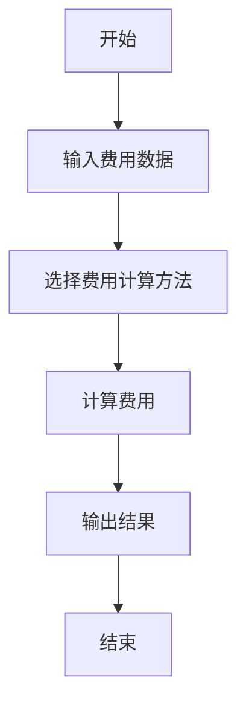
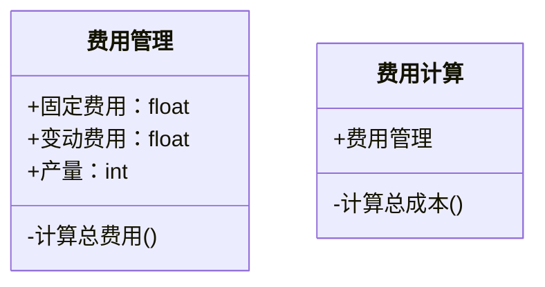
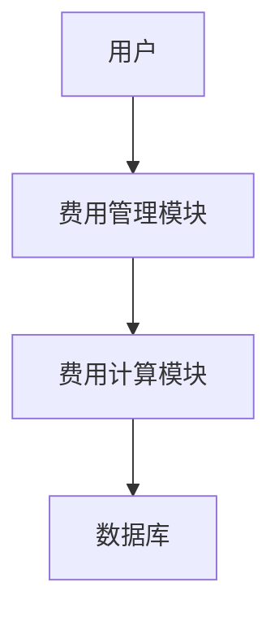
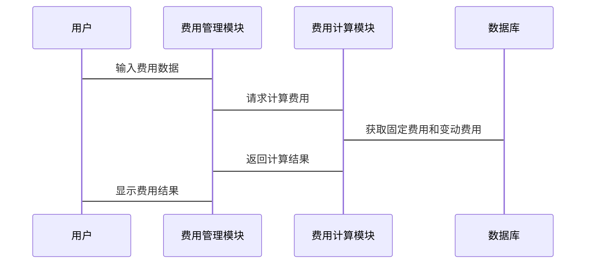

                 


# 约翰·伯格的成本意识：为什么费用很重要

> 关键词：成本意识、费用分析、费用计算、费用管理系统、费用优化、成本效益分析

> 摘要：费用是企业在经营过程中不可避免的一部分，成本意识是企业管理和决策的重要基础。本文通过分析费用的重要性，探讨费用计算的核心概念、数学模型、算法原理，以及费用管理系统的架构设计和项目实战，帮助读者全面理解成本意识和费用管理的本质。

---

## 第一部分: 费用的定义与背景

### 第1章: 费用的定义与背景

#### 1.1 费用的定义与分类

##### 1.1.1 费用的基本定义
费用是企业在经营活动中所发生的各种支出，包括材料费、人工费、租金、广告费等。费用的目的是为了获取收入，同时需要通过合理的费用控制来提高利润率。

##### 1.1.2 费用的分类与特征
费用可以分为以下几类：
- **直接费用**：直接用于产品或服务的支出，如原材料成本。
- **间接费用**：无法直接追溯到产品或服务的支出，如工厂租金。
- **固定费用**：在一定范围内不随产量变化的费用，如管理人员工资。
- **变动费用**：随产量变化的费用，如生产工人的工资。

费用的特征包括：时间性、可控性、可变性等。

##### 1.1.3 费用的计算方法
费用的计算方法主要包括：
- **成本加成定价法**：将成本加上一定比例的利润作为售价。
- **边际成本法**：仅考虑增加产量所增加的成本。

#### 1.2 费用的核心要素与结构

##### 1.2.1 费用的构成要素
费用的构成要素包括：
- **成本对象**：费用所对应的项目或产品。
- **成本项目**：具体的费用支出，如原材料、人工费等。
- **成本动因**：导致费用发生的原因，如生产数量。

##### 1.2.2 费用的计算模型
费用的计算模型可以通过以下公式表示：
$$\text{总费用} = \text{直接费用} + \text{间接费用}$$

##### 1.2.3 费用的边界与外延
费用的边界包括企业的日常运营支出，而外延则包括资本支出和研发投入。

---

## 第二部分: 费用分析的数学模型

### 第2章: 费用计算的数学模型

#### 2.1 费用计算的数学公式

##### 2.1.1 费用的线性模型
费用的线性模型可以表示为：
$$C(x) = a + bx$$
其中，$a$ 是固定费用，$b$ 是单位变动费用，$x$ 是产量。

##### 2.1.2 费用的非线性模型
非线性模型可以表示为：
$$C(x) = ax^2 + bx + c$$
其中，$a$、$b$、$c$ 是常数。

##### 2.1.3 费用的综合评估公式
综合评估公式可以表示为：
$$\text{总费用} = \sum_{i=1}^n (a_i + b_i x_i)$$
其中，$a_i$ 是第$i$个项目的固定费用，$b_i$ 是第$i$个项目的单位变动费用，$x_i$ 是第$i$个项目的产量。

#### 2.2 费用分析的算法原理

##### 2.2.1 费用计算的流程图


##### 2.2.2 费用计算的Python代码实现
```python
def calculate_cost(fixed_cost, variable_cost, quantity):
    total_cost = fixed_cost + variable_cost * quantity
    return total_cost

# 示例
fixed_cost = 100
variable_cost = 50
quantity = 10
print(calculate_cost(fixed_cost, variable_cost, quantity))  # 输出 600
```

---

## 第三部分: 系统分析与架构设计

### 第3章: 系统分析与架构设计

#### 3.1 系统功能设计

##### 3.1.1 领域模型类图


#### 3.2 系统架构设计

##### 3.2.1 系统架构图


#### 3.3 系统接口设计

##### 3.3.1 系统交互序列图


---

## 第四部分: 项目实战

### 第4章: 项目实战

#### 4.1 环境安装

##### 4.1.1 安装Python
```bash
# 安装Python
sudo apt-get install python3
```

##### 4.1.2 安装依赖库
```bash
# 安装numpy和pandas
pip install numpy pandas
```

#### 4.2 核心代码实现

##### 4.2.1 费用计算代码
```python
import numpy as np
import pandas as pd

def calculate_cost(fixed_cost, variable_cost, quantity):
    total_cost = fixed_cost + variable_cost * quantity
    return total_cost

# 示例数据
data = {
    '固定费用': [100],
    '变动费用': [50],
    '产量': [10]
}

df = pd.DataFrame(data)
df['总费用'] = df.apply(lambda x: calculate_cost(x['固定费用'], x['变动费用'], x['产量']), axis=1)
print(df)
```

#### 4.3 代码解读与分析

##### 4.3.1 代码解读
上述代码通过Python中的numpy和pandas库，实现了一个简单的费用计算功能。首先定义了一个`calculate_cost`函数，然后创建了一个包含固定费用、变动费用和产量的数据框，最后计算了总费用并输出结果。

##### 4.3.2 案例分析
通过上述代码，用户可以输入不同的固定费用、变动费用和产量，计算出相应的总费用。例如，当固定费用为100，变动费用为50，产量为10时，总费用为600。

---

## 第五部分: 最佳实践

### 第5章: 最佳实践

#### 5.1 费用管理的技巧

##### 5.1.1 定期审查费用
定期审查费用，识别不必要的支出。

##### 5.1.2 优化成本结构
通过优化成本结构，降低固定费用和变动费用。

##### 5.1.3 使用工具辅助
利用财务软件或数据分析工具辅助费用管理。

#### 5.2 注意事项

##### 5.2.1 避免忽略隐性成本
在费用计算中，不要忽略隐性成本，如物流费用、仓储费用等。

##### 5.2.2 确保数据准确性
确保输入数据的准确性，避免计算错误。

#### 5.3 小结
费用管理是企业运营中的重要环节，通过合理控制费用，可以提高企业的利润率和竞争力。

#### 5.4 拓展阅读
- 《成本管理：理论与实践》
- 《费用分析与优化》
- 《企业财务管理》

---

## 作者

作者：AI天才研究院/AI Genius Institute & 禅与计算机程序设计艺术 /Zen And The Art of Computer Programming

