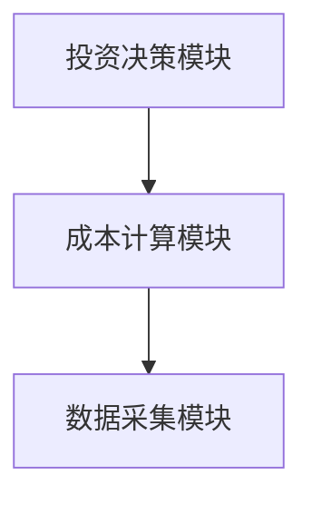

                 


# 约翰·伯格的成本敏感型投资：长期累积的力量

## 关键词：成本敏感型投资，约翰·伯格，投资策略，长期累积，投资成本，收益最大化，投资模型

## 摘要：  
本文深入探讨了约翰·伯格的成本敏感型投资理念，分析其在投资决策中的重要性。通过背景介绍、核心概念、算法原理、系统分析、项目实战和总结，详细阐述了成本敏感型投资的理论基础、数学模型和实际应用。结合Mermaid图表和Python代码，展示了如何在投资中通过控制成本来实现长期收益最大化。

---

# 第一部分: 背景与概述

## 第1章: 成本敏感型投资的背景与定义

### 1.1 投资领域的成本问题

#### 1.1.1 投资成本的定义与分类  
投资成本是指在投资过程中产生的各种费用，包括交易成本、管理成本和机会成本。交易成本通常包括佣金、税费等，而管理成本则包括基金管理费、托管费等。机会成本是指由于选择某一投资而放弃其他投资的潜在收益。

#### 1.1.2 成本在投资决策中的重要性  
成本是投资决策中的重要因素，尤其是在长期投资中，累计成本对最终收益的影响巨大。通过控制成本，投资者可以提高净收益。

#### 1.1.3 成本敏感型投资的定义与特点  
成本敏感型投资是一种关注投资成本并将其作为主要决策因素的投资策略。其特点是通过降低投资成本来优化长期收益，强调长期累积的力量。

### 1.2 约翰·伯格的投资理念

#### 1.2.1 约翰·伯格的背景与贡献  
约翰·伯格是成本敏感型投资的倡导者，他通过研究发现，长期投资中的累计成本对收益的影响不容忽视。

#### 1.2.2 成本敏感型投资的核心思想  
伯格认为，投资成本过高会显著侵蚀长期收益，因此投资者应优先选择低成本的投资工具。

#### 1.2.3 长期累积力量的内涵与外延  
长期累积力量指的是通过持续优化投资成本，逐步积累收益，实现财富的长期增长。

### 1.3 成本敏感型投资与传统投资的区别

#### 1.3.1 传统投资的成本结构分析  
传统投资通常忽视交易成本和管理成本，认为这些成本对短期收益影响有限。

#### 1.3.2 成本敏感型投资的独特优势  
成本敏感型投资通过降低投资成本，提高了长期收益。

#### 1.3.3 适用场景与边界条件  
成本敏感型投资适用于长期投资，尤其是指数基金和被动投资策略。

---

## 第2章: 成本敏感型投资的理论基础

### 2.1 投资成本的构成与影响

#### 2.1.1 交易成本的分类与计算  
交易成本包括佣金、税费等，这些成本直接影响投资收益。

#### 2.1.2 管理成本的来源与影响  
管理成本包括基金管理费和托管费，这些费用会从基金收益中扣除。

#### 2.1.3 机会成本的概念与应用  
机会成本是指由于选择某一投资而放弃其他投资的潜在收益。

### 2.2 投资组合优化的数学模型

#### 2.2.1 投资组合优化的基本原理  
投资组合优化的目标是通过调整投资比例，最大化收益并最小化风险。

#### 2.2.2 成本敏感型投资的数学表达  
$$ C = \sum_{i=1}^{n} c_i \cdot x_i $$
其中，$C$ 表示总成本，$c_i$ 表示第 $i$ 项投资的单位成本，$x_i$ 表示投资比例。

#### 2.2.3 约翰·伯格模型的公式推导  
$$ R = r \cdot (1 + \frac{C}{A})^t $$
其中，$R$ 表示收益，$r$ 表示年化收益率，$C$ 表示总成本，$A$ 表示初始投资金额，$t$ 表示投资时间。

### 2.3 成本与收益的平衡关系

#### 2.3.1 成本对收益的影响分析  
成本是收益的减项，降低成本可以提高净收益。

#### 2.3.2 长期累积力量的数学模型  
$$ R = r \cdot (1 + \frac{C}{A})^t $$
通过降低 $C$，可以显著提高 $R$。

---

## 第3章: 成本敏感型投资的核心概念

### 3.1 成本敏感型投资的属性特征对比

| 属性 | 传统投资 | 成本敏感型投资 |
|------|----------|----------------|
| 成本结构 | 忽略交易和管理成本 | 强调降低交易和管理成本 |
| 投资目标 | 短期收益最大化 | 长期收益最大化 |
| 投资策略 | 主动交易 | 被动投资 |

### 3.2 成本敏感型投资的核心要素

#### 3.2.1 成本敏感型投资的系统性  
通过系统化的方法降低投资成本。

#### 3.2.2 长期累积力量的可持续性  
通过持续优化成本，实现长期收益增长。

#### 3.2.3 投资组合的稳定性  
保持投资组合的稳定性，降低波动风险。

---

## 第4章: 成本敏感型投资的算法与数学模型

### 4.1 投资成本的优化算法

#### 4.1.1 最小化成本函数  
$$ \text{minimize } C = \sum_{i=1}^{n} c_i \cdot x_i $$
#### 4.1.2 约束条件  
$$ \sum_{i=1}^{n} x_i = 1 $$
$$ x_i \geq 0 \quad \forall i $$

### 4.2 投资组合优化的数学模型

#### 4.2.1 净值增长率模型  
$$ R = (1 - C) \cdot r^t $$

#### 4.2.2 成本对收益的影响  
通过降低 $C$，可以显著提高 $R$。

### 4.3 实际案例分析

#### 4.3.1 案例一：指数基金投资  
假设投资金额为 $10,000，年化收益率为 7%，交易成本为 0.1%。  
计算长期累积收益：

$$ R = 10000 \cdot (1 + 7\% - 0.1\%)^t $$

---

## 第5章: 成本敏感型投资的系统分析

### 5.1 系统架构设计

#### 5.1.1 系统功能模块  
- 数据采集模块：采集市场数据和成本数据。
- 成本计算模块：计算投资成本。
- 投资决策模块：基于成本优化投资组合。

#### 5.1.2 系统架构图  


### 5.2 系统接口设计

#### 5.2.1 数据接口  
- 市场数据接口：获取股票、基金等市场数据。
- 成本数据接口：获取交易成本和管理成本。

#### 5.2.2 投资决策接口  
- 输入：初始金额、投资期限、风险偏好。
- 输出：最优投资组合。

### 5.3 系统交互流程

#### 5.3.1 投资者发起投资请求  
1. 投资者输入初始金额和投资期限。
2. 系统采集市场数据和成本数据。
3. 系统计算最优投资组合。
4. 系统输出投资建议。

---

## 第6章: 成本敏感型投资的项目实战

### 6.1 环境配置

#### 6.1.1 技术选型  
- 语言：Python
- 工具：Pandas、NumPy、Matplotlib

#### 6.1.2 安装依赖  
```bash
pip install pandas numpy matplotlib
```

### 6.2 核心实现

#### 6.2.1 成本计算函数  
```python
def calculate_cost(amount, transaction_cost, management_cost):
    return amount * (transaction_cost + management_cost)
```

#### 6.2.2 投资组合优化  
```python
import pandas as pd
import numpy as np

def optimize_portfolio(amount, transaction_cost, management_cost):
    costs = calculate_cost(amount, transaction_cost, management_cost)
    return amount * (1 - costs)
```

### 6.3 案例分析

#### 6.3.1 案例一：指数基金投资  
假设初始金额为 $10,000，年化收益率为 7%，交易成本为 0.1%。  
计算长期累积收益：

$$ R = 10000 \cdot (1 + 7\% - 0.1\%)^t $$

---

## 第7章: 成本敏感型投资的总结与展望

### 7.1 总结

#### 7.1.1 关键点回顾  
- 投资成本对长期收益的影响巨大。
- 通过降低投资成本可以提高净收益。
- 成本敏感型投资是一种长期有效的投资策略。

#### 7.1.2 注意事项  
- 需要持续关注市场变化和成本变化。
- 投资者需具备长期投资的耐心。

### 7.2 展望

#### 7.2.1 未来发展趋势  
- 更多低成本投资工具的出现。
- 技术驱动的自动化投资。

#### 7.2.2 拓展阅读  
- 《约翰·伯格的投资哲学》
- 《投资学原理》

---

## 作者：AI天才研究院 & 禅与计算机程序设计艺术

通过本文的详细分析，读者可以深入了解约翰·伯格的成本敏感型投资理念，并通过实际案例和系统设计，掌握如何在投资中应用这一策略。希望本文能为投资者提供有价值的参考，帮助他们在复杂的市场环境中做出更明智的投资决策。

