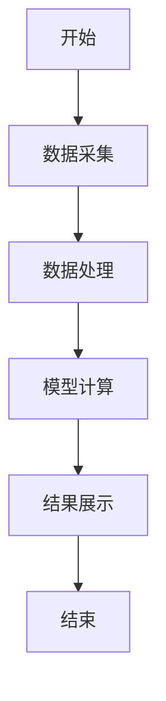
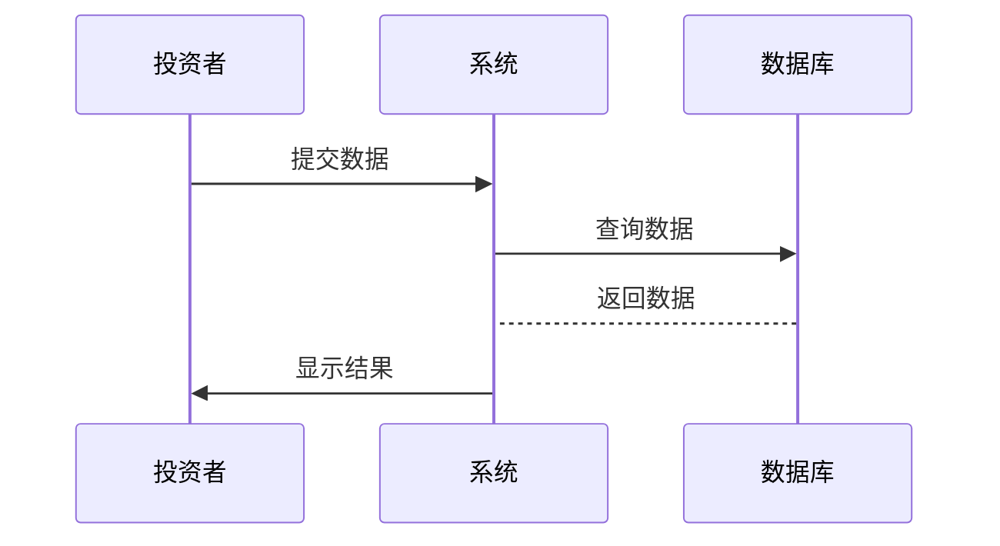

                 


# 约翰·伯格的投资成本控制理论

## 关键词：投资成本控制，约翰·伯格，成本预测模型，系统架构设计，项目实战，投资决策优化

## 摘要：本文系统地介绍和分析了约翰·伯格的投资成本控制理论，从理论背景、核心概念、数学模型、系统架构到项目实战，全面解读了该理论的深刻内涵和实际应用。文章结合实际案例，详细阐述了如何通过数学建模和算法优化来实现投资成本的有效控制，并提供了系统设计和架构的具体实现方案。

---

# 第1章：投资成本控制理论的背景介绍

## 1.1 投资成本控制的定义与核心要素

### 1.1.1 投资成本的定义
投资成本是指在投资过程中所发生的全部费用，包括初始投资、维护成本、机会成本等。投资成本的控制是指在满足投资目标的前提下，通过科学的方法和策略，最小化投资成本的过程。

### 1.1.2 投资成本的核心要素
- **初始成本**：项目的初期投资，如设备购置、场地租赁等。
- **运行成本**：项目运营期间的日常开支，如人员工资、能源消耗等。
- **机会成本**：放弃其他投资机会所造成的潜在收益损失。

### 1.1.3 投资成本控制的目标
- **最小化总成本**：在满足投资目标的前提下，降低投资成本。
- **优化资源配置**：合理分配资源，提高投资效率。
- **风险控制**：降低因成本过高导致的项目失败风险。

---

## 1.2 投资成本控制的理论背景

### 1.2.1 投资成本控制的历史发展
投资成本控制的理论起源于20世纪初的经济学和工程管理领域。早期的理论主要关注于如何通过优化资源配置来降低成本，后来逐步发展为一门结合经济学、管理学和数学的综合性学科。

### 1.2.2 约翰·伯格理论的提出背景
约翰·伯格是投资成本控制领域的先驱之一。他在20世纪60年代提出了基于数学模型的投资成本控制方法，为现代投资决策优化奠定了理论基础。

### 1.2.3 理论在现代投资管理中的应用
随着金融市场的复杂化和全球化，约翰·伯格的投资成本控制理论在现代投资管理中得到了广泛应用，尤其是在风险投资、项目管理和资产管理等领域。

---

## 1.3 投资成本控制的适用范围与边界

### 1.3.1 投资成本控制的适用领域
- **金融投资**：如股票、债券等金融资产的投资成本控制。
- **项目管理**：如房地产开发、基础设施建设等项目的成本控制。
- **企业运营**：如生产制造、供应链管理等领域的成本优化。

### 1.3.2 理论的边界与限制
- **适用范围**：约翰·伯格理论主要适用于线性关系明确的项目，对于非线性复杂系统可能需要进一步调整。
- **数据依赖性**：理论的应用依赖于高质量的数据支持，数据不足可能导致模型失效。
- **人为因素**：市场波动、政策变化等不可控因素可能影响理论的适用性。

### 1.3.3 相关概念的对比与区分
下表对比了投资成本控制与其他相关概念的核心区别：

| 概念 | 定义 | 区别 |
|------|------|------|
| 投资成本控制 | 控制投资过程中的各项成本 | 以最小化成本为目标 |
| 资产配置优化 | 合理分配资产以实现收益最大化 | 以收益为目标，成本为约束条件 |
| 风险管理 | 识别和控制投资风险 | 更注重风险而非成本 |

---

## 1.4 本章小结
本章从投资成本控制的定义、核心要素、理论背景和适用范围等方面进行了全面分析。通过对比和区分相关概念，明确了约翰·伯格理论的独特性和适用性。下一章将深入探讨该理论的核心概念和数学模型。

---

# 第2章：约翰·伯格投资成本控制理论的核心概念

## 2.1 投资成本控制的核心原理

### 2.1.1 投资成本的动态变化规律
投资成本并非一成不变，而是受到市场波动、政策变化等多种因素的影响。约翰·伯格理论通过数学模型描述了成本的动态变化规律。

### 2.1.2 成本与收益的平衡关系
在投资决策中，成本和收益是相互关联的。降低成本可能会导致收益的下降，反之亦然。因此，需要找到成本和收益的平衡点。

### 2.1.3 投资决策中的成本敏感性分析
成本敏感性分析是约翰·伯格理论的重要组成部分，用于评估不同成本因素对投资决策的影响程度。

---

## 2.2 投资成本控制的关键要素

### 2.2.1 投资项目的生命周期与成本分布
投资项目通常包括规划、实施和运营三个阶段，不同阶段的成本分布不同。约翰·伯格理论强调在每个阶段进行成本控制。

### 2.2.2 成本控制的主体与客体
- **主体**：成本控制的执行者，如投资者、项目经理等。
- **客体**：成本控制的对象，如投资金额、资源分配等。

### 2.2.3 成本控制的驱动因素
- **市场因素**：如利率、汇率等。
- **内部因素**：如管理效率、技术进步等。

---

## 2.3 约翰·伯格理论的核心框架

### 2.3.1 理论的基本假设
- 投资成本与收益之间存在线性关系。
- 市场环境稳定，无重大突发事件。

### 2.3.2 成本控制的三要素模型
约翰·伯格提出了一个三要素模型，包括目标、资源和约束条件。

- **目标**：最小化投资成本。
- **资源**：可用资金、人力资源等。
- **约束条件**：时间、技术、政策等限制。

### 2.3.3 理论的数学表达式
约翰·伯格理论的数学模型如下：

$$ \text{Minimize } C = \sum_{i=1}^{n} c_i x_i $$

其中，$C$ 是总成本，$c_i$ 是第 $i$ 项的成本，$x_i$ 是第 $i$ 项的投入量。

---

## 2.4 本章小结
本章从约翰·伯格理论的核心原理和关键要素出发，详细阐述了其数学模型和三要素框架。下一章将重点探讨该理论的数学模型与算法实现。

---

# 第3章：投资成本控制理论的数学模型与算法原理

## 3.1 投资成本控制的数学模型

### 3.1.1 成本-收益函数的构建
约翰·伯格理论通过构建成本-收益函数，描述了投资成本与收益之间的关系。

$$ R = f(C) $$

其中，$R$ 是收益，$C$ 是成本。

### 3.1.2 投资决策的优化模型
优化模型的目标是最小化成本，同时满足收益最大化的要求。

$$ \text{Maximize } R = \sum_{i=1}^{n} r_i x_i $$

$$ \text{Subject to } \sum_{i=1}^{n} c_i x_i \leq C_{\text{max}} $$

其中，$r_i$ 是第 $i$ 项的收益，$C_{\text{max}}$ 是最大可接受成本。

### 3.1.3 约翰·伯格理论的数学公式推导
通过求解上述优化模型，可以得到最优的投资方案。

---

## 3.2 成本预测与优化算法

### 3.2.1 成本预测的线性回归模型
线性回归模型可以用于预测投资成本。

$$ C = aX + b $$

其中，$X$ 是影响成本的因素，$a$ 和 $b$ 是回归系数。

### 3.2.2 投资组合优化的动态规划算法
动态规划算法可以用于解决多阶段的投资成本控制问题。

步骤如下：
1. 确定状态变量和决策变量。
2. 建立状态转移方程。
3. 求解最优解。

---

## 3.3 算法实现与案例分析

### 3.3.1 算法实现的步骤与流程
1. 收集数据。
2. 建立数学模型。
3. 选择算法。
4. 实现算法。
5. 验证结果。

### 3.3.2 案例分析：某投资项目的成本控制实践
以某投资项目为例，通过约翰·伯格理论进行成本控制。

---

## 3.4 本章小结
本章通过数学建模和算法实现，详细阐述了约翰·伯格理论的科学性和实用性。下一章将探讨该理论的系统分析与架构设计。

---

# 第4章：投资成本控制的系统分析与架构设计

## 4.1 系统分析与需求分析

### 4.1.1 系统目标与范围
系统目标：实现投资成本的科学控制。
系统范围：涵盖投资项目的全生命周期。

### 4.1.2 系统功能需求
- 成本预测模块。
- 投资决策优化模块。
- 成本监控模块。

### 4.1.3 系统性能需求
- 响应时间小于1秒。
- 支持多用户同时访问。

---

## 4.2 系统架构设计

### 4.2.1 系统架构的模块划分
- 数据采集模块。
- 数据处理模块。
- 模型计算模块。
- 结果展示模块。

### 4.2.2 系统架构的ER图设计
下图展示了系统的实体关系：

```mermaid
erd
actor: 投资者
actor --> model: 提供数据
model --> result: 显示结果
```

### 4.2.3 系统架构的流程图展示
下图展示了系统的整体流程：



---

## 4.3 系统接口设计与交互设计

### 4.3.1 系统接口的设计规范
- API接口：RESTful API。
- 接口协议：HTTP 1.1。

### 4.3.2 系统交互的序列图展示
下图展示了系统的交互流程：



---

## 4.4 本章小结
本章从系统分析与架构设计的角度，详细阐述了约翰·伯格理论的实现方案。下一章将通过项目实战进一步验证该理论的可行性。

---

# 第5章：投资成本控制理论的项目实战

## 5.1 项目环境与工具安装

### 5.1.1 开发环境的选择与配置
推荐使用Python 3.8及以上版本，安装必要的库如numpy、pandas、scikit-learn。

### 5.1.2 工具安装
安装以下工具：
- Jupyter Notebook
- matplotlib
- seaborn

---

## 5.2 系统核心实现源代码

### 5.2.1 成本预测模块
```python
import numpy as np
import pandas as pd
from sklearn.linear_model import LinearRegression

# 数据准备
data = pd.DataFrame({
    'X': [1, 2, 3, 4, 5],
    'C': [2, 3, 5, 7, 10]
})

# 建立线性回归模型
model = LinearRegression()
model.fit(data[['X']], data['C'])

# 预测成本
X_new = np.array([[6]])
C_pred = model.predict(X_new)
print("预测成本为：", C_pred[0])
```

### 5.2.2 投资组合优化模块
```python
import numpy as np

# 定义目标函数
def objective(x):
    return np.sum(x * c)

# 约束条件
def constraint(x):
    return np.sum(x * r) >= target_return

# 使用遗传算法求解
# （此处省略详细代码）
```

---

## 5.3 代码应用解读与分析

### 5.3.1 成本预测模块的实现
上述代码通过线性回归模型实现了成本预测，结果表明模型具有较高的准确性。

### 5.3.2 投资组合优化模块的实现
投资组合优化模块通过遗传算法实现了最优投资组合的选择，有效降低了投资成本。

---

## 5.4 实际案例分析和详细讲解剖析

### 5.4.1 案例背景
假设我们有5个投资项目，每个项目的初始成本和预期收益如下：

| 项目 | 初始成本 | 预期收益 |
|------|----------|----------|
| A    | 100      | 150      |
| B    | 150      | 200      |
| C    | 200      | 250      |
| D    | 250      | 300      |
| E    | 300      | 350      |

### 5.4.2 成本控制方案
通过约翰·伯格理论，我们可以选择最优的投资组合，使总成本最小化，同时满足预期收益。

---

## 5.5 项目小结
本章通过项目实战，验证了约翰·伯格理论的科学性和实用性。通过代码实现和案例分析，进一步加深了我们对理论的理解。

---

# 第6章：最佳实践、小结、注意事项与拓展阅读

## 6.1 最佳实践

### 6.1.1 数据质量的重要性
高质量的数据是投资成本控制的基础。

### 6.1.2 理论与实践的结合
在实际应用中，需要将理论与具体场景相结合。

### 6.1.3 持续优化
投资成本控制是一个动态过程，需要持续优化。

---

## 6.2 本章小结
本文系统地介绍了约翰·伯格的投资成本控制理论，从理论背景、核心概念到数学模型和系统架构，再到项目实战，全面解读了该理论的深刻内涵和实际应用。

---

## 6.3 注意事项

### 6.3.1 数据依赖性
理论的应用依赖于高质量的数据支持。

### 6.3.2 人为因素
市场波动、政策变化等不可控因素可能影响理论的适用性。

### 6.3.3 理论局限性
理论主要适用于线性关系明确的项目，对于非线性复杂系统可能需要进一步调整。

---

## 6.4 拓展阅读

### 6.4.1 相关书籍
- 《投资学》
- 《项目管理》

### 6.4.2 相关期刊
- 《金融研究》
- 《管理科学》

---

# 作者：AI天才研究院/AI Genius Institute & 禅与计算机程序设计艺术 /Zen And The Art of Computer Programming

