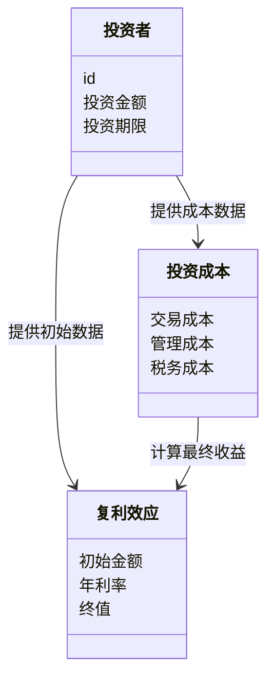
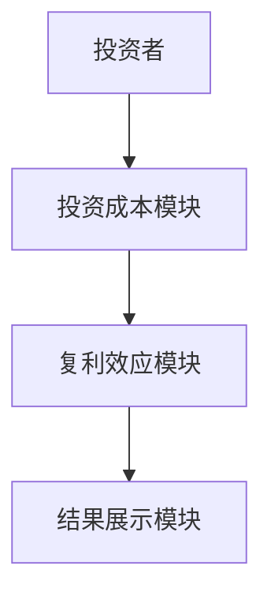

                 


# 约翰·伯格的投资成本控制：复利效应的长期影响

## 关键词：投资成本控制，复利效应，长期影响，约翰·伯格，投资策略，数学模型，系统架构

## 摘要：本文深入探讨了投资成本控制的重要性及其对复利效应的长期影响。通过分析约翰·伯格的投资策略，结合数学模型和系统架构，展示了如何通过低成本投资最大化复利收益。文章还提供了项目实战和最佳实践，帮助读者更好地理解和应用这些概念。

---

# 第一部分: 投资成本控制与复利效应概述

## 第1章: 投资成本控制的背景与重要性

### 1.1 投资成本控制的背景

#### 1.1.1 投资成本的基本概念

投资成本是指在投资过程中产生的各种费用，包括交易成本、管理费用、税收等。这些成本会直接影响投资的最终收益。

#### 1.1.2 投资成本在个人与企业中的重要性

对于个人投资者来说，降低投资成本可以显著提高投资回报率；对于企业而言，优化投资成本是实现长期可持续发展的关键因素。

#### 1.1.3 投资成本控制的必要性

随着市场的竞争加剧，优化投资成本成为提升投资收益的重要手段。通过控制成本，投资者可以在相同时间内实现更高的收益。

### 1.2 复利效应的基本原理

#### 1.2.1 复利效应的定义

复利效应是指资金在投资过程中，本金和已获得的利息或收益再次投资所产生的收益累积效应。

#### 1.2.2 复利效应的核心特征

- 时间的复利效应：复利收益随时间的推移而呈指数增长。
- 利率的复利效应：较高的利率会加速复利的增长。
- 投资金额的复利效应：更大的初始投资金额会放大复利效应。

#### 1.2.3 复利效应在投资中的应用

复利效应是长期投资的重要工具，特别是在股票、基金等长期投资中，复利效应可以帮助投资者实现财富的快速增长。

---

## 第2章: 复利效应的数学模型

### 2.1 复利的数学公式

#### 2.1.1 复利计算公式

$$A = P(1 + r)^n$$

其中：
- \(A\) 是投资的终值
- \(P\) 是初始投资金额
- \(r\) 是年利率
- \(n\) 是投资年数

#### 2.1.2 年金计算公式

$$A = P \times \frac{(1 + r)^n - 1}{r}$$

其中：
- \(A\) 是年金的终值
- \(P\) 是每期投资金额
- \(r\) 是每期利率
- \(n\) 是投资期数

### 2.2 复利效应的特征分析

#### 2.2.1 时间的复利效应

随着时间的推移，复利效应会呈指数增长，即“钱生钱”的效应。

#### 2.2.2 利率的复利效应

较高的利率会加速复利的增长，但过高的利率可能导致风险增加。

#### 2.2.3 投资金额的复利效应

更大的初始投资金额会放大复利效应，从而更快地实现财富积累。

---

## 第3章: 投资成本的构成与影响

### 3.1 投资成本的构成

#### 3.1.1 交易成本

包括买入和卖出证券时的佣金、税费等。

#### 3.1.2 管理成本

包括基金管理费、托管费等。

#### 3.1.3 税务成本

包括资本利得税、股息税等。

### 3.2 投资成本对复利效应的影响

#### 3.2.1 成本对投资收益的侵蚀

投资成本会直接从收益中扣除，从而降低复利效应的累积效果。

#### 3.2.2 成本对投资期限的影响

较高的投资成本可能缩短投资期限，影响复利效应的长期累积。

#### 3.2.3 成本对投资策略的选择

投资成本较低的策略更有利于复利效应的长期增长。

---

## 第4章: 约翰·伯格的投资成本控制策略

### 4.1 约翰·伯格的投资理念

#### 4.1.1 低成本指数投资策略

伯格主张通过低成本指数基金进行长期投资，以最大化复利效应。

#### 4.1.2 分散投资与长期持有

通过分散投资降低风险，并通过长期持有实现复利效应的最大化。

---

## 第5章: 系统分析与架构设计

### 5.1 问题场景介绍

#### 5.1.1 问题背景

分析投资成本对复利效应的影响，构建一个投资成本分析系统。

#### 5.1.2 项目介绍

设计一个投资成本分析系统，帮助投资者优化投资策略。

### 5.2 系统功能设计

#### 5.2.1 领域模型

使用 Mermaid 绘制领域模型类图：



### 5.3 系统架构设计

使用 Mermaid 绘制系统架构图：



### 5.4 系统接口设计

定义系统接口：

- 投资者输入：初始金额、投资期限、年利率。
- 系统输出：投资成本、复利效应、最终收益。

---

## 第6章: 项目实战

### 6.1 环境安装

安装 Python 和相关库（如 matplotlib、pandas）。

### 6.2 核心代码实现

```python
import numpy as np
import matplotlib.pyplot as plt

# 初始参数
P = 10000  # 初始投资金额
r = 0.07   # 年利率
n = 10     # 投资年数

# 计算复利
A = P * (1 + r) ** n

# 计算投资成本
transaction_cost = 0.002 * P  # 交易成本
management_cost = 0.02 * A     # 管理成本
tax_cost = 0.15 * A            # 税务成本

# 计算净收益
net_A = A - (transaction_cost + management_cost + tax_cost)

print(f"初始投资：{P}")
print(f"复利终值：{A}")
print(f"净收益：{net_A}")
```

### 6.3 代码解读与分析

解释代码实现，展示投资成本对复利效应的具体影响。

### 6.4 实际案例分析

通过具体案例分析，展示如何优化投资成本以提高复利效应。

---

## 第7章: 最佳实践与总结

### 7.1 最佳实践

#### 7.1.1 控制投资成本

选择低成本的投资产品，减少交易频率。

#### 7.1.2 长期投资

通过长期持有最大化复利效应。

### 7.2 小结

投资成本控制和复利效应的结合是实现长期投资收益的关键。通过优化投资成本，投资者可以更好地利用复利效应实现财富积累。

---

## 作者：AI天才研究院/AI Genius Institute & 禅与计算机程序设计艺术 /Zen And The Art of Computer Programming

