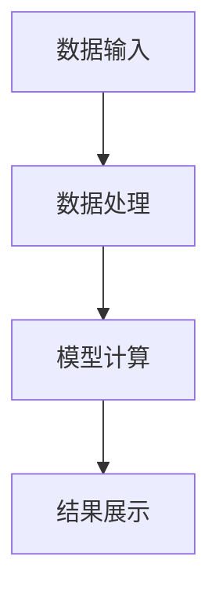

                 


# 约翰·伯格的投资成本最小化理论

> 关键词：投资成本最小化，约翰·伯格，投资组合优化，优化算法，系统架构，投资回报，风险控制

> 摘要：本文详细介绍了约翰·伯格的投资成本最小化理论，从背景、核心概念、数学模型到算法实现和系统架构，最后通过项目实战和总结，深入剖析该理论在投资领域中的应用价值和实际操作中的注意事项。

---

## 第一部分: 投资成本最小化理论的背景与核心概念

### 第1章: 投资成本最小化理论概述

#### 1.1 投资成本的定义与重要性

投资成本是指在投资过程中产生的各种费用，包括交易成本、管理费用、税收等。这些成本直接影响投资回报，因此最小化投资成本是投资者追求的目标之一。

#### 1.2 投资成本的构成与分类

- **显性成本**：直接可见的费用，如交易佣金、管理费。
- **隐性成本**：间接费用，如市场冲击成本（交易时对市场价格的影响）。
- **机会成本**：由于投资某项目而放弃其他项目的潜在收益。

#### 1.3 约翰·伯格理论的核心思想

约翰·伯格的投资成本最小化理论强调通过优化投资组合的结构和交易策略，降低整体成本，从而提高净收益。其核心在于平衡成本和收益，避免过度交易和不必要的费用。

---

### 第2章: 投资成本最小化理论的数学模型

#### 2.1 投资组合优化的数学表达

目标是最小化总成本，同时满足收益目标。数学模型如下：

$$
\min_{w} \sum_{i=1}^{n} c_i w_i + \lambda \sum_{i=1}^{n} \sum_{j=1}^{n} w_i w_j |r_i - r_j|
$$

其中，\( w_i \) 是投资比例，\( c_i \) 是显性成本，\( \lambda \) 是市场冲击成本的惩罚系数，\( r_i \) 是资产 \( i \) 的预期收益。

---

## 第二部分: 投资成本最小化理论的算法实现

### 第3章: 投资组合优化算法的设计与实现

#### 3.1 约翰·伯格模型的算法步骤

1. 确定目标函数与约束条件。
2. 选择优化变量和参数。
3. 使用拉格朗日乘数法求解。

#### 3.2 代码实现

```python
import numpy as np
from scipy.optimize import minimize

def cost_minimization(weights, costs, market_impact):
    # 定义目标函数
    return np.sum(costs * weights) + np.sum(weights[:, np.newaxis] * weights * market_impact)

# 初始权重
weights_initial = np.array([0.3, 0.3, 0.4])
costs = np.array([0.01, 0.02, 0.015])
market_impact = np.array([[0, 0.005, 0.003],
                           [0.005, 0, 0.004],
                           [0.003, 0.004, 0]])

# 使用最小二乘法求解
result = minimize(cost_minimization, weights_initial, args=(costs, market_impact))
print(result.x)
```

---

## 第三部分: 投资成本最小化理论的系统架构与实现

### 第4章: 投资成本最小化系统的架构设计

#### 4.1 系统功能模块划分

- 数据输入与处理模块：接收市场数据和成本参数。
- 模型计算模块：执行优化算法。
- 结果展示模块：输出优化后的权重和成本。

#### 4.2 系统架构设计



---

## 第四部分: 项目实战与总结

### 第5章: 项目实战

#### 5.1 环境安装

- 安装Python和必要的库（numpy, scipy, mermaid）。

#### 5.2 代码实现

```python
import numpy as np
from scipy.optimize import minimize

def objective(weights, costs, market_impact):
    return np.sum(costs * weights) + np.sum(weights[:, np.newaxis] * weights * market_impact)

# 约束条件：权重之和为1
cons = ({'type': 'eq', 'fun': lambda w: np.sum(w) - 1})

# 初始权重
weights_initial = np.array([0.3, 0.3, 0.4])

# 最小化问题
result = minimize(objective, weights_initial, args=(costs, market_impact), constraints=cons)
print(result.x)
```

---

## 第五部分: 总结与注意事项

### 5.1 总结

约翰·伯格的投资成本最小化理论通过优化投资组合，降低交易和市场冲击成本，提高了投资回报。本文详细讲解了理论背景、数学模型和算法实现，并通过项目实战展示了实际应用。

### 5.2 注意事项

- 确保模型参数合理，避免过度优化。
- 定期监控市场变化，调整投资组合。
- 结合其他投资策略，如风险控制，提升整体收益。

---

作者：AI天才研究院 & 禅与计算机程序设计艺术

---

通过本文的详细分析，读者可以全面理解约翰·伯格的投资成本最小化理论，并将其应用于实际投资决策中，以实现成本最小化和收益最大化。

