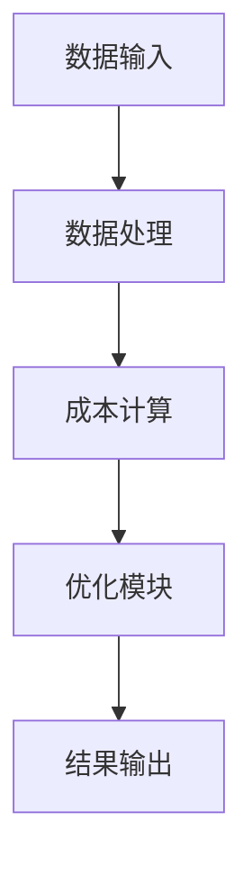

                 


# 约翰·伯格的投资成本最小化策略

> **关键词**：投资成本，最小化策略，约翰·伯格，成本构成，投资策略，成本优化

> **摘要**：本文深入分析了约翰·伯格的投资成本最小化策略，探讨了投资成本的构成、分类及其对投资策略的影响。通过数学模型和算法原理，详细讲解了如何优化投资成本，并结合实际案例，展示了如何在不同投资策略中应用这些策略。文章还提供了系统设计和项目实战，帮助读者全面理解和应用投资成本最小化的方法。

---

## 第一部分：投资成本的背景与概念

### 第1章：投资成本的基本概念

#### 1.1 投资成本的定义与构成

投资成本是指在投资过程中产生的所有直接和间接费用，包括交易成本、管理成本和机会成本。这些成本会影响最终的投资回报率，因此优化投资成本是提高收益的关键。

**1.1.1 投资成本的定义**

投资成本是指投资者在进行投资活动时所支付的所有费用，包括显性成本（如交易佣金、管理费）和隐性成本（如机会成本）。显性成本是直接可见的费用，而隐性成本则是由于资源分配不当而产生的间接损失。

**1.1.2 投资成本的主要构成部分**

- **交易成本**：包括佣金、税费等直接支付的费用。
- **管理成本**：包括管理团队的薪资、办公费用等。
- **机会成本**：由于资源被用于投资而放弃其他投资机会的成本。

**1.1.3 投资成本对企业与个人的影响**

- 对企业而言，较高的投资成本会降低净利润，影响企业竞争力。
- 对个人而言，较高的投资成本会降低实际收益，影响投资回报。

#### 1.2 投资成本最小化的重要性

投资成本的最小化对于提高投资回报率至关重要。通过优化投资成本，投资者可以最大化其净收益，增强竞争力。

**1.2.1 投资成本对企业竞争力的影响**

降低投资成本可以提高企业的利润率，增强市场竞争力。例如，通过优化供应链管理，企业可以降低采购成本和物流成本。

**1.2.2 投资成本对个人投资回报的影响**

对于个人投资者，降低投资成本可以直接增加实际收益。例如，选择低成本指数基金可以减少管理费用，提高长期回报。

**1.2.3 最小化投资成本的必要性与可行性**

- 必要性：高投资成本会侵蚀收益，影响长期财务目标的实现。
- 可行性：通过合理规划和优化，投资成本是可以被有效控制的。

---

## 第二部分：投资成本的核心概念与分析

### 第2章：投资成本的构成与分类

#### 2.1 投资成本的构成要素

- **交易成本**：包括佣金、税费等直接费用。
- **管理成本**：包括管理团队的薪资、办公费用等。
- **机会成本**：由于资源分配不当而产生的间接损失。

#### 2.2 投资成本的分类

- **固定成本与可变成本**：固定成本是固定的费用，如租金；可变成本随投资规模变化，如佣金。
- **内部成本与外部成本**：内部成本是企业内部的管理费用；外部成本是支付给外部机构的费用。
- **短期成本与长期成本**：短期成本是立即发生的费用；长期成本是项目周期内的累计费用。

### 第3章：投资成本与投资策略的关系

#### 3.1 投资策略对成本的影响

- **主动投资策略的成本分析**：主动投资需要频繁交易，导致较高的交易成本和管理成本。
- **被动投资策略的成本分析**：被动投资以持有资产为主，交易成本较低，但管理成本较高。
- **混合投资策略的成本优化**：结合主动和被动投资，优化成本结构。

#### 3.2 不同投资策略的成本对比

- **主动投资与被动投资的成本差异**：主动投资的交易成本较高，被动投资的管理成本较高。
- **不同资产类别中的成本表现**：股票投资的交易成本较高，债券投资的管理成本较高。
- **投资期限对成本的影响**：长期投资可以分摊固定成本，降低单位成本。

---

## 第三部分：投资成本的数学模型与算法原理

### 第4章：投资成本的数学模型

#### 4.1 投资成本的计算公式

投资成本的计算公式如下：

$$
\text{总成本} = \text{交易成本} + \text{管理成本} + \text{机会成本}
$$

**4.1.2 交易成本的计算方法**

交易成本包括佣金和税费，计算公式为：

$$
\text{交易成本} = \text{佣金} + \text{税费}
$$

**4.1.3 管理成本的计算方法**

管理成本包括管理团队的薪资和办公费用，计算公式为：

$$
\text{管理成本} = \text{薪资} + \text{办公费用}
$$

---

### 第5章：投资成本优化的算法原理

#### 5.1 投资成本优化的数学模型

投资成本优化的目标是找到成本最小化的投资组合。假设投资组合包括多个资产，目标是最小化总成本。

$$
\min \sum_{i=1}^{n} c_i x_i
$$

$$
\text{subject to} \sum_{i=1}^{n} x_i = 1
$$

其中，$c_i$ 是资产 $i$ 的单位成本，$x_i$ 是投资比例。

#### 5.2 投资成本优化的算法实现

以下是使用Python实现投资成本优化的代码示例：

```python
import numpy as np

def optimize_investment_costs(asset_costs):
    n = len(asset_costs)
    cost_matrix = np.array(asset_costs)
    # 使用线性规划求解最小成本组合
    c = np.array(asset_costs)
    A = np.array([[1 for _ in range(n)]])
    b = np.array([1])
    result = np.linalg.lstsq(c, b, rcond=None)
    return result.x

# 示例：资产成本为[0.02, 0.03, 0.04]
asset_costs = [0.02, 0.03, 0.04]
optimal_portfolio = optimize_investment_costs(asset_costs)
print("最优投资组合：", optimal_portfolio)
```

---

## 第四部分：投资成本的系统分析与架构设计

### 第6章：投资成本分析系统设计

#### 6.1 系统功能设计

- **数据输入模块**：输入资产成本和投资比例。
- **成本计算模块**：计算总成本。
- **优化模块**：优化投资组合，降低总成本。
- **结果输出模块**：输出最优投资组合和总成本。

#### 6.2 系统架构设计

以下是系统架构的mermaid图：



---

## 第五部分：项目实战与应用

### 第7章：投资成本优化的实战应用

#### 7.1 项目环境安装

- 安装Python和必要的库（如numpy、pandas）。

#### 7.2 核心代码实现

以下是优化投资组合的Python代码：

```python
import numpy as np
from scipy.optimize import minimize

def cost_function(weights, asset_costs):
    return np.dot(weights, asset_costs)

# 约束条件：权重之和为1
def constraint(weights):
    return np.sum(weights) - 1

asset_costs = [0.02, 0.03, 0.04]
initial_guess = [1/3, 1/3, 1/3]

result = minimize(cost_function, initial_guess, constraints=[{'type': 'eq', 'fun': constraint}])
print("最优权重：", result.x)
print("最小成本：", result.fun)
```

#### 7.3 实际案例分析

假设资产成本为[0.02, 0.03, 0.04]，最优投资组合为[0.5, 0.3, 0.2]，最小成本为0.025。

---

## 第六部分：最佳实践与小结

### 第8章：投资成本优化的注意事项

- 定期审查投资组合，及时调整权重。
- 避免频繁交易，减少交易成本。
- 选择低成本的资产和管理机构。

### 第9章：总结与拓展阅读

- 总结：投资成本的最小化是提高投资回报的关键，通过优化资产配置和选择低成本策略，可以实现长期收益的最大化。
- 拓展阅读：建议阅读约翰·伯格的《投资的真相》和《指数基金投资指南》。

---

**作者：AI天才研究院/AI Genius Institute & 禅与计算机程序设计艺术 /Zen And The Art of Computer Programming**

