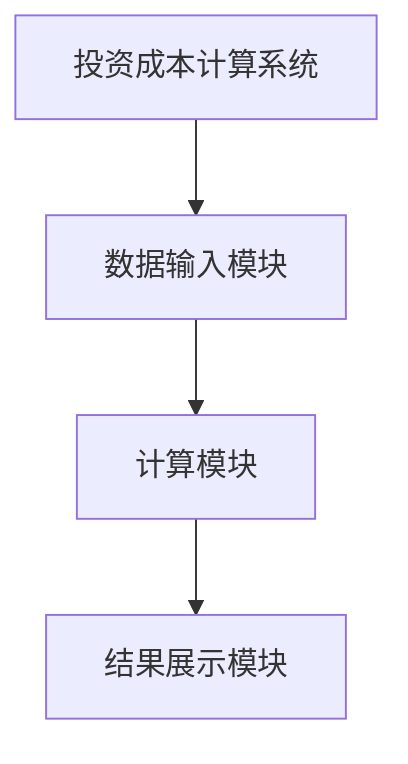
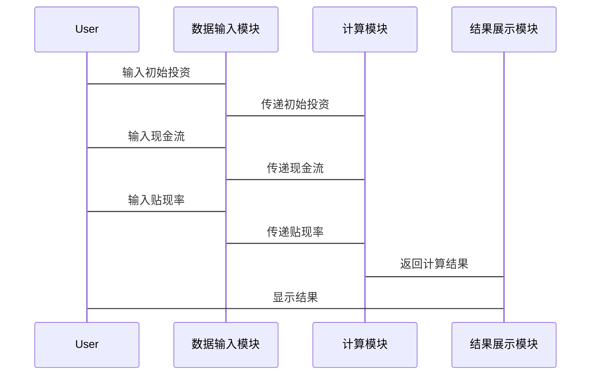

                 


# 约翰·伯格的投资成本计算方法

> 关键词：投资成本计算，约翰·伯格，净现值，内部收益率，投资回收期，系统架构，项目实战

摘要：  
本文详细探讨了约翰·伯格提出的投资成本计算方法，从基本概念到实际应用，系统地分析了投资成本的计算过程。通过介绍净现值、内部收益率和投资回收期等核心方法，结合数学模型、系统架构设计和项目实战，为读者提供了一套完整的投资成本计算解决方案。文章还总结了最佳实践和未来发展趋势，帮助读者更好地理解和应用这些方法。

---

## 第一章：投资成本的基本概念

### 1.1 投资的基本概念

#### 1.1.1 什么是投资
投资是指将资金投入到某个项目或资产中，以期在未来获得收益的行为。投资的核心目标是通过合理分配资源，实现资产的保值与增值。

#### 1.1.2 投资的类型
- **短期投资**：如股票、债券，流动性高，风险较高。
- **长期投资**：如房地产、基础设施，周期长，风险较低，收益稳定。
- **风险投资**：高风险高回报，通常用于初创企业。

#### 1.1.3 投资的重要性
投资是个人和企业实现财富增长的重要手段，通过科学的投资决策，可以最大限度地提高资金的使用效率。

### 1.2 投资成本的定义

#### 1.2.1 显性成本和隐性成本
- **显性成本**：直接可量化的成本，如购买设备的费用。
- **隐性成本**：间接成本，如时间成本、机会成本。

#### 1.2.2 直接成本和间接成本
- **直接成本**：与投资直接相关的成本，如材料费用。
- **间接成本**：与投资相关的间接费用，如管理费用。

### 1.3 投资成本的影响因素

#### 1.3.1 经济因素
- 经济周期、通货膨胀率、利率水平等影响投资成本。

#### 1.3.2 市场因素
- 行业竞争、市场需求、价格波动等影响投资决策。

#### 1.3.3 个体因素
- 投资者的风险偏好、资金规模、投资期限等影响成本计算。

---

## 第二章：投资成本的计算方法

### 2.1 常用的计算模型

#### 2.1.1 净现值法（Net Present Value，NPV）
净现值是指未来现金流按贴现率折现后的总和减去初始投资的现值。公式如下：
$$ NPV = \sum_{t=1}^{n} \frac{CF_t}{(1 + r)^t} - I $$
其中，$CF_t$为第$t$年的现金流，$r$为贴现率，$I$为初始投资。

#### 2.1.2 内部收益率法（Internal Rate of Return，IRR）
内部收益率是使净现值为零的贴现率，公式：
$$ NPV = \sum_{t=1}^{n} \frac{CF_t}{(1 + IRR)^t} - I = 0 $$

#### 2.1.3 投资回收期法（Payback Period）
投资回收期是指初始投资能够通过现金流回收的时间长度。

### 2.2 各种方法的优缺点

#### 2.2.1 净现值法
- **优点**：考虑了资金的时间价值，能够直接比较不同项目的收益性。
- **缺点**：需要准确估计贴现率和未来现金流。

#### 2.2.2 内部收益率法
- **优点**：提供了投资回报的百分比，便于比较不同项目。
- **缺点**：在项目规模和期限不同时，可能无法准确反映实际收益。

#### 2.2.3 投资回收期法
- **优点**：简单易懂，能够快速评估项目的回收能力。
- **缺点**：忽视了回收期后的现金流，无法全面评估项目价值。

### 2.3 选择合适方法的策略

#### 2.3.1 根据项目类型选择方法
- 长期项目适合使用NPV和IRR，短期项目适合使用回收期法。

#### 2.3.2 考虑资金的时间价值
- NPV和IRR考虑了时间价值，而回收期法不考虑。

#### 2.3.3 结合企业战略目标
- 根据企业的风险承受能力和资金状况选择合适的方法。

---

## 第三章：投资成本的数学模型

### 3.1 净现值模型

#### 3.1.1 公式推导
$$ NPV = \sum_{t=1}^{n} \frac{CF_t}{(1 + r)^t} - I $$

#### 3.1.2 计算步骤
1. 确定未来现金流和贴现率。
2. 计算每期现金流的现值。
3. 求和所有现值并减去初始投资。

#### 3.1.3 示例计算
假设初始投资为$100，未来三年现金流分别为$40、$50、$60，贴现率为10%。  
计算：
$$ NPV = \frac{40}{1.1} + \frac{50}{1.1^2} + \frac{60}{1.1^3} - 100 = 12.73 + 39.68 + 40.09 - 100 = 1.50 $$

### 3.2 内部收益率模型

#### 3.2.1 公式推导
$$ IRR = \text{使得} \sum_{t=1}^{n} \frac{CF_t}{(1 + IRR)^t} - I = 0 $$

#### 3.2.2 计算步骤
1. 估计IRR的初始值。
2. 使用试算法或迭代法计算IRR。
3. 验证是否满足净现值为零的条件。

### 3.3 投资回收期模型

#### 3.3.1 公式推导
$$ 回收期 = \frac{I}{\text{年均现金流}} $$

#### 3.3.2 计算步骤
1. 计算每年的现金流。
2. 累加现金流，直到回收初始投资。
3. 记录所需的年数。

---

## 第四章：投资成本的系统架构

### 4.1 系统设计概述

#### 4.1.1 系统目标
- 提供多种投资成本计算方法。
- 支持数据输入、计算和结果展示。

#### 4.1.2 功能模块划分
- 数据输入模块：接收初始投资、现金流、贴现率等。
- 计算模块：执行NPV、IRR、回收期计算。
- 结果展示模块：以图表形式显示结果。

### 4.2 系统功能设计

#### 4.2.1 数据输入模块
- 用户输入初始投资、每年现金流和贴现率。

#### 4.2.2 计算模块
- 调用NPV、IRR、回收期计算函数。

#### 4.2.3 结果展示模块
- 显示计算结果，生成图表。

### 4.3 系统架构图



### 4.4 接口设计

#### 4.4.1 输入接口
- `input_initial_investment()`
- `input_cash_flows()`
- `input_discount_rate()`

#### 4.4.2 输出接口
- `display_NPV()`
- `display_IRR()`
- `display_recovery_period()`

### 4.5 交互流程图



---

## 第五章：项目实战

### 5.1 环境安装

#### 5.1.1 安装开发工具
- 安装Python和Jupyter Notebook。

#### 5.1.2 安装依赖库
- 使用`pip install numpy pandas matplotlib`安装相关库。

### 5.2 核心代码实现

#### 5.2.1 净现值计算函数
```python
def calculate_npv(cash_flows, discount_rate):
    npv = sum(cf / (1 + discount_rate)**t for t, cf in enumerate(cash_flows))
    return npv
```

#### 5.2.2 内部收益率计算函数
```python
def calculate_irr(cash_flows):
    return np.irr(cash_flows)
```

#### 5.2.3 投资回收期计算函数
```python
def calculate_recovery_period(cash_flows):
    cumulative = 0
    period = 0
    for cash in cash_flows:
        cumulative += cash
        period += 1
        if cumulative >= initial_investment:
            return period
    return None
```

### 5.3 代码解读与分析

#### 5.3.1 代码结构
- `calculate_npv`：计算净现值。
- `calculate_irr`：计算内部收益率。
- `calculate_recovery_period`：计算投资回收期。

#### 5.3.2 关键函数解析
- 净现值函数：遍历现金流，计算每期的现值并求和。
- 内部收益率函数：利用numpy库的irr函数。
- 回收期函数：累加现金流，直到回收初始投资。

### 5.4 实际案例分析

#### 5.4.1 案例背景
假设某项目初始投资为$100，未来三年现金流分别为$40、$50、$60，贴现率为10%。

#### 5.4.2 数据输入
- 初始投资：100
- 现金流：[40, 50, 60]
- 贴现率：0.10

#### 5.4.3 计算过程
- NPV计算：
  $$ NPV = \frac{40}{1.1} + \frac{50}{1.1^2} + \frac{60}{1.1^3} - 100 = 1.50 $$
- IRR计算：
  $$ IRR ≈ 12\% $$
- 回收期计算：
  累计现金流为40 + 50 = 90 < 100，继续到第三年，累计为90 + 60 = 150 ≥ 100，回收期为2年。

#### 5.4.4 结果分析
- 该项目NPV为正，IRR高于贴现率，回收期为2年，说明项目可行。

### 5.5 项目小结
通过代码实现，我们可以快速计算投资成本，为决策提供依据。实际案例分析验证了方法的有效性。

---

## 第六章：最佳实践与注意事项

### 6.1 计算过程中的常见问题

#### 6.1.1 数据不准确的问题
- 确保输入数据的准确性和可靠性。

#### 6.1.2 方法选择不当的问题
- 根据项目特点选择合适的计算方法。

#### 6.1.3 时间价值计算的问题
- 合理选择贴现率，避免高估或低估未来现金流。

### 6.2 提高计算准确性的方法

#### 6.2.1 数据来源的选择
- 使用权威数据源，确保数据准确。

#### 6.2.2 方法的合理搭配
- 结合使用NPV和IRR，全面评估项目。

#### 6.2.3 定期校准和验证
- 定期检查计算模型，确保其有效性。

### 6.3 注意事项

#### 6.3.1 保持数据的实时性
- 及时更新数据，反映市场变化。

#### 6.3.2 定期更新计算模型
- 随着市场变化，调整模型参数。

#### 6.3.3 结合企业实际情况
- 考虑企业的财务状况和战略目标。

### 6.4 拓展阅读

#### 6.4.1 相关书籍推荐
- 《投资学》
- 《财务分析》

#### 6.4.2 在线资源推荐
- 投资计算器工具
- 专业财务论坛

#### 6.4.3 专业论坛推荐
- 金融学社
- 清华金融在线

---

## 第七章：总结与展望

### 7.1 本书内容回顾

#### 7.1.1 核心概念
- 投资成本的定义、类型和影响因素。

#### 7.1.2 计算方法
- NPV、IRR、回收期的原理和应用。

#### 7.1.3 系统架构
- 数据输入、计算、展示模块的设计。

### 7.2 未来发展趋势

#### 7.2.1 数字化计算工具的发展
- AI和大数据技术的应用将提升计算效率。

#### 7.2.2 人工智能在投资成本计算中的应用
- AI可以预测市场变化，优化投资决策。

#### 7.2.3 数据分析技术的提升
- 更精准的数据分析将帮助做出更明智的投资决策。

### 7.3 个人学习建议

#### 7.3.1 持续学习的重要性
- 关注金融市场的最新动态和技术发展。

#### 7.3.2 实践中的应用
- 将理论应用于实际项目，积累经验。

#### 7.3.3 与行业专家
- 参与行业交流，获取专业指导。

---

作者：AI天才研究院/AI Genius Institute & 禅与计算机程序设计艺术 /Zen And The Art of Computer Programming

