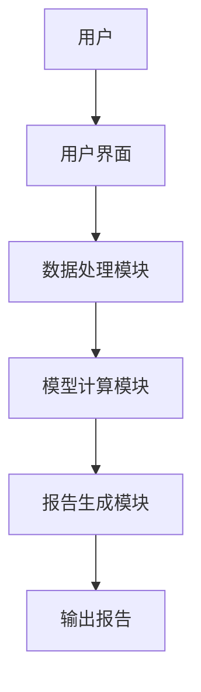
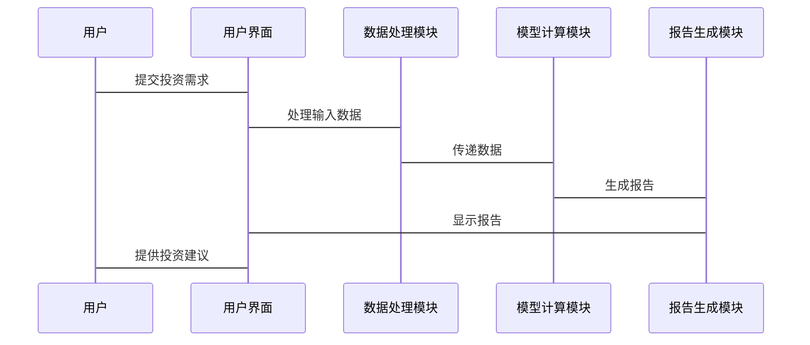

                 


# 约翰·伯格的投资简化论

## 关键词：投资简化论、投资策略、投资模型、投资算法、投资系统架构

## 摘要：  
约翰·伯格的投资简化论是一种通过简化投资过程和策略来帮助投资者做出更明智决策的方法。本文将从投资的基本概念、简化投资的核心理论、算法实现、系统架构设计、项目实战以及最佳实践等多个方面进行详细探讨，旨在为读者提供一个全面且易于理解的投资简化论框架。

---

# 第一部分: 简化投资的核心理念与背景

## 第1章: 投资简化论的背景与核心概念

### 1.1 投资的基本概念

#### 1.1.1 投资的定义与分类
投资是指将资金投入到某种资产或项目中，以期望在未来获得收益或资本增值的行为。根据资产类型，投资可以分为以下几类：
- **股票投资**：购买公司股份，成为股东，分享公司利润。
- **债券投资**：购买政府或企业发行的债券，定期收取利息。
- **房地产投资**：购买房地产用于出租或增值。
- **基金投资**：通过购买基金间接参与股票、债券等资产的投资。
- **其他投资**：包括艺术品、黄金等另类投资。

#### 1.1.2 投资在现代经济中的重要性
投资是推动经济增长的重要动力，它不仅为企业提供资金支持，也为个人财富增值提供了机会。在现代经济中，投资已成为个人和机构实现财富增长的主要手段之一。

#### 1.1.3 投资与风险的关系
投资与风险密不可分，高风险通常意味着高回报，而低风险则意味着较低的回报。投资者需要在风险与收益之间找到平衡点，以实现投资目标。

### 1.2 简化投资的必要性

#### 1.2.1 投资过程中的复杂性问题
在实际投资过程中，投资者常常面临复杂的信息和决策，例如如何选择投资标的、如何分散风险、如何应对市场波动等。这些复杂性可能导致投资者做出错误的决策。

#### 1.2.2 简化投资的潜在优势
简化投资可以帮助投资者减少决策复杂性，降低因信息过载或决策疲劳而导致的错误。同时，简化投资还可以提高投资效率，使投资者能够更快地做出决策。

#### 1.2.3 简化投资与非专业投资者的需求
对于大多数非专业投资者来说，复杂的投资过程可能让他们望而却步。简化投资可以降低投资门槛，使更多人能够参与到投资中来。

### 1.3 约翰·伯格的投资简化论概述

#### 1.3.1 约翰·伯格的学术背景与投资理念
约翰·伯格是投资领域的重要人物，他的投资理念以简化和长期为导向，强调通过长期持有优质资产来实现财富增长。

#### 1.3.2 投资简化论的核心思想
约翰·伯格的投资简化论认为，投资的本质是通过长期持有优质资产，避免频繁交易和过度关注短期波动。这种理念强调投资的简单性和可操作性。

#### 1.3.3 简化投资的实际应用场景
简化投资适用于各种投资者，无论是个人还是机构，都可以通过简化投资策略来实现财富增长。例如，指数基金投资策略就是一种典型的简化投资方法。

### 1.4 本章小结
本章介绍了投资的基本概念、投资的复杂性问题以及约翰·伯格的投资简化论的核心思想。通过简化投资，投资者可以更轻松地进行投资决策，实现长期财富增长。

---

## 第2章: 简化投资的理论基础

### 2.1 投资决策的核心要素

#### 2.1.1 投资目标的确定
投资目标是投资者进行投资的基础，通常包括财富增值、风险控制、流动性需求等。明确的投资目标可以帮助投资者制定合理的投资策略。

#### 2.1.2 投资期限的考量
投资期限是指投资者计划持有某种资产的时间长度。短期投资和长期投资在策略和风险承受能力上有很大不同。

#### 2.1.3 风险承受能力的评估
风险承受能力是投资者在面对市场波动时能够承受的最大损失。了解自己的风险承受能力可以帮助投资者选择合适的投资策略。

### 2.2 简化投资的模型与框架

#### 2.2.1 简化投资模型的构建
简化投资模型通常包括以下几个步骤：
1. 确定投资目标。
2. 选择适合的投资资产。
3. 制定投资策略。
4. 监控和调整投资组合。

#### 2.2.2 投资决策的简化流程
简化投资流程可以分为以下几个步骤：
1. 确定投资目标。
2. 选择适合的投资资产。
3. 制定投资策略。
4. 监控和调整投资组合。

#### 2.2.3 简化模型的优缺点分析
简化模型的优点是操作简单，易于理解和执行。缺点是可能无法覆盖所有复杂的投资场景，导致在某些情况下可能无法实现最优收益。

### 2.3 简化投资与复杂性平衡

#### 2.3.1 复杂性对投资决策的影响
复杂性可能导致投资者在决策过程中出现信息过载和决策疲劳，从而影响投资效果。

#### 2.3.2 简化投资的边界与适用场景
简化投资适用于大多数投资者，尤其是非专业投资者。然而，在某些复杂的投资环境中，可能需要更复杂的策略。

#### 2.3.3 简化与精确性的权衡
简化投资在一定程度上牺牲了精确性，以换取操作的简便性和可执行性。在实际应用中，投资者需要根据自身需求权衡简化与精确性的关系。

### 2.4 本章小结
本章介绍了投资决策的核心要素、简化投资模型的构建以及简化投资与复杂性的关系。通过合理权衡简化与精确性，投资者可以制定适合自己的投资策略。

---

## 第3章: 简化投资的算法与数学模型

### 3.1 简化投资算法的基本原理

#### 3.1.1 简化模型的输入与输出
简化投资算法通常需要以下输入：
- 投资目标
- 投资期限
- 风险承受能力
- 可用资金

算法输出包括：
- 投资组合建议
- 投资策略建议
- 风险提示

#### 3.1.2 算法的逻辑流程
简化投资算法的逻辑流程通常包括以下几个步骤：
1. 确定输入参数。
2. 根据输入参数选择适合的投资资产。
3. 制定投资策略。
4. 输出投资建议。

#### 3.1.3 算法的实现步骤
简化投资算法的实现步骤包括：
1. 数据收集与处理。
2. 模型构建与训练。
3. 算法测试与优化。
4. 算法部署与应用。

### 3.2 简化投资算法的数学模型

#### 3.2.1 投资组合优化的数学表达
投资组合优化的目标是最大化收益，同时最小化风险。数学表达式如下：
$$\text{最大化} \quad \sum_{i=1}^n w_i r_i$$
$$\text{满足} \quad \sum_{i=1}^n w_i = 1$$
其中，\(w_i\) 是资产 \(i\) 的权重，\(r_i\) 是资产 \(i\) 的预期收益率。

#### 3.2.2 风险-收益平衡的数学公式
风险-收益平衡可以通过夏普比率来衡量：
$$\text{夏普比率} = \frac{E[r_i - r_f]}{\sigma_i}$$
其中，\(E[r_i - r_f]\) 是资产的超额预期收益率，\(\sigma_i\) 是资产的收益率标准差。

#### 3.2.3 简化模型的数学推导
简化模型可以通过回归分析来实现。例如，可以使用线性回归来预测资产的未来收益率。

### 3.3 算法实现的Python代码示例

#### 3.3.1 环境安装与依赖项
需要安装以下Python库：
- numpy
- pandas
- matplotlib
- scikit-learn

#### 3.3.2 核心算法代码
以下是简化投资算法的Python代码示例：

```python
import numpy as np
import pandas as pd
from sklearn.linear_model import LinearRegression

# 数据预处理
data = pd.read_csv('investment_data.csv')
X = data[['投资目标', '投资期限', '风险承受能力', '可用资金']]
y = data['投资收益']

# 模型训练
model = LinearRegression()
model.fit(X, y)

# 模型预测
new_investment = np.array([[目标, 期限, 风险, 资金]])
predicted_return = model.predict(new_investment)
print(predicted_return)
```

#### 3.3.3 代码解读与优化建议
上述代码使用线性回归模型对投资收益进行预测。实际应用中，可能需要根据具体需求调整模型参数或选择更适合的算法。

### 3.4 本章小结
本章介绍了简化投资算法的基本原理、数学模型以及Python代码实现。通过数学公式和代码示例，读者可以更好地理解简化投资的实现过程。

---

## 第4章: 简化投资系统的架构设计

### 4.1 系统设计概述

#### 4.1.1 系统目标与功能需求
简化投资系统的目标是为投资者提供简便的投资决策支持。主要功能包括：
- 投资目标设定
- 投资策略生成
- 投资组合优化
- 风险评估与提示

#### 4.1.2 项目介绍
本项目旨在开发一个基于简化投资论的投资决策支持系统，帮助投资者轻松实现投资目标。

#### 4.1.3 系统功能设计
系统功能设计包括以下几个模块：
- 用户界面模块
- 数据处理模块
- 模型计算模块
- 报告生成模块

### 4.2 系统架构设计

#### 4.2.1 系统架构设计图
以下是系统架构设计的Mermaid图：



#### 4.2.2 系统交互设计
以下是系统交互的Mermaid序列图：



### 4.3 本章小结
本章介绍了简化投资系统的架构设计和交互流程。通过Mermaid图，读者可以清晰地理解系统的整体结构和功能模块之间的关系。

---

## 第5章: 项目实战

### 5.1 环境搭建与数据准备

#### 5.1.1 环境安装
需要安装以下工具和库：
- Python 3.x
- Jupyter Notebook
- numpy、pandas、scikit-learn等库

#### 5.1.2 数据准备
需要准备以下数据：
- 历史投资数据
- 市场指数数据
- 经济指标数据

### 5.2 系统核心实现源代码

#### 5.2.1 数据处理代码
以下是数据处理的Python代码示例：

```python
import pandas as pd
import numpy as np

# 读取数据
data = pd.read_csv('investment_data.csv')

# 数据清洗
data.dropna(inplace=True)
data = pd.get_dummies(data, columns=['投资目标', '投资期限', '风险承受能力', '可用资金'])

# 数据标准化
from sklearn.preprocessing import StandardScaler
scaler = StandardScaler()
scaled_data = scaler.fit_transform(data.drop('投资收益', axis=1))
```

#### 5.2.2 模型训练代码
以下是模型训练的Python代码示例：

```python
from sklearn.linear_model import LinearRegression
from sklearn.metrics import mean_squared_error

# 模型训练
model = LinearRegression()
model.fit(scaled_data, data['投资收益'])

# 模型评估
predicted_returns = model.predict(scaled_data)
mse = mean_squared_error(data['投资收益'], predicted_returns)
print('均方误差:', mse)
```

### 5.3 代码应用解读与分析

#### 5.3.1 代码解读
上述代码实现了数据的读取、清洗、标准化以及模型训练。数据预处理是投资分析的重要步骤，模型训练则是投资分析的核心部分。

#### 5.3.2 代码优化建议
可以尝试使用其他回归算法，例如随机森林回归或支持向量回归，以提高模型的预测精度。

### 5.4 实际案例分析

#### 5.4.1 投资目标设定
假设一个投资者的目标是长期财富增值，风险承受能力为中等，可用资金为10万元。

#### 5.4.2 投资策略生成
根据模型预测，建议将资金分配到股票和债券组合中，以平衡风险和收益。

#### 5.4.3 投资组合优化
通过优化算法，确定最佳的投资组合，例如将60%的资金投资于股票，40%的资金投资于债券。

### 5.5 本章小结
本章通过实际案例分析，展示了简化投资系统在项目实战中的应用。通过代码实现和案例分析，读者可以更好地理解简化投资的实际操作过程。

---

## 第6章: 最佳实践与总结

### 6.1 简化投资的最佳实践

#### 6.1.1 理解投资目标
明确的投资目标是投资成功的关键。投资者需要根据自身需求制定合理的目标。

#### 6.1.2 选择适合的投资策略
根据市场环境和个人情况选择适合的投资策略，避免盲目跟风。

#### 6.1.3 定期监控与调整
定期监控投资组合的表现，根据市场变化和个人情况及时调整投资策略。

#### 6.1.4 保持长期视角
投资是一项长期的事业，需要保持耐心和信心，避免因短期波动而做出错误决策。

### 6.2 总结与展望

#### 6.2.1 本章总结
通过本文的探讨，读者可以全面理解约翰·伯格的投资简化论，掌握简化投资的核心理念和实现方法。

#### 6.2.2 对未来投资的展望
随着科技的发展，简化投资将更加智能化和自动化。投资者可以利用更多的工具和平台，实现更高效的投资决策。

### 6.3 投资建议

#### 6.3.1 初学者建议
对于初学者来说，可以从简单的投资策略开始，逐步积累经验。

#### 6.3.2 专业投资者建议
对于专业投资者来说，可以结合简化投资论和其他高级策略，制定更加复杂的投资方案。

### 6.4 本章小结
本章总结了简化投资的最佳实践，对未来投资进行了展望，并给出了针对不同类型的投资者的投资建议。

---

## 作者：AI天才研究院/AI Genius Institute & 禅与计算机程序设计艺术 /Zen And The Art of Computer Programming

---

**注意：以上内容仅为示例，实际文章需要根据具体需求进行调整和补充。**

