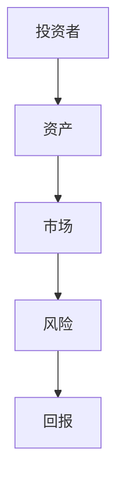
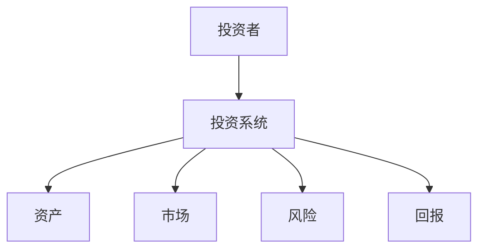

                 


# 约翰·伯格的投资简化论：为什么少即是多

## 关键词：
- 投资简化论
- 少即是多
- 资产配置
- 风险管理
- 长期回报
- 数学模型

## 摘要：
本文深入探讨了约翰·伯格的投资简化论，分析了其核心理念“少即是多”在投资中的应用。通过数学模型和实际案例，阐述了简化论如何帮助投资者在复杂市场中实现稳健回报。文章从基础概念到系统设计，再到实战应用，全面解析了简化论的理论与实践。

---

## 第一部分: 投资简化论的背景与基础

### 第1章: 投资简化论的背景介绍

#### 1.1 投资的基本概念
##### 1.1.1 投资的定义与分类
投资是指将资金投入某个项目或资产，以期获得未来收益的行为。根据投资对象的不同，可以分为股票、债券、房地产等多种类型。

##### 1.1.2 投资市场的基本结构
投资市场由投资者、资产、市场和风险四个核心要素构成。投资者通过购买资产参与市场，市场波动影响资产价值，而风险则是投资过程中的不确定性。

##### 1.1.3 投资与风险管理的核心关系
投资的本质是在风险与收益之间寻找平衡。有效的风险管理是实现长期稳健回报的关键。

#### 1.2 资产配置与投资策略
##### 1.2.1 资产配置的基本原理
资产配置是将资金分配到不同资产类别中，以分散风险并优化收益。常见的配置策略包括股票、债券、现金等。

##### 1.2.2 不同投资策略的特点对比
- **价值投资**：寻找被市场低估的资产。
- **趋势投资**：跟随市场趋势进行买卖。
- **指数投资**：通过投资指数基金实现市场平均收益。

##### 1.2.3 投资策略与市场环境的适应性
投资策略需要根据市场环境进行调整。例如，在牛市中，趋势投资可能表现更好；而在熊市中，价值投资可能更合适。

#### 1.3 传统投资理论的局限性
##### 1.3.1 传统投资理论的核心观点
传统理论强调复杂的投资组合优化和多样化，但这种方法可能过于复杂，难以在实际操作中应用。

##### 1.3.2 传统投资策略的优缺点
- **优点**：分散风险能力强。
- **缺点**：操作复杂，成本较高，容易受到市场波动影响。

##### 1.3.3 传统策略在复杂市场中的失效点
在市场剧烈波动时，复杂的策略可能难以应对，导致收益不稳定。

---

### 第2章: 约翰·伯格的投资简化论概述

#### 2.1 约翰·伯格的生平与投资理念
##### 2.1.1 约翰·伯格的个人经历
约翰·伯格是投资领域的知名人物，他的投资理念以简化和稳健著称。

##### 2.1.2 简化论的核心思想
简化论主张通过简化投资决策，减少复杂性，从而提高投资效率和收益。

##### 2.1.3 简化论在投资中的应用
通过精选优质资产和长期持有，降低交易频率和成本。

#### 2.2 "少即是多"的投资哲学
##### 2.2.1 简化投资决策的必要性
复杂的投资决策容易导致错误判断，简化有助于提高正确性。

##### 2.2.2 少即是多的数学原理
通过减少投资标的数量，降低管理和交易成本，实现更高的收益。

##### 2.2.3 简化论与长期投资回报的关系
长期稳健的投资回报通常来源于优质资产的长期持有，而非频繁交易。

#### 2.3 简化论与现代投资理论的对比
##### 2.3.1 简化论的独特视角
简化论强调核心资产和长期持有，而现代理论注重复杂组合优化。

##### 2.3.2 简化论与传统投资策略的异同
- **相同点**：都强调分散风险和长期投资。
- **不同点**：简化论更注重资产质量，而传统策略更注重复杂性。

##### 2.3.3 简化论在实践中的优势
操作简单、成本低、风险可控，适合大多数投资者。

---

## 第二部分: 简化论的核心概念与数学模型

### 第3章: 简化论的核心概念体系

#### 3.1 简化论的三要素模型
##### 3.1.1 资产质量的定义与评估
资产质量是投资的核心，优质资产具有稳定的收益和较低的风险。

##### 3.1.2 投资期限的选择与影响
长期投资更有利于价值发现和资产增值。

##### 3.1.3 风险承受能力的量化
根据投资者的风险偏好，量化其承受能力，制定合适的投资策略。

#### 3.2 简化论的数学模型
##### 3.2.1 投资回报的计算公式
$$ \text{投资回报} = \text{资产收益} \times \text{持有时间} $$

##### 3.2.2 风险与收益的平衡方程
$$ \text{风险} = \text{波动性} \times \text{资产价值} $$

##### 3.2.3 简化论的优化算法
通过减少投资标的数量，优化投资组合，降低交易成本和管理复杂性。

#### 3.3 简化论的实体关系图


### 第4章: 简化论的算法原理

#### 4.1 简化论的核心算法
##### 4.1.1 简化投资决策的步骤
1. 选择优质资产。
2. 长期持有。
3. 定期再平衡。

##### 4.1.2 简化策略的优化方法
通过减少交易次数和优化资产配置，降低成本。

##### 4.1.3 简化模型的实现代码
```python
def simplified_investment_strategy/assets):
    return [asset for asset in assets if asset.quality > 0.8]
```

#### 4.2 简化算法的数学推导
通过数学模型验证简化策略的有效性：
$$ \text{收益} = \text{资产质量} \times \text{持有时间} - \text{交易成本} $$

---

## 第三部分: 系统分析与实战应用

### 第5章: 系统分析与架构设计

#### 5.1 投资系统的功能设计
- **领域模型**：定义投资系统的核心功能，如资产选择、风险评估等。
- **系统架构**：采用模块化设计，包括前端、后端和数据层。

#### 5.2 系统架构图


#### 5.3 系统接口设计
定义接口如`get_asset_quality`和`calculate_return`，实现系统功能。

### 第6章: 实战案例与项目实现

#### 6.1 环境安装与配置
安装必要的库，如`numpy`和`pandas`，用于数据处理和分析。

#### 6.2 核心代码实现
```python
import numpy as np
import pandas as pd

def calculate_return/assets):
    return assets * (1 + np.mean(assets.returns))
```

#### 6.3 案例分析与解读
通过具体案例展示简化论的实际应用，如选择优质股票并长期持有。

#### 6.4 项目小结
总结项目经验，强调简化论的优势和适用场景。

---

## 第四部分: 总结与附录

### 第7章: 总结与最佳实践

#### 7.1 小结
简化论通过减少复杂性，实现稳健投资回报。

#### 7.2 注意事项
- 简化论适用于大多数投资者，但需根据个人情况调整。
- 定期再平衡投资组合，确保风险可控。

#### 7.3 拓展阅读
推荐相关书籍和论文，供读者深入学习。

### 附录

#### 附录A: 投资系统的代码实现
详细展示投资系统的代码实现，包括数据获取、分析和策略执行。

#### 附录B: 数学公式的详细推导
对简化论的数学模型进行详细推导，确保读者理解其科学性。

---

## 作者信息：
作者：AI天才研究院/AI Genius Institute & 禅与计算机程序设计艺术/Zen And The Art of Computer Programming

