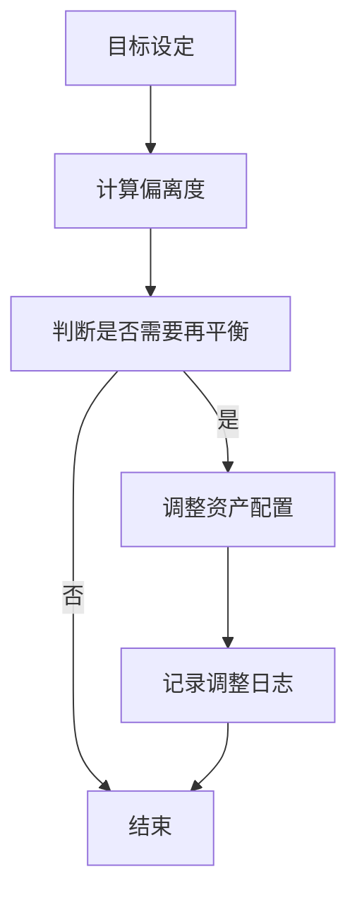
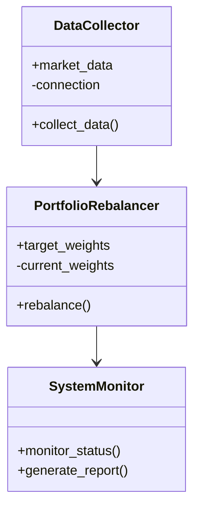
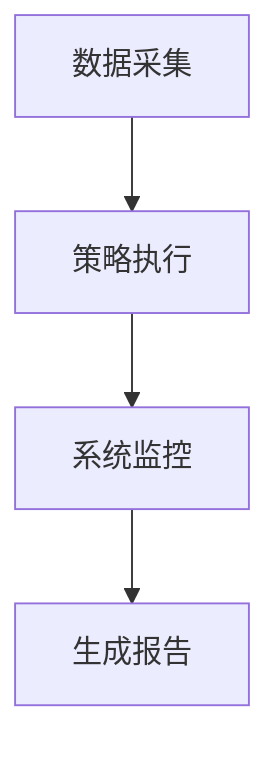

                 


# 约翰·伯格的投资组合再平衡策略

> 关键词：投资组合再平衡，约翰·伯格，策略优化，数学模型，系统架构，Python实现，投资组合管理

> 摘要：本文系统地介绍并分析了约翰·伯格的投资组合再平衡策略，从背景、类型、数学模型到系统架构和实战案例，详细阐述了该策略的核心思想和实现方法。通过本文，读者可以全面理解投资组合再平衡的原理、算法实现和实际应用。

---

## 第一部分: 投资组合再平衡策略概述

### 第1章: 投资组合再平衡的背景与重要性

#### 1.1 投资组合再平衡的定义与核心概念

##### 1.1.1 投资组合再平衡的定义
投资组合再平衡是指根据市场变化和个人投资目标的调整，定期或不定期地重新调整投资组合的资产配置比例，以维持投资组合的风险和收益的平衡。

##### 1.1.2 投资组合再平衡的核心要素
- **目标设定**：明确投资目标和风险承受能力。
- **资产配置**：根据目标分配资产比例。
- **市场变化**：根据市场波动调整配置。
- **再平衡频率**：定期或不定期进行调整。

##### 1.1.3 投资组合再平衡的背景与重要性
随着市场环境的变化，单一的资产配置在长期内可能会偏离预期目标。再平衡策略可以帮助投资者规避风险、捕捉机会，保持投资组合的健康状态。

#### 1.2 约翰·伯格的投资组合再平衡策略

##### 1.2.1 约翰·伯格的背景与投资理念
约翰·伯格是投资领域的传奇人物，他提出的指数投资理念和再平衡策略对现代投资组合管理产生了深远影响。

##### 1.2.2 投资组合再平衡的必要性
市场波动和投资者目标的变化需要定期调整投资组合，以保持风险和收益的平衡。

##### 1.2.3 约翰·伯格策略的核心思想
- **长期投资**：避免频繁交易，降低费用。
- **分散投资**：通过资产配置降低风险。
- **定期再平衡**：保持资产配置比例，适应市场变化。

---

### 第2章: 投资组合再平衡的类型与方法

#### 2.1 定期再平衡策略

##### 2.1.1 定期再平衡的定义与特点
定期再平衡是指根据预设的时间间隔（如季度、半年、一年）进行资产配置调整。

##### 2.1.2 定期再平衡的实施频率
- 每季度一次
- 每半年一次
- 每年一次

##### 2.1.3 定期再平衡的优缺点
| 类型    | 优点                          | 缺点                          |
|---------|-------------------------------|-------------------------------|
| 定期再平衡 | 简单易行，便于管理            | 可能错过市场波动带来的机会    |

#### 2.2 事件驱动再平衡策略

##### 2.2.1 事件驱动再平衡的定义与特点
事件驱动再平衡是指在特定市场事件（如重大经济变化、资产价格剧烈波动）发生时进行调整。

##### 2.2.2 重大市场事件的触发条件
- 经济危机
- 股票市场崩盘
- 利率调整

##### 2.2.3 事件驱动再平衡的实施步骤
1. 监测市场事件
2. 评估资产配置偏离
3. 调整投资组合

#### 2.3 指数跟踪再平衡策略

##### 2.3.1 指数跟踪的定义与特点
指数跟踪再平衡是通过跟踪市场指数的变化，定期调整投资组合的资产比例。

##### 2.3.2 指数跟踪再平衡的实施方法
- 每月调整
- 每季度调整
- 每年调整

##### 2.3.3 指数跟踪再平衡的优缺点
| 类型    | 优点                          | 缺点                          |
|---------|-------------------------------|-------------------------------|
| 指数跟踪再平衡 | 低成本，易于操作            | 可能偏离投资者的个性化目标    |

---

### 第3章: 投资组合再平衡的数学模型与算法

#### 3.1 投资组合再平衡的数学模型

##### 3.1.1 投资组合优化的数学公式
$$ \text{目标函数：} \min_w \frac{1}{2} w^T \Sigma w $$
$$ \text{约束条件：} \sum_{i=1}^n w_i = 1, \quad w_i \geq 0 $$

其中，\( w \) 是资产权重向量，\( \Sigma \) 是资产收益率的协方差矩阵。

##### 3.1.2 投资组合再平衡的目标函数
$$ \text{目标函数：} \min_w \frac{1}{2} w^T \Sigma w - \lambda \cdot \text{偏离度} $$

##### 3.1.3 投资组合再平衡的约束条件
$$ \sum_{i=1}^n w_i = 1 $$
$$ w_i \geq 0 $$

#### 3.2 约翰·伯格策略的算法实现

##### 3.2.1 算法原理与流程图


##### 3.2.2 算法实现的步骤分解
1. 计算当前资产权重
2. 计算目标资产权重
3. 计算偏离度
4. 判断是否需要再平衡
5. 如果需要，调整资产配置
6. 记录调整日志

##### 3.2.3 算法实现的代码示例
```python
def rebalance_portfolio(current_weights, target_weights):
    # 计算偏离度
    deviation = current_weights - target_weights
    # 判断是否需要再平衡
    if sum(abs(deviation)) > 0.05:
        # 调整资产配置
        new_weights = target_weights
    else:
        new_weights = current_weights
    return new_weights
```

---

### 第4章: 投资组合再平衡的系统架构与实现

#### 4.1 系统架构设计

##### 4.1.1 系统功能模块划分
- 数据采集模块
- 策略执行模块
- 系统监控模块

##### 4.1.2 系统架构的类图设计


##### 4.1.3 系统架构的流程图设计


#### 4.2 系统实现细节

##### 4.2.1 数据采集模块
- 从数据源获取市场数据
- 存储市场数据

##### 4.2.2 策略执行模块
- 计算当前资产权重
- 计算目标资产权重
- 判断是否需要再平衡
- 调整资产配置

##### 4.2.3 系统监控模块
- 监测系统状态
- 生成报告

---

### 第5章: 投资组合再平衡的实战案例分析

#### 5.1 实战案例介绍

##### 5.1.1 案例背景与目标
假设一个投资者的目标是将资产分配到股票、债券和现金中，目标比例为60%股票，30%债券，10%现金。

##### 5.1.2 实战案例的实施步骤
1. 初始资产分配：$60,000股票，$30,000债券，$10,000现金
2. 市场变化导致股票下跌10%，债券上涨5%，现金不变
3. 计算当前资产权重：股票54%，债券31.5%，现金14.5%
4. 判断偏离度：股票偏离6%，债券偏离1.5%，现金偏离4.5%
5. 再平衡调整：卖出股票，买入债券和现金，恢复到60%股票，30%债券，10%现金

##### 5.1.3 实战案例的调整结果
- 股票：$54,000变为$60,000
- 债券：$31,500变为$30,000
- 现金：$14,500变为$10,000

---

## 第六章: 总结与展望

### 6.1 总结
投资组合再平衡是保持资产配置合理的重要手段，约翰·伯格的策略提供了简单有效的实现方法。

### 6.2 注意事项
- 定期再平衡可能会产生交易费用
- 市场波动剧烈时需要谨慎调整
- 考虑税收影响

### 6.3 未来研究方向
- 更复杂的再平衡策略
- 人工智能在再平衡中的应用
- 多因素优化模型

---

**作者：AI天才研究院/AI Genius Institute & 禅与计算机程序设计艺术 /Zen And The Art of Computer Programming**

