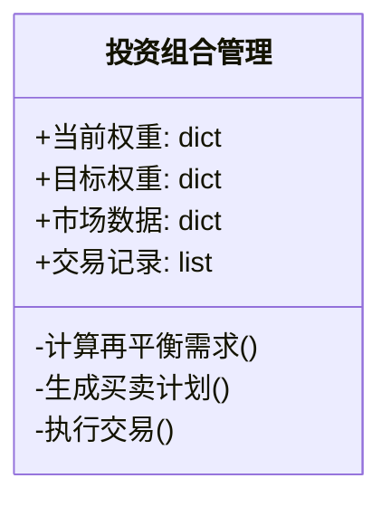
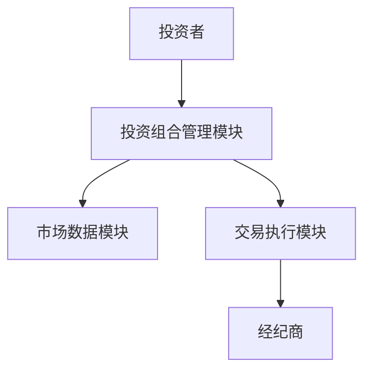

                 


# 《约翰·伯格的投资组合再平衡：应对市场剧烈波动的策略》

**关键词**：投资组合再平衡、市场波动、约翰·伯格、风险管理、资产配置、动态调整

**摘要**：本文详细探讨了投资组合再平衡的核心概念、策略、算法原理以及在应对市场剧烈波动中的应用。结合约翰·伯格的投资理念，分析了再平衡在风险管理中的重要性，并通过实际案例展示了如何通过再平衡策略优化投资组合的表现。文章内容涵盖了再平衡的定义、类型、数学模型、系统架构设计以及实战应用，旨在为投资者提供一套应对市场波动的有效策略。

---

## 第一部分: 投资组合再平衡的背景与基础

### 第1章: 投资组合再平衡的背景与意义

#### 1.1 市场波动与投资组合管理

##### 1.1.1 市场波动的定义与特征
市场波动是指资产价格在短时间内出现剧烈波动的现象，通常由市场情绪、经济数据、政策变化等因素引发。波动的特征包括随机性、不可预测性和非线性变化。市场波动对投资组合的影响主要体现在资产价格的波动性和组合收益的不确定性上。

##### 1.1.2 投资组合管理的核心目标
投资组合管理的核心目标是通过合理的资产配置和风险控制，实现收益最大化和风险最小化。投资组合的目标通常包括收益目标、风险目标和流动性目标。

##### 1.1.3 再平衡在投资组合管理中的重要性
再平衡是投资组合管理中的关键步骤，用于调整组合中各资产的权重，使其符合预定的资产配置目标。再平衡有助于应对市场波动，优化组合表现，并降低风险。

#### 1.2 投资者的风险管理需求

##### 1.2.1 投资者的风险偏好与收益目标
投资者的风险偏好决定了其对高风险资产（如股票）和低风险资产（如债券）的配置比例。收益目标是投资者在特定时间段内期望实现的回报水平。

##### 1.2.2 市场波动对投资组合的影响
市场波动可能导致投资组合的实际收益偏离预期，特别是在市场剧烈波动的情况下，组合的权重可能偏离目标配置，从而影响整体收益。

##### 1.2.3 再平衡策略在风险管理中的作用
再平衡通过调整组合权重，确保投资组合的风险和收益与投资者的目标一致。在市场波动加剧时，再平衡能够有效降低组合的波动性，优化风险收益比。

#### 1.3 约翰·伯格的投资理念

##### 1.3.1 约翰·伯格的投资者画像
约翰·伯格是一位长期价值投资者，注重长期投资和分散化策略。他认为市场波动是投资机会的来源，而不是风险。

##### 1.3.2 伯格的投资哲学与策略
伯格的投资哲学强调长期持有优质资产，避免频繁交易。他主张通过分散化投资降低风险，并通过定期再平衡维持组合的稳定性。

##### 1.3.3 伯格再平衡策略的核心思想
伯格的再平衡策略强调在市场波动中保持冷静，通过定期调整组合权重，避免过度偏离目标配置。

#### 1.4 本章小结

##### 1.4.1 投资组合再平衡的必要性
再平衡是投资组合管理中的关键步骤，能够帮助投资者应对市场波动，优化组合表现。

##### 1.4.2 伯格策略的独特性
伯格的投资理念强调长期持有和定期再平衡，这使其在市场波动中更具防御性。

##### 1.4.3 本书的结构与目标
本书将从理论到实践，详细讲解再平衡的原理、策略和实现方法，帮助投资者在市场波动中制定有效的应对策略。

---

## 第2章: 投资组合再平衡的核心概念

### 2.1 投资组合再平衡的定义与目标

#### 2.1.1 投资组合再平衡的定义
再平衡是指根据市场环境和投资者目标，调整投资组合中各资产的权重，以保持组合的稳定性和优化性。

#### 2.1.2 再平衡的主要目标
- 保持资产配置的稳定性
- 优化组合的风险收益比
- 抓住市场波动中的投资机会

#### 2.1.3 再平衡的边界与外延
再平衡的边界包括时间频率、成本控制和风险容忍度。外延则涉及动态调整和事件驱动策略。

### 2.2 投资组合再平衡的类型

#### 2.2.1 定期再平衡策略
定期再平衡是指按照预定的时间间隔（如季度或半年）进行调整，适用于市场波动较为稳定的环境。

#### 2.2.2 事件驱动再平衡策略
事件驱动再平衡是指在特定事件（如市场崩盘或重大政策变化）发生时进行调整，适用于市场波动剧烈的情况。

#### 2.2.3 动态再平衡策略
动态再平衡是指根据市场波动实时调整组合权重，适用于市场波动频繁且剧烈的环境。

### 2.3 投资组合再平衡的核心要素

#### 2.3.1 资产配置权重
资产配置权重是指组合中各资产的占比，通常根据投资者的风险偏好和收益目标确定。

#### 2.3.2 市场波动预测
市场波动预测是再平衡策略的重要依据，通常通过历史数据分析和模型模拟进行预测。

#### 2.3.3 再平衡成本
再平衡成本包括交易费用、税收和时间成本，需要在调整策略时综合考虑。

### 2.4 本章小结

#### 2.4.1 再平衡的核心概念总结
再平衡是通过调整资产权重，保持组合稳定性和优化性的策略。

#### 2.4.2 不同再平衡策略的对比
定期、事件驱动和动态再平衡各有优缺点，适用于不同的市场环境。

#### 2.4.3 伯格策略的要素分析
伯格的再平衡策略注重长期持有和定期调整，强调分散化和稳定性。

---

## 第3章: 投资组合再平衡的算法原理

### 3.1 再平衡算法的原理与步骤

#### 3.1.1 确定再平衡的触发条件
触发条件包括时间间隔、权重偏离目标值和市场波动加剧等情况。

#### 3.1.2 计算当前组合与目标组合的差异
通过比较当前组合权重与目标权重，确定需要调整的资产及其比例。

#### 3.1.3 制定再平衡的具体操作方案
根据差异计算，制定买卖计划，确保调整后组合权重符合目标。

#### 3.1.4 执行再平衡操作并监控效果
执行调整操作后，监控组合表现，确保再平衡效果符合预期。

### 3.2 再平衡算法的数学模型

#### 3.2.1 确定目标权重
目标权重根据投资者的风险偏好和收益目标确定，通常以资产类别为单位。

#### 3.2.2 计算当前权重
当前权重是组合中各资产的实际占比，需要定期进行重新计算。

#### 3.2.3 计算权重偏离
权重偏离 = 当前权重 - 目标权重

#### 3.2.4 制定买卖计划
买卖计划根据权重偏离确定，卖出偏离过高的资产，买入偏离过低的资产。

#### 3.2.5 执行交易
根据买卖计划执行交易，调整组合权重。

### 3.3 再平衡算法的实现

#### 3.3.1 使用Python实现再平衡算法
```python
import pandas as pd
import numpy as np

def calculate_rebalance(current_weights, target_weights):
    """
    计算再平衡的买卖计划
    """
    deviations = current_weights - target_weights
    buy_list = {}
    sell_list = {}
    for asset in deviations:
        if deviations[asset] < 0:
            sell_list[asset] = -deviations[asset]
        elif deviations[asset] > 0:
            buy_list[asset] = deviations[asset]
    return buy_list, sell_list

# 示例数据
current_weights = {'股票': 0.6, '债券': 0.3, '现金': 0.1}
target_weights = {'股票': 0.5, '债券': 0.3, '现金': 0.2}

buy, sell = calculate_rebalance(current_weights, target_weights)
print("买入:", buy)
print("卖出:", sell)
```

#### 3.3.2 再平衡算法的优化
通过动态调整和成本控制，优化再平衡算法的效率和效果。

### 3.4 本章小结

#### 3.4.1 再平衡算法的原理
再平衡算法通过计算权重偏离，制定买卖计划，实现组合调整。

#### 3.4.2 数学模型的应用
数学模型是再平衡算法的核心，通过计算权重差异，优化调整方案。

#### 3.4.3 代码实现与优化
通过Python代码实现再平衡算法，并通过优化提高效率和效果。

---

## 第4章: 投资组合再平衡的系统分析与架构设计

### 4.1 问题场景介绍
在市场剧烈波动的情况下，投资组合需要实时监控和调整，确保组合的稳定性。

### 4.2 系统功能设计

#### 4.2.1 领域模型设计


#### 4.2.2 系统架构设计


### 4.3 系统接口设计

#### 4.3.1 系统输入接口
- 当前组合权重
- 目标组合权重
- 市场数据

#### 4.3.2 系统输出接口
- 买卖计划
- 交易指令
- 调整后的组合权重

### 4.4 系统交互设计

#### 4.4.1 系统交互流程
```mermaid
sequenceDiagram
    投资者 -> 投资组合管理模块: 提交投资目标
    投资组合管理模块 -> 市场数据模块: 获取当前市场数据
    投资组合管理模块 -> 市场数据模块: 计算当前组合权重
    投资组合管理模块 -> 市场数据模块: 确定再平衡触发条件
    投资组合管理模块 -> 交易执行模块: 生成买卖计划
    交易执行模块 -> 经纪商: 执行交易
    交易执行模块 -> 投资组合管理模块: 返回交易结果
    投资者 <- 投资组合管理模块: 通知调整完成
```

### 4.5 本章小结

#### 4.5.1 系统设计的重要性
系统设计是实现再平衡策略的关键，确保功能模块协调工作。

#### 4.5.2 系统架构的选择
采用模块化架构，便于功能扩展和维护。

#### 4.5.3 系统交互的优化
通过优化交互流程，提高系统效率和用户体验。

---

## 第5章: 投资组合再平衡的项目实战

### 5.1 环境安装与配置

#### 5.1.1 安装Python环境
安装Python 3.x及以上版本，并安装必要的库（如pandas、numpy等）。

#### 5.1.2 安装投资组合管理模块
安装或编写用于再平衡计算的Python模块。

### 5.2 系统核心实现

#### 5.2.1 再平衡算法的实现
编写Python代码实现再平衡算法，包括计算权重差异、生成买卖计划等。

#### 5.2.2 系统功能实现
实现市场数据获取、组合权重计算、再平衡触发条件判断等功能。

### 5.3 代码实现与解读

#### 5.3.1 再平衡算法的代码实现
```python
import pandas as pd
import numpy as np

def calculate_rebalance(current_weights, target_weights):
    deviations = current_weights - target_weights
    buy = {}
    sell = {}
    for asset in deviations:
        if deviations[asset] > 0:
            buy[asset] = deviations[asset]
        elif deviations[asset] < 0:
            sell[asset] = -deviations[asset]
    return buy, sell

# 示例数据
current_weights = {'股票': 0.6, '债券': 0.3, '现金': 0.1}
target_weights = {'股票': 0.5, '债券': 0.3, '现金': 0.2}

buy, sell = calculate_rebalance(current_weights, target_weights)
print("买入:", buy)
print("卖出:", sell)
```

#### 5.3.2 系统功能实现的代码解读
代码通过计算当前权重与目标权重的差异，生成买卖计划，实现再平衡操作。

### 5.4 实际案例分析

#### 5.4.1 案例背景
假设投资者的目标组合为股票50%、债券30%、现金20%，当前组合为股票60%、债券30%、现金10%。

#### 5.4.2 再平衡操作
根据代码计算，需要卖出股票10%，买入现金10%。

#### 5.4.3 调整后的组合
调整后组合为股票50%、债券30%、现金20%，符合目标配置。

### 5.5 本章小结

#### 5.5.1 环境安装与配置
安装必要的软件和库，确保系统正常运行。

#### 5.5.2 系统核心实现
通过代码实现再平衡算法，确保功能正常。

#### 5.5.3 项目实战的总结
通过实际案例分析，验证再平衡策略的有效性。

---

## 第6章: 投资组合再平衡的总结与扩展

### 6.1 总结与反思

#### 6.1.1 再平衡的重要性
再平衡是投资组合管理中的关键步骤，能够有效应对市场波动，优化组合表现。

#### 6.1.2 伯格策略的启示
伯格的投资理念强调长期持有和定期再平衡，值得投资者借鉴。

### 6.2 投资组合再平衡的注意事项

#### 6.2.1 再平衡成本
再平衡需要考虑交易成本和时间成本，避免过度调整。

#### 6.2.2 市场波动预测的局限性
市场波动难以准确预测，再平衡策略需要灵活调整。

### 6.3 投资组合再平衡的未来展望

#### 6.3.1 人工智能与再平衡策略
人工智能技术可以提高再平衡的效率和准确性。

#### 6.3.2 数量化投资的未来发展
数量化投资将更加普及，再平衡策略将更加智能化和个性化。

### 6.4 本章小结

#### 6.4.1 再平衡的核心价值
再平衡是投资组合管理中的重要工具，能够帮助投资者应对市场波动。

#### 6.4.2 伯格策略的借鉴意义
伯格的投资理念对现代投资组合管理具有重要的启示。

#### 6.4.3 未来的投资趋势
随着技术进步，再平衡策略将更加智能化和个性化。

---

## 作者信息

**作者：AI天才研究院/AI Genius Institute & 禅与计算机程序设计艺术 /Zen And The Art of Computer Programming**

---

通过以上内容，我们详细讲解了投资组合再平衡的核心概念、算法原理、系统架构设计以及实战应用，结合约翰·伯格的投资理念，为投资者提供了一套应对市场剧烈波动的有效策略。

