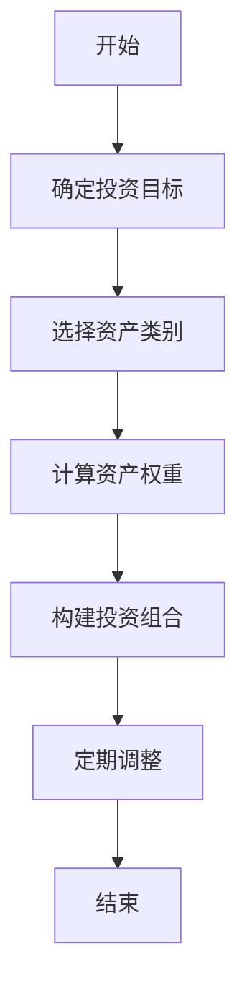

                 


# 约翰·伯格的投资者教育理念

> 关键词：投资者教育，约翰·伯格，价值投资，长期投资，风险管理，投资组合优化

> 摘要：本文深入探讨了约翰·伯格的投资者教育理念，分析了其核心概念、价值投资与长期投资策略、风险管理与投资组合优化，以及如何通过系统分析和项目实战来实现这些理念。文章还提供了最佳实践和投资建议，帮助读者更好地理解和应用伯格的投资思想。

---

## 第一部分：约翰·伯格的投资者教育理念概述

### 第1章：投资者教育的核心概念

#### 1.1 投资者教育的背景与重要性

##### 1.1.1 投资者教育的定义与目标

投资者教育是指通过系统化的知识传授和实践指导，帮助投资者掌握投资的基本原理、策略和技巧，从而做出理性、科学的投资决策。其目标是提高投资者的金融素养，避免盲目投资和非理性决策，实现长期稳健的投资回报。

##### 1.1.2 投资者教育的背景与现状

在全球金融市场日益复杂的今天，投资者教育的重要性愈发凸显。随着金融产品的不断创新和市场的全球化，投资者面临更多的选择和风险。然而，许多投资者缺乏必要的金融知识，容易受到市场波动和短期利益的诱惑，导致投资失败。因此，投资者教育不仅是必要的，更是紧迫的。

##### 1.1.3 投资者教育的核心价值

投资者教育的核心价值在于帮助投资者树立正确的投资理念，掌握科学的投资方法，增强风险意识和风险管理能力。通过教育，投资者能够更好地理解市场运作机制，识别投资机会和风险，制定合理的投资策略，并在实践中不断优化和调整。

#### 1.2 约翰·伯格的投资者教育理念

##### 1.2.1 约翰·伯格的生平与成就

约翰·伯格（John Bogle）是美国著名投资家，被誉为“指数基金之父”。他创立了 Vanguard 集团，并推广了低成本指数基金的投资理念。伯格的投资理念以价值投资和长期投资为核心，强调避免频繁交易和过度追求短期收益。

##### 1.2.2 伯格投资理念的核心要素

1. **价值投资**：伯格认为，投资的本质是寻找那些被市场低估的优质企业，长期持有，分享企业的成长收益。
2. **长期投资**：伯格倡导长期投资，避免短期市场的波动干扰，通过时间的积累实现财富增值。
3. **风险管理**：伯格强调风险管理的重要性，主张通过分散投资和控制成本来降低投资风险。

##### 1.2.3 伯格理念的现实意义

伯格的理念不仅在理论上具有深远影响，实践中也取得了显著成效。他的投资策略简单明了，适合不同类型的投资者，尤其是普通散户。伯格的理念强调长期性和纪律性，帮助投资者避免情绪化决策，实现稳健的投资回报。

---

### 第2章：价值投资与长期投资策略

#### 2.1 价值投资的基本原理

##### 2.1.1 价值投资的定义与特征

价值投资是一种以内在价值为导向的投资方法。投资者通过分析公司的基本面，寻找那些市场价格低于其内在价值的股票进行投资。其核心特征包括：注重长期、注重基本面、注重安全边际。

##### 2.1.2 价值投资与成长投资的对比

| 对比维度      | 价值投资              | 成长投资              |
|----------------|-----------------------|-----------------------|
| 投资目标      | 寻找被低估的股票      | 寻找高成长的股票      |
| 投资期限      | 长期为主              | 中长期为主            |
| 风险承受      | 较低                  | 较高                  |
| 估值标准      | 市盈率、市净率等      | 市盈率、市净率等      |

##### 2.1.3 价值投资的选股标准

1. **低市盈率**：市盈率低于行业平均水平。
2. **低市净率**：市净率低于行业平均水平。
3. **高股息率**：股息率较高，且股息增长稳定。
4. **良好基本面**：公司财务健康，盈利能力强，行业地位稳固。

#### 2.2 长期投资的策略与优势

##### 2.2.1 长期投资的定义与特点

长期投资是指投资者将资金投入某个资产或项目，并在较长时间内持有，以获得资本增值和分红收益。其特点是投资期限长、关注长期收益、减少交易成本和税收。

##### 2.2.2 长期投资与短期投资的对比

| 对比维度      | 长期投资              | 短期投资              |
|----------------|-----------------------|-----------------------|
| 投资期限      | 5年以上               | 1年以内               |
| 风险承受      | 较低                  | 较高                  |
| 投资目标      | 资本增值              | 短期收益              |
| 交易频率      | 低                    | 高                    |

##### 2.2.3 长期投资的风险管理

1. **分散投资**：通过投资不同行业、不同地区的资产，降低单一资产的风险。
2. **定期再平衡**：定期调整投资组合，保持目标资产配置。
3. **控制成本**：选择低费用的基金或投资产品，减少成本对收益的影响。

---

### 第3章：风险管理与投资组合优化

#### 3.1 风险管理的核心原则

##### 3.1.1 风险的定义与分类

风险是指在投资过程中，由于不确定因素导致投资收益低于预期甚至出现损失的可能性。风险可以分为市场风险、流动性风险、信用风险等。

##### 3.1.2 投资组合的风险分析

投资组合的风险分析包括以下几个方面：
1. **波动性分析**：通过标准差衡量资产收益的波动程度。
2. **相关性分析**：分析不同资产之间的相关性，避免过度集中。
3. **情景分析**：模拟不同市场环境下投资组合的表现。

##### 3.1.3 风险与收益的平衡

在投资中，风险与收益是相伴相生的。高风险意味着潜在的高收益，而低风险则意味着较低的收益。投资者需要根据自身的风险承受能力和投资目标，合理配置资产，实现风险与收益的平衡。

#### 3.2 投资组合优化的数学模型

##### 3.2.1 现代投资组合理论（MPT）介绍

现代投资组合理论（MPT）是由哈里·马科维茨提出的，其核心思想是通过分散投资来降低风险。MPT认为，最优的投资组合是那些在给定风险下收益最高的组合，或者在给定收益下风险最小的组合。

##### 3.2.2 马科维茨均值-方差模型

马科维茨均值-方差模型是MPT的核心，它通过优化资产的期望收益和方差来构建最优投资组合。公式如下：

$$
\text{Minimize } \sigma^2 \text{ subject to } E(r) \geq \text{目标收益}
$$

其中，$\sigma^2$是投资组合的方差，$E(r)$是投资组合的期望收益。

##### 3.2.3 投资组合优化的实践应用

在实践中，投资组合优化可以通过以下步骤实现：
1. **确定投资目标**：明确投资期限、风险承受能力和收益目标。
2. **选择资产类别**：根据目标选择股票、债券、基金等不同资产。
3. **计算资产权重**：通过数学模型确定各资产在组合中的权重。
4. **定期调整**：根据市场变化和个人目标，定期调整投资组合。

---

### 第4章：伯格投资理念的系统分析

#### 4.1 投资决策系统的构建

##### 4.1.1 系统功能设计

投资决策系统需要具备以下功能：
1. **数据采集**：获取市场数据、公司基本面信息等。
2. **数据分析**：对数据进行处理和分析，生成投资建议。
3. **风险评估**：评估投资组合的风险，并提供优化建议。
4. **结果展示**：以图表等形式展示投资组合的收益和风险。

##### 4.1.2 系统架构设计

系统架构采用分层设计：
1. **数据层**：存储市场数据和投资组合信息。
2. **业务逻辑层**：处理数据分析和风险评估。
3. **用户界面层**：展示结果并接受用户输入。

##### 4.1.3 系统接口设计

系统接口包括：
1. **数据接口**：与数据源对接，获取实时数据。
2. **用户接口**：与用户交互，接受指令并展示结果。
3. **API接口**：与其他系统对接，实现数据共享。

#### 4.2 投资组合管理的流程图

以下是投资组合管理的流程图：



---

### 第5章：伯格理念的项目实战

#### 5.1 投资组合模拟构建

##### 5.1.1 环境安装与数据准备

首先，需要安装Python和相关库（如Pandas、NumPy、Matplotlib）。然后，准备市场数据，可以从Yahoo Finance等平台获取。

##### 5.1.2 投资组合优化的代码实现

以下是使用Python实现投资组合优化的代码示例：

```python
import numpy as np
import pandas as pd

# 数据准备
data = pd.read_csv('market_data.csv')
returns = data.pct_change().dropna()

# 计算协方差矩阵
cov_matrix = returns.cov()

# 确定权重
weights = np.array([0.6, 0.4])  # 假设股票和债券的权重分别为60%和40%

# 计算期望收益和风险
expected_return = np.mean(returns) * weights
portfolio_variance = weights.T @ cov_matrix @ weights
portfolio_std_dev = np.sqrt(portfolio_variance)
```

##### 5.1.3 代码应用解读与分析

上述代码展示了如何使用Python进行投资组合优化。首先，读取市场数据并计算收益率。然后，计算协方差矩阵，确定资产权重，最后计算投资组合的期望收益和标准差。通过这种方式，投资者可以优化投资组合，实现风险与收益的平衡。

#### 5.2 实际案例分析

##### 5.2.1 案例背景介绍

假设我们有一个包含股票和债券的投资组合，目标是实现长期稳健的收益。

##### 5.2.2 投资组合构建过程

1. **数据采集**：获取过去5年的股票和债券收益率数据。
2. **风险评估**：计算股票和债券的相关性及波动性。
3. **优化配置**：通过数学模型确定最优权重。
4. **组合构建**：根据优化结果构建投资组合。

##### 5.2.3 投资结果与绩效评估

通过长期持有优质股票和债券，投资组合实现了稳定的收益，年化回报率约为8%，标准差约为6%。这表明投资组合在控制风险的同时，实现了较高的收益。

---

### 第6章：最佳实践与投资建议

#### 6.1 投资者的最佳实践

##### 6.1.1 长期投资的纪律性

投资者需要坚持长期投资，避免频繁交易。定期审视和调整投资组合，确保符合自身的目标和风险承受能力。

##### 6.1.2 风险管理的技巧

通过分散投资和定期再平衡，降低投资组合的风险。选择低费用的基金，减少成本对收益的影响。

##### 6.1.3 价值投资的耐心与坚持

耐心等待优质企业的成长，避免因短期波动而卖出。坚持长期投资，分享企业的长期增长。

#### 6.2 投资者的注意事项

##### 6.2.1 避免常见投资误区

1. **过度自信**：避免过于相信自己的判断，忽视市场风险。
2. **追涨杀跌**：避免盲目跟随市场情绪，导致投资损失。
3. **忽视费用**：选择低费用的投资产品，避免高成本侵蚀收益。

##### 6.2.2 保持对市场的敏感性

关注宏观经济、行业动态和公司基本面，及时调整投资策略。通过持续学习和实践，提升自己的投资能力。

##### 6.2.3 定期评估与调整投资策略

根据市场变化和个人目标，定期评估投资组合的收益和风险，及时进行调整。确保投资策略与自身情况相匹配。

---

### 第7章：总结与展望

#### 7.1 伯格理念的核心总结

1. **价值投资**：寻找被低估的优质企业，长期持有。
2. **长期投资**：避免短期波动，实现稳健增长。
3. **风险管理**：通过分散和控制成本，降低投资风险。

#### 7.2 投资者的未来展望

1. **数字化投资的趋势**：随着科技的发展，越来越多的投资工具和平台将采用数字化方式，提高投资效率。
2. **个性化投资的可能性**：通过大数据和人工智能技术，实现个性化的投资策略，满足不同投资者的需求。
3. **教育与投资的结合**：投资者教育将更加重要，通过系统化教育，帮助更多人实现财富增值。

---

### 第8章：附录与拓展阅读

#### 8.1 相关书籍推荐

1. **《投资之道》**：伯格的著作，详细阐述了他的投资理念。
2. **《证券分析》**：本杰明·格雷厄姆的经典之作，价值投资的 bible。
3. **《投资学》**：现代投资组合理论的系统介绍。

#### 8.2 投资术语表

1. **价值投资**：寻找市场价格低于内在价值的股票进行投资。
2. **长期投资**：持有资产较长时间，以实现资本增值。
3. **风险管理**：通过分散投资和控制成本，降低投资风险。

---

## 作者

作者：AI天才研究院/AI Genius Institute & 禅与计算机程序设计艺术/Zen And The Art of Computer Programming

---

通过以上内容，我们详细解读了约翰·伯格的投资者教育理念，从理论到实践，帮助读者全面理解并应用这些理念。希望这篇文章能为投资者提供有价值的指导和启示。

