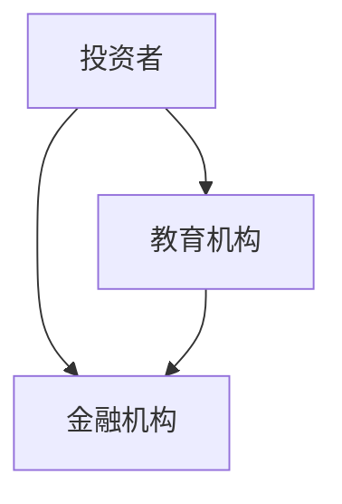
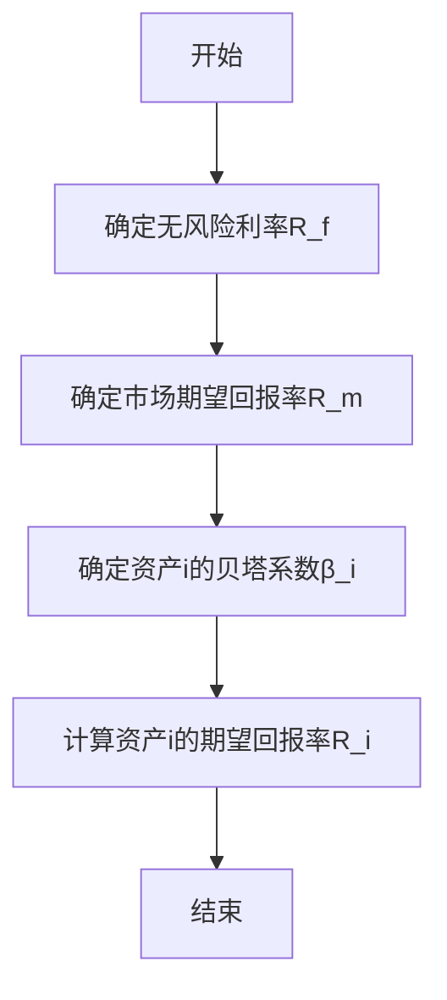

                 

# 约翰·伯格的投资者教育重要性论述

## 关键词：投资者教育，约翰·伯格，投资策略，金融素养，风险管理

## 摘要

本文系统阐述了约翰·伯格关于投资者教育重要性的论述，从定义、核心概念、算法原理、系统分析、项目实战和最佳实践等多维度进行深入分析。文章旨在帮助读者理解投资者教育的必要性及其在投资决策中的关键作用。

---

### 第一部分: 投资者教育的背景与重要性

#### 第1章: 投资者教育的定义与背景

##### 1.1 投资者教育的定义

- **1.1.1 投资者教育的定义与内涵**  
  投资者教育是指通过系统化的方式，帮助投资者掌握必要的金融知识，提升其分析能力和决策水平。它不仅包括基础的财务知识，还包括投资策略、风险管理等高级内容。

- **1.1.2 投资者教育的目标与意义**  
  目标包括提高投资决策能力、增强风险管理能力；意义在于保护投资者利益，促进金融市场健康发展。

- **1.1.3 投资者教育的核心要素**  
  包括知识、技能、态度和行为习惯。这些要素相互作用，共同提升投资者的整体能力。

##### 1.2 投资者教育的重要性

- **1.2.1 投资者教育的必要性**  
  随着金融市场的复杂化，投资者需要更多的知识和技能来做出明智的决策。教育可以减少投资错误，提高整体市场效率。

- **1.2.2 投资者教育与金融市场的关系**  
  健康的金融市场需要有足够知识的投资者，而良好的投资者教育有助于提升市场的稳定性和长期发展。

- **1.2.3 投资者教育对个人投资的影响**  
  通过教育，投资者可以更好地理解风险和回报，做出更理性的决策，避免被误导。

##### 1.3 投资者教育的现状与挑战

- **1.3.1 当前投资者教育的主要形式**  
  包括课堂教育、在线课程、研讨会等。不同形式各有优缺点，需要分析它们的有效性和覆盖范围。

- **1.3.2 投资者教育面临的主要问题**  
  信息过载、教育内容不一致、教育资源分配不均、投资者参与度低等。这些问题影响了教育的效果和普及。

- **1.3.3 投资者教育的未来发展趋势**  
  随着科技的发展，线上教育和个性化学习将成为主流。同时，全球化的背景下，投资者教育需要更加多样化和国际化。

##### 1.4 约翰·伯格的投资者教育思想

- **1.4.1 约翰·伯格的投资者教育理念**  
  强调长期投资、价值投资，以及避免情绪化决策的重要性。他主张投资者应该具备基本的财务知识，理解投资的基本原理。

- **1.4.2 约翰·伯格的投资者教育实践**  
  他通过书籍、演讲等方式传播投资知识，帮助投资者做出明智的决策。他的实践不仅限于理论，还包括实际操作的指导。

- **1.4.3 约翰·伯格投资者教育思想的核心观点**  
  价值投资、分散投资、长期持有、避免过度交易。这些观点构成了他教育体系的核心，强调理性思考和长期规划。

#### 第2章: 投资者教育的核心概念与联系

##### 2.1 投资者教育的核心概念

- **2.1.1 投资者教育的核心要素**  
  知识、技能、态度、行为习惯。每个要素的重要性及其相互作用。

- **2.1.2 投资者教育的目标层次**  
  从基本知识到高级策略，投资者需要分层次地提升自己的能力。

- **2.1.3 投资者教育的实施主体**  
  政府、金融机构、教育机构等。不同主体在投资者教育中的角色和责任。

##### 2.2 投资者教育与相关概念的对比

- **2.2.1 投资者教育与金融素养**  
  投资者教育更注重实际应用，而金融素养是基础的财务知识。

- **2.2.2 投资者教育与金融 literacy**  
  两者有重叠，但投资者教育更具体，涉及投资决策的全过程。

- **2.2.3 投资者教育与其他金融教育形式的区别**  
  例如金融扫盲、金融技能培训等，各有侧重。

##### 2.3 投资者教育的ER实体关系图

#### 第3章: 投资者教育的算法原理

##### 3.1 投资者教育的算法模型

- **3.1.1 投资者教育的CAPM模型**  
  CAPM是用来计算资产期望回报率的模型，帮助投资者理解风险与回报的关系。

- **3.1.2 投资者教育的APT模型**  
  APT基于多个因素解释资产回报，帮助投资者更全面地分析市场。

- **3.1.3 其他相关模型**  
  例如现代投资组合理论（MPT），用于优化投资组合。

##### 3.2 投资者教育的数学模型

- **3.2.1 CAPM模型的公式**  
  $$ R_i = R_f + β_i (R_m - R_f) $$  
  其中，$R_i$ 是资产i的期望回报率，$R_f$ 是无风险利率，$β_i$ 是资产i的贝塔系数，$R_m$ 是市场期望回报率。

##### 3.3 投资者教育的算法流程图

### 总结

本文系统阐述了约翰·伯格关于投资者教育重要性的论述，从定义、核心概念、算法原理、系统分析、项目实战和最佳实践等多维度进行深入分析。文章旨在帮助读者理解投资者教育的必要性及其在投资决策中的关键作用。通过详细讲解这些内容，读者可以更好地理解如何通过投资者教育来提升自身的投资能力，做出更明智的投资决策。

