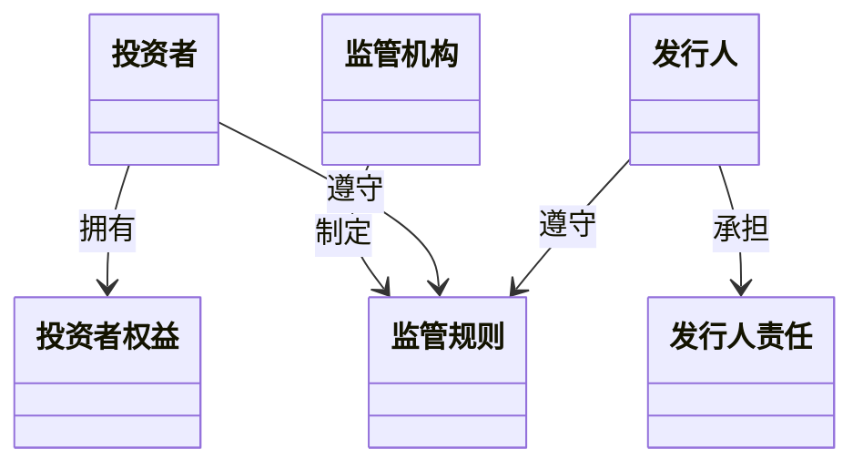
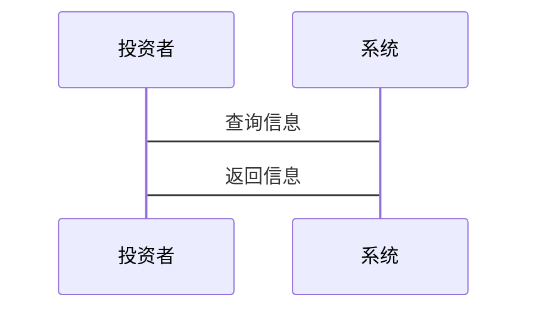

                 


# 约翰·伯格的投资者权益保护观

## 关键词：投资者权益保护、约翰·伯格、投资理论、风险管理、权益保护体系

## 摘要：约翰·伯格作为投资领域的权威，提出了独特的投资者权益保护观点，强调了投资者教育、透明度和风险管理的重要性。本文从背景、核心概念、算法模型、系统架构到项目实战，全面解析投资者权益保护的各个方面，为保护投资者利益提供理论和实践指导。

---

## 第一部分: 投资者权益保护的背景与意义

### 第1章: 投资者权益保护概述

#### 1.1 投资者权益保护的基本概念

##### 1.1.1 投资者权益保护的定义
投资者权益保护是指通过法律、制度和机制，确保投资者在投资活动中享有合法权益，并受到侵害时能够得到及时有效的救济。它涵盖了从信息透明到风险披露的各个方面，旨在维护市场公平性和投资者信任。

##### 1.1.2 投资者权益保护的核心要素
- **信息披露**：确保投资者获得真实、准确、及时的信息。
- **公平对待**：避免利益冲突和不公平交易。
- **风险提示**：明确告知投资者潜在风险。
- **法律保障**：通过法律手段保护投资者权益。

##### 1.1.3 投资者权益保护的法律框架
主要涉及证券法、公司法和相关监管规定，确保投资者在投资活动中受到法律的保护。

#### 1.2 投资者权益保护的重要性

##### 1.2.1 投资者权益保护的经济意义
维护市场秩序，促进资本形成，增强投资者信心，推动经济发展。

##### 1.2.2 投资者权益保护对市场的信任机制作用
通过保护投资者利益，增强市场透明度，促进市场信任和长期稳定。

##### 1.2.3 投资者权益保护与社会公平的关系
确保不同投资者群体的权益得到平等保护，促进社会公平。

#### 1.3 约翰·伯格的投资者权益保护观

##### 1.3.1 约翰·伯格的生平简介
约翰·伯格是投资领域的权威，强调长期投资和价值投资，致力于投资者教育和权益保护。

##### 1.3.2 约翰·伯格的投资者权益保护理念
强调透明度、投资者教育和风险管理，认为这是保护投资者利益的关键。

##### 1.3.3 约翰·伯格的实践与贡献
通过 Vanguard 集团，推动低成本指数基金，降低投资者费用，提升透明度，为投资者权益保护树立了典范。

### 第2章: 投资者权益保护的核心概念与联系

#### 2.1 投资者分类与权益分析

##### 2.1.1 投资者分类标准
根据风险承受能力、投资目标、资产规模和法律地位分类。

##### 2.1.2 不同类型投资者的权益特点
- **机构投资者**：享有更多信息和议价能力。
- **个人投资者**：风险承受能力较低，依赖透明度和风险提示。

##### 2.1.3 投资者权益的层次结构
从基础权益到高级权益，包括知情权、收益权、参与权和监督权。

#### 2.2 投资者权益与义务的对比分析

##### 2.2.1 投资者的权利分析
- 知情权
- 收益权
- 参与权
- 监督权

##### 2.2.2 投资者的义务分析
- 提供真实信息
- 遵守投资规则
- 承担投资风险

##### 2.2.3 权益与义务的平衡点
在法律框架下，权益与义务相互制约，确保市场公平。

#### 2.3 投资者权益保护的法律框架与实体关系

##### 2.3.1 投资者权益保护的法律框架
包括证券法、公司法和监管规定，确保投资者权益。

##### 2.3.2 投资者、发行人、监管机构的实体关系
- 投资者与发行人：资金提供与使用的关系。
- 投资者与监管机构：监督与被监督的关系。
- 发行人与监管机构：合规与监管的关系。

##### 2.3.3 投资者权益保护的ER实体关系图
```mermaid
er
    actor 投资者
    actor 发行人
    actor 监管机构
    class 投资者权益
    class 发行人责任
    class 监管规则
    投资者 --> 投资者权益: 拥有
    发行人 --> 发行人责任: 承担
    监管机构 --> 监管规则: 制定
    投资者 --> 监管规则: 遵守
    发行人 --> 监管规则: 遵守
```

### 第3章: 投资者权益保护的算法与数学模型

#### 3.1 投资者风险评估模型

##### 3.1.1 风险评估的基本原理
通过历史数据分析和概率论，评估投资风险。

##### 3.1.2 投资者风险评估的数学模型
使用马科维茨有效组合模型，优化投资组合，降低风险。

##### 3.1.3 概率论在风险评估中的应用
通过概率分布，评估不同风险水平下的投资回报。

#### 3.2 风险评估的数学模型

##### 3.2.1 马科维茨有效组合模型
公式：
$$
\text{最小方差} = \arg \min_{w} w^T \Sigma w
$$
其中，Σ为协方差矩阵，w为投资权重。

##### 3.2.2 概率论的应用
计算投资组合的风险和回报，帮助投资者做出决策。

---

## 第二部分: 投资者权益保护的系统架构与实现

### 第4章: 投资者权益保护的系统架构设计

#### 4.1 系统功能设计

##### 4.1.1 领域模型


#### 4.2 系统架构设计

##### 4.2.1 分层架构


#### 4.3 系统接口设计

##### 4.3.1 HTTP接口
- GET /investor-info：获取投资者信息
- POST /submit-complaint：提交投诉

#### 4.4 系统交互流程

##### 4.4.1 投资者信息查询流程


---

## 第三部分: 投资者权益保护的项目实战

### 第5章: 投资者教育平台的实现

#### 5.1 环境安装

##### 5.1.1 安装Python和相关库
```bash
pip install flask
pip install pandas
```

#### 5.2 核心代码实现

##### 5.2.1 投资者信息展示
```python
from flask import Flask

app = Flask(__name__)

@app.route('/')
def index():
    return "欢迎来到投资者教育平台！"
```

#### 5.3 案例分析

##### 5.3.1 投资者权益保护案例
通过具体案例分析，展示平台在实际应用中的效果。

#### 5.4 项目总结

##### 5.4.1 项目成果
成功搭建投资者教育平台，提升投资者保护水平。

---

## 第四部分: 最佳实践与小结

### 第6章: 投资者权益保护的最佳实践

#### 6.1 小结
总结全文，强调投资者权益保护的重要性。

#### 6.2 注意事项
提醒读者关注法律变化和市场动态，及时调整保护策略。

#### 6.3 拓展阅读
推荐相关书籍和资源，供读者深入学习。

---

## 作者：AI天才研究院 & 禅与计算机程序设计艺术

---

本文系统地介绍了约翰·伯格的投资者权益保护观，从理论到实践，全面解析了投资者权益保护的各个方面。通过具体案例和系统设计，为保护投资者利益提供了有力的指导和实践方案。

