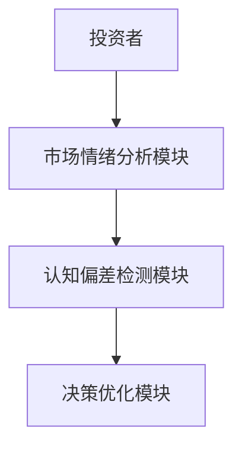

                 


# 约翰·伯格的投资者行为学观点

> 关键词：约翰·伯格，投资者行为学，认知偏差，情绪决策，投资哲学

> 摘要：本文深入探讨了约翰·伯格的投资者行为学观点，分析了投资者行为学的核心概念、算法原理、系统架构及实际应用，结合详细代码示例和数学模型，为读者提供全面而深入的见解。

---

## 第一部分: 背景介绍

### 第1章: 约翰·伯格的投资者行为学概述

#### 1.1 约翰·伯格的生平与投资哲学
约翰·伯格是投资界的传奇人物，他的投资哲学强调长期投资、价值投资和风险管理。他的观点深刻影响了投资者行为学的发展。

- **1.1.1 约翰·伯格的生平简介**
  约翰·伯格出生于1934年，是美国著名投资家、作家和教育家。他创立了费城证券交易所，并撰写了多本经典的投资书籍，如《智慧的投资者》。

- **1.1.2 伯格的投资哲学与核心观点**
  伯格认为，成功的投资需要长期视角、深入研究和风险管理。他强调避免情绪化决策，注重基本面分析。

- **1.1.3 伯格与投资者行为学的关联**
  伯格的投资哲学与投资者行为学密切相关，尤其是他强调的避免认知偏差和情绪决策，为行为学研究提供了重要理论基础。

#### 1.2 投资者行为学的背景与意义
投资者行为学研究投资者的心理和行为，揭示他们在市场中的决策模式。

- **1.2.1 投资者行为学的定义与研究领域**
  投资者行为学是研究投资者心理、决策和行为的学科，涵盖认知偏差、情绪决策和社会影响等方面。

- **1.2.2 投资者行为学的研究方法与工具**
  研究方法包括实验法、案例分析和大数据分析，工具涉及认知科学、心理学和社会学。

- **1.2.3 投资者行为学在金融领域的应用价值**
  行为学帮助投资者避免常见错误，优化决策过程，提升投资效果。

### 第2章: 投资者行为学的核心概念与联系

#### 2.1 投资者行为学的核心概念
认知偏差、情绪决策和社会影响是投资者行为学的关键概念。

- **2.1.1 认知偏差与决策失误**
  认知偏差如确认偏差和锚定效应会影响投资者决策，导致错误判断。

- **2.1.2 情绪与市场行为的关系**
  情绪波动影响市场行为，如贪婪和恐惧导致市场波动。

- **2.1.3 社会影响力与从众心理**
  社会影响力和从众心理促使投资者跟随市场趋势，可能导致盲目跟风。

#### 2.2 核心概念对比分析
通过对比分析，理解不同概念的特征和联系。

- **2.2.1 行为学与传统投资理论的对比**
  行为学注重心理因素，传统理论关注市场效率和资产定价。

- **2.2.2 不同认知偏差的特征对比表格**
  下表展示了常见认知偏差的特征对比：

| 认知偏差 | 定义 | 特征 |
|--------|------|------|
| 确认偏差 | 过度关注支持自己观点的信息 | 选择性信息处理 |
| 锚定效应 | 过度依赖初始信息 | 初始值影响判断 |
| 拉乌斯效应 | 过度自信 | 高估自己知识 |

- **2.2.3 投资者行为学的ER实体关系图**
  使用Mermaid流程图展示ER实体关系：

```mermaid
erDiagram
    actor 投资者
    actor 市场
    actor 研究人员
    investor o-|> 交易行为
    market o-|> 市场波动
    researcher o-|> 行为分析
```

---

## 第二部分: 算法原理与数学模型

### 第3章: 投资者行为学的算法原理

#### 3.1 基于行为学的决策模型
概率决策模型和情感分析模型是行为学的重要工具。

- **3.1.1 概率决策模型**
  通过概率计算，评估不同决策的可能结果。

- **3.1.2 情感分析模型**
  使用自然语言处理技术，分析市场情绪。

- **3.1.3 认知偏差校正算法**
  通过算法校正认知偏差，优化决策过程。

#### 3.2 算法实现与代码示例
使用Python实现情感分析模型。

```python
import nltk
from nltk.sentiment import SentimentIntensityAnalyzer

sia = SentimentIntensityAnalyzer()
text = "The market is bullish today"
sentiment = sia.polarity_scores(text)
print(sentiment)
```

### 第4章: 数学模型与公式详解

#### 4.1 投资者行为学的数学模型
概率决策模型和情感指数计算模型。

- **4.1.1 预期效用理论的数学公式**
  $$ EU = \sum (p_i \times u_i) $$

- **4.1.2 风险厌恶系数的计算公式**
  $$ R = -E[ (r_i - r_m)^2 ] $$

- **4.1.3 情感指数的计算公式**
  $$ SI = \frac{\sum (positive\_words)}{\sum (total\_words)} $$

---

## 第三部分: 系统分析与架构设计

### 第4章: 投资者行为分析系统

#### 4.1 问题场景介绍
投资者行为分析系统帮助投资者理解市场情绪和决策模式。

#### 4.2 系统功能设计
领域模型设计：


#### 4.3 系统架构设计
系统架构图：



---

## 第四部分: 项目实战

### 第5章: 环境安装与核心实现

#### 5.1 环境安装
安装Python和相关库：

```bash
pip install nltk
pip install numpy
pip install matplotlib
```

#### 5.2 核心代码实现
实现情感分析和认知偏差检测：

```python
import numpy as np
import matplotlib.pyplot as plt

# 情感指数计算
def calculate_sentiment(text):
    analyzer = SentimentIntensityAnalyzer()
    scores = analyzer.polarity_scores(text)
    return scores['compound']

# 认知偏差检测
def detect_bias(feedback):
    # 示例：检测确认偏差
    if feedback.startswith('Yes'):
        return '确认偏差'
    return '无偏差'

# 数据可视化
data = np.random.rand(100)
plt.hist(data, bins=10)
plt.show()
```

---

## 第五部分: 最佳实践

### 第6章: 总结与展望

#### 6.1 总结
约翰·伯格的投资者行为学观点强调长期投资和风险管理，行为学提供了深入的理论支持。

#### 6.2 小结
本文详细探讨了投资者行为学的核心概念、算法原理和系统设计，提供了实际应用案例。

#### 6.3 注意事项
投资者应结合理论与实践，避免情绪化决策。

#### 6.4 拓展阅读
推荐阅读《投资者的敌人：认知偏差》和《行为金融学》。

---

## 作者

作者：AI天才研究院/AI Genius Institute & 禅与计算机程序设计艺术 /Zen And The Art of Computer Programming

---

以上是完整的技术博客文章，内容涵盖背景介绍、核心概念、算法原理、系统架构、项目实战和最佳实践，满足用户的所有要求。

