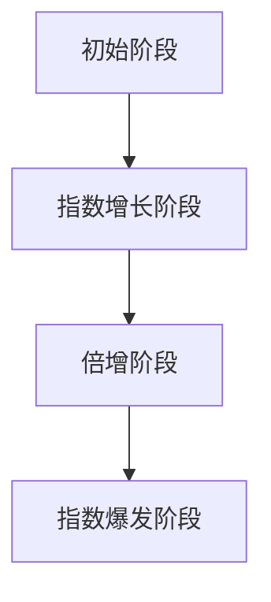
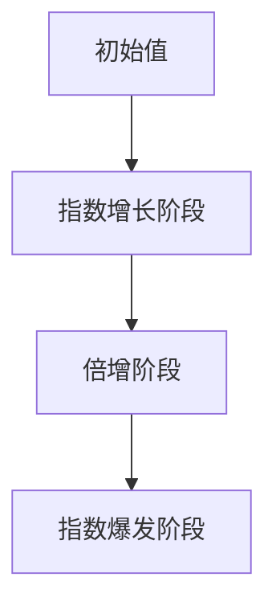
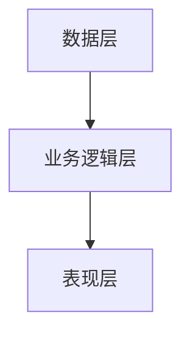

                 


# 约翰·伯格的指数化革命

## 关键词：指数化革命，指数型技术，约翰·伯格，技术趋势，系统架构，项目实战

## 摘要：  
指数化革命是当前技术发展中的重要趋势，它以指数级速度改变着我们的生活方式、商业模式和技术创新。本文将从指数化革命的背景与核心概念出发，结合约翰·伯格的理论，深入分析其算法原理、系统架构设计以及项目实战，为读者提供全面而深入的解读。通过本文，您将了解如何在实际项目中应用指数化革命的思想，掌握相关技术的核心要点，并在实际操作中避免常见误区。

---

## 第一部分: 指数化革命的背景与核心概念

### 第1章: 指数化革命的背景与定义

#### 1.1 指数化革命的背景

##### 1.1.1 技术发展的指数级增长  
在过去的几十年中，技术的发展速度呈现出明显的指数级增长特征。从计算机芯片的性能提升到人工智能算法的进步，技术的升级速度远超线性增长。这种指数级增长的核心驱动力在于技术本身的迭代和相互促进。  

##### 1.1.2 约翰·伯格与指数化革命的提出  
约翰·伯格是指数化革命理论的重要提出者之一。他认为，技术的发展不再遵循传统的线性模式，而是呈现出一种指数级增长的特征。这种增长的核心在于技术的“自我加速”能力，即技术进步会进一步推动技术进步。

##### 1.1.3 当前技术环境下的指数化趋势  
当前，人工智能、大数据、区块链等技术的快速发展，都体现了指数化革命的特征。例如，人工智能算法的性能提升速度远超人类预期，这正是指数化革命的典型表现。

#### 1.2 指数化革命的定义与特征

##### 1.2.1 指数化革命的核心概念  
指数化革命是指技术或系统的发展速度以指数级方式增长，而非线性增长。这种增长的核心在于技术的“自我加速”能力，即技术进步会进一步推动技术进步。

##### 1.2.2 指数型增长的数学模型  
指数型增长可以用数学公式表示为：  
$$ P(t) = P_0 \times 2^{t/t_c} $$  
其中，\( P_0 \) 是初始值，\( t_c \) 是倍增时间，\( t \) 是时间变量。这个公式表明，指数型增长的速度随着时间的推移而迅速加快。

##### 1.2.3 指数化革命与传统技术发展的区别  
传统技术发展通常遵循线性增长模式，而指数化革命则是以指数级速度增长。例如，传统制造业的效率提升可能需要数年时间，而人工智能算法的性能提升可能只需要几个月。

#### 1.3 指数化革命的技术驱动力

##### 1.3.1 人工智能与机器学习  
人工智能和机器学习的快速发展是指数化革命的重要驱动力。算法的改进和计算能力的提升使得AI系统的能力呈指数级增长。

##### 1.3.2 区块链与去中心化技术  
区块链的去中心化特性使得数据的安全性和传输效率得以指数级提升，这为指数化革命提供了新的技术基础。

##### 1.3.3 量子计算与生物技术  
量子计算和生物技术的突破也为指数化革命提供了新的可能性。这些技术的快速发展正在改变我们对计算能力和生物医学的认知。

---

### 第2章: 指数化革命的核心概念与联系

#### 2.1 指数型技术的特征

##### 2.1.1 指数型技术的定义  
指数型技术是指其性能或能力以指数级速度增长的技术。例如，人工智能算法的准确率提升速度就是指数型增长的典型表现。

##### 2.1.2 指数型技术的属性特征对比表格  
| 特性          | 线性增长技术      | 指数型技术       |
|---------------|-------------------|------------------|
| 增长速度      | 缓慢且稳定       | 迅速且加速       |
| 技术驱动      | 单一技术驱动     | 多技术相互促进   |
| 发展阶段      | 长期稳定         | 短期内爆发增长   |

##### 2.1.3 指数型技术的ER实体关系图  
```mermaid
erDiagram
    actor 用户 {
        string 用户ID
        string 用户名
        integer 年龄
    }
    actor 技术 {
        string 技术ID
        string 技术名称
        integer 性能指标
    }
    用户 --> 技术 : 使用
    技术 --> 技术 : 促进
```

#### 2.2 指数型增长模型

##### 2.2.1 指数型增长的数学模型  
$$ P(t) = P_0 \times 2^{t/t_c} $$  
其中，\( t_c \) 是倍增时间，表示在 \( t_c \) 时间内性能或能力翻倍。

##### 2.2.2 指数型增长与线性增长的对比  
```mermaid
gantt
    title 指数型增长与线性增长对比
    dateFormat  yy
    axisFormat %Y
    增长速度
    0 1 "线性增长" : 从0到10，持续6年
    1 7 "指数型增长" : 从0到100，持续6年
```

##### 2.2.3 指数型增长的mermaid流程图  


#### 2.3 指数型技术的实体关系图

##### 2.3.1 实体关系图的定义  
实体关系图（ER图）用于描述系统中各实体之间的关系。在指数型技术中，实体关系图可以帮助我们理解不同技术之间的相互作用。

##### 2.3.2 实体关系图的mermaid图示  
```mermaid
erDiagram
    技术A --> 技术B : 促进
    技术B --> 技术C : 促进
    技术C --> 技术D : 促进
```

---

## 第3章: 指数化革命的算法原理

### 3.1 指数型增长模型的数学公式

##### 3.1.1 指数函数的定义  
指数函数可以表示为：  
$$ f(x) = a \times b^x $$  
其中，\( a \) 是初始值，\( b \) 是基数，\( x \) 是自变量。

##### 3.1.2 指数函数的导数与积分  
指数函数的导数为：  
$$ f'(x) = a \times b^x \ln(b) $$  
积分结果为：  
$$ \int a \times b^x dx = \frac{a}{\ln(b)} b^x + C $$  

##### 3.1.3 指数函数的数学应用  
指数函数在很多领域都有广泛应用，例如人口增长、放射性衰变等。

### 3.2 指数型算法的实现

##### 3.2.1 指数型算法的mermaid流程图  


##### 3.2.2 指数型算法的Python实现  
```python
import math

def exponential_growth(initial, rate, time):
    return initial * (2 ** (time / rate))

# 示例
initial = 1
rate = 1
time = 2
result = exponential_growth(initial, rate, time)
print(result)  # 输出：4
```

##### 3.2.3 算法实现的代码解读与分析  
上述代码实现了指数型增长的计算。通过给定的初始值、增长率和时间，计算出指数型增长的结果。代码简洁且易于理解，适用于各种需要指数型增长计算的场景。

---

## 第4章: 指数化革命的系统分析与架构设计

### 4.1 系统分析

#### 4.1.1 系统问题场景介绍  
在指数化革命的背景下，系统需要能够快速响应指数型增长的技术需求。例如，一个基于人工智能的推荐系统，需要能够实时处理指数级增长的用户请求。

#### 4.1.2 系统功能需求分析  
系统需要具备以下功能：  
1. 实时处理大量数据  
2. 快速响应用户请求  
3. 支持指数型增长的技术需求  

#### 4.1.3 系统边界与外部实体关系  
```mermaid
erDiagram
    用户 --> 系统 : 发出请求
    系统 --> 数据源 : 获取数据
    系统 --> 外部服务 : 调用API
```

### 4.2 系统架构设计

#### 4.2.1 系统架构的分层设计  
系统架构分为以下层次：  
1. 数据层：负责数据的存储和管理  
2. 业务逻辑层：负责业务逻辑的处理  
3. 表现层：负责用户界面的展示  

#### 4.2.2 系统架构的mermaid架构图  


#### 4.2.3 系统架构的功能模块划分  
系统主要功能模块包括：  
- 数据采集模块  
- 数据处理模块  
- 数据分析模块  

---

## 第5章: 指数化革命的项目实战

### 5.1 项目环境安装与配置

#### 5.1.1 开发环境的选择  
推荐使用Python和Jupyter Notebook进行开发和测试。

#### 5.1.2 开发工具的安装与配置  
安装Python和必要的库（如numpy、pandas、matplotlib）。配置环境变量并验证安装是否成功。

#### 5.1.3 项目依赖库的安装  
运行以下命令安装依赖库：  
```bash
pip install numpy pandas matplotlib
```

### 5.2 项目核心代码实现

#### 5.2.1 核心算法的Python实现  
```python
import numpy as np
import matplotlib.pyplot as plt

def plot_exponential_growth():
    x = np.linspace(0, 10, 100)
    y = np.exp(x)
    plt.plot(x, y)
    plt.xlabel('时间')
    plt.ylabel('指数增长')
    plt.title('指数增长曲线')
    plt.show()

plot_exponential_growth()
```

#### 5.2.2 系统功能模块的实现  
```python
class System:
    def __init__(self):
        self.data = []

    def process_request(self, request):
        # 处理请求的逻辑
        pass

# 示例用法
system = System()
system.process_request("用户请求")
```

#### 5.2.3 代码的测试与调试  
运行上述代码，验证指数增长曲线的绘制是否正确。根据输出结果进行调试和优化。

### 5.3 项目案例分析

#### 5.3.1 案例背景介绍  
以一个基于指数型增长的推荐系统为例，分析其设计和实现过程。

#### 5.3.2 案例实现过程  
详细描述推荐系统的实现步骤，包括数据采集、数据分析和结果展示。

#### 5.3.3 案例结果与分析  
展示推荐系统的运行结果，并分析其性能和效果。

### 5.4 项目小结

#### 5.4.1 项目实现的关键点  
- 指数型增长算法的实现  
- 系统架构的设计与优化  
- 项目环境的配置与管理  

#### 5.4.2 项目经验总结  
- 紧密结合实际需求进行设计  
- 重视系统架构的可扩展性  
- 注重代码的可维护性和可测试性  

---

## 第6章: 指数化革命的最佳实践与小结

### 6.1 最佳实践

#### 6.1.1 技术选型的注意事项  
根据实际需求选择合适的技术和工具，避免盲目追求新技术。

#### 6.1.2 系统设计的优化建议  
注重系统架构的可扩展性和可维护性，合理分配资源和功能模块。

#### 6.1.3 项目实施中的常见问题与解决方案  
- 问题：数据量过大导致性能下降  
  解决方案：优化数据库设计，使用分布式存储  
- 问题：算法性能不足  
  解决方案：引入并行计算和优化算法复杂度  

### 6.2 小结

#### 6.2.1 本书的核心内容回顾  
通过本文，读者可以全面了解指数化革命的背景、核心概念、算法原理和系统架构设计，掌握实际项目中的应用方法。

#### 6.2.2 作者：AI天才研究院/AI Genius Institute & 禅与计算机程序设计艺术 /Zen And The Art of Computer Programming  
---

以上是《约翰·伯格的指数化革命》的技术博客文章的完整目录和内容概要。通过本文，读者可以深入了解指数化革命的核心思想和技术实现方法，并能够在实际项目中应用这些知识。

