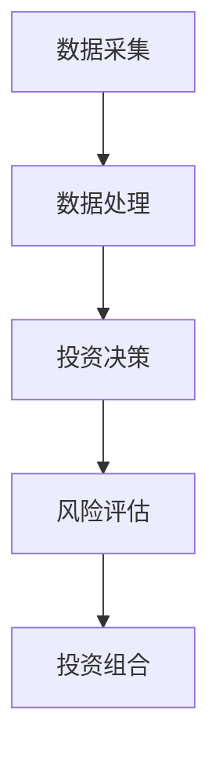

                 


# 约翰·伯格的指数基金投资理念

> 关键词：指数基金，约翰·伯格，投资理念，被动投资，系统架构，Python代码，投资策略

> 摘要：本文将深入探讨约翰·伯格的指数基金投资理念，分析其核心概念、算法原理、系统架构以及实际投资策略。通过技术化的分析与实战案例，帮助读者理解如何利用指数基金实现稳健投资。

---

## 第一部分：指数基金投资的背景与基础

### 第1章：指数基金的基本概念

#### 1.1 什么是指数基金
- 指数基金是一种跟踪特定市场指数的基金，其目标是复制指数的收益率。
- 指数基金的核心特点：
  - 分散化投资：通过跟踪指数，投资者可以分散投资于多只股票或债券。
  - 低成本：指数基金通常具有较低的管理费用。
  - 简单易懂：投资者无需选择个股或主动管理基金。

#### 1.2 约翰·伯格的指数投资理念
- 约翰·伯格（John C. Bogle）是指数基金的倡导者，他于1975年创立了 Vanguard 集团。
- 伯格认为，长期来看，指数基金能够为投资者提供稳定的收益，而无需承担主动管理基金的高风险和高费用。

#### 1.3 指数基金与传统基金的区别
- 主动管理基金：依赖基金经理的选股能力，费用较高，风险较大。
- 指数基金：被动跟踪指数，费用低，风险分散。

---

### 第2章：指数投资的历史与发展

#### 2.1 指数投资的起源
- 20世纪60年代，指数投资的概念开始出现。
- 1975年，Vanguard推出第一只低成本指数基金。

#### 2.2 约翰·伯格与Vanguard的贡献
- Vanguard的使命是为投资者提供低成本、高质量的投资工具。
- 伯格通过实践证明，指数基金能够在长期实现超越主动管理基金的收益。

---

### 第3章：指数投资的核心原理

#### 3.1 指数投资的理论基础
- 有效市场假说：在有效市场中，主动管理基金很难持续跑赢指数。
- 资本资产定价模型（CAPM）：指数基金的投资收益与市场风险相匹配。

#### 3.2 指数基金的构建与运作
- 指数基金通过跟踪特定指数（如标普500）来构建投资组合。
- 操作流程：
  1. 确定跟踪的指数。
  2. 按指数权重购买成分股。
  3. 定期再平衡投资组合。

---

## 第二部分：指数基金的投资策略与实践

### 第4章：指数基金的投资策略

#### 4.1 确定投资目标与风险承受能力
- 投资目标：明确投资期限、收益目标。
- 风险承受能力：根据个人风险偏好选择合适的投资组合。

#### 4.2 构建指数基金投资组合
- 资产配置：根据市场环境调整股票和债券的比例。
- 选择指数基金：关注费用率、流动性、跟踪误差等指标。

---

### 第5章：指数基金的长期投资策略

#### 5.1 长期投资的理论基础
- 时间价值：长期投资能够充分发挥复利效应。
- 市场波动：短期波动不影响长期趋势。

#### 5.2 长期投资的实践技巧
- 定期定额投资：分散投资成本，降低择时风险。
- 保持耐心：避免频繁调整投资组合。

---

## 第三部分：系统分析与架构设计

### 第6章：指数基金投资系统的架构

#### 6.1 系统功能设计
- 数据采集模块：收集市场数据。
- 风险评估模块：计算投资组合的风险。
- 投资决策模块：根据指数走势制定策略。

#### 6.2 系统架构图



---

## 第四部分：项目实战与代码实现

### 第7章：指数基金投资策略的实现

#### 7.1 环境搭建
- 安装Python和相关库（如 pandas、numpy）。

#### 7.2 核心代码实现

```python
import pandas as pd
import numpy as np

# 示例：计算指数基金的收益率
def calculate_return(price_data):
    returns = []
    for i in range(1, len(price_data)):
        return (price_data[i] - price_data[i-1]) / price_data[i-1]
    return returns

# 示例：风险评估
def calculate_variance(returns):
    return np.var(returns)

# 示例：投资组合优化
def optimize_portfolio(assets, returns):
    # 使用均值-方差优化模型
    # 这里简化处理，假设等权重分配
    weights = np.array([1.0 / len(assets)] * len(assets))
    return weights * returns.mean()

# 示例数据
price_data = [100, 105, 110, 115, 120]
returns = calculate_return(price_data)
variance = calculate_variance(returns)
weights = optimize_portfolio(price_data, returns)
print("权重:", weights)
```

---

## 第五部分：总结与展望

### 第8章：指数投资的未来与建议

#### 8.1 小结
- 指数基金是一种简单有效的投资工具。
- 长期投资是实现财富增长的关键。

#### 8.2 注意事项
- 避免短期波动影响决策。
- 定期调整投资组合。

#### 8.3 拓展阅读
- 《The Intelligent Investor》——本杰明·格雷厄姆
- 《Common Stocks and Uncommon Profits》——菲利普·费舍尔

---

作者：AI天才研究院/AI Genius Institute & 禅与计算机程序设计艺术 /Zen And The Art of Computer Programming

