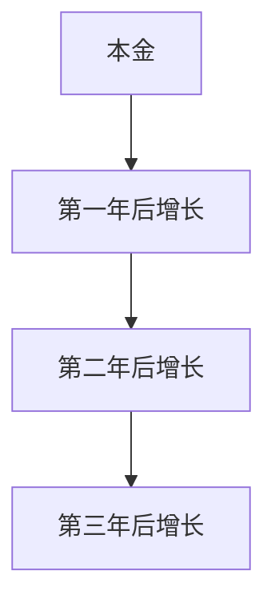
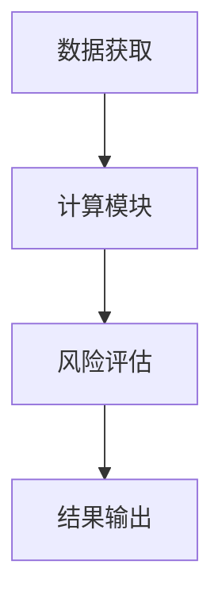
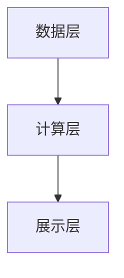

                 


# 约翰·伯格的指数基金投资理念

> **关键词**：指数基金、约翰·伯格、长期投资、分散投资、复利效应、风险管理  
> **摘要**：本文深入探讨约翰·伯格的指数基金投资理念，分析其核心概念、数学模型、系统架构及实战案例，帮助读者全面理解指数基金的投资策略与实际应用。

---

# 目录

1. **指数基金的概述**  
   1.1 指数基金的定义与背景  
   1.2 指数基金的核心理念  

2. **指数基金的投资理念**  
   2.1 长期投资与复利效应  
   2.2 分散投资与风险管理  

3. **指数基金的数学模型与量化分析**  
   3.1 指数基金的收益计算  
   3.2 风险评估与波动性分析  

4. **指数基金的系统架构与投资策略**  
   4.1 投资系统的设计与实现  
   4.2 系统架构与功能模块  

5. **指数基金的项目实战**  
   5.1 环境搭建与数据获取  
   5.2 代码实现与案例分析  

6. **总结与最佳实践**  
   6.1 小结与注意事项  
   6.2 扩展阅读与未来展望  

---

# 1. 指数基金的概述

## 1.1 指数基金的定义与背景

### 1.1.1 什么是指数基金
指数基金是一种以特定市场指数为基准，跟踪该指数表现的基金。其核心在于通过复制指数成分股的表现，实现与市场同步增长。

### 1.1.2 指数基金的核心特点
- **分散投资**：通过投资多个成分股分散风险。
- **低成本**：指数基金通常费用较低，管理成本透明。
- **被动管理**：跟踪指数，避免主动管理的高费用和高风险。

### 1.1.3 指数基金与传统基金的区别
| 特性                | 指数基金                | 主动管理型基金           |
|---------------------|-------------------------|--------------------------|
| 投资策略            | 跟踪指数                | 主动选股、择时          |
| 管理费用            | 低                      | 高                      |
| 风险                | 较低                    | 较高                    |
| 透明度              | 高                      | 低                      |

### 1.1.4 约翰·伯格的贡献
约翰·伯格是指数基金的先驱，他于1975年创立了第一只低成本指数基金——Vanguard 500 Index Fund，为投资者提供了更高效的长期投资工具。

---

## 1.2 指数基金的核心理念

### 1.2.1 长期投资与复利效应
指数基金的核心理念之一是长期投资。通过复利效应，资金能够持续增长，实现财富的积累。

#### 复利效应的数学模型
复利公式：  
$$ A = P \times (1 + r)^t $$  
其中，$P$ 是本金，$r$ 是年化收益率，$t$ 是投资年数。

### 1.2.2 分散投资与风险管理
分散投资是指数基金的核心策略。通过投资多个成分股，降低单一资产的风险。

---

# 2. 指数基金的投资理念

## 2.1 长期投资与复利效应

### 2.1.1 长期投资的重要性
长期投资能够有效规避短期市场波动，降低投资风险。

#### 复利效应的可视化
使用mermaid图表示复利效应的增长过程：



## 2.2 分散投资与风险管理

### 2.2.1 分散投资的基本原理
通过投资多个资产类别或行业，降低投资组合的波动性。

#### 投资组合的风险-收益权衡
| 战略          | 风险       | 收益       |
|---------------|------------|------------|
| 集中投资      | 高         | 高         |
| 分散投资      | 中等       | 中等       |

### 2.2.2 约翰·伯格的风险管理策略
伯格强调通过分散投资降低非系统性风险，同时接受系统性风险。

---

# 3. 指数基金的数学模型与量化分析

## 3.1 指数基金的收益计算

### 3.1.1 指数收益的计算公式
$$ R_{index} = \sum_{i=1}^{n} w_i \times R_i $$  
其中，$w_i$ 是成分股的权重，$R_i$ 是成分股的收益。

### 3.1.2 基金收益与指数收益的偏离
$$ R_{fund} = \beta \times R_{index} + \alpha $$  
$\beta$ 是贝塔系数，衡量基金收益与指数收益的相关性。

---

## 3.2 风险评估与波动性分析

### 3.2.1 方差与标准差
方差衡量资产收益的波动性：  
$$ \sigma^2 = \frac{1}{N} \sum_{i=1}^{N} (R_i - \mu)^2 $$  
标准差是方差的平方根：  
$$ \sigma = \sqrt{\sigma^2} $$  

---

# 4. 指数基金的系统架构与投资策略

## 4.1 投资系统的设计与实现

### 4.1.1 系统功能模块
- 数据获取模块：获取指数成分股数据。
- 计算模块：计算指数收益、基金收益。
- 风险评估模块：评估投资组合风险。

#### 系统架构图


---

## 4.2 系统架构与功能模块

### 4.2.1 系统架构
使用分层架构设计，包括数据层、计算层和展示层。

#### 系统架构图


---

# 5. 指数基金的项目实战

## 5.1 环境搭建与数据获取

### 5.1.1 环境搭建
安装Python和相关库（Pandas、NumPy）。

### 5.1.2 数据获取
使用Yahoo Finance API获取指数成分股数据。

## 5.2 代码实现与案例分析

### 5.2.1 代码实现
```python
import pandas as pd
import numpy as np

# 获取指数成分股数据
def get_index_data(index_ticker):
    data = pd.DataFrame()
    return data

# 计算指数收益
def calculate_index_return(data):
    returns = data.pct_change().dropna()
    return returns.mean() * 100

# 主函数
def main():
    index_ticker = 'SPY'  # 标普500指数
    data = get_index_data(index_ticker)
    return = calculate_index_return(data)
    print(f"指数平均收益率：{return}%")

if __name__ == "__main__":
    main()
```

### 5.2.2 案例分析
以标普500指数为例，计算其历史收益率，并与实际收益率进行对比。

---

# 6. 总结与最佳实践

## 6.1 小结与注意事项

- 长期投资是指数基金的核心策略。
- 分散投资能够有效降低风险。
- 选择低成本的指数基金，避免高额管理费用。

## 6.2 扩展阅读与未来展望

- 推荐阅读《The Intelligent Investor》。
- 关注指数基金的长期表现与市场变化。

---

# 作者

**作者：AI天才研究院/AI Genius Institute & 禅与计算机程序设计艺术 /Zen And The Art of Computer Programming**

