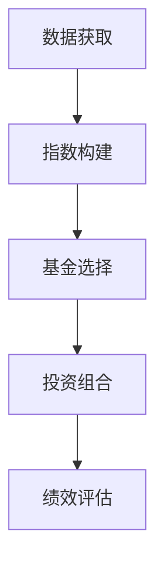
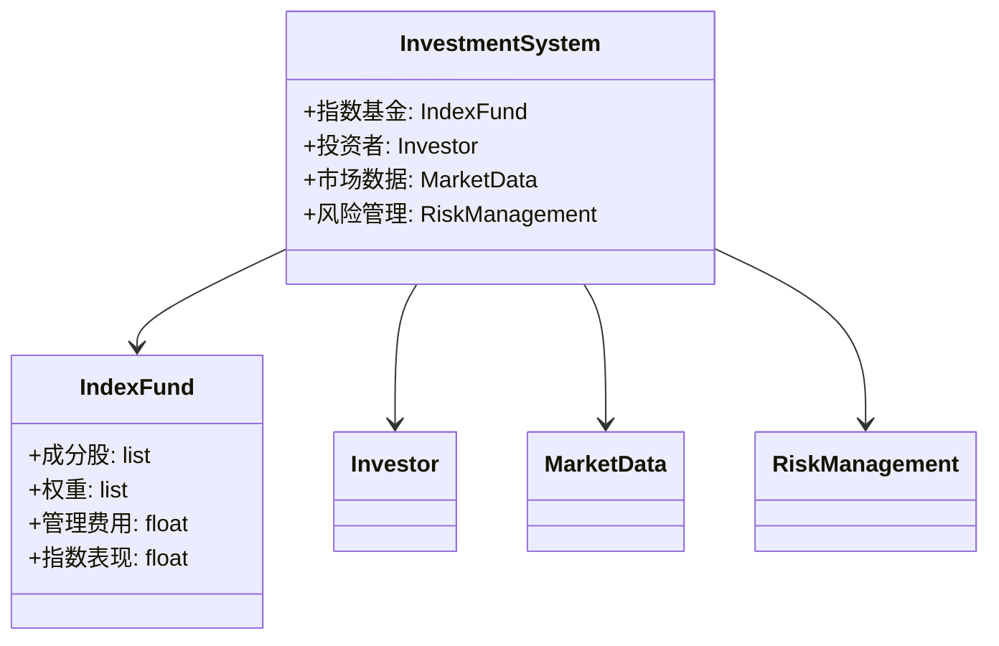

                 


# 约翰·伯格的指数基金投资理论

## 关键词
指数基金、约翰·伯格、被动投资、投资理论、金融数学

## 摘要
本文深入探讨了约翰·伯格提出的指数基金投资理论，分析了其核心概念、数学模型、系统架构以及实际应用。通过背景介绍、核心概念对比、数学公式推导、系统设计、项目实战和最佳实践等多维度的分析，全面揭示了指数基金的运作原理及其在现代投资中的重要地位。本文旨在为读者提供一个清晰、系统的理解框架，帮助他们在投资领域中做出明智决策。

---

## 第一部分：指数基金投资理论的背景与基础

### 第1章：指数基金的起源与发展

#### 1.1 指数基金的起源
- 1.1.1 金融市场的演变与投资需求
    - 20世纪初，金融市场的波动性增加，投资者开始寻求更稳定的收益方式。
    - 1929年经济大萧条后，机构投资者逐渐兴起，推动了被动投资的需求。
- 1.1.2 约翰·伯格的贡献与指数基金的诞生
    - 约翰·伯格于1975年创立了先锋集团（Vanguard），推出全球首个完全复制标准普尔500指数的共同基金。
    - 指数基金的出现标志着被动投资时代的到来。

#### 1.2 指数基金的定义与核心概念
- 1.2.1 指数基金的定义
    - 指数基金是一种被动管理型基金，旨在跟踪特定市场指数的表现。
- 1.2.2 指数基金的核心要素
    - 跟踪指数：选择一个具有代表性的市场指数（如标普500、道琼斯指数等）。
    - 分散投资：通过持有指数中的所有成分股来降低风险。
    - 低成本：通过被动管理降低管理费用和交易成本。
- 1.2.3 指数基金的边界与外延
    - 边界：严格复制指数，避免主动调整。
    - 外延：包括不同市场、行业、资产类别的指数基金。

#### 1.3 指数基金与主动管理的对比
- 1.3.1 主动管理的定义与特点
    - 主动管理：基金经理通过精选个股或行业进行主动操作，追求超越市场的收益。
    - 高成本：管理费用较高，通常为1%~2%。
    - 风险：高波动性，依赖基金经理的能力。
- 1.3.2 指数基金与主动管理的优劣势对比
    | 特性             | 指数基金                 | 主动管理                 |
    |------------------|--------------------------|--------------------------|
    | 成本             | 低成本                   | 高成本                   |
    | 风险             | 低风险                   | 高风险                   |
    | 收益             | 稳定收益                 | 不稳定收益               |
    | 管理方式         | 被动跟踪                 | 主动操作                 |
- 1.3.3 指数基金的优势与适用场景
    - 优势：分散风险、低成本、长期稳定收益。
    - 适用场景：长期投资、风险厌恶型投资者、缺乏专业投资能力的个人。

---

## 第二部分：指数基金的核心概念与数学模型

### 第2章：指数基金的核心概念与原理

#### 2.1 指数基金的核心概念
- 2.1.1 指数基金的构建原理
    - 通过复制指数成分股的权重，确保基金的表现与指数一致。
- 2.1.2 指数基金的复制误差
    - 由于交易成本、税收等因素，基金的实际表现可能略低于指数表现。
- 2.1.3 指数基金的费用结构
    - 管理费用（ER，expense ratio）：通常在0.1%~0.5%之间。

#### 2.2 指数基金的数学模型
- 2.2.1 指数基金的收益计算
    - 总回报公式：
    $$ R_{\text{total}} = R_{\text{index}} - (1 - R_{\text{index}}) \times R_{\text{fee}} $$
    - 其中，$R_{\text{index}}$为指数收益，$R_{\text{fee}}$为管理费用。
- 2.2.2 指数基金的风险模型
    - 风险由市场波动性决定，与指数的风险一致。
    - 风险计算公式：
    $$ \text{Volatility} = \sqrt{\sum_{i=1}^{n} w_i^2 \sigma_i^2} $$
    - 其中，$w_i$为成分股权重，$\sigma_i$为成分股波动性。

### 第3章：指数基金的数学模型与公式

#### 3.1 指数基金的收益计算
- 3.1.1 指数基金的收益公式
    - 以标普500指数为例，假设指数年收益为8%，管理费用为0.2%：
    $$ R_{\text{fund}} = 8\% - 0.2\% = 7.8\% $$
- 3.1.2 指数基金的总回报计算
    - 总回报包括资本收益和分红再投资。

#### 3.2 指数基金的风险分析
- 3.2.1 风险的定义与衡量指标
    - 风险是指资产收益的波动性，通常用标准差衡量。
- 3.2.2 指数基金的风险模型
    - 与跟踪指数的风险一致，无额外风险敞口。

#### 3.3 指数基金的费用比率（ER）
- 3.3.1 费用比率的计算公式
    - 管理费用、托管费用、运营费用的总和。
- 3.3.2 费用比率对收益的影响
    - 长期来看，费用比率的差异会导致收益差距显著扩大。

---

## 第三部分：指数基金的系统分析与架构设计

### 第4章：指数基金的投资系统架构

#### 4.1 投资系统的核心模块
- 4.1.1 数据获取与处理模块
    - 获取指数成分股的历史数据，清洗和整理数据。
- 4.1.2 指数构建与跟踪模块
    - 计算成分股权重，构建指数组合。
- 4.1.3 基金选择与配置模块
    - 根据指数权重选择基金，进行动态再平衡。

#### 4.2 系统架构的Mermaid图


#### 4.3 系统功能设计
- 领域模型（Mermaid类图）


---

## 第四部分：指数基金的项目实战

### 第5章：指数基金的实战应用

#### 5.1 项目背景与目标
- 选择标普500指数作为跟踪目标，构建一个简单的指数基金投资组合。

#### 5.2 项目实施步骤
- 5.2.1 数据获取：使用Yahoo Finance获取标普500成分股的历史数据。
- 5.2.2 指数构建：计算每只股票的权重，构建指数组合。
- 5.2.3 基金选择：选择跟踪标普500的指数基金。
- 5.2.4 绩效评估：计算基金的收益与风险。

#### 5.3 代码实现
```python
import pandas as pd
import yfinance as yf

# 下载标普500成分股数据
tickers = ['AAPL', 'MSFT', 'GOOGL', 'AMZN', 'FB']
data = yf.download(tickers, start='2020-01-01', end='2023-12-31')

# 计算每只股票的权重
close_prices = data['Adj Close'].iloc[-1]
weights = close_prices / close_prices.sum()

# 构建指数组合
index_return = (data['Adj Close'].pct_change().mean() * weights).sum()
```

#### 5.4 实际案例分析
- 以2020年为例，假设投资1000美元，每年定期定额投资，计算基金的总收益和风险。

---

## 第五部分：指数基金的最佳实践

### 第6章：指数基金的优化与风险管理

#### 6.1 风险管理
- 分散投资：通过持有多个指数基金降低风险。
- 定期再平衡：每年调整投资组合，确保与指数一致。

#### 6.2 长期投资
- 长期持有指数基金，避免频繁交易。

#### 6.3 定投策略
- 定期定额投资，分散投资风险。

#### 6.4 费用控制
- 选择低费用比率的指数基金。

#### 6.5 税务优化
- 利用税收优惠政策降低税务负担。

---

## 结语

约翰·伯格的指数基金投资理论为现代投资提供了重要的理论基础和实践指导。通过被动投资、分散风险和低成本管理，指数基金为投资者提供了稳定可靠的收益。在实际应用中，投资者需要结合自身需求和市场环境，合理配置指数基金，实现长期稳健的投资回报。

---

## 作者：AI天才研究院/AI Genius Institute & 禅与计算机程序设计艺术 /Zen And The Art of Computer Programming

