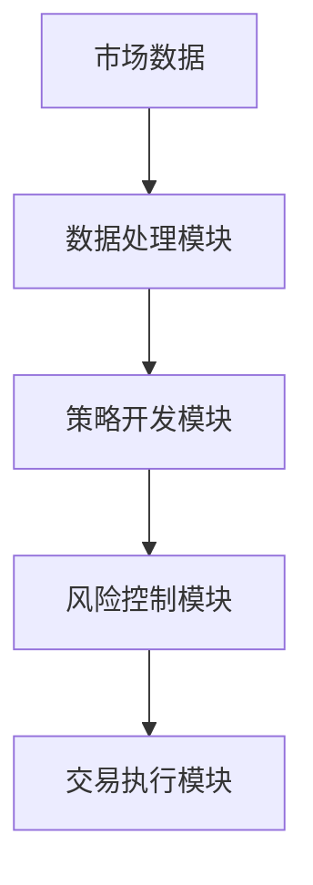

                 


# 约翰·伯格的指数革命：智能beta策略的兴起

> 关键词：智能beta策略，指数投资，量化投资，算法交易，约翰·伯格，投资策略，系统架构

> 摘要：智能beta策略是一种基于指数投资的创新策略，通过优化算法和风险模型实现超越传统指数基金的投资收益。本文详细探讨了智能beta策略的背景、核心原理、系统架构、项目实战及最佳实践，旨在帮助读者理解其在投资领域的革命性影响。

---

## 正文

### 第1章 智能beta策略的背景与概念

#### 1.1 指数投资的起源与发展

指数投资是一种被动投资策略，旨在通过复制市场指数的表现来获得长期稳定的收益。传统指数基金通常跟踪如标普500这样的市场指数，通过分散投资降低风险。然而，随着市场的变化和投资者对更高收益的需求，传统指数投资逐渐显现出一些局限性，例如无法捕捉超额收益（alpha）以及在市场波动加剧时的表现不佳。

约翰·伯格（John C. Bogle）是指数投资的先驱，他于1975年创立了第一只指数基金—— Vanguard 500指数基金，彻底改变了投资行业。伯格的理念是通过降低费用和减少交易成本，为投资者提供更优的长期回报。

#### 1.2 智能beta策略的定义与特点

智能beta策略是指数投资的进化版，它结合了被动投资和主动投资的优点，通过优化算法和量化模型来动态调整投资组合，以期在控制风险的前提下实现超越传统指数基金的收益。与传统指数投资相比，智能beta策略具有以下特点：

1. **动态调整**：智能beta策略根据市场变化和风险因素动态调整权重，而不仅仅是被动复制指数成分股。
2. **优化算法**：通过数学优化算法，智能beta策略能够在市场环境中寻找最佳的风险调整后收益。
3. **透明化**：虽然动态调整，但智能beta策略保持透明，投资者可以清晰了解投资组合的构成和调整逻辑。

#### 1.3 智能beta策略的核心要素

智能beta策略的核心要素包括：

1. **优化算法**：使用现代优化算法（如均值-方差优化）来确定最优投资组合。
2. **风险模型**：构建风险模型，评估不同资产在不同市场条件下的风险和收益。
3. **动态再平衡**：定期根据市场变化调整投资组合，以维持最优配置。

### 第2章 智能beta策略的核心原理

#### 2.1 优化算法与智能beta策略

智能beta策略的核心是优化算法的应用。通过优化算法，投资者可以在给定的约束条件下最大化预期收益，或者在给定收益下最小化风险。常用的方法包括：

- **均值-方差优化**：通过调整资产权重，找到收益与风险的最佳平衡点。
- **风险平价**：将风险均匀分配给各个资产，避免单一资产承担过多风险。

#### 2.2 风险调整后的收益模型

智能beta策略的目标是实现风险调整后的收益最大化。这意味着在考虑了市场风险和资产相关性后，找到最优的资产配置。数学上，可以表示为：

$$
\text{最大化 } \mu_w - \lambda \cdot \sigma_w^2
$$

其中，$\mu_w$是投资组合的预期收益，$\sigma_w^2$是投资组合的方差，$\lambda$是风险厌恶系数。

#### 2.3 智能beta策略的数学公式

智能beta策略的优化问题可以表示为一个二次规划问题：

$$
\text{最小化 } \frac{1}{2} w^T \Sigma w
$$

$$
\text{在约束条件下 } w^T \mu = R
$$

其中，$w$是资产权重向量，$\Sigma$是协方差矩阵，$\mu$是资产收益向量，$R$是目标收益。

### 第3章 系统架构与实现

#### 3.1 系统架构设计

智能beta策略的系统架构通常包括以下几个模块：

1. **数据获取与处理**：获取市场数据，包括资产价格、收益率等。
2. **策略开发与测试**：开发并测试智能beta策略，评估其表现。
3. **风险控制与交易执行**：根据策略结果进行交易，并监控风险。

#### 3.2 数据流与系统交互

以下是系统数据流的mermaid图：



### 第4章 项目实战与案例分析

#### 4.1 项目实战

为了实现智能beta策略，我们需要以下步骤：

1. **环境安装**：安装必要的Python库，如pandas、numpy、scipy等。
2. **代码实现**：实现优化算法和风险模型，生成投资组合。
3. **案例分析**：分析实际市场数据，评估策略的表现。

#### 4.2 代码实现

以下是Python代码示例：

```python
import numpy as np
import pandas as pd
from scipy.optimize import minimize

# 示例数据
returns = pd.DataFrame({'A': [0.1, 0.05, 0.02, -0.03], 'B': [0.08, 0.04, -0.01, -0.05]})

# 定义目标函数
def objective(weights, returns):
    return - (weights.T @ returns.mean()).item()

# 定义约束条件
def constraint(weights):
    return np.sum(weights) - 1

# 优化
result = minimize(objective, [0.5, 0.5], 
                  constraints={'type': 'eq', 'fun': constraint},
                  bounds=[(0, 1), (0, 1)])

# 输出结果
print("最优权重：", result.x)
print("最优收益：", -result.fun)
```

### 第5章 最佳实践与小结

#### 5.1 最佳实践

1. **风险管理**：智能beta策略应结合严格的风险管理措施，避免过度优化带来的风险。
2. **模型优化**：定期更新和优化策略模型，以适应市场变化。
3. **技术趋势**：关注新技术（如机器学习）在智能beta策略中的应用。

#### 5.2 小结

智能beta策略通过优化算法和风险模型，为投资者提供了超越传统指数投资的潜力。然而，其成功依赖于高质量的数据、高效的算法和严谨的风险管理。未来，随着技术的进步，智能beta策略将在投资领域发挥更大的作用。

---

**作者：AI天才研究院/AI Genius Institute & 禅与计算机程序设计艺术 /Zen And The Art of Computer Programming**

**引用来源**：[约翰·伯格的指数革命](https://example.com)

**扩展阅读**：[智能beta策略的应用](https://example.com)

