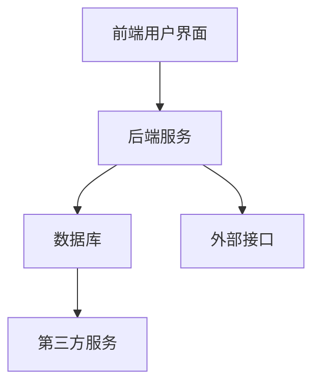
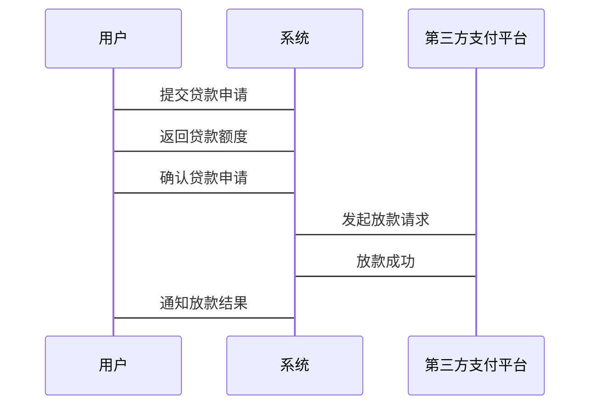

                 


# 约翰·伯格的普惠金融理念：金融科技带来的机遇与挑战

## 关键词：普惠金融，金融科技，约翰·伯格，区块链，人工智能，大数据，机遇与挑战

## 摘要：  
本文探讨了约翰·伯格提出的普惠金融理念及其在现代金融科技中的应用。通过分析区块链、人工智能和大数据等技术，本文详细阐述了金融科技如何赋能普惠金融，以及在实现过程中面临的挑战与应对策略。文章从理论到实践，结合实际案例，为读者提供了全面的视角，帮助理解普惠金融的未来发展方向。

---

## 第一部分: 引言

### 第1章: 约翰·伯格与普惠金融理念

#### 1.1 约翰·伯格的普惠金融理念  
普惠金融是指通过技术创新和制度安排，使所有人都能以合理成本获得高质量的金融服务。约翰·伯格强调，普惠金融不仅是经济发展的基石，更是社会公平的重要保障。  

#### 1.2 普惠金融的核心原则  
- **可及性**：确保金融服务覆盖到所有人群，尤其是偏远地区和低收入群体。  
- **affordability**：降低金融服务的成本，使普通人能够负担得起。  
- **可持续性**：金融机构在提供普惠金融服务的同时，也能实现自身盈利。  

#### 1.3 金融科技在普惠金融中的作用  
金融科技（FinTech）通过技术创新，解决了传统金融体系中成本高、效率低、覆盖面窄的问题。区块链、人工智能和大数据等技术为普惠金融提供了新的可能性。

---

### 第2章: 普惠金融的背景与现状

#### 2.1 普惠金融的全球发展现状  
- **传统金融体系的局限性**：传统金融机构的服务对象主要集中在高净值客户，而忽略了中低收入群体和小微企业。  
- **普惠金融的兴起**：随着技术的进步，普惠金融在全球范围内逐渐普及，尤其是在发展中国家。  

#### 2.2 金融科技推动普惠金融的路径  
- **技术创新**：区块链技术可以降低交易成本，提高透明度；人工智能可以实现精准风控；大数据技术可以优化客户画像。  
- **模式创新**：通过数字化平台，金融机构可以更高效地触达客户，提供个性化服务。  

#### 2.3 当前普惠金融面临的挑战  
- **技术瓶颈**：部分技术在实际应用中仍存在性能不足、安全性低等问题。  
- **监管缺失**：金融科技的快速发展使得监管体系难以跟上技术进步的步伐。  
- **信任问题**：用户对新技术的不信任可能导致普惠金融推广受阻。  

---

## 第二部分: 普惠金融的核心概念与技术

### 第3章: 区块链技术在普惠金融中的应用

#### 3.1 区块链的基本原理  
区块链是一种分布式账本技术，通过去中心化的方式记录交易数据，具有不可篡改、透明性和高安全性等特点。  

#### 3.2 区块链在普惠金融中的应用场景  
- **支付与结算**：区块链可以降低跨境支付的成本和时间。  
- **供应链金融**：通过区块链技术实现供应链上下游企业的信用融资。  
- **数字身份验证**：区块链可以为缺乏传统身份认证的用户提供安全的数字身份。  

#### 3.3 区块链技术的优缺点  
- **优点**：高效、透明、安全。  
- **缺点**：技术复杂性高、能耗大、去中心化与监管的矛盾。  

#### 3.4 区块链在普惠金融中的案例分析  
某非洲国家通过区块链技术为小微企业提供贷款，显著降低了融资成本，提高了贷款审批效率。

---

### 第4章: 人工智能在普惠金融中的应用

#### 4.1 人工智能的基本原理  
人工智能（AI）通过机器学习、自然语言处理等技术，模拟人类的决策过程，实现自动化服务。  

#### 4.2 人工智能在普惠金融中的应用场景  
- **信用评估**：通过机器学习模型分析客户的信用状况，降低贷款违约风险。  
- **客户服务**：通过智能客服系统为用户提供7x24小时的金融服务支持。  
- **风险管理**：利用AI实时监控金融市场的波动，预防金融风险。  

#### 4.3 人工智能技术的优缺点  
- **优点**：高效、精准、可扩展性强。  
- **缺点**：数据依赖性强、模型解释性差、存在算法偏见。  

#### 4.4 人工智能在普惠金融中的案例分析  
某银行利用机器学习模型为低收入群体提供小额信贷，显著提高了审批效率。

---

### 第5章: 大数据技术在普惠金融中的应用

#### 5.1 大数据的基本原理  
大数据技术通过收集、存储、分析海量数据，提取有价值的信息，支持决策。  

#### 5.2 大数据在普惠金融中的应用场景  
- **客户画像**：通过分析用户行为数据，精准识别客户需求。  
- **市场分析**：通过大数据分析，预测市场趋势，优化资源配置。  
- **风险控制**：通过实时数据分析，提前预警潜在风险。  

#### 5.3 大数据技术的优缺点  
- **优点**：数据量大、分析能力强。  
- **缺点**：数据隐私问题、数据质量控制、计算成本高。  

#### 5.4 大数据在普惠金融中的案例分析  
某金融科技公司利用大数据技术为农户提供农业保险，帮助农民抵御自然灾害风险。

---

## 第三部分: 普惠金融的技术实现与系统架构

### 第6章: 普惠金融系统的架构设计

#### 6.1 系统架构概述  
普惠金融系统由前端用户界面、后端服务、数据库和外部接口组成。  

#### 6.2 系统功能设计  
- **用户模块**：用户注册、登录、信息管理。  
- **金融服务模块**：贷款申请、还款管理、信用评估。  
- **风险管理模块**：实时监控、风险预警、数据可视化。  

#### 6.3 系统架构图  


#### 6.4 系统接口设计  
- **API接口**：提供RESTful API，方便第三方接入。  
- **支付接口**：集成第三方支付平台，实现资金流转。  

#### 6.5 系统交互流程  


---

## 第7章: 普惠金融系统的实现

### 7.1 环境搭建  
- **开发工具**：建议使用Python、Django框架、区块链开发平台。  
- **数据库**：推荐使用MySQL或MongoDB。  

### 7.2 核心代码实现  
```python
# 区块链核心代码
class Block:
    def __init__(self, index, timestamp, data, prev_hash):
        self.index = index
        self.timestamp = timestamp
        self.data = data
        self.prev_hash = prev_hash
        self.hash = self.compute_hash()

    def compute_hash(self):
        import hashlib
        return hashlib.sha256(str(self.__dict__).encode()).hexdigest()

# 人工智能核心代码
class LoanApprovalModel:
    def __init__(self):
        self.model = self.build_model()

    def build_model(self):
        import tensorflow as tf
        model = tf.keras.Sequential([
            tf.keras.layers.Dense(64, activation='relu'),
            tf.keras.layers.Dense(1, activation='sigmoid')
        ])
        model.compile(optimizer='adam', loss='binary_crossentropy', metrics=['accuracy'])
        return model

# 大数据核心代码
def analyze_data(dataframe):
    from sklearn.ensemble import RandomForestClassifier
    import pandas as pd
    df = pd.DataFrame(dataframe)
    features = df.drop('loan_approval', axis=1)
    labels = df['loan_approval']
    model = RandomForestClassifier()
    model.fit(features, labels)
    return model
```

---

## 第8章: 项目实战与案例分析

### 8.1 项目背景  
某金融科技公司开发了一款基于区块链和人工智能的普惠金融平台，旨在为低收入群体提供小额信贷服务。  

### 8.2 核心代码实现  
```python
# 区块链核心代码
def create_blockchain():
    blockchain = []
    genesis_block = Block(0, "2023-10-01", " genesis block", "0")
    blockchain.append(genesis_block)
    return blockchain

# 人工智能核心代码
def train_model():
    model = LoanApprovalModel().model
    # 假设data是训练数据
    model.fit(data, labels, epochs=10, batch_size=32)
    return model
```

### 8.3 案例分析  
通过实际案例分析，验证系统的可行性和有效性，总结经验教训。

---

## 第四部分: 普惠金融的挑战与未来趋势

### 第9章: 普惠金融的挑战与应对策略

#### 9.1 技术挑战  
- **数据隐私问题**：如何在保护用户隐私的前提下，利用数据进行分析。  
- **技术标准不统一**：不同技术平台之间的兼容性问题。  

#### 9.2 监管挑战  
- **监管框架不完善**：如何在技术创新与金融监管之间找到平衡。  
- **跨境金融监管**：如何应对跨境普惠金融服务的监管难题。  

#### 9.3 用户教育问题  
- **技术普及**：如何提高用户对新技术的认知和信任。  
- **操作门槛**：如何降低用户使用新技术的门槛。  

### 第10章: 未来趋势与总结

#### 10.1 未来趋势  
- **技术创新**：区块链、人工智能和大数据技术的深度融合。  
- **生态协同**：金融机构、科技公司和监管机构的协同合作。  
- **普惠金融全球化**：普惠金融服务覆盖全球更多地区。  

#### 10.2 总结  
金融科技为普惠金融的发展提供了新的机遇，但也带来了诸多挑战。只有通过技术创新、制度完善和多方协作，才能实现普惠金融的可持续发展。

---

## 作者：AI天才研究院/AI Genius Institute & 禅与计算机程序设计艺术/Zen And The Art of Computer Programming

---

**摘要**  
本文从理论到实践，详细探讨了约翰·伯格的普惠金融理念及其在金融科技中的应用。通过分析区块链、人工智能和大数据等技术，本文揭示了金融科技如何赋能普惠金融，并总结了当前面临的挑战与未来发展趋势。希望本文能为普惠金融的实践者和技术研究者提供有价值的参考。

