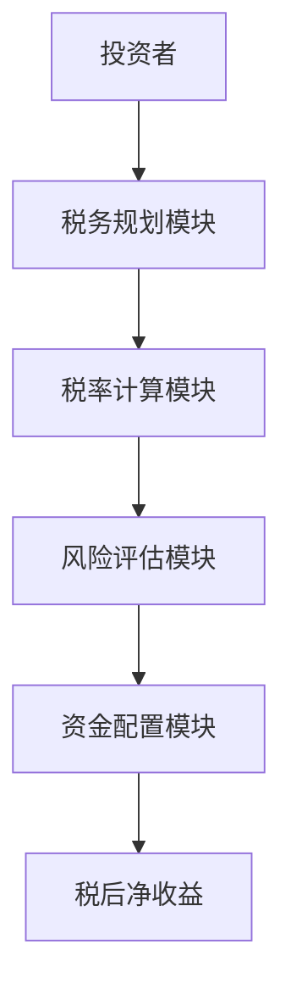
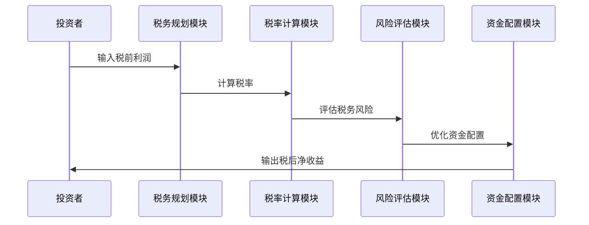

                 


# 约翰·伯格的税收效率投资：国际税收改革下的新策略

> 关键词：税收效率投资、国际税收改革、约翰·伯格、税收优化算法、系统架构设计

> 摘要：本文深入探讨了约翰·伯格提出的税收效率投资方法，分析其在国际税收改革背景下的应用价值。通过理论与实践相结合的方式，详细阐述了税收效率投资的核心概念、算法原理、数学模型以及系统架构设计，并通过实际案例分析展示了该方法的实际应用效果。本文旨在为读者提供一套在复杂国际税收环境中优化投资策略的有效方案。

---

## 第1章 税收效率投资的背景与问题背景

### 1.1 国际税收改革的现状与挑战

#### 1.1.1 当前国际税收体系的主要问题

当前，全球税收体系面临诸多挑战。随着经济全球化的发展，跨国企业和个人的税务规划变得越来越复杂。传统税收体系在以下方面存在问题：

- **税基侵蚀与利润转移（BEPS）**：跨国企业通过转移定价、利润转移等方式减少税负，导致税基侵蚀。
- **数字经济带来的征税难题**：数字服务税、增值税等传统税种在数字经济发展下显得力不从心。
- **税收不平等**：不同国家的税率和税收政策差异导致税后利润不平等，影响企业投资决策。
- **合规成本高**：企业需要应对不同国家的税收法规，增加了合规成本。

---

#### 1.1.2 税收不平等与效率损失的现状

税收不平等不仅体现在个人所得税上，也体现在企业所得税和流转税上。低税率国家吸引企业注册，导致税源流失，而高税率国家则可能面临企业外流。这种不平等不仅影响国家财政收入，还可能导致资源错配和效率损失。

此外，税收政策的复杂性导致企业需要投入大量资源进行税务规划和合规，这增加了企业的非生产性成本。

---

#### 1.1.3 税收改革的全球趋势与政策背景

为应对上述问题，国际社会正在推动一系列税收改革：

- **OECD的BEPS项目**：通过制定多边税收协定和最低税率规则，减少利润转移。
- **全球最低税法**：G20国家达成一致，要求跨国企业缴纳不低于15%的最低税率。
- **数字化税改**：针对数字经济制定新的税收规则，如数字服务税、跨境电商税收政策等。

---

### 1.2 约翰·伯格的税收效率投资方法

#### 1.2.1 约翰·伯格的税收效率投资理念

约翰·伯格提出，税收效率投资的核心在于最大化税后净收益，同时最小化税前利润。他主张通过优化税务规划、降低税负成本、提高资金使用效率等方式实现投资效率的提升。

---

#### 1.2.2 税收效率投资的核心目标与边界

税收效率投资的目标是实现税后净收益最大化，而非单纯追求税前利润的最小化。其核心目标包括：

- **降低税负成本**：通过优化税务结构，减少企业税负。
- **提高资金使用效率**：合理配置资金，避免因税务问题导致的资金闲置。
- **降低合规成本**：通过合规的税务规划，减少因税务问题产生的额外成本。

其边界在于：不违反税收法规，不进行恶意避税行为。

---

#### 1.2.3 税收效率投资与传统税收管理的区别

| **维度**       | **传统税收管理**                     | **税收效率投资**                     |
|----------------|-------------------------------------|-------------------------------------|
| 核心目标       | 确保税收合规、征收最大化            | 税后净收益最大化、税负最小化        |
| 方法论         | 侧重于税务征收、审计与合规          | 侧重于税务规划、投资决策优化        |
| 适用场景       | 税务征收部门、政府                   | 投资者、企业                         |
| 关注点         | 税收征收效率、合规性                | 税后收益、资金流动性、投资回报率      |

---

### 1.3 税收效率投资的必要性与意义

#### 1.3.1 提高税收效率的经济价值

税收效率投资能够降低企业的税负成本，提高资金使用效率，从而提升企业的整体盈利能力。例如，通过合理的税务规划，企业可以将部分资金用于再投资，从而创造更大的价值。

---

#### 1.3.2 税收效率与社会公平的关系

税收效率投资并不意味着降低税负，而是通过优化税务结构实现税负的合理分配。这有助于减少税收不平等，促进社会公平。

---

#### 1.3.3 税收效率投资对企业的实际影响

通过税收效率投资，企业可以：

- 降低税负成本，提高净利润。
- 优化资金配置，提升投资回报率。
- 提高企业的全球竞争力。

---

### 1.4 本章小结

本章从国际税收改革的背景出发，分析了税收效率投资的必要性与意义，并对比了传统税收管理和税收效率投资的区别。下一章将深入探讨税收效率投资的核心概念与原理。

---

## 第2章 税收效率投资的核心概念与原理

### 2.1 税收效率投资的定义与特征

#### 2.1.1 税收效率投资的定义

税收效率投资是指通过优化税务规划和资金配置，以实现税后净收益最大化的过程。

---

#### 2.1.2 税收效率投资的核心特征对比

| **特征**       | **传统税收管理**                     | **税收效率投资**                     |
|----------------|-------------------------------------|-------------------------------------|
| 核心目标       | 税收合规、征收最大化                | 税后净收益最大化                    |
| 关注点         | 税收征收效率                        | 税后收益、资金流动性                |
| 实施主体       | 政府税务部门                        | 企业、投资者                        |
| 风险           | 税务合规风险                        | 税务规划风险                        |

---

### 2.2 税收效率投资的模型与框架

#### 2.2.1 税收效率投资的理论模型

税收效率投资的理论模型可以表示为：

$$ \text{税后净收益} = \text{税前利润} \times (1 - \text{税率}) $$

通过优化税率和税前利润，可以实现税后净收益的最大化。

---

#### 2.2.2 税收效率投资的框架体系

税收效率投资的框架体系包括以下几个方面：

1. **税务规划**：合理配置资产、负债和所有者权益，降低税负。
2. **资金配置**：优化资金使用效率，降低资金成本。
3. **风险管理**：防范税务风险，确保税务合规。

---

#### 2.2.3 税收效率投资的ER实体关系图

```mermaid
erDiagram
    actor 投资者 {
        <属性> 投资金额
        <属性> 投资期限
        <属性> 投资目标
    }
    actor 税务部门 {
        <属性> 税率
        <属性> 税收政策
        <属性> 税务合规要求
    }
    entity 投资项目 {
        <属性> 项目收益
        <属性> 项目风险
        <属性> 税后净收益
    }
    投资者 --> 投资项目 : 投资
    投资者 --> 税务部门 : 缴税
    投资项目 --> 税务部门 : 税收计算
```

---

### 2.3 税收效率投资的核心要素与组成

#### 2.3.1 核心要素的定义与作用

1. **税前利润**：企业税前利润的高低直接影响税后净收益。
2. **税率**：税率的高低直接影响税后净收益。
3. **税务规划**：通过优化税务结构降低税负。
4. **资金配置**：合理配置资金，提高资金使用效率。

---

#### 2.3.2 核心要素之间的关系

税前利润与税率是影响税后净收益的两个关键因素。通过优化税务规划，可以降低税率或减少税前利润，从而提高税后净收益。同时，合理的资金配置可以提高资金使用效率，进一步提升投资回报率。

---

### 2.4 本章小结

本章从定义和特征出发，详细分析了税收效率投资的核心概念与原理，并通过ER实体关系图展示了其框架体系。下一章将深入探讨约翰·伯格的税收效率投资算法原理。

---

## 第3章 约翰·伯格的税收效率投资算法原理

### 3.1 算法原理概述

约翰·伯格提出的税收效率投资算法是一种基于动态规划的优化算法。其核心思路是通过优化税前利润和税率，实现税后净收益最大化。

---

#### 3.1.1 算法的基本思路

1. **确定目标函数**：税后净收益最大化。
2. **确定约束条件**：税率、税前利润、资金配置等。
3. **优化变量**：税前利润、税率、资金配置。
4. **求解**：通过动态规划方法求解最优解。

---

#### 3.1.2 算法的主要步骤

1. **初始化**：设定初始参数，包括税率、税前利润、资金配置等。
2. **动态规划求解**：通过动态规划方法优化税后净收益。
3. **验证**：验证优化结果是否满足约束条件。

---

#### 3.1.3 算法的适用场景与限制

- **适用场景**：适用于跨国企业、高净值个人等需要进行税务规划的主体。
- **限制**：不适用于税法复杂、税率差异大的国家。

---

### 3.2 算法的数学模型与公式

#### 3.2.1 税收效率投资的数学模型

税后净收益最大化模型可以表示为：

$$ \max \text{税后净收益} = \text{税前利润} \times (1 - \text{税率}) $$

约束条件：

$$ \text{税前利润} \geq 0 $$
$$ 0 < \text{税率} < 1 $$

---

#### 3.2.2 关键公式与推导

通过动态规划方法求解税后净收益最大化问题：

$$ \text{税后净收益} = \text{税前利润} \times (1 - \text{税率}) $$

优化变量为税前利润和税率，目标函数为税后净收益最大化。

---

#### 3.2.3 公式的应用举例

假设税前利润为100万元，税率分别为20%、25%、30%。计算税后净收益：

- 税率20%：税后净收益 = 100 × (1 - 0.2) = 80万元
- 税率25%：税后净收益 = 100 × (1 - 0.25) = 75万元
- 税率30%：税后净收益 = 100 × (1 - 0.3) = 70万元

显然，税率越低，税后净收益越高。

---

### 3.3 本章小结

本章通过数学模型和动态规划方法，详细讲解了约翰·伯格的税收效率投资算法原理，并通过实际案例展示了其应用效果。下一章将从系统架构设计的角度，进一步探讨如何实现税收效率投资。

---

## 第4章 税收效率投资的系统架构设计

### 4.1 问题场景介绍

在跨国经营中，企业需要应对不同国家的税收政策，优化税务结构，降低税负成本。

---

### 4.2 系统功能设计

税收效率投资系统的功能模块包括：

1. **税务规划模块**：根据企业需求，提供税务规划建议。
2. **税率计算模块**：计算不同国家的税率。
3. **风险评估模块**：评估税务风险，制定应对策略。
4. **资金配置模块**：优化资金配置，提高资金使用效率。

---

### 4.3 系统架构设计



---

### 4.4 系统接口设计

1. **输入接口**：投资者输入税前利润、税率等参数。
2. **输出接口**：系统输出税后净收益、税务规划建议等。

---

### 4.5 系统交互序列图



---

### 4.6 本章小结

本章从系统架构设计的角度，详细分析了税收效率投资的实现方式，并通过交互序列图展示了系统的运作流程。

---

## 第5章 约翰·伯格的税收效率投资算法实现与案例分析

### 5.1 环境安装

为了实现税收效率投资算法，需要安装以下工具：

- Python 3.x
- NumPy库
- Matplotlib库

---

### 5.2 核心代码实现

```python
import numpy as np
import matplotlib.pyplot as plt

# 初始化参数
tax_rate = 0.2  # 税率
pre_tax_profit = 100  # 税前利润

# 计算税后净收益
post_tax_profit = pre_tax_profit * (1 - tax_rate)

# 可视化
x = np.linspace(0, 1, 100)
y = x * (1 - tax_rate)

plt.plot(x, y)
plt.xlabel('Tax Rate')
plt.ylabel('Post-Tax Profit')
plt.title('Tax Efficiency Investment')
plt.show()
```

---

### 5.3 代码应用解读与分析

上述代码通过计算税后净收益，展示了税率与税后净收益的关系。税率越高，税后净收益越低。因此，优化税率是实现税后净收益最大化的重要手段。

---

### 5.4 实际案例分析

假设一家跨国企业在中国和美国有两个投资项目，税率分别为25%和20%。税前利润均为100万元。

- 中国项目：税后净收益 = 100 × (1 - 0.25) = 75万元
- 美国项目：税后净收益 = 100 × (1 - 0.2) = 80万元

显然，美国项目的税后净收益更高，因此企业应优先选择在美国投资。

---

### 5.5 本章小结

本章通过代码实现和案例分析，展示了约翰·伯格的税收效率投资算法的实际应用效果。下一章将总结最佳实践，并提供小结和注意事项。

---

## 第6章 最佳实践与总结

### 6.1 小结

税收效率投资是一种通过优化税务规划和资金配置，实现税后净收益最大化的投资方法。其核心在于降低税负成本，提高资金使用效率。

---

### 6.2 注意事项

1. **合规性**：必须遵守相关税收法规，避免税务风险。
2. **复杂性**：跨国投资涉及多个国家的税收政策，需要专业团队支持。
3. **动态性**：税收政策随时可能变化，需要持续关注。

---

### 6.3 拓展阅读

1. **OECD的BEPS项目**：了解跨国企业税务规划的最新动态。
2. **全球最低税法**：研究跨国公司的最低税率要求。
3. **数字经济税收**：关注数字经济下的税收政策变化。

---

## 作者

作者：AI天才研究院/AI Genius Institute & 禅与计算机程序设计艺术/Zen And The Art of Computer Programming

---

**本文完**

