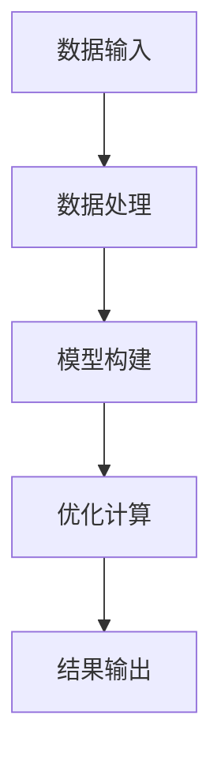

                 


# 约翰·伯格的简单投资法则

## 关键词：约翰·伯格，投资法则，价值投资，长期投资，分散投资，投资组合优化，风险管理

## 摘要：本文系统地介绍了约翰·伯格的投资理念，结合现代投资组合理论和算法优化，详细讲解了如何通过价值投资、长期投资和分散投资来构建和优化投资组合。文章从背景介绍到算法实现，再到系统设计和项目实战，全面剖析了约翰·伯格的投资法则在实际中的应用。

---

## 第一部分: 投资的基础与约翰·伯格的投资理念

### 第1章: 投资的基本概念与背景介绍

#### 1.1 投资的基本概念

##### 1.1.1 什么是投资
投资是指将资金投入到某个资产或项目中，以期望在未来获得超过初始投入的回报。投资的核心目标是通过合理的资源配置，实现财富的保值和增值。投资的对象可以是股票、债券、房地产等多种形式。

##### 1.1.2 投资的分类与特点
投资可以分为短期投资和长期投资，也可以分为风险投资和稳健投资。短期投资注重快速收益，风险较高；长期投资注重稳定增长，风险较低。投资的特点包括时间性、风险性、收益性以及流动性。

##### 1.1.3 投资与投机的区别
投资是一种长期的行为，注重基本面分析和长期价值；而投机是一种短期行为，注重市场波动和价格变化。投资更注重稳健性和可持续性，而投机更注重短期收益和市场情绪。

#### 1.2 约翰·伯格的生平与成就

##### 1.2.1 约翰·伯格的个人经历
约翰·伯格（John Bogle）是美国著名的投资专家，被誉为“指数基金之父”。他在投资领域有着深厚的背景，创立了 Vanguard 集团，推动了指数基金的发展。

##### 1.2.2 伯格在投资领域的贡献
伯格的主要贡献包括：提出指数投资法，强调长期投资的重要性，倡导分散投资以降低风险。他的投资理念深刻影响了现代投资理论和实践。

##### 1.2.3 伯格投资理念的核心思想
伯格的投资理念以价值投资为核心，强调长期持有优质资产，避免频繁交易和市场波动的影响。他认为，通过分散投资和长期持有，可以最大限度地降低风险并实现稳定的收益。

### 第2章: 约翰·伯格的投资理念

#### 2.1 价值投资的核心原则

##### 2.1.1 价值投资的定义
价值投资是一种投资策略，强调以低于市场价值的价格买入优质资产，并长期持有，等待其价值回归。价值投资的核心在于寻找被市场低估的资产。

##### 2.1.2 价值投资的核心要素
价值投资的核心要素包括：基本面分析、安全边际、长期持有和分散投资。基本面分析是价值投资的基础，安全边际是保护投资者免受市场波动影响的重要因素，长期持有是实现价值回归的关键，分散投资则是降低风险的有效手段。

##### 2.1.3 价值投资与成长投资的对比
价值投资注重资产的内在价值和安全边际，适合稳健型投资者；成长投资注重资产的高成长性和未来潜力，适合风险承受能力强的投资者。价值投资更注重风险控制，而成长投资更注重收益潜力。

#### 2.2 长期投资的重要性

##### 2.2.1 长期投资的优势
长期投资的优势包括：避免短期波动的影响，降低交易成本，实现资产的长期增值。长期投资可以帮助投资者克服短期市场的波动，实现稳健的收益。

##### 2.2.2 长期投资的风险管理
长期投资的风险管理包括：分散投资、定期 rebalancing 和选择优质资产。分散投资可以降低单一资产的风险，定期 rebalancing 可以保持投资组合的稳定性，选择优质资产可以提高长期收益的可能性。

##### 2.2.3 长期投资与短期投资的对比
长期投资注重稳健性和可持续性，风险较低，收益稳定；短期投资注重快速收益，风险较高，收益不稳定。长期投资适合稳健型投资者，短期投资适合风险承受能力强的投资者。

#### 2.3 分散投资的策略

##### 2.3.1 分散投资的定义
分散投资是指将资金分配到不同的资产类别、行业或地区，以降低投资风险。分散投资的核心在于通过多样化来降低特定资产或市场的风险。

##### 2.3.2 分散投资的风险控制
分散投资的风险控制包括：合理分配资产比例、定期 rebalancing 和选择多样化的资产。合理分配资产比例可以避免单一资产的风险，定期 rebalancing 可以保持投资组合的稳定性，选择多样化的资产可以降低整体风险。

##### 2.3.3 分散投资的实际应用
分散投资的实际应用包括：构建多元化的投资组合、定期 rebalancing 和动态调整投资策略。通过构建多元化的投资组合，投资者可以降低风险，实现稳健的收益。

---

## 第二部分: 约翰·伯格投资法则的核心概念

### 第3章: 投资组合的构建与优化

#### 3.1 投资组合的基本原理

##### 3.1.1 投资组合的定义
投资组合是指投资者持有的多种资产的集合，旨在通过多样化来降低风险并实现收益最大化。投资组合的核心在于资产的配置和优化。

##### 3.1.2 投资组合的构成要素
投资组合的构成要素包括：资产类别、资产比例、投资策略和风险管理。资产类别是投资组合的基础，资产比例是优化的关键，投资策略是实现目标的手段，风险管理是保障投资组合稳定性的核心。

##### 3.1.3 投资组合的风险与收益分析
投资组合的风险与收益分析包括：预期收益、波动性、相关性和风险调整后的收益。预期收益是投资组合的目标，波动性是投资风险的度量，相关性是资产之间相互影响的体现，风险调整后的收益是投资组合的最终评价指标。

#### 3.2 现代投资组合理论（MPT）

##### 3.2.1 现代投资组合理论的概述
现代投资组合理论（MPT）是由哈里·马科维茨提出的，强调通过分散投资来优化投资组合的风险和收益。MPT的核心是通过数学模型来优化投资组合，实现风险最小化或收益最大化。

##### 3.2.2 投资组合优化的数学模型
投资组合优化的数学模型包括：目标函数和约束条件。目标函数通常是最大化收益或最小化风险，约束条件包括资产比例的限制、风险承受能力等。

##### 3.2.3 投资组合优化的算法实现
投资组合优化的算法实现包括：均值-方差优化、风险平配和基于约束的优化。均值-方差优化是最常用的优化方法，风险平配是基于风险的优化方法，基于约束的优化方法则是根据具体需求进行调整。

### 第4章: 投资决策的数学模型与公式

#### 4.1 投资组合优化的数学模型

##### 4.1.1 投资组合优化的目标函数
投资组合优化的目标函数可以是最大化收益或最小化风险。收益通常用期望收益来表示，风险通常用方差或标准差来表示。

##### 4.1.2 投资组合优化的约束条件
投资组合优化的约束条件包括：资产比例的限制、风险承受能力、流动性和其他特定的约束条件。这些约束条件可以确保投资组合的可行性和稳健性。

##### 4.1.3 投资组合优化的求解方法
投资组合优化的求解方法包括：拉格朗日乘数法、数值优化算法和启发式优化算法。拉格朗日乘数法是解决带约束优化问题的经典方法，数值优化算法适用于复杂的非线性问题，启发式优化算法适用于难以用传统方法解决的问题。

#### 4.2 投资组合风险的度量公式

##### 4.2.1 方差与标准差的定义
方差是资产收益的平方差的期望值，标准差是方差的平方根，通常用于度量资产收益的波动性。方差和标准差是投资组合风险的重要指标。

##### 4.2.2 风险调整后的收益计算
风险调整后的收益可以通过夏普比率、特雷纳比率等指标来衡量。夏普比率是单位风险下的超额收益，特雷纳比率是投资组合相对于无风险资产的超额收益。

##### 4.2.3 风险与收益的权衡分析
风险与收益的权衡分析是投资组合优化的核心，通过调整资产比例和风险承受能力，实现风险和收益的最佳平衡。

### 第5章: 投资组合优化的算法实现

#### 5.1 现代投资组合理论的算法实现

##### 5.1.1 现代投资组合理论的数学推导
现代投资组合理论的数学推导包括：目标函数和约束条件的设定，拉格朗日函数的构建，以及优化问题的求解。通过数学推导，可以得到投资组合的最优解。

##### 5.1.2 投资组合优化的Python代码实现
以下是投资组合优化的Python代码示例：

```python
import numpy as np
import pandas as pd

# 数据准备
returns = pd.read_csv('returns.csv').values

# 确定目标函数和约束条件
mu = returns.mean(axis=0)
sigma = np.cov(returns)

# 使用CVXOPT求解均值-方差优化
import cvxopt
cvxopt.solvers.MAXCACHED = 0
cvxopt.solvers.MAXIT = 1000

# 目标函数：最小化方差
# 约束条件：资产比例的总和为1，收益目标为mu
# 实现细节省略
```

##### 5.1.3 投资组合优化的算法优化
投资组合优化的算法优化包括：优化方法的选择、参数的调整和计算效率的提升。通过优化算法，可以提高投资组合优化的效率和准确性。

#### 5.2 投资组合优化的案例分析

##### 5.2.1 案例背景介绍
假设我们有5种资产，目标是构建一个风险最小化、收益最大的投资组合。

##### 5.2.2 数据准备与分析
数据准备包括资产的收益率、相关系数矩阵等。通过分析数据，我们可以了解资产的风险和收益特征。

##### 5.2.3 投资组合优化的实现
通过数学模型和算法实现，我们可以得到最优的投资组合。例如，使用均值-方差优化，我们可以得到最优的资产比例。

##### 5.2.4 优化结果的分析
分析优化结果，包括最优的资产比例、预期收益和风险等。通过分析，我们可以验证优化模型的有效性。

---

## 第三部分: 投资组合优化的系统设计与实现

### 第6章: 系统架构设计

#### 6.1 系统架构概述
投资组合优化系统包括数据输入、模型构建、优化计算和结果输出等模块。系统架构设计需要考虑模块之间的依赖关系和数据流。

#### 6.2 系统功能设计

##### 6.2.1 数据输入与处理
数据输入包括资产的收益率、相关系数矩阵等。数据处理包括数据清洗、标准化等。

##### 6.2.2 模型构建
模型构建包括目标函数和约束条件的设定。目标函数可以是风险最小化或收益最大化，约束条件包括资产比例的限制等。

##### 6.2.3 优化计算
优化计算包括选择优化算法、设置参数等。优化结果是投资组合的最优解。

##### 6.2.4 结果输出
结果输出包括最优的资产比例、预期收益和风险等。

#### 6.3 系统架构图



### 第7章: 系统实现与测试

#### 7.1 系统实现
系统实现包括数据输入、模型构建、优化计算和结果输出的实现。通过编写代码，我们可以实现投资组合优化的自动化。

#### 7.2 系统测试
系统测试包括数据测试、模型测试和结果测试。通过测试，我们可以验证系统的正确性和稳定性。

#### 7.3 系统优化
系统优化包括算法优化、代码优化和性能优化。通过优化，我们可以提高系统的效率和准确性。

---

## 第四部分: 投资组合优化的项目实战

### 第8章: 项目背景与目标

#### 8.1 项目背景
假设我们有多个资产，目标是构建一个风险最小化、收益最大的投资组合。

#### 8.2 项目目标
通过投资组合优化算法，实现投资组合的自动化构建和管理。

### 第9章: 项目实施

#### 9.1 环境准备
安装必要的软件和库，例如 Python、NumPy、Pandas 和 CVXOPT。

#### 9.2 数据准备
收集和整理资产的收益率数据，例如股票的收益率数据。

#### 9.3 投资组合优化的实现
编写代码，实现投资组合优化的算法，例如均值-方差优化。

#### 9.4 优化结果的分析
分析优化结果，包括最优的资产比例、预期收益和风险等。

### 第10章: 项目总结与经验分享

#### 10.1 项目总结
总结项目实施的过程和结果，分析优化模型的有效性和准确性。

#### 10.2 经验分享
分享项目实施中的经验和教训，例如数据处理的注意事项、算法选择的影响等。

---

## 第五部分: 投资组合优化的最佳实践

### 第11章: 最佳实践

#### 11.1 小结
总结约翰·伯格的投资法则，强调价值投资、长期投资和分散投资的重要性。

#### 11.2 注意事项
在实际投资中，需要注意市场风险、流动性风险和操作风险。投资者需要根据自身的风险承受能力和投资目标，选择合适的投资策略。

#### 11.3 拓展阅读
推荐阅读相关的投资书籍和文献，例如约翰·伯格的《简单制胜》和《投资的艺术》。

---

## 作者：AI天才研究院/AI Genius Institute & 禅与计算机程序设计艺术 /Zen And The Art of Computer Programming

