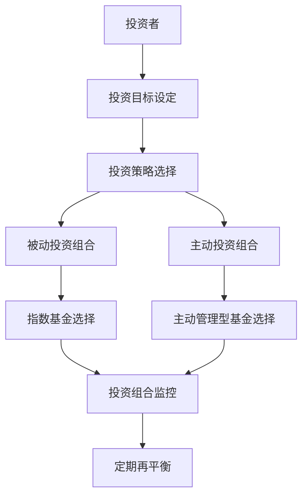

                 


# 约翰·伯格的被动投资vs主动投资debate

> 关键词：被动投资，主动投资，指数基金，约翰·伯格，投资策略，金融分析

> 摘要：本文深入探讨了约翰·伯格倡导的被动投资策略与传统主动投资策略之间的辩论。通过分析两者的定义、优缺点、历史表现和适用场景，结合数学模型和系统架构设计，为读者提供全面的视角，帮助理解哪种策略更适合不同的投资目标和市场环境。

---

# 第一部分: 被动投资与主动投资的基本概念

## 第1章: 被动投资概述

### 1.1 被动投资的定义与特点

#### 1.1.1 被动投资的定义

被动投资是一种以指数基金或交易所交易基金（ETF）为主要投资工具的投资策略。其核心理念是通过跟踪市场指数的表现，而非试图主动预测市场走势或选择个股，来实现长期稳定的收益。被动投资强调分散投资和低成本运作，追求与市场同步增长。

#### 1.1.2 被动投资的核心特点

- **低成本**：被动投资通过指数基金或ETF，避免了高额的主动管理费用。
- **分散风险**：通过投资整个市场指数，避免了个别股票或行业的波动风险。
- **长期稳定**：被动投资追求与市场同步增长，适合长期投资者。

#### 1.1.3 被动投资的历史发展

被动投资的兴起始于20世纪70年代，以约翰·伯格（John C. Bogle）的先锋投资公司（Vanguard Group）为代表。伯格于1975年推出第一只指数基金，开创了被动投资的先河。随着技术的进步和投资者对低成本、高透明度投资工具的需求增加，被动投资在全球范围内迅速发展。

### 1.2 指数基金与被动投资

#### 1.2.1 指数基金的运作机制

指数基金通过复制特定市场指数（如标普500指数）的表现来实现投资收益。其运作机制包括：

1. **指数选择**：选择一个市场指数作为跟踪目标。
2. **成分股投资**：购买指数中的所有成分股，按比例分配资金。
3. **定期再平衡**：定期调整投资组合，以保持与指数一致的比例。

#### 1.2.2 指数基金的优势与劣势

- **优势**：
  - 成本低：指数基金的管理费用（expense ratio）通常远低于主动管理型基金。
  - 分散风险：通过投资多个成分股，降低个股风险。
  - 易于理解：指数基金的投资逻辑简单明了。
- **劣势**：
  - 缺乏灵活性：指数基金的投资组合固定，无法根据市场变化进行调整。
  - 可能跑输市场：在某些情况下，市场指数的表现可能不如某些主动管理型基金。

#### 1.2.3 被动投资的代表人物：约翰·伯格

约翰·伯格是被动投资领域的先驱，他创立了先锋投资公司，并推出第一只指数基金——Vanguard S&P 500指数基金。伯格坚信市场有效性和指数基金的长期收益潜力，他的工作推动了被动投资在全球范围内的普及。

---

## 第2章: 主动投资概述

### 2.1 主动投资的定义与特点

#### 2.1.1 主动投资的定义

主动投资是一种通过主动管理和精选个股或行业，试图跑赢市场指数的投资策略。其核心理念是通过分析市场趋势、公司基本面或技术指标，寻找被低估或高增长的投资机会，从而实现超额收益。

#### 2.1.2 主动投资的核心特点

- **高成本**：主动投资需要支付高昂的管理费用和佣金。
- **高风险**：主动投资依赖于管理人的选股能力和市场判断，风险较高。
- **短期波动**：主动投资的收益可能在短期内波动较大。

#### 2.1.3 主动投资的历史发展

主动投资的历史可以追溯到20世纪初，随着金融市场的成熟和机构投资者的兴起，主动管理型基金逐渐成为主流。然而，随着指数基金的兴起，主动投资的市场份额逐渐被侵蚀。

### 2.2 主动投资的主要策略

#### 2.2.1 价值投资

价值投资强调以低于公允价值的价格买入股票，长期持有，等待其价值回归。这种策略的代表人物包括本杰明·格雷厄姆和沃伦·巴菲特。

#### 2.2.2 成长投资

成长投资关注那些收入和利润快速增长的公司，试图通过投资高增长股票实现超额收益。这种策略的风险较高，但潜在回报也较高。

#### 2.2.3 技术分析

技术分析通过研究历史价格和成交量数据，预测未来的价格走势。这种方法依赖于对市场心理和趋势的判断。

---

## 第3章: 被动投资与主动投资的核心概念对比

### 3.1 投资目标与策略对比

| **对比维度** | **被动投资** | **主动投资** |
|--------------|--------------|--------------|
| 投资目标      | 追踪市场指数  | 跑赢市场指数  |
| 管理方式      | 指数化、分散化 | 主动选股、集中化 |
| 成本          | 低           | 高           |
| 风险          | 低           | 高           |
| 适合投资者    | 长期、保守型  | 短期、激进型  |

### 3.2 投资风险与收益对比

#### 3.2.1 被动投资的风险

被动投资的主要风险在于市场整体表现不佳，以及市场波动可能带来的短期损失。然而，长期来看，指数基金通常能够实现稳定的收益。

#### 3.2.2 主动投资的风险

主动投资的风险主要来自于市场判断失误和个股选择错误。此外，高昂的管理费用也会侵蚀收益。

### 3.3 投资成本对比

| **费用类型**       | **被动投资** | **主动投资** |
|--------------------|--------------|--------------|
| 管理费（expense ratio） | 通常低于1%   | 通常高于2%   |
| 交易费用           | 低           | 高           |
| 委托费用           | 无           | 可能存在      |

---

## 第4章: 被动投资与主动投资的历史表现分析

### 4.1 被动投资的历史表现

#### 4.1.1 指数基金的长期表现

以标普500指数为例，过去50年的年化回报率约为10%。指数基金通过跟踪这一表现，为投资者提供了稳定的收益。

#### 4.1.2 被动投资的稳定性

指数基金的表现相对稳定，波动性低于主动管理型基金。长期来看，指数基金的表现通常优于大多数主动管理型基金。

#### 4.1.3 被动投资的市场适应性

无论市场上涨还是下跌，指数基金都能通过分散投资降低风险，实现长期稳定回报。

### 4.2 主动投资的历史表现

#### 4.2.1 主动管理基金的表现

统计显示，大多数主动管理型基金的表现难以长期跑赢市场指数。根据晨星（Morningstar）的数据，过去10年中，只有约15%的主动管理型基金能够跑赢指数基金。

#### 4.2.2 主动投资的波动性

主动投资的收益波动较大，尤其是在市场剧烈波动时，主动管理型基金的表现可能大幅低于指数基金。

#### 4.2.3 主动投资的市场适应性

主动投资的表现依赖于市场环境和管理人的能力。在牛市中，主动投资可能表现优异，但在熊市中，其表现往往不如指数基金稳定。

### 4.3 两者表现的对比与总结

#### 4.3.1 长期表现对比

- 长期来看，指数基金的表现通常优于大多数主动管理型基金。
- 主动投资在某些特定市场环境下可能表现优异，但难以持续跑赢市场指数。

#### 4.3.2 稳定性对比

- 被动投资表现更为稳定，波动性较小。
- 主动投资波动较大，收益不稳定。

#### 4.3.3 成本对比

- 被动投资的成本远低于主动投资。
- 主动投资的高成本会显著侵蚀长期收益。

---

## 第5章: 被动投资与主动投资的适用场景

### 5.1 被动投资的适用场景

#### 5.1.1 长期投资

对于那些计划长期持有投资的投资者，被动投资是一个理想的选择。通过指数基金，投资者可以实现长期稳定的收益，同时避免频繁交易带来的成本和风险。

#### 5.1.2 低风险偏好投资者

被动投资通过分散投资和低成本运作，适合风险偏好较低的投资者。这类投资者更注重稳定收益，而非短期高回报。

#### 5.1.3 对市场波动不敏感的投资者

被动投资的波动性较低，适合那些对市场波动不敏感的投资者。这类投资者更关注长期回报，而非短期市场波动。

### 5.2 主动投资的适用场景

#### 5.2.1 短期投资

对于那些希望在短期内实现高回报的投资者，主动投资可能是一个更好的选择。通过精选个股或行业，投资者可以在短期内获得超额收益。

#### 5.2.2 高风险偏好投资者

主动投资的风险较高，但潜在回报也较高，适合风险偏好较高的投资者。这类投资者愿意承担更高的风险以追求更高的回报。

#### 5.2.3 对市场趋势敏感的投资者

对于那些能够准确判断市场趋势的投资者，主动投资可能是一个更好的选择。这类投资者可以通过及时调整投资组合，抓住市场机会，实现超额收益。

---

## 第6章: 被动投资与主动投资的结合——混合投资策略

### 6.1 混合投资策略的定义

混合投资策略是将被动投资和主动投资相结合的一种投资策略。通过在投资组合中同时配置指数基金和主动管理型基金，投资者可以在控制成本和风险的同时，抓住市场机会，实现更好的收益。

### 6.2 混合投资策略的优势

- **成本控制**：通过配置指数基金，降低整体投资成本。
- **风险分散**：通过配置主动管理型基金，降低投资组合的波动性。
- **收益增强**：通过主动管理型基金，捕捉市场机会，增强整体收益。

### 6.3 混合投资策略的实现

#### 6.3.1 投资组合配置

- 60%的指数基金（如标普500指数基金）。
- 40%的主动管理型基金（如成长型基金或价值型基金）。

#### 6.3.2 定期再平衡

- 每季度末对投资组合进行再平衡，确保各部分比例符合预期。

---

## 第7章: 数学模型与算法原理

### 7.1 被动投资的数学模型

#### 7.1.1 指数基金收益计算

假设投资于标普500指数基金，年化回报率为10%。投资10000美元，5年后资产增长为：

$$
10000 \times (1 + 0.10)^5 = 16105.10 \text{美元}
$$

#### 7.1.2 投资组合波动性计算

通过标准差衡量投资组合的波动性，指数基金的标准差通常低于主动管理型基金。

### 7.2 主动投资的数学模型

#### 7.2.1 价值投资的估值模型

通过市盈率（P/E）和市净率（P/B）等指标，评估股票的内在价值。

#### 7.2.2 成长投资的预测模型

通过预测公司未来几年的收入和利润增长率，评估股票的潜在回报。

---

## 第8章: 系统架构设计与实现

### 8.1 系统架构设计

通过Mermaid图展示被动投资与主动投资的系统架构设计：



### 8.2 系统功能设计

- **投资目标设定**：根据投资者的风险偏好和收益目标，确定投资策略。
- **被动投资组合**：选择指数基金，构建分散化的投资组合。
- **主动投资组合**：精选个股或行业，构建集中化的投资组合。
- **投资组合监控**：定期检查投资组合的表现，进行必要的调整。

---

## 第9章: 项目实战——构建被动与主动投资组合

### 9.1 环境安装

- **Python编程环境**：安装Python 3.x，安装必要的库（如pandas、numpy、matplotlib）。
- **数据获取**：通过Yahoo Finance API获取历史数据。

### 9.2 核心实现源代码

#### 9.2.1 被动投资组合实现

```python
import pandas as pd
import numpy as np
import matplotlib.pyplot as plt

# 获取指数基金数据
data = pd.read_csv('spx.csv')
data['Adj Close'].plot()
plt.title('S&P 500 Index Fund Performance')
plt.xlabel('Year')
plt.ylabel('Price')
plt.show()
```

#### 9.2.2 主动投资组合实现

```python
import pandas as pd
import numpy as np
import matplotlib.pyplot as plt

# 获取主动管理型基金数据
data = pd.read_csv('active_fund.csv')
data['Adj Close'].plot()
plt.title('Active Fund Performance')
plt.xlabel('Year')
plt.ylabel('Price')
plt.show()
```

---

## 第10章: 最佳实践与总结

### 10.1 最佳实践

- **长期投资**：被动投资适合长期投资者，主动投资适合短期投资者。
- **分散风险**：通过混合投资策略，分散投资风险。
- **定期再平衡**：定期检查投资组合，进行必要的调整。

### 10.2 小结

被动投资和主动投资各有优缺点，适合不同的投资者和市场环境。通过深入了解两者的优缺点和适用场景，投资者可以根据自身需求选择合适的投资策略，实现最佳收益。

---

# 结语

约翰·伯格的被动投资与主动投资的辩论，本质上是低成本、分散化与高成本、集中化之间的博弈。通过本文的分析，读者可以更好地理解两种策略的优缺点，从而做出更明智的投资决策。无论是选择被动投资、主动投资，还是混合投资策略，关键在于根据自身的风险偏好和收益目标，找到最适合自己的投资方式。

---

# 作者

作者：AI天才研究院/AI Genius Institute  
联系邮箱：[contact@ai-genius-institute.com](mailto:contact@ai-genius-institute.com)

