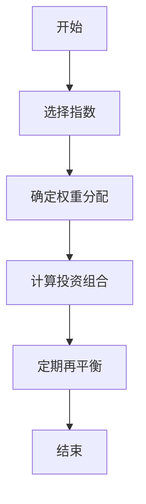
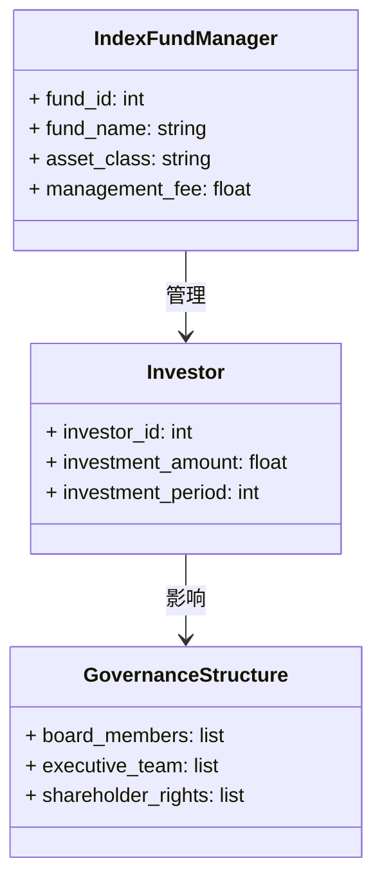
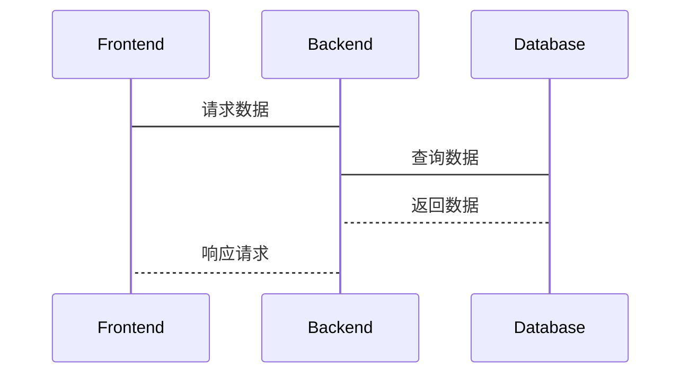

                 


# 《约翰·伯格的被动投资与公司治理影响》

## 关键词：
- 被动投资
- 公司治理
- 约翰·伯格
- 投资策略
- 指数基金

## 摘要：
《约翰·伯格的被动投资与公司治理影响》系统地探讨了被动投资对现代公司治理的深远影响。通过分析约翰·伯格的被动投资策略，本书揭示了指数基金如何改变传统的公司治理结构，以及这种变化如何影响企业的决策过程。书中结合理论与实践，详细阐述了被动投资的算法原理、系统架构设计，并通过实际案例展示了被动投资在公司治理中的应用。读者将深入了解被动投资如何通过股东结构变化影响公司治理，以及如何在实际操作中应用这些策略。

---

## 目录大纲：

### 第一部分：被动投资与公司治理的背景介绍

#### 第1章：被动投资概述
1.1 被动投资的起源与发展
1.1.1 被动投资的定义与特点
1.1.2 被动投资的历史演变
1.1.3 被动投资的现状与趋势

1.2 约翰·伯格的贡献
1.2.1 约翰·伯格的生平简介
1.2.2 伯格与被动投资的关联
1.2.3 伯格的投资哲学对被动投资的影响

1.3 被动投资与主动投资的对比
1.3.1 主动投资与被动投资的定义
1.3.2 两者的优缺点分析
1.3.3 市场环境对两者的影响

#### 第2章：公司治理概述
2.1 公司治理的基本概念
2.1.1 公司治理的定义与范畴
2.1.2 公司治理结构与功能
2.1.3 公司治理的重要性

2.2 股东、董事会与高管的角色
2.2.1 股东的权力与责任
2.2.2 董事会的构成与职责
2.2.3 高管的管理与决策作用

2.3 公司治理中的问题与挑战
2.3.1 代理问题
2.3.2 透明度与信息披露
2.3.3 治理结构的全球化挑战

---

### 第二部分：被动投资与公司治理的核心概念与联系

#### 第3章：被动投资对治理的影响
3.1 被动投资如何改变股东结构
3.1.1 股权分散化的影响
3.1.2 机构投资者的角色变化
3.1.3 股东参与度的降低

3.2 被动投资对治理决策的影响
3.2.1 股东投票权的变化
3.2.2 公司战略的调整
3.2.3 董事会结构的优化

3.3 被动投资与传统投资的治理差异
3.3.1 被动投资的低参与性
3.3.2 主动投资的高干预性
3.3.3 两者的治理效果对比

---

### 第三部分：被动投资的算法原理与数学模型

#### 第4章：被动投资的算法原理
4.1 指数基金的构建算法
4.1.1 指数复制的原理
4.1.2 资产配置的优化方法
4.1.3 风险调整回报的计算

4.2 使用mermaid展示指数构建流程


4.3 Python代码实现
```python
import pandas as pd
import numpy as np

# 示例代码：计算指数权重
def calculate_weights(index_components):
    returns = pd.Series(np.random.randn(len(index_components)), index=index_components)
    weights = returns.sort_values(ascending=False).cumsum()
    return weights

index_components = ['AAPL', 'GOOGL', 'MSFT', 'AMZN']
weights = calculate_weights(index_components)
print(weights)
```

4.4 数学模型与公式
4.4.1 夏普比率公式：
$$\text{夏普比率} = \frac{E[r_i - r_f]}{\sigma_i}$$
其中，$E[r_i - r_f]$ 是资产的超额收益期望值，$\sigma_i$ 是资产收益的标准差。

4.4.2 CAPM模型：
$$E[r_i] = r_f + \beta_i (E[r_m] - r_f)$$
其中，$r_f$ 是无风险利率，$\beta_i$ 是资产的贝塔系数，$E[r_m]$ 是市场预期回报率。

---

### 第四部分：系统分析与架构设计

#### 第5章：系统架构设计
5.1 问题场景介绍
5.1.1 被动投资与公司治理的结合
5.1.2 系统目标与功能需求
5.1.3 用户角色与权限分配

5.2 领域模型设计


5.3 系统架构设计


5.4 系统接口设计
5.4.1 API接口定义
5.4.2 接口交互流程图


---

### 第五部分：项目实战

#### 第6章：实战案例分析
6.1 环境安装与配置
6.1.1 安装Python与相关库
6.1.2 安装Jupyter Notebook
6.1.3 数据源获取与准备

6.2 核心代码实现
6.2.1 计算指数权重
6.2.2 模拟投资回报
6.2.3 风险评估与优化

6.3 案例分析与解读
6.3.1 某指数基金的绩效分析
6.3.2 公司治理结构的优化建议
6.3.3 投资策略的调整与改进

6.4 项目总结
6.4.1 实验结果分析
6.4.2 可能的改进方向
6.4.3 项目经验总结

---

### 第六部分：总结与展望

#### 第7章：总结与展望
7.1 全书核心内容回顾
7.1.1 被动投资的背景与影响
7.1.2 公司治理的变革与挑战
7.1.3 投资策略的优化与创新

7.2 最佳实践与注意事项
7.2.1 投资者如何选择被动投资产品
7.2.2 如何优化公司治理结构
7.2.3 风险管理与投资组合优化

7.3 拓展阅读与进一步研究
7.3.1 推荐书籍与文献
7.3.2 未来研究方向
7.3.3 行业趋势与动态

---

## 作者：AI天才研究院/AI Genius Institute & 禅与计算机程序设计艺术 /Zen And The Art of Computer Programming

