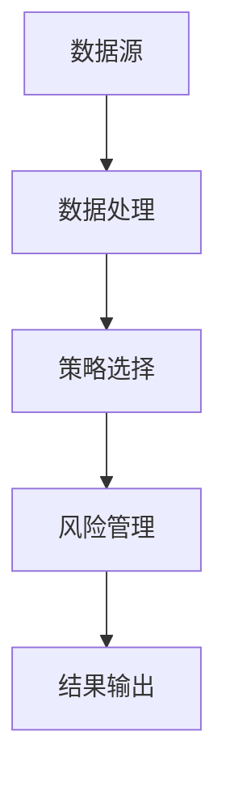

                 


# 约翰·伯格的被动投资哲学

## 关键词
- 被动投资
- 指数基金
- 定投策略
- 风险管理
- 资产配置

## 摘要
约翰·伯格的被动投资哲学强调长期投资、分散投资和低成本策略。本文从被动投资的背景出发，详细探讨其核心理念、理论基础、指数基金的选择、定投策略的应用、风险管理的重要性以及如何构建有效的投资组合。通过数学模型和系统架构的分析，结合实际案例，为投资者提供科学的指导和实践建议。

---

# 第一部分: 被动投资的背景与基础

## 第1章: 被动投资的起源与核心理念

### 1.1 被动投资的起源
#### 1.1.1 投资的定义与分类
投资是将资金投入到资产中以期获得收益的行为，主要分为主动投资和被动投资。被动投资强调模仿市场表现，而非主动选股或择时。

#### 1.1.2 被动投资的起源与发展
被动投资起源于20世纪70年代，伯格的先驱性工作推动了指数基金的发展。

#### 1.1.3 被动投资与主动投资的区别
被动投资注重长期持有，费用低；主动投资追求超额收益，费用高。

### 1.2 约翰·伯格的投资哲学
#### 1.2.1 约翰·伯格的生平简介
伯格是 Vanguard 集团的创始人，倡导低成本、分散化的投资策略。

#### 1.2.2 伯格的投资理念
长期投资、分散投资、低成本。

#### 1.2.3 伯格对被动投资的贡献
推动指数基金的发展，强调风险管理。

---

## 第2章: 被动投资的核心概念与理论基础

### 2.1 被动投资的核心概念
#### 2.1.1 指数基金的定义与特点
指数基金追踪市场指数，如标普500，费用低，风险分散。

#### 2.1.2 投资组合理论
分散投资降低风险，组合收益由资产权重决定。

#### 2.1.3 市场有效性假说
市场有效下，被动投资优于主动投资。

### 2.2 被动投资的理论基础
#### 2.2.1 哈里·马科维茨的现代投资组合理论
通过优化投资组合降低风险。

#### 2.2.2 威廉·夏普的CAPM模型
资产收益与系统风险相关。

#### 2.2.3 费雪·布莱克的指数套利理论
套利机会有限，被动投资有效。

---

## 第3章: 被动投资的策略与实践

### 3.1 被动投资的主要策略
#### 3.1.1 指数基金投资策略
选择跟踪广泛指数的基金。

#### 3.1.2 定期定额投资策略
定期投入固定金额，平滑波动。

#### 3.1.3 资产配置策略
按风险偏好分配股票、债券等资产。

### 3.2 被动投资的实施步骤
#### 3.2.1 确定投资目标与风险承受能力
评估收益目标和风险承受能力。

#### 3.2.2 选择合适的指数基金
比较费用和跟踪误差。

#### 3.2.3 制定投资计划与执行
制定定投计划，定期复盘。

---

## 第4章: 指数基金的构建与选择

### 4.1 指数基金的构建原理
#### 4.1.1 指数基金的定义与类型
包括股票指数、债券指数等。

#### 4.1.2 指数基金的构建方法
复制指数成分股，按权重配置。

#### 4.1.3 指数基金的成本与收益分析
费用低，长期收益稳定。

### 4.2 指数基金的选择标准
#### 4.2.1 基准指数的选择
选择覆盖面广、流动性好的指数。

#### 4.2.2 基金公司的选择
选择历史悠久、管理能力强的公司。

#### 4.2.3 基金费用的比较
关注管理费和托管费。

---

## 第5章: 定投策略与风险管理

### 5.1 定投策略的原理与优势
#### 5.1.1 定投的定义与特点
定期投入，分散风险。

#### 5.1.2 定投的优势与适用场景
平滑市场波动，适合长期投资。

#### 5.1.3 定投与指数基金的结合
定期投入指数基金，长期收益稳定。

### 5.2 风险管理在被动投资中的应用
#### 5.2.1 风险的定义与分类
市场风险、流动性风险等。

#### 5.2.2 被动投资中的风险来源
市场波动、基金费用等。

#### 5.2.3 风险管理的具体措施
分散投资、定期再平衡。

---

## 第6章: 被动投资的系统架构与实现

### 6.1 系统架构设计
#### 6.1.1 系统功能模块划分
数据采集、策略选择、风险管理。

#### 6.1.2 系统架构图（Mermaid）


#### 6.1.3 系统接口设计
API接口用于数据获取和策略执行。

### 6.2 系统实现与优化
#### 6.2.1 系统核心算法实现
使用Python编写指数基金跟踪算法。

#### 6.2.2 系统性能优化方法
缓存数据，减少计算次数。

#### 6.2.3 系统维护与升级策略
定期更新指数成分股，优化算法。

---

## 第7章: 项目实战

### 7.1 环境安装
安装Python和必要的库，如pandas、numpy。

### 7.2 系统核心实现源代码
```python
import pandas as pd
import numpy as np

def calculate_return(prices):
    return prices.pct_change().cumprod()

# 示例数据
prices = pd.Series([100, 105, 110, 108, 115])
returns = calculate_return(prices)
print(returns)
```

### 7.3 代码应用解读与分析
计算收益，展示指数基金的表现。

### 7.4 实际案例分析
分析过去十年指数基金的表现，对比定投与一次性投资的收益。

### 7.5 项目小结
被动投资策略在实际中的有效性。

---

## 第8章: 总结与最佳实践

### 8.1 总结
被动投资的长期优势和风险管理的重要性。

### 8.2 最佳实践 tips
- 定期定额投资，分散风险。
- 选择低成本指数基金。
- 定期再平衡投资组合。

### 8.3 小结
被动投资是长期稳健的投资方式，值得深入学习和实践。

### 8.4 注意事项
市场波动和经济周期影响投资表现，需保持耐心。

### 8.5 拓展阅读
推荐相关书籍和资源，进一步学习投资知识。

---

# 作者：AI天才研究院/AI Genius Institute & 禅与计算机程序设计艺术 /Zen And The Art of Computer Programming

---

通过以上目录结构，文章将详细探讨约翰·伯格的被动投资哲学，结合理论与实践，为读者提供全面的指导。

