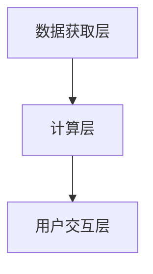

                 


# 约翰·伯格的被动投资策略优势

> 关键词：被动投资，约翰·伯格，指数基金，投资策略，长期持有，风险管理

> 摘要：本文深入分析了约翰·伯格的被动投资策略，探讨其在投资领域的优势与应用。通过详细阐述被动投资的背景、核心理论、数学模型及系统架构，结合实际案例和项目实战，为读者提供全面的理论与实践指导。

---

## 第一章：被动投资的背景与基础

### 1.1 被动投资的定义与特点

被动投资是一种以指数基金为核心的投资策略，强调长期持有，避免频繁交易。其特点包括：

- **长期性**：强调长期投资，通过复利效应实现收益最大化。
- **分散性**：通过投资指数基金，分散个股风险，降低波动性。
- **低成本**：被动投资通常费用较低，适合小额投资者。

### 1.2 约翰·伯格与被动投资

约翰·伯格是被动投资领域的先驱，他的投资理念对现代投资理论影响深远。伯格的贡献包括：

- **指数基金的推广**：他创立了 Vanguard 集团，推动了低成本指数基金的发展。
- **价值投资理念**：强调长期持有优质资产，避免短期波动影响决策。

### 1.3 被动投资的历史发展

被动投资起源于20世纪中期，随着有效市场假说的提出而逐渐发展。20世纪70年代，伯格推出第一只指数基金，标志着被动投资的兴起。近年来，随着技术进步和成本降低，被动投资在全球范围内得到广泛应用。

---

## 第二章：约翰·伯格的被动投资策略

### 2.1 投资理念

伯格的投资理念强调：

- **长期持有**：避免短期市场波动，追求长期稳定收益。
- **分散投资**：通过投资指数基金，降低个股风险。
- **成本控制**：低成本是实现超额收益的关键因素。

### 2.2 策略体系

伯格的策略体系包括：

- **指数基金选择**：选择跟踪市场指数、费用低的基金。
- **投资组合构建**：通过分散投资，优化风险收益比。
- **风险管理**：通过定期再平衡，保持投资组合的稳定性。

### 2.3 核心思想

伯格的核心思想是：

- **避免市场预测**：认为市场预测不可靠，投资应基于长期价值。
- **价值投资结合被动投资**：通过持有优质资产，获得市场平均收益。

---

## 第三章：被动投资的核心理论

### 3.1 有效市场假说

有效市场假说认为市场价格反映所有信息，主动投资难以跑赢市场。被动投资基于此理论，通过指数基金获取市场平均收益。

### 3.2 指数基金的优势

指数基金的优势包括：

- **分散风险**：投资多个资产，降低单一资产风险。
- **费用低**：被动管理费用低于主动管理。
- **简单易懂**：适合非专业投资者。

### 3.3 成本与收益

低成本是被动投资的重要优势，费用低的基金能长期积累更多收益。复利效应使长期持有成本优势更加明显。

---

## 第四章：数学模型与量化分析

### 4.1 指数基金收益模型

指数基金的收益可以用以下公式表示：

$$
R_{\text{基金}} = \beta R_{\text{市场}} + \alpha
$$

其中，$\beta$ 是基金的贝塔系数，反映基金相对于市场的波动性；$\alpha$ 是基金的超额收益。

### 4.2 成本影响

被动投资的总收益受到费用的影响，长期来看，低成本能显著提升收益。假设两只基金，一只费用为0.1%，另一只为1%，长期持有后，费用差异会显著影响收益。

### 4.3 风险调整收益模型

使用夏普比率衡量风险调整收益：

$$
\text{夏普比率} = \frac{E[R_{\text{基金}} - R_{\text{无风险}}]}{\sigma_{\text{基金}}}
$$

---

## 第五章：系统分析与架构设计

### 5.1 系统架构设计

使用分层架构，包括数据获取层、计算层和用户交互层。系统架构图如下：



### 5.2 接口设计

系统主要接口包括数据获取接口、计算接口和结果展示接口，使用RESTful API设计。

### 5.3 交互设计

用户通过Web界面选择指数基金，系统计算并展示收益情况，支持用户进行再平衡操作。

---

## 第六章：项目实战

### 6.1 环境配置

使用Python和相关库（如pandas、numpy）进行环境配置。

### 6.2 核心代码实现

实现指数基金收益计算的代码示例：

```python
import pandas as pd
import numpy as np

# 模拟指数数据
index_data = pd.DataFrame({
    'date': ['2020-01', '2020-02', '2020-03'],
    'value': [100, 105, 102]
})

# 计算月度收益
index_data['return'] = index_data['value'].pct_change()

print(index_data)
```

### 6.3 实际案例分析

以标普500指数为例，计算过去十年的年化收益，展示被动投资的优势。

---

## 第七章：总结与展望

### 7.1 总结

被动投资以其低成本、分散风险和长期稳定的收益，成为投资领域的重要策略。伯格的贡献推动了指数基金的发展，为投资者提供了可靠的选择。

### 7.2 展望

随着技术进步和市场发展，被动投资将继续发展，特别是在智能投顾和自动化交易领域。

---

## 附录

- **术语表**：解释文中使用的关键术语。
- **工具推荐**：推荐适合被动投资的工具和平台。
- **扩展阅读**：提供相关书籍和资源，供读者深入学习。

---

作者：AI天才研究院/AI Genius Institute & 禅与计算机程序设计艺术 /Zen And The Art of Computer Programming

