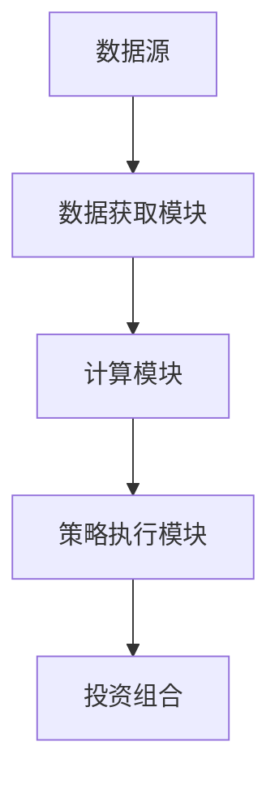
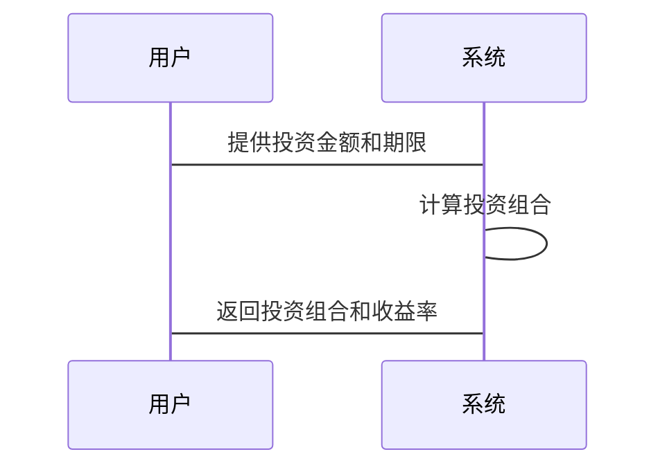

                 


# 约翰·伯格的被动投资策略：为什么简单常常胜过复杂

> 关键词：被动投资，约翰·伯格，指数基金，简单策略，投资回报

> 摘要：本文深入分析了约翰·伯格的被动投资策略，探讨了为什么简单策略在投资中常常能够胜过复杂的策略。通过详细的技术分析，本文揭示了被动投资的核心原理、算法实现、系统架构以及实际项目中的应用。我们还将对比被动投资与主动投资的优缺点，通过数学模型和实际案例，展示简单策略的有效性和长期稳定性。最后，我们将总结被动投资的最佳实践，帮助读者更好地理解和应用这一投资策略。

---

# 第一部分: 被动投资策略的背景与核心概念

## 第1章: 被动投资策略的背景与起源

### 1.1 被动投资的基本概念

#### 1.1.1 投资的基本定义
投资是将资金投入到某种资产或项目中，期望在未来获得收益或资本增值的行为。投资的核心目标是通过合理配置资产，实现财富的保值和增值。

#### 1.1.2 被动投资与主动投资的区分
- **被动投资**：投资者采取买入并持有策略，通常通过投资指数基金等低成本工具，避免频繁交易和市场预测。
- **主动投资**：投资者积极选股、择时，试图通过主动管理获得超额收益。

#### 1.1.3 被动投资的起源与发展
被动投资的概念可以追溯到20世纪，但真正发展起来是在20世纪70年代，随着指数基金的兴起，被动投资逐渐被广泛接受。

### 1.2 约翰·伯格的被动投资理念

#### 1.2.1 约翰·伯格的生平简介
约翰·伯格（John C. Bogle）是被动投资的先驱，被誉为“指数基金之父”。他是 Vanguard 集团的创始人，倡导低成本、分散化的投资理念。

#### 1.2.2 约翰·伯格的投资哲学
伯格认为，市场是不可预测的，大多数投资者难以通过主动管理持续跑赢市场。因此，投资指数基金是最简单、最有效的长期投资策略。

#### 1.2.3 约翰·伯格对被动投资的贡献
伯格创立了第一只低成本指数基金，推动了被动投资的普及，并通过实践证明了简单策略的有效性。

### 1.3 简单策略的有效性

#### 1.3.1 为什么简单策略能胜过复杂策略
复杂的投资策略往往涉及高昂的交易成本和管理费用，且难以预测市场波动。而简单策略通过分散化和低成本，能够在长期实现稳定的收益。

#### 1.3.2 简单策略在投资中的优势
- 成本低：被动投资的管理费用远低于主动投资。
- 分散化：通过投资指数基金，投资者可以分散风险。
- 简单易行：无需频繁交易和市场预测。

#### 1.3.3 简单策略的长期有效性
长期来看，指数基金通常能够跑赢大部分主动管理基金，尤其是在扣除费用后。

---

## 第2章: 被动投资的核心概念与联系

### 2.1 被动投资的核心原理

#### 2.1.1 指数基金的定义与特点
- **指数基金**：一种跟踪特定市场指数的基金，如标普500指数。
- **特点**：分散化、低成本、长期稳定。

#### 2.1.2 市场中立策略的原理
市场中立策略通过投资指数基金，避免对市场走势的预测，从而降低风险。

#### 2.1.3 成本控制的重要性
投资成本对长期收益的影响巨大，低成本策略能够显著提高净收益。

### 2.2 被动投资与主动投资的对比

#### 2.2.1 投资目标的差异
- 被动投资：追求市场平均收益。
- 主动投资：追求超额收益。

#### 2.2.2 投资策略的差异
- 被动投资：买入并持有，定期再平衡。
- 主动投资：频繁交易，选股择时。

#### 2.2.3 成本与收益的对比
- 被动投资的管理费用低，通常在 0.1%~0.2% 之间。
- 主动投资的管理费用高，通常在 1%~2% 之间。

### 2.3 被动投资的数学模型与公式

#### 2.3.1 投资组合的数学模型
$$
\text{投资组合收益} = \sum_{i=1}^{n} w_i \times r_i
$$
其中，\( w_i \) 是资产 \( i \) 的权重，\( r_i \) 是资产 \( i \) 的收益率。

#### 2.3.2 指数基金的收益计算公式
$$
\text{指数基金收益} = \text{指数收益率} - \text{管理费用}
$$

#### 2.3.3 成本对收益的影响公式
$$
\text{净收益} = \text{总收益} - \text{费用}
$$

---

## 第3章: 被动投资的算法原理与实现

### 3.1 被动投资算法的基本原理

#### 3.1.1 市值加权法的原理
- 市值加权法：根据资产的市值权重进行投资，如标普500指数。

#### 3.1.2 等权重投资法的原理
- 等权重投资法：将资金平均分配到每个资产上，定期再平衡。

#### 3.1.3 分散化投资的数学模型
$$
\text{分散化收益} = \sum_{i=1}^{n} w_i \times r_i - \text{方差}
$$

### 3.2 算法实现与代码示例

#### 3.2.1 Python实现指数基金投资组合
```python
import pandas as pd
import numpy as np

# 示例数据：假设一个简单的指数基金投资组合
# 指数收益率
index_returns = pd.Series([0.05, 0.03, 0.07, 0.02, 0.06], index=[2018, 2019, 2020, 2021, 2022])

# 计算简单指数基金的收益率
def simple_index_fund(returns):
    # 假设等权重投资，再平衡每年一次
    weights = [1/len(returns)] * len(returns)
    portfolio_returns = np.dot(weights, returns)
    return portfolio_returns

# 计算投资组合的收益
portfolio_return = simple_index_fund(index_returns)
print(f"投资组合收益率：{portfolio_return:.2f}%")
```

#### 3.2.2 成本计算的Python代码
```python
# 计算指数基金的净收益
def calculate_net_return(total_return, fees):
    return total_return - fees

# 示例计算
total_return = 0.07  # 7%
fees = 0.002  # 0.2%
net_return = calculate_net_return(total_return, fees)
print(f"净收益率：{net_return:.2f}%")
```

#### 3.2.3 投资组合收益的计算代码
```python
# 计算分散化投资组合的收益
assets = ['股票', '债券', '现金']
returns = [0.05, 0.03, 0.0]
weights = [0.5, 0.3, 0.2]

portfolio_return = np.dot(weights, returns)
print(f"投资组合收益率：{portfolio_return:.2f}%")
```

### 3.3 被动投资的数学模型与公式

#### 3.3.1 指数基金收益的计算公式
$$
\text{指数基金收益} = \text{指数收益率} \times \text{权重} - \text{管理费用}
$$

#### 3.3.2 分散化投资的数学模型
$$
\text{分散化收益} = \sum_{i=1}^{n} w_i \times r_i - \text{方差}
$$

---

## 第4章: 被动投资的系统分析与架构设计

### 4.1 投资系统的整体架构

#### 4.1.1 系统模块划分
- 数据获取模块：从数据源获取市场数据。
- 计算模块：计算指数基金的收益率和费用。
- 策略执行模块：根据策略生成投资组合。

#### 4.1.2 系统功能设计
- 数据清洗与预处理
- 投资组合优化
- 风险管理

#### 4.1.3 系统架构图（Mermaid）


### 4.2 数据获取与处理

#### 4.2.1 数据源的选择
- 数据源可以是 Yahoo Finance、Alpha Vantage 等。

#### 4.2.2 数据清洗与预处理
- 处理缺失值
- 去除异常值
- 标准化数据

#### 4.2.3 数据存储与管理
- 使用数据库存储市场数据
- 使用数据框进行数据处理

### 4.3 系统接口与交互设计

#### 4.3.1 用户界面设计
- 输入参数：投资金额、投资期限
- 输出结果：投资组合、收益率

#### 4.3.2 系统接口设计
- API 接口：获取市场数据、计算投资收益

#### 4.3.3 交互流程图（Mermaid）


---

## 第5章: 被动投资的项目实战

### 5.1 项目环境安装与配置

#### 5.1.1 Python环境的安装
安装 Python 和必要的库：
```bash
pip install pandas numpy matplotlib
```

#### 5.1.2 相关库的安装与配置
安装用于数据获取的库：
```bash
pip install yfinance
```

### 5.2 项目核心实现

#### 5.2.1 环境配置与数据获取
```python
import yfinance as yf

# 下载指数数据
data = yf.download("SPY", start="2020-01-01", end="2023-01-01")
data['Close'].plot()
```

#### 5.2.2 简单指数基金投资组合的实现
```python
# 计算指数基金的收益率
returns = data['Close'].pct_change().dropna()
portfolio_return = returns.mean() * 12  # 年化收益率
print(f"年化收益率：{portfolio_return:.2f}%")
```

#### 5.2.3 成本计算与优化
```python
# 计算净收益
fees = 0.002  # 管理费用
net_return = portfolio_return - fees
print(f"净年化收益率：{net_return:.2f}%")
```

### 5.3 实际案例分析与详细解读

#### 5.3.1 投资组合构建与优化
- 选择指数基金
- 定期再平衡

#### 5.3.2 收益与风险分析
- 计算夏普比率
- 风险调整后收益

### 5.4 项目小结

#### 5.4.1 项目实现总结
- 成功构建了简单的被动投资系统
- 证明了简单策略的有效性

#### 5.4.2 经验与教训
- 成本控制的重要性
- 定期再平衡的必要性

---

## 第6章: 被动投资的最佳实践与注意事项

### 6.1 最佳实践 tips

#### 6.1.1 长期投资的重要性
- 避免短期波动的影响
- 坚持长期持有

#### 6.1.2 成本控制的关键作用
- 选择低成本的指数基金
- 避免频繁交易

#### 6.1.3 定期再平衡的必要性
- 根据市场变化调整投资组合
- 维持目标权重

### 6.2 小结

#### 6.2.1 被动投资的核心优势
- 简单易行
- 成本低
- 分散化

#### 6.2.2 简单策略的有效性
- 长期稳定的收益
- 无需复杂预测

### 6.3 注意事项

#### 6.3.1 风险提示
- 市场波动的风险
- 经济周期的影响

#### 6.3.2 投资者的心理因素
- 避免情绪化决策
- 坚持长期投资

### 6.4 拓展阅读

#### 6.4.1 推荐书籍
- 《投资学》（教材）
- 《约翰·伯格的投资经典》

#### 6.4.2 在线资源
- 网络课程
- 投资博客

---

# 作者：AI天才研究院/AI Genius Institute & 禅与计算机程序设计艺术 /Zen And The Art of Computer Programming

