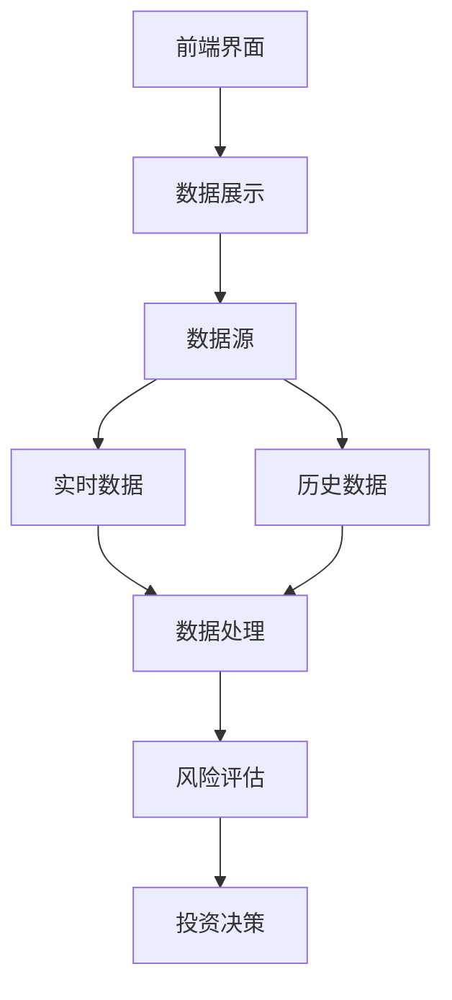

                 


# 约翰·伯格的被动投资：ETF时代的新发展

## 关键词：被动投资，ETF，指数基金，风险管理，约翰·伯格，投资策略

## 摘要：  
本文深入探讨了约翰·伯格的被动投资理念及其在ETF（交易所交易基金）时代的新发展。通过分析ETF的基本概念、投资策略、风险管理以及系统架构，本文为读者提供了全面了解被动投资在现代金融市场中的应用。结合理论与实践，本文详细讲解了如何在ETF时代优化投资组合，降低风险，并通过系统化的方法实现长期稳健的投资回报。

---

## 第一部分：被动投资与ETF概述

### 第1章：被动投资的背景与核心理念

#### 1.1 被动投资的定义与特点

被动投资是一种投资策略，旨在通过复制特定市场指数的表现来实现投资收益。与主动投资不同，被动投资不依赖于市场预测或选股技巧，而是通过分散投资于一篮子资产来降低风险。以下是被动投资的核心特点：

- **低成本**：被动投资通常通过指数基金实现，管理费用较低。
- **分散风险**：投资于广泛市场的指数基金可以有效分散个券风险。
- **长期稳健**：被动投资适合长期投资者，能够抵御市场波动。

#### 1.2 ETF的基本概念与运作机制

ETF（交易所交易基金）是一种在交易所上市交易的开放式基金，结合了封闭式基金和开放式基金的特点。以下是ETF的主要运作机制：

- **指数跟踪**：大多数ETF以特定指数为基准，如标普500指数。
- **实物交付**：投资者可以按基金份额净值申购或赎回，避免了开放式基金的高申购赎回费用。
- **实时交易**：ETF在交易所上市，投资者可以像买卖股票一样交易ETF。

#### 1.3 约翰·伯格的被动投资理念

约翰·伯格是被动投资的先驱，他于1975年创立了Vanguard集团，并推出了第一只低成本指数基金。伯格的核心理念是：

- **市场有效假说**：市场是有效的，主动管理难以战胜市场指数。
- **长期投资**：通过长期持有指数基金实现财富增值。
- **分散投资**：通过投资广泛市场的指数基金降低风险。

---

## 第二部分：ETF的投资策略与风险管理

### 第2章：ETF的投资策略

#### 2.1 ETF的类型与选择

ETF的种类繁多，投资者需要根据自身的风险承受能力和投资目标选择合适的ETF。以下是常见的ETF类型：

- **股票型ETF**：投资于股票市场的指数基金。
- **债券型ETF**：投资于债券市场的指数基金。
- **混合型ETF**：同时投资于股票和债券的混合型指数基金。

#### 2.2 被动投资中的定投策略

定投策略是被动投资的重要组成部分，通过定期定额投资，投资者可以避免市场波动的影响。以下是定投策略的核心优势：

- **分散投资成本**：在市场高点和低点均匀投资，降低整体成本。
- **长期复利效应**：通过长期投资实现财富的复利增长。

#### 2.3 ETF投资中的风险管理

风险管理是ETF投资的重要环节，以下是常见的风险管理措施：

- **风险评估**：通过夏普比率评估基金的风险调整后收益。
- **资产配置**：通过合理配置不同资产类别降低整体风险。
- **定期再平衡**：定期调整投资组合，保持目标资产配置。

---

## 第三部分：ETF投资的系统架构与技术分析

### 第3章：ETF投资的系统架构

#### 3.1 系统功能设计

以下是ETF投资管理系统的功能模块：

- **数据采集**：获取实时市场数据。
- **指数跟踪**：计算ETF与基准指数的跟踪误差。
- **风险评估**：评估投资组合的风险。
- **投资决策**：基于数据和模型做出投资决策。

#### 3.2 系统架构设计

以下是ETF投资管理系统的架构图：



---

## 第四部分：项目实战

### 第4章：ETF投资实战

#### 4.1 环境安装

以下是安装Python环境的步骤：

```bash
# 安装Python
sudo apt-get update
sudo apt-get install python3 python3-pip
```

#### 4.2 核心代码实现

以下是ETF筛选工具的Python代码：

```python
import pandas as pd
import requests

# 获取ETF数据
url = "https://api.example.com/etf"
response = requests.get(url)
data = response.json()

# 数据处理
df = pd.DataFrame(data)
df['夏普比率'] = df['收益'] / df['波动率']

# 筛选高夏普比率的ETF
high_sharpe = df[df['夏普比率'] > 1.5]

print(high_sharpe)
```

---

## 第五部分：最佳实践与总结

### 第5章：最佳实践与总结

#### 5.1 最佳实践

- **分散投资**：避免过度集中于某一种资产或行业。
- **定期再平衡**：保持投资组合的资产配置。
- **长期投资**：耐心持有，避免频繁交易。

#### 5.2 小结

被动投资在ETF时代迎来了新的发展机遇，通过低成本、高分散的投资方式，投资者可以实现稳健的财富增长。约翰·伯格的理念为我们提供了宝贵的指导，未来随着技术的进步，ETF投资将更加智能化和个性化。

---

## 作者：AI天才研究院/AI Genius Institute & 禅与计算机程序设计艺术 /Zen And The Art of Computer Programming

