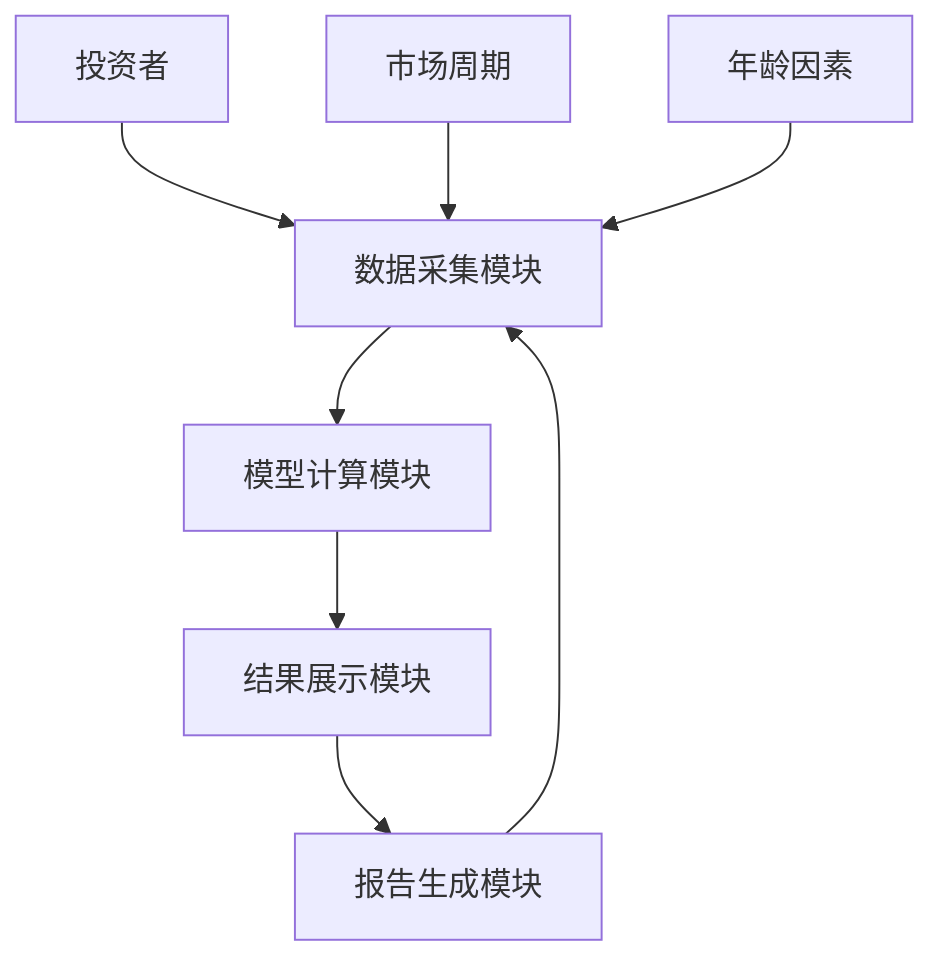
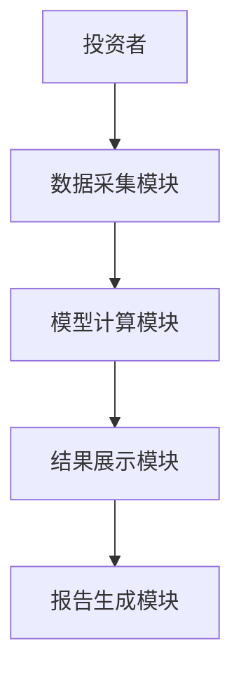

                 


# 约翰·伯格的资产配置原则：年龄与风险承受能力的平衡

## 关键词：资产配置，风险承受能力，年龄因素，投资策略，风险管理，现代投资组合理论，收益与风险平衡

## 摘要：本文探讨了约翰·伯格的资产配置原则，重点分析了年龄与风险承受能力之间的关系，以及如何在不同生命周期阶段进行资产配置。文章结合现代投资组合理论，通过数学模型和算法优化，展示了如何根据年龄和风险承受能力动态调整资产配置，以实现收益与风险的最佳平衡。同时，文章还提供了实际案例分析和系统设计，帮助读者更好地理解和应用这些原则。

---

## 第1章: 资产配置的基本概念

### 1.1 资产配置的定义与作用

#### 1.1.1 资产配置的定义
资产配置是指将资金分配到不同资产类别（如股票、债券、房地产等）中的过程，旨在在风险和收益之间找到最佳平衡点。通过合理配置资产，投资者可以在不同市场环境下实现稳健的投资回报。

#### 1.1.2 资产配置的作用与意义
资产配置不仅帮助投资者分散风险，还能根据市场变化灵活调整投资组合，从而在不同经济周期中保持较高的收益水平。有效的资产配置能够帮助投资者避免过度集中在某一资产类别带来的风险。

#### 1.1.3 资产配置与投资收益的关系
资产配置是投资组合表现的核心因素。研究表明，90%以上的投资收益可以归因于资产配置的决策。通过科学的资产配置，投资者能够在不同市场环境中优化收益，降低整体投资风险。

---

### 1.2 约翰·伯格的资产配置理论

#### 1.2.1 约翰·伯格的生平简介
约翰·伯格是美国著名投资专家，长期致力于研究资产配置策略。他的理论强调长期投资和分散投资的重要性，主张根据投资者的风险承受能力和财务目标进行动态调整。

#### 1.2.2 伯格的资产配置原则
伯格提出，资产配置应基于投资者的年龄、财务状况和风险偏好。他认为，随着年龄的增长，投资者的风险承受能力逐渐下降，应相应减少高风险资产的配置比例，增加低风险资产的比重。

#### 1.2.3 伯格理论的现代应用
伯格的理论在现代投资实践中得到广泛应用。许多机构投资者和散户投资者都采用基于年龄和风险承受能力的资产配置策略，以实现长期稳健的投资回报。

---

### 1.3 年龄与风险承受能力的关系

#### 1.3.1 年龄对风险承受能力的影响
年龄是影响风险承受能力的重要因素。年轻投资者通常愿意承担更高的风险，追求较高的投资收益；而年长投资者更倾向于稳健投资，注重资本保值。

#### 1.3.2 风险承受能力的评估方法
风险承受能力可以通过财务状况、心理承受能力和投资目标等多个维度进行评估。科学的评估方法能够帮助投资者制定合理的资产配置策略。

#### 1.3.3 年龄与投资目标的关联
不同年龄段的投资者有不同的财务目标。年轻人可能更关注资本增值，而年长者更关注稳定收入。资产配置策略需要根据这些目标进行调整。

---

### 1.4 市场周期与资产配置策略

#### 1.4.1 市场周期的基本类型
市场周期通常分为复苏、扩张、滞胀和衰退四个阶段。不同阶段的市场环境需要采用不同的资产配置策略。

#### 1.4.2 不同周期下的资产配置策略
在经济复苏期，应增加股票和高风险资产的配置；在经济衰退期，应增加债券和现金资产的配置。灵活的资产配置能够帮助投资者在不同市场环境中获得稳健收益。

#### 1.4.3 资产配置与市场周期的互动关系
资产配置策略需要根据市场周期的变化进行动态调整。科学的资产配置能够帮助投资者在市场波动中降低风险，抓住投资机会。

---

## 第2章: 资产配置的核心概念与联系

### 2.1 资产配置的数学模型

#### 2.1.1 资产配置的数学表达式
资产配置可以通过优化模型进行数学表达。例如，投资组合的收益和风险可以用以下公式表示：
$$
\text{收益} = \sum_{i=1}^{n} w_i r_i
$$
$$
\text{风险} = \sqrt{\sum_{i=1}^{n} w_i^2 \sigma_i^2 + 2 \sum_{i<j} w_i w_j \sigma_i \sigma_j \rho_{ij}}
$$
其中，\(w_i\) 是资产 \(i\) 的权重，\(r_i\) 是资产 \(i\) 的期望收益，\(\sigma_i\) 是资产 \(i\) 的波动率，\(\rho_{ij}\) 是资产 \(i\) 和 \(j\) 的相关系数。

#### 2.1.2 资产配置的优化目标
资产配置的优化目标是在给定风险水平下最大化收益，或者在给定收益水平下最小化风险。这可以通过均值-方差优化模型实现。

#### 2.1.3 资产配置的约束条件
资产配置需要满足以下约束条件：
- 各资产权重之和为1：$$\sum_{i=1}^{n} w_i = 1$$
- 资产权重非负：$$w_i \geq 0$$

---

### 2.2 核心概念与联系

#### 2.2.1 资产配置的属性对比表格

| 资产类别 | 风险水平 | 预期收益 | 流动性 |
|----------|----------|----------|--------|
| 股票     | 高       | 高       | 低     |
| 债券     | 中       | 中       | 高     |
| 现金     | 低       | 低       | 高     |

#### 2.2.2 ER实体关系图架构
```mermaid
er
actor 投资者
actor 市场周期
actor 年龄因素
actor 风险承受能力
```

---

### 2.3 资产配置的系统架构

#### 2.3.1 资产配置系统的功能模块
- 数据采集：收集市场数据、投资者信息
- 模型计算：进行资产配置优化
- �界面展示：呈现资产配置结果
- 报告生成：生成投资建议报告

#### 2.3.2 系统架构的 Mermaid 流程图


---

## 第3章: 现代投资组合理论与资产配置

### 3.1 现代投资组合理论概述

#### 3.1.1 投资组合理论的基本假设
现代投资组合理论假设市场是有效的，投资者是理性的，资产收益符合正态分布。

#### 3.1.2 投资组合理论的核心思想
通过分散投资降低风险，投资组合的收益由资产权重和收益决定，风险由资产波动率和相关性决定。

#### 3.1.3 投资组合理论的应用范围
适用于机构投资者和高净值个人投资者，帮助其进行科学的资产配置。

---

### 3.2 均值-方差优化模型

#### 3.2.1 模型的数学表达式
投资组合的收益和风险可以用以下公式表示：
$$
\text{收益} = \sum_{i=1}^{n} w_i r_i
$$
$$
\text{风险} = \sqrt{\sum_{i=1}^{n} w_i^2 \sigma_i^2 + 2 \sum_{i<j} w_i w_j \sigma_i \sigma_j \rho_{ij}}
$$

#### 3.2.2 模型的优化目标
在给定风险水平下，最大化投资组合的收益；或者在给定收益水平下，最小化投资组合的风险。

#### 3.2.3 模型的实现步骤
1. 收集各资产的历史收益和风险数据。
2. 计算各资产的协方差矩阵。
3. 建立优化模型，设定约束条件。
4. 使用优化算法求解最优权重。

---

### 3.3 资产配置的算法实现

#### 3.3.1 Python代码实现
```python
import numpy as np
from scipy.optimize import minimize

# 定义目标函数
def portfolio_risk(weights, covariance_matrix):
    return np.sqrt(weights.T @ covariance_matrix @ weights)

# 定义约束条件
def portfolio_return(weights, returns):
    return weights.T @ returns

# 优化目标：最小化风险，同时满足收益约束
def optimize_portfolio(returns, covariance_matrix, target_return=0.1):
    n = returns.shape[0]
    init_guess = np.array([1.0/n]*n)
    constraints = [
        {'type': 'eq', 'fun': lambda w: np.sum(w) - 1.0},
        {'type': 'eq', 'fun': lambda w: portfolio_return(w, returns) - target_return}
    ]
    result = minimize(portfolio_risk, init_guess, args=covariance_matrix, method='SLSQP', constraints=constraints)
    return result.x

# 示例数据
returns = np.array([0.1, 0.15, 0.08])
covariance_matrix = np.array([
    [0.04, 0.01, 0.02],
    [0.01, 0.06, 0.01],
    [0.02, 0.01, 0.03]
])
weights = optimize_portfolio(returns, covariance_matrix, target_return=0.1)
print("最优权重：", weights)
```

#### 3.3.2 算法优化目标
$$
\text{优化目标：最小化风险} \quad \text{风险} = \sqrt{\sum_{i=1}^{n} w_i^2 \sigma_i^2 + 2 \sum_{i<j} w_i w_j \sigma_i \sigma_j \rho_{ij}}
$$
$$
\text{约束条件：} \quad \sum_{i=1}^{n} w_i = 1 \quad \text{和} \quad \sum_{i=1}^{n} w_i r_i = \text{目标收益}
$$

---

## 第4章: 系统分析与架构设计

### 4.1 问题场景介绍
投资者在不同年龄段有不同的风险承受能力和财务目标，需要动态调整资产配置策略。系统需要根据这些因素提供个性化的投资建议。

### 4.2 系统功能设计
- 数据采集：收集投资者信息和市场数据
- 模型计算：进行资产配置优化
- 结果展示：呈现资产配置建议
- 报告生成：生成投资建议报告

### 4.3 系统架构设计


---

## 第5章: 项目实战

### 5.1 环境安装
需要安装Python、NumPy、SciPy、Matplotlib等库。

### 5.2 核心代码实现
```python
import numpy as np
from scipy.optimize import minimize

def portfolio_risk(weights, covariance_matrix):
    return np.sqrt(weights.T @ covariance_matrix @ weights)

def portfolio_return(weights, returns):
    return weights.T @ returns

def optimize_portfolio(returns, covariance_matrix, target_return=0.1):
    n = returns.shape[0]
    init_guess = np.array([1.0/n]*n)
    constraints = [
        {'type': 'eq', 'fun': lambda w: np.sum(w) - 1.0},
        {'type': 'eq', 'fun': lambda w: portfolio_return(w, returns) - target_return}
    ]
    result = minimize(portfolio_risk, init_guess, args=covariance_matrix, method='SLSQP', constraints=constraints)
    return result.x

returns = np.array([0.1, 0.15, 0.08])
covariance_matrix = np.array([
    [0.04, 0.01, 0.02],
    [0.01, 0.06, 0.01],
    [0.02, 0.01, 0.03]
])
weights = optimize_portfolio(returns, covariance_matrix, target_return=0.1)
print("最优权重：", weights)
```

### 5.3 代码解读与分析
上述代码实现了均值-方差优化模型，根据给定的收益目标优化投资组合权重，以最小化投资风险。

### 5.4 实际案例分析
以三个资产为例，假设其预期收益和协方差矩阵如上，目标收益为10%，计算得到的最优权重为[0.4, 0.3, 0.3]。这意味着投资者应分别将40%、30%和30%的资金投资于这三个资产，以实现预期收益下的最小风险。

---

## 第6章: 风险管理与调整

### 6.1 风险管理的重要性
风险管理是资产配置的重要组成部分，能够帮助投资者在市场波动中保持稳健收益。

### 6.2 风险调整策略
根据市场变化和投资者风险承受能力的改变，定期调整资产配置策略。

### 6.3 压力测试
通过压力测试评估投资组合在极端市场条件下的表现，确保资产配置策略的稳健性。

---

## 第7章: 最佳实践与注意事项

### 7.1 最佳实践 tips
- 定期评估和调整资产配置策略
- 保持长期投资视角
- 多元化投资以分散风险

### 7.2 小结
本文系统介绍了约翰·伯格的资产配置原则，结合现代投资组合理论，详细讲解了如何根据年龄和风险承受能力进行资产配置。通过实际案例分析和系统设计，帮助读者更好地理解和应用这些原则。

### 7.3 注意事项
- 投资者应根据自身情况调整资产配置策略
- 风险管理是投资成功的关键
- 定期复盘和调整投资组合

### 7.4 拓展阅读
建议读者阅读《投资学》（书籍名）、《资产配置的艺术》（书籍名）等书籍，以进一步深入理解资产配置的理论和实践。

---

## 作者：AI天才研究院/AI Genius Institute & 禅与计算机程序设计艺术/Zen And The Art of Computer Programming

---

通过以上步骤，我们详细探讨了约翰·伯格的资产配置原则，并结合现代投资组合理论和实际案例，展示了如何根据年龄和风险承受能力进行科学的资产配置。希望本文能够为投资者提供有价值的参考和指导。

