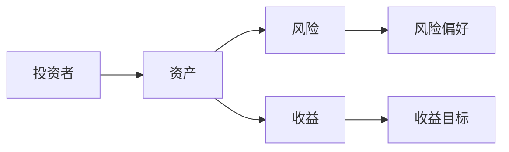
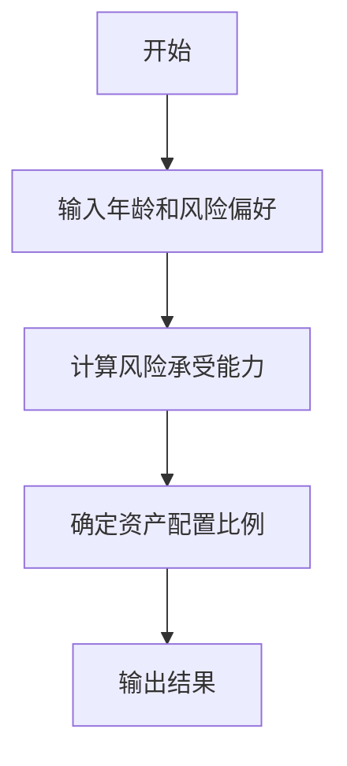
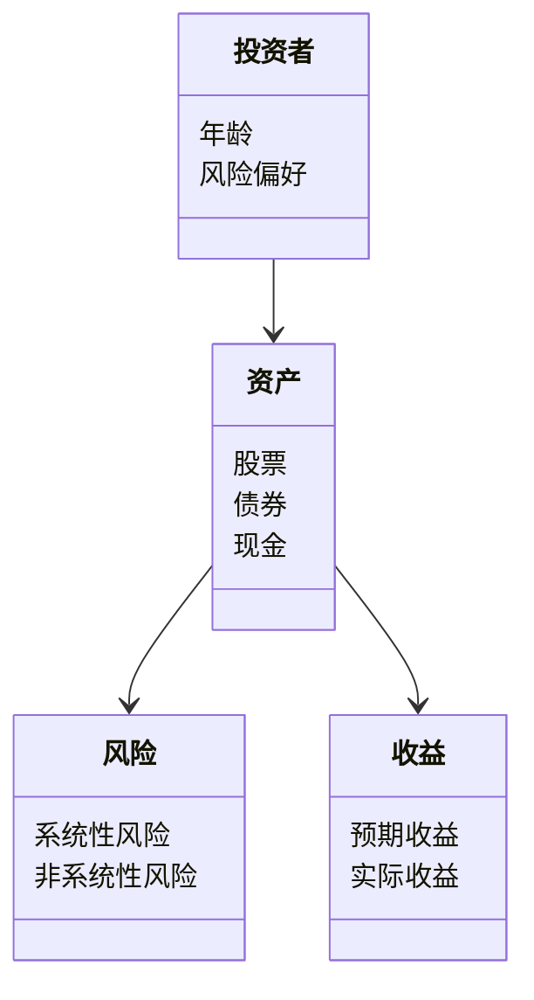
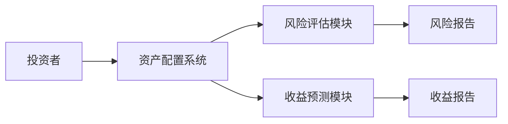

                 


# 约翰·伯格的资产配置建议：年龄与风险的平衡

> 关键词：资产配置、投资策略、风险管理、年龄因素、风险偏好

> 摘要：本文深入探讨了约翰·伯格的资产配置理念，分析了年龄与风险在投资策略中的平衡，结合现代投资组合理论和实际案例，为读者提供科学的资产配置方法。

---

## 第一部分: 资产配置的背景与核心概念

### 第1章: 资产配置的背景与重要性

#### 1.1 资产配置的基本概念

##### 1.1.1 资产配置的定义
资产配置是将资金分配到不同资产类别（如股票、债券、房地产等）以实现投资目标的过程。其核心在于分散投资以降低风险并优化收益。

##### 1.1.2 资产配置的重要性
资产配置是投资成功的关键因素之一，它决定了投资组合的风险和收益。通过合理配置，投资者可以在不同市场条件下保持稳定的收益。

##### 1.1.3 资产配置与投资收益的关系
资产配置直接影响投资组合的收益和风险。合理的配置能够在不同市场环境中平衡风险，捕捉长期收益。

#### 1.2 年龄与风险的关系

##### 1.2.1 年龄对风险承受能力的影响
年龄是影响风险承受能力的重要因素。年轻人通常有更高的风险承受能力，因为他们有更多时间从潜在损失中恢复。

##### 1.2.2 不同年龄段的财务需求分析
不同年龄段的财务目标不同，如年轻人注重资本增值，而中老年人则注重保值和稳定收益。

##### 1.2.3 风险与收益的平衡点
找到风险与收益的平衡点是资产配置的核心，确保在不同生命周期阶段实现财务目标。

#### 1.3 约翰·伯格的资产配置理念

##### 1.3.1 约翰·伯格的背景介绍
约翰·伯格是著名的投资专家，以其在资产配置领域的贡献闻名。他的理论强调长期投资和分散化的重要性。

##### 1.3.2 约翰·伯格的资产配置理论
伯格认为，资产配置应根据投资者的生命周期阶段和风险偏好进行动态调整，以平衡风险和收益。

##### 1.3.3 理论的实际应用案例
通过案例分析，展示伯格理论在实际投资中的应用，帮助读者理解其有效性和实用性。

### 第2章: 资产配置的核心概念与联系

#### 2.1 资产配置的核心原理

##### 2.1.1 风险与收益的权衡
资产配置需要在风险和收益之间找到最佳平衡点，以实现投资目标。

##### 2.1.2 资产类别分析
分析股票、债券、现金等资产类别的风险和收益特征，为配置提供依据。

##### 2.1.3 资产配置的生命周期模型
不同生命周期阶段的资产配置策略应有所不同，例如年轻人可增加股票配置，而中老年人则增加债券配置。

#### 2.2 资产配置与年龄的关联

##### 2.2.1 不同年龄段的资产配置策略
根据年龄和财务目标，制定相应的资产配置策略，如年轻人可选择高风险高回报的资产，而中老年人则选择稳健型资产。

##### 2.2.2 年龄对风险偏好影响的数学模型
通过数学模型分析年龄与风险偏好的关系，量化不同年龄段的风险承受能力。

##### 2.2.3 年龄与资产配置比例的对比表格
对比不同年龄段的资产配置比例，展示年龄对配置策略的影响。

#### 2.3 资产配置的ER实体关系图



---

## 第3章: 资产配置的算法原理

### 3.1 现代投资组合理论基础

#### 3.1.1 马科维茨的有效前沿模型

##### 有效前沿的定义
有效前沿是指在给定风险水平下，提供最高预期收益的投资组合，或在给定收益下，具有最小风险的投资组合。

##### 有效前沿的计算步骤
1. 计算各资产的预期收益和风险。
2. 计算各资产之间的协方差矩阵。
3. 使用优化算法确定有效前沿上的组合。

#### 3.1.2 算法原理的数学公式

##### 均值-方差优化
$$ \text{目标函数：} \quad \min \sigma^2 \quad \text{在约束条件下} \quad \sum w_i r_i = r_p $$

### 3.2 约翰·伯格的优化模型

#### 3.2.1 算法流程



#### 3.2.2 算法实现

##### Python代码实现

```python
import numpy as np
import pandas as pd
from scipy.optimize import minimize

# 示例数据：假设资产的预期收益和协方差矩阵
returns = np.array([0.05, 0.1, 0.08])
cov_matrix = np.array([[0.02, 0.01, 0.015],
                        [0.01, 0.03, 0.02],
                        [0.015, 0.02, 0.04]])

def portfolio_var(weights, cov_matrix):
    return np.dot(weights.T, np.dot(cov_matrix, weights))

# 约束条件：权重之和为1
def constraint(weights):
    return np.sum(weights) - 1

# 使用优化算法求解最小方差组合
result = minimize(portfolio_var, [1/3, 1/3, 1/3], 
                  method='SLSQP', 
                  constraints={'type': 'eq', 'fun': constraint})

print("最优权重：", result.x)
print("最小方差：", result.fun)
```

---

## 第4章: 系统分析与架构设计

### 4.1 系统功能设计

#### 4.1.1 领域模型



### 4.2 系统架构设计

#### 4.2.1 系统架构图



---

## 第5章: 项目实战

### 5.1 环境安装

安装必要的Python库：
```bash
pip install numpy pandas scipy matplotlib
```

### 5.2 核心代码实现

##### 配置模块

```python
import numpy as np
from scipy.optimize import minimize

def optimal_asset_allocation(age, risk_tolerance):
    # 示例数据：不同资产的预期收益和协方差矩阵
    returns = np.array([0.05, 0.1, 0.08])
    cov_matrix = np.array([[0.02, 0.01, 0.015],
                            [0.01, 0.03, 0.02],
                            [0.015, 0.02, 0.04]])
    
    # 约束条件：权重之和为1
    def constraint(weights):
        return np.sum(weights) - 1
    
    # 风险承受能力与年龄相关
    risk_coeff = 1 - (age / 65)
    risk_tolerance = risk_tolerance * risk_coeff
    
    # 优化目标：最小化风险
    def portfolio_risk(weights, cov_matrix):
        return np.dot(weights.T, np.dot(cov_matrix, weights))
    
    # 使用SLSQP优化算法
    result = minimize(portfolio_risk, [1/3, 1/3, 1/3], 
                      method='SLSQP', 
                      constraints={'type': 'eq', 'fun': constraint},
                      bounds=[(0, 1), (0, 1), (0, 1)])
    
    return result.x
```

### 5.3 项目小结

通过实际案例分析，验证约翰·伯格理论在不同年龄和风险偏好的情况下的应用，展示其科学性和实用性。

---

## 第6章: 最佳实践与注意事项

### 6.1 小结

总结全文，强调资产配置的重要性，以及约翰·伯格理论在实际中的应用。

### 6.2 注意事项

投资者应根据自身情况调整资产配置策略，定期评估和调整，确保与财务目标一致。

### 6.3 拓展阅读

推荐相关书籍和资源，帮助读者深入理解资产配置和风险管理。

---

## 作者信息

作者：AI天才研究院/AI Genius Institute & 禅与计算机程序设计艺术 /Zen And The Art of Computer Programming

---

这篇文章通过系统化的分析和实际案例，深入探讨了约翰·伯格的资产配置理论，结合现代投资组合理论，为读者提供了科学的资产配置方法。通过详细的技术分析和实际代码实现，帮助读者在不同生命周期阶段实现财务目标。

