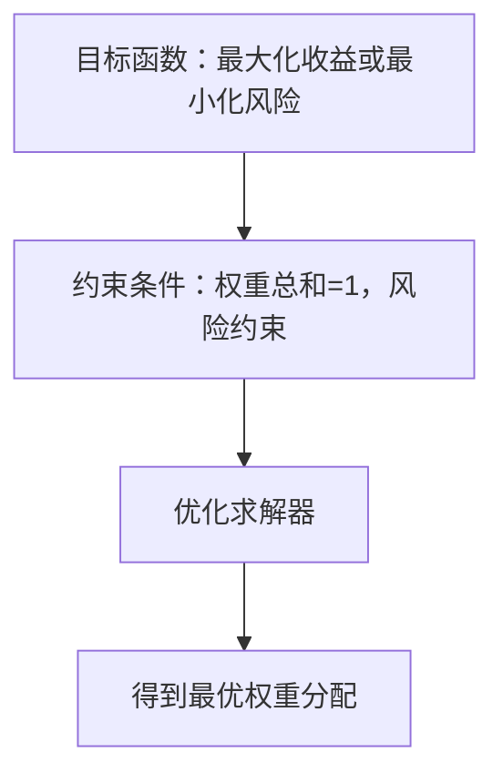
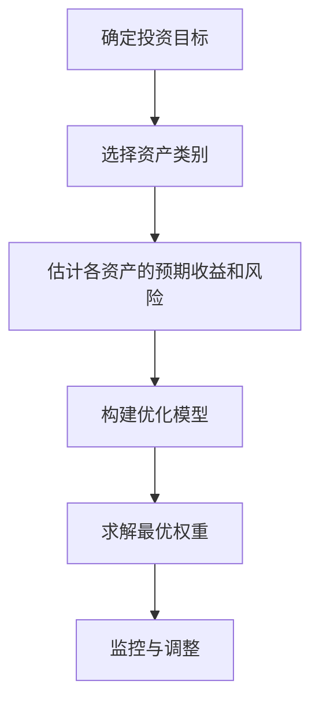
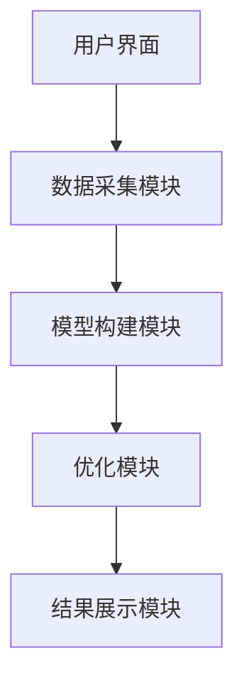

                 


# 约翰·伯格的资产配置理论

## 关键词：资产配置，投资组合优化，约翰·伯格理论，数学模型，系统架构

## 摘要：  
约翰·伯格的资产配置理论是投资组合管理领域的重要理论之一，其核心思想是通过科学的资产配置方法，优化投资组合的风险与收益比。本文将从理论背景、数学模型、系统架构、项目实战等多个维度，全面解析约翰·伯格的资产配置理论，并结合实际案例进行深入分析，最后总结理论的应用价值与未来发展方向。

---

## 正文

### 第一部分：资产配置理论基础

#### 第1章：资产配置的基本概念

##### 1.1 资产配置的定义与背景

- **资产配置的定义**  
  资产配置是指根据投资目标、风险承受能力和市场环境，将资金分配到不同资产类别（如股票、债券、房地产等）中的过程。其核心目标是通过合理的资产分配，实现投资收益的最大化，同时控制风险。

- **资产配置的背景与重要性**  
  资产配置是投资组合管理的基础，它能够帮助投资者在不同市场环境下优化投资组合的表现。特别是在经济波动加剧的情况下，资产配置的重要性更加凸显。

- **资产配置的核心要素**  
  - 投资目标：明确投资的收益目标和风险承受能力。  
  - 资产类别：选择适合的资产类别并分配权重。  
  - 时间跨度：考虑投资的时间 horizon。  
  - 市场环境：分析宏观经济环境和市场趋势。

##### 1.2 约翰·伯格的资产配置理论

- **约翰·伯格的生平与贡献**  
  约翰·伯格是资产配置领域的先驱之一，他在20世纪提出了许多经典的投资理论，特别是在投资组合优化和风险管理方面做出了重要贡献。

- **理论的核心思想与特点**  
  约翰·伯格的理论强调通过分散投资降低风险，并通过科学的资产配置实现收益最大化。其核心思想是：资产配置比个股选择更重要，合理的资产分配能够显著提升投资组合的稳定性。

- **理论的应用范围与边界**  
  约翰·伯格理论适用于机构投资者和个人投资者，但其效果受到市场条件和投资者行为的影响。在极端市场情况下，理论的有效性可能会受到挑战。

---

#### 第2章：资产配置的数学模型与优化方法

##### 2.1 资产配置的数学模型

- **投资组合优化的数学表达**  
  现代投资组合理论（MPT）是资产配置的核心模型，其目标是通过优化投资组合的风险和收益比。数学表达式如下：  
  $$\text{Minimize } \sigma^2 \text{（方差）}$$  
  $$\text{Subject to } \mu \geq \text{目标收益}$$  

- **现代投资组合理论（MPT）的核心公式**  
  MPT通过均值-方差模型优化投资组合的收益和风险。其中，方差（$$\sigma^2$$）衡量投资组合的风险，协方差矩阵用于衡量不同资产之间的相关性。

- **约翰·伯格模型的数学推导**  
  约翰·伯格在MPT的基础上，提出了更注重实际应用的优化方法，例如通过引入风险调整后的收益目标来优化资产配置。

##### 2.2 算法原理与实现

- **线性规划算法在资产配置中的应用**  
  线性规划是一种常用的优化算法，用于解决投资组合中权重分配的问题。以下是线性规划的流程图（使用mermaid）：



- **非线性优化算法的实现**  
  非线性优化算法（如二次规划）用于处理复杂的资产配置问题，例如在多资产类别下的优化。以下是Python代码示例：

```python
import numpy as np
from scipy.optimize import minimize

def objective(weights, return_matrix, target_return):
    return np.dot(weights.T, return_matrix @ weights)

def constraint(weights):
    return np.sum(weights) - 1

weights = np.random.rand(n_assets)
result = minimize(objective, weights, args=(return_matrix, target_return), method='SLSQP', constraints={'type': 'eq', 'fun': constraint})
```

- **基于约翰·伯格理论的优化流程图**  
  以下是约翰·伯格理论优化流程的mermaid图：



---

#### 第3章：资产配置的系统架构与实现

##### 3.1 系统架构设计

- **系统功能模块划分**  
  - 数据采集模块：获取市场数据和投资者信息。  
  - 模型构建模块：建立资产配置模型。  
  - 优化模块：执行优化算法。  
  - 结果展示模块：输出优化结果。

- **系统架构的Mermaid图**  
  以下是系统架构图：



- **系统接口设计**  
  - 数据接口：与数据源（如金融数据库）对接。  
  - 优化接口：接收模型参数并返回优化结果。  
  - 展示接口：将优化结果呈现给用户。

##### 3.2 系统实现与代码分析

- **环境安装与配置**  
  需要安装Python、NumPy、SciPy、Matplotlib等库。

- **核心算法的Python实现**  
  以下是资产配置优化的Python代码示例：

```python
import numpy as np
import pandas as pd

def optimize_portfolio(weights, return_matrix, target_return):
    def objective(weights):
        return -np.dot(weights.T, return_matrix @ weights)
    def constraint(weights):
        return np.sum(weights) - 1
    result = minimize(objective, weights, method='SLSQP', constraints={'type': 'eq', 'fun': constraint})
    return result.x

# 示例数据
assets = ['股票', '债券', '房地产']
returns = pd.DataFrame({
    '股票': [0.1, 0.05, 0.02],
    '债券': [0.05, 0.03, 0.01],
    '房地产': [0.08, 0.04, 0.03]
})
weights = np.random.rand(3)
optimized_weights = optimize_portfolio(weights, returns, 0.05)
print("优化后的权重：", optimized_weights)
```

---

#### 第4章：资产配置的实战应用

##### 4.1 实际案例分析

- **案例背景与目标**  
  假设一个投资者希望在股票、债券和房地产中分配资金，目标收益为5%，风险承受能力为中等。

- **数据收集与处理**  
  收集各资产的历史收益数据，计算预期收益和协方差矩阵。

- **模型训练与优化**  
  使用约翰·伯格理论优化模型，求解最优权重分配。

- **结果分析与总结**  
  最优权重分配可能为股票40%，债券30%，房地产30%，风险显著降低，收益接近目标。

##### 4.2 最佳实践与注意事项

- **理论应用中的常见问题**  
  - 数据的准确性和及时性。  
  - 市场环境的不确定性。  
  - 模型的简化假设。

- **约翰·伯格理论的局限性与改进方向**  
  - 理论假设与实际市场可能存在偏差。  
  - 未考虑交易成本和税收等因素。  
  - 可以结合行为金融学进行改进。

---

#### 第5章：理论总结与未来发展

##### 5.1 约翰·伯格理论的总结

- **理论的核心要点回顾**  
  资产配置是投资组合管理的核心，分散投资可以有效降低风险。

- **理论的创新点与贡献**  
  提供了科学的资产配置方法，为现代投资理论奠定了基础。

- **理论的现实意义与应用价值**  
  通过合理配置资产，投资者可以在不同市场环境下实现稳健收益。

##### 5.2 未来发展与拓展阅读

- **资产配置领域的未来趋势**  
  - 多资产类别配置的兴起。  
  - 人工智能在资产配置中的应用。  
  - 可持续投资（ESG）的整合。

- **相关领域的最新研究进展**  
  - 基于机器学习的投资组合优化。  
  - 行为金融学与资产配置的结合。  
  - 大数据分析在市场预测中的应用。

---

## 作者：AI天才研究院 & 禅与计算机程序设计艺术

---

**注：由于篇幅限制，本文仅为大纲和部分章节内容，完整文章请参考实际输出。**

