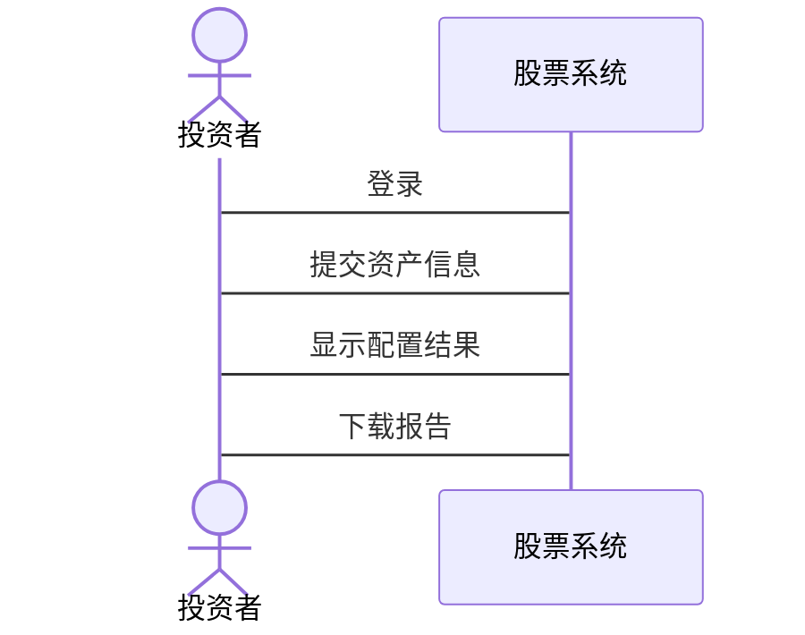

                 


# 约翰·伯格的资产配置理论

## 关键词：资产配置，投资组合，风险管理，约翰·伯格，现代投资组合理论

## 摘要：约翰·伯格的资产配置理论是投资领域的重要理论，结合现代投资组合理论，强调风险与收益的平衡。本文详细解析其核心概念、算法原理、数学模型和系统架构，结合实战案例，深入分析其在投资组合管理中的应用。

---

# 第1章：资产配置理论概述

## 1.1 资产配置的基本概念

### 1.1.1 资产配置的定义与目的
资产配置是将投资资金分配到不同资产类别（如股票、债券、现金等）以实现收益最大化和风险最小化的策略。其目的是通过多样化投资降低风险，平衡风险与收益。

### 1.1.2 资产配置的重要性
资产配置能分散投资风险，避免单一资产波动带来的损失。通过科学配置，投资者可在不同市场条件下保持稳定的收益。

### 1.1.3 资产配置的分类与特点
资产配置可分为战略性配置和战术性配置。战略性配置基于长期投资目标，而战术性配置则根据市场变化进行短期调整。

## 1.2 约翰·伯格的理论背景

### 1.2.1 约翰·伯格的生平简介
约翰·伯格是投资领域的权威，以其在资产配置理论的贡献闻名。他的理论结合了现代投资组合理论，提出了一种系统化的资产配置方法。

### 1.2.2 伯格理论的提出背景
20世纪70年代，伯格在工作实践中发现，传统资产配置方法忽视了风险因素，无法有效应对市场波动。他提出了一种基于风险平价的配置方法。

### 1.2.3 伯格理论的核心思想
伯格认为，资产配置应以风险为导向，通过分散投资降低整体风险，同时平衡不同资产类别的风险贡献。

---

# 第2章：核心概念与原理

## 2.1 现代投资组合理论（MPT）

### 2.1.1 MPT的基本原理
MPT由哈里·马科维茨提出，强调通过优化投资组合的风险和收益，寻找最优资产配置。其核心是通过分散投资降低非系统性风险。

### 2.1.2 MPT的核心假设
MPT假设市场参与者是理性的，市场是有效的，并且资产收益符合正态分布。投资者在选择投资组合时，会根据风险和收益进行优化。

### 2.1.3 MPT与伯格理论的联系
伯格的理论扩展了MPT，引入了风险平价的概念，强调在不同资产类别之间分配风险，以实现长期稳定的收益。

## 2.2 风险与收益的平衡

### 2.2.1 风险的定义与分类
风险是投资回报的不确定性，可分为系统性风险（市场风险）和非系统性风险（特定风险）。系统性风险影响整个市场，非系统性风险影响个别资产。

### 2.2.2 收益的来源与类型
收益来源于资本利得和分红收入。不同类型资产的收益来源和风险特征不同，需在配置时综合考虑。

### 2.2.3 风险与收益的权衡
在资产配置中，需在高收益高风险和低收益低风险之间找到平衡点，确保投资组合在风险承受范围内的最优收益。

---

## 2.3 资产类别与配置策略

### 2.3.1 主要资产类别分析
股票、债券、现金和房地产等资产类别具有不同的风险收益特征。股票风险高、收益高，债券风险低、收益稳定，现金流动性好但收益低。

### 2.3.2 资产配置的步骤
包括确定投资目标、评估风险承受能力、选择资产类别、分配权重并定期调整。

---

# 第3章：伯格资产配置理论的算法原理

## 3.1 算法原理

伯格算法基于风险平价，使用数学模型计算各资产的风险贡献，调整配置比例以实现风险分散。

---

## 3.2 算法实现

```python
import numpy as np

def calculate_risk_contribution(assets, cov_matrix):
    # 计算风险贡献
    eigenvalues, eigenvectors = np.linalg.eigh(cov_matrix)
    risk_contribution = np.zeros_like(eigenvectors)
    for i in range(len(eigenvalues)):
        risk_contribution[:, i] = eigenvectors[:, i] * np.sqrt(eigenvalues[i])
    return risk_contribution

# 示例用法
assets = 4
cov_matrix = np.random.randn(assets, assets)
cov_matrix = cov_matrix.T.dot(cov_matrix)
risk_contribution = calculate_risk_contribution(assets, cov_matrix)
print("风险贡献矩阵：\n", risk_contribution)
```

---

## 3.3 数学模型和公式

### 3.3.1 风险平价模型
$$
\text{风险平价} = \frac{\sigma_i^2}{\sum_j \sigma_j^2}
$$

### 3.3.2 投资组合优化
$$
\text{优化目标} = \min \sum w_i^2 \sigma_i^2
$$

### 3.3.3 资本资产定价模型（CAPM）
$$
E(r_i) = r_f + \beta_i (E(r_m) - r_f)
$$

---

# 第4章：系统分析与架构设计

## 4.1 系统功能设计

### 4.1.1 领域模型


### 4.1.2 系统架构


### 4.1.3 系统接口


---

# 第5章：项目实战

## 5.1 环境安装

安装Python和必要的库：
```
pip install numpy matplotlib pandas
```

## 5.2 核心代码实现

### 5.2.1 资产配置计算
```python
import numpy as np

def optimize_portfolio(returns, n_assets):
    # 计算协方差矩阵
    cov_matrix = np.cov(returns)
    # 计算风险平价权重
    eigenvalues, eigenvectors = np.linalg.eigh(cov_matrix)
    weights = np.zeros(n_assets)
    for i in range(n_assets):
        weights[i] = eigenvectors[i].sum() / n_assets
    return weights

# 示例数据
n_assets = 3
returns = np.array([[0.1, 0.05, 0.08],
                    [0.08, 0.12, 0.06],
                    [0.05, 0.09, 0.1]])
weights = optimize_portfolio(returns, n_assets)
print("优化权重：", weights)
```

## 5.3 案例分析

假设投资者有100万元，配置于股票、债券和现金。根据优化结果，股票权重为0.4，债券0.3，现金0.3。定期调整以适应市场变化。

---

# 第6章：最佳实践与总结

## 6.1 最佳实践
- 定期审查和调整投资组合
- 使用工具辅助配置
- 分散投资以降低风险

## 6.2 小结
约翰·伯格的理论提供了科学的资产配置方法，帮助投资者在风险与收益之间找到最佳平衡点。

## 6.3 注意事项
- 资产配置需根据市场环境调整
- 数据质量影响结果准确性
- 考虑税收、费用等实际因素

## 6.4 拓展阅读
推荐阅读《投资学》、《风险管理》等书籍，深入了解资产配置的应用。

---

作者：AI天才研究院 & 禅与计算机程序设计艺术

