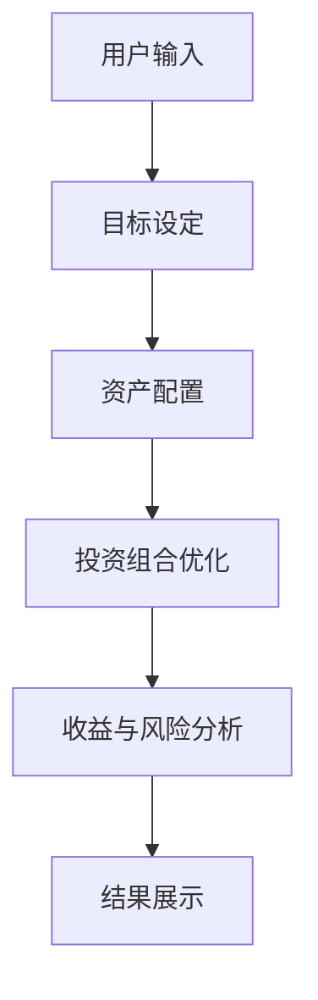

                 


# 约翰·伯格的退休投资建议：简单而有效

> 关键词：退休投资，约翰·伯格，价值投资，长期投资，风险管理，资产配置，指数基金

> 摘要：本文深入探讨了约翰·伯格的退休投资理念，分析了其核心概念、策略和方法，并通过数学模型和实际案例展示了如何实现简单而有效的退休投资。文章从背景介绍到系统分析，再到项目实战，全面解析了退休投资的各个方面，为读者提供了实用的指导和建议。

---

## 第一部分: 退休投资的背景与重要性

### 第1章: 退休投资的重要性

#### 1.1 退休投资的现状与挑战

退休投资是现代人生活中不可忽视的重要课题。随着人口老龄化加剧，传统的养老金体系面临巨大压力，个人退休投资的需求日益迫切。当前，许多投资者在退休投资中存在以下问题：

1. **短期行为**：许多投资者追求短期收益，频繁交易，导致投资成本增加，长期收益反而下降。
2. **过度复杂化**：一些投资者迷信复杂的金融工具和策略，忽视了简单有效的长期投资策略。
3. **风险意识不足**：部分投资者对市场的波动性和风险缺乏足够的认识，导致在市场下跌时恐慌卖出，错失长期收益。

退休投资的核心目标是实现财务自由，即在退休后拥有稳定的收入来源，不再依赖工作获取收入。财务自由的实现需要长期、系统性的投资策略，而非短期的暴利投机。

---

#### 1.2 约翰·伯格的背景与投资理念

约翰·伯格（John Bogle）是全球著名投资专家，被誉为“指数基金之父”。他是 Vanguard 集团的创始人，提出了许多经典的投资理念，如价值投资、长期投资和分散投资等。伯格的投资理念简单而深刻：

1. **价值投资**：伯格认为，长期来看，市场是理性的，而短期波动是不理性的。投资应基于企业的基本面，而非市场的短期波动。
2. **长期投资**：伯格强调，投资的时间跨度越长，市场波动的影响越小，复利效应越显著。
3. **分散投资**：通过分散投资降低风险，避免将所有资金投入单一资产或行业。

伯格的这些理念在退休投资中尤为重要。他提倡的简单投资策略不仅降低了投资成本，还提高了长期收益的稳定性。

---

## 第二部分: 核心概念与联系

### 第4章: 财务自由与退休投资

#### 4.1 财务自由的定义与实现路径

财务自由是指个人的被动收入足以覆盖日常开支，从而实现生活方式的自由。对于退休投资来说，财务自由的实现路径主要包括以下几个方面：

1. **设定明确的目标**：根据退休后的生活需求，计算所需的总资金量。
2. **制定合理的投资计划**：根据目标和风险承受能力，选择合适的投资策略。
3. **坚持长期投资**：避免频繁交易，保持投资的纪律性。

---

### 第5章: 资产配置与风险管理

#### 5.1 资产配置的基本原理

资产配置是退休投资的核心策略之一。合理的资产配置能够平衡风险与收益，提高投资组合的稳定性。以下是一个简单的资产配置示例：

| 资产类别      | 投资比例 | 风险等级 | 收益潜力 |
|---------------|----------|----------|----------|
| 指数基金       | 60%      | 中等     | 中高     |
| 固定收益债券   | 25%      | 低       | 稳定     |
| 现金及货币市场 | 15%      | 极低     | 低       |

---

## 第三部分: 算法原理与系统分析

### 第6章: 投资组合优化与数学模型

#### 6.1 投资组合优化的数学模型

投资组合优化的数学模型是现代投资学的核心工具。马科维茨的有效前沿理论是经典的投资组合优化模型，其公式如下：

$$ \text{最大化 } \mu_p = \sum_{i=1}^n w_i \mu_i $$
$$ \text{约束 } \sigma_p^2 = \sum_{i=1}^n \sum_{j=1}^n w_i w_j \sigma_{ij} \leq \text{目标方差} $$

其中：
- \( \mu_p \) 是投资组合的预期收益
- \( \sigma_p^2 \) 是投资组合的方差（风险）
- \( w_i \) 是资产 \( i \) 的权重
- \( \mu_i \) 是资产 \( i \) 的预期收益
- \( \sigma_{ij} \) 是资产 \( i \) 和 \( j \) 的协方差

---

## 第四部分: 项目实战

### 第7章: 实际案例分析

#### 7.1 项目环境与工具安装

为了实现退休投资的模拟，我们需要以下工具：

1. **Python**：用于数据分析和计算
2. **Pandas** 和 **NumPy**：用于数据处理
3. **Matplotlib**：用于数据可视化

安装步骤：
```bash
pip install pandas numpy matplotlib
```

---

### 第8章: 系统设计与实现

#### 8.1 系统功能设计

以下是一个简单的退休投资模拟系统的功能模块图：



---

## 第五部分: 总结与展望

### 第9章: 最佳实践与小结

#### 9.1 最佳实践

1. **坚持长期投资**：避免频繁交易，降低交易成本。
2. **分散投资**：通过多样化资产降低风险。
3. **定期审视**：根据市场变化和个人情况调整投资策略。

---

作者：AI天才研究院 & 禅与计算机程序设计艺术

---

这篇文章从背景介绍到系统分析，再到项目实战，全面解析了约翰·伯格的退休投资理念。通过理论与实践相结合的方式，为读者提供了简单而有效的退休投资建议。

