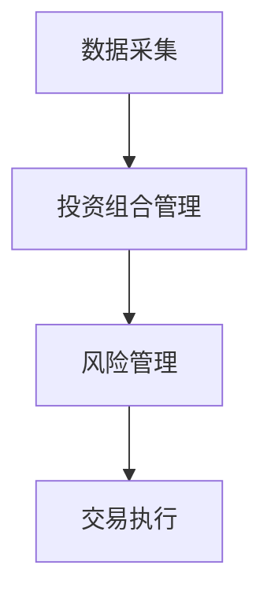
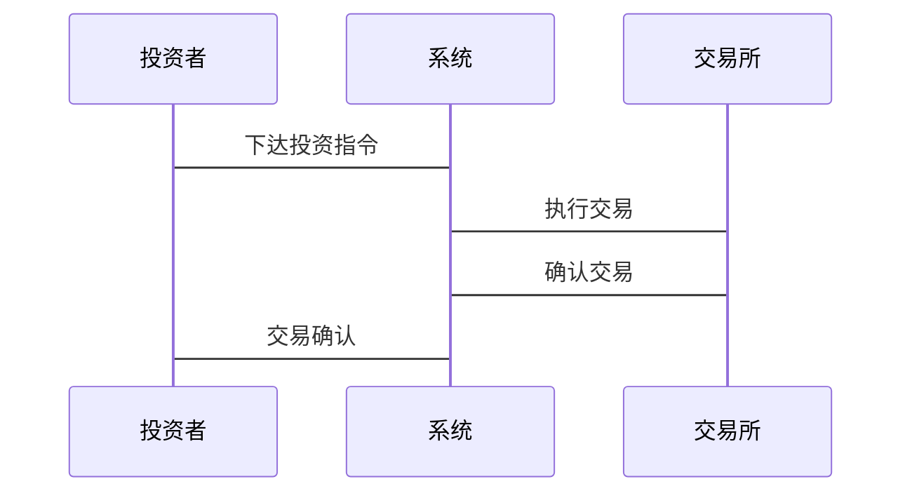

                 


# 约翰·伯格的遗产：被动投资的未来

> 关键词：被动投资，约翰·伯格，指数基金，ETF，投资策略，数学模型，系统架构

> 摘要：被动投资作为一种低风险、低成本的投资策略，近年来在全球范围内得到了广泛应用。本文将深入探讨被动投资的核心概念、数学模型、系统架构以及实际应用，并结合约翰·伯格的遗产，分析被动投资的未来发展趋势。

---

## 第1章: 被动投资的背景与概念

### 1.1 被动投资的定义与特点

被动投资是一种以指数基金或交易所交易基金（ETF）为主要工具的投资策略，其核心目标是通过跟踪特定市场指数的表现来实现长期稳定的收益。与主动投资不同，被动投资不依赖于对市场的预测或个股的选择，而是通过分散投资来降低风险。

#### 1.1.1 被动投资的定义
被动投资是指通过购买和持有特定市场指数的成分股，以跟踪该指数表现的投资策略。被动投资者相信市场是有效的，因此试图通过复制市场表现来获得长期收益。

#### 1.1.2 被动投资的核心特点
- **分散投资**：通过投资一篮子股票或债券，降低单一资产的风险。
- **低成本**：被动投资的管理费用较低，因为指数基金的运作成本通常较低。
- **长期稳定**：被动投资注重长期收益，而非短期收益波动。

#### 1.1.3 被动投资与主动投资的区别
| 方面 | 被动投资 | 主动投资 |
|------|----------|----------|
| 管理方式 | 跟踪指数 | 主动选股、择时 |
| 成本 | 低 | 高 |
| 风险 | 低 | 高 |
| 收益 | 稳定 | 波动大 |

### 1.2 约翰·伯格与被动投资的起源

#### 1.2.1 约翰·伯格的生平简介
约翰·伯格（John C. Bogle）是被动投资的先驱，被誉为“指数基金之父”。他是Vanguard集团的创始人，致力于为投资者提供低成本、高质量的投资工具。

#### 1.2.2 约翰·伯格对被动投资的贡献
伯格于1975年推出了第一只现代意义上的指数基金——Vanguard 500指数基金（VFIAX），标志着被动投资的兴起。他倡导低成本、分散化的投资理念，为全球投资者提供了新的选择。

#### 1.2.3 被动投资的兴起与发展趋势
被动投资的兴起源于市场有效性的假设，即市场难以被预测和击败。随着技术的进步和信息的透明化，被动投资逐渐成为主流，尤其是在机构投资者和个人投资者中。

### 1.3 被动投资的市场环境与应用背景

#### 1.3.1 被动投资的市场环境分析
- **市场有效性**：被动投资假设市场是有效的，因此试图击败市场是不现实的。
- **技术进步**：现代技术使得指数基金和ETF的运作更加高效。
- **成本下降**：被动投资的成本较低，适合长期投资。

#### 1.3.2 被动投资的适用场景与边界
- **长期投资**：适合追求长期稳定收益的投资者。
- **分散投资**：适合希望通过降低风险的投资者。
- **低成本需求**：适合对管理费用敏感的投资者。

---

## 第2章: 指数基金与被动投资策略

### 2.1 指数基金的定义与运作机制

#### 2.1.1 指数基金的定义
指数基金是一种跟踪特定市场指数的基金，其投资组合与该指数的成分股相同。指数基金的目标是复制指数的表现，而不是超越它。

#### 2.1.2 指数基金的运作流程
1. **选择指数**：选择一个合适的市场指数，如标普500指数。
2. **购买成分股**：购买该指数的所有成分股，按比例分配投资。
3. **定期再平衡**：定期调整投资组合，以保持与指数的一致性。

#### 2.1.3 指数基金的费用结构
- **管理费**：指数基金的管理费通常较低，因为其运作简单。
- **交易费用**：指数基金的交易费用由投资者承担。

### 2.2 被动投资的核心策略

#### 2.2.1 指数化投资策略
指数化投资策略是被动投资的核心，通过跟踪市场指数来实现收益。这种方法避免了主动管理的高成本和高风险。

#### 2.2.2 定量宽松与被动投资
定量宽松是一种货币政策工具，通过购买长期资产来降低利率。被动投资在定量宽松环境下表现良好，因为央行的资产购买推高了资产价格。

#### 2.2.3 被动投资的风险管理
被动投资通过分散投资降低了非系统性风险，但仍然面临系统性风险，如市场崩盘或经济衰退。

### 2.3 指数基金的优缺点分析

#### 2.3.1 指数基金的优点
- **分散风险**：投资于多个资产，降低单一资产的风险。
- **低成本**：管理费用低，适合长期投资。
- **透明化**：指数基金的成分股公开透明。

#### 2.3.2 指数基金的缺点
- **无法跑赢市场**：被动投资的目标是复制市场表现，而非超越市场。
- **系统性风险**：无法避免市场整体下跌的风险。
- **流动性限制**：某些指数基金可能流动性不足。

---

## 第3章: ETF（交易所交易基金）与被动投资

### 3.1 ETF的定义与特点

#### 3.1.1 ETF的定义
ETF是一种在交易所上市交易的基金，其成分股与指数一致，投资者可以在市场上随时买卖ETF。

#### 3.1.2 ETF的核心特点
- **流动性高**：ETF可以在交易所随时买卖，流动性好。
- **透明化**：ETF的成分股和权重公开透明。
- **费用低**：ETF的管理费用通常低于主动管理的基金。

#### 3.1.3 ETF与传统指数基金的区别
| 方面 | ETF | 指数基金 |
|------|-----|----------|
| 交易方式 | 上市交易 | 按份额购买 |
| 流动性 | 高 | 中 |
| 费用 | 低 | 中 |

### 3.2 ETF的运作机制与风险管理

#### 3.2.1 ETF的运作流程
1. **选择指数**：选择一个合适的市场指数。
2. **发行和上市**：ETF在交易所上市，投资者可以买卖ETF份额。
3. **申购和赎回**：投资者可以通过申购和赎回ETF份额，但通常需要大额交易。

#### 3.2.2 ETF的风险管理策略
- **套利机制**：通过套利机制确保ETF的市场价格与 NAV 一致。
- **流动性管理**：保持足够的流动性，避免市场波动对ETF价格的影响。

#### 3.2.3 ETF的流动性问题
ETF的流动性通常较好，但某些小规模的ETF可能流动性不足，导致买卖价差较大。

### 3.3 ETF在被动投资中的应用

#### 3.3.1 ETF的投资策略
- **分散投资**：通过投资多个ETF实现分散化。
- **定期再平衡**：定期调整ETF投资组合，保持与目标指数一致。

#### 3.3.2 ETF的市场定位
ETF作为一种灵活的投资工具，适合短期交易和长期投资，广泛应用于各种市场环境。

#### 3.3.3 ETF的未来发展趋势
随着技术的进步和市场的成熟，ETF的种类和数量将不断增加，被动投资将更加普及。

---

## 第4章: 被动投资的数学模型与算法原理

### 4.1 被动投资的数学模型

#### 4.1.1 现代投资组合理论（MPT）
现代投资组合理论由哈里·马科维茨提出，认为最优投资组合应基于风险和收益的权衡。

#### 4.1.2 资本资产定价模型（CAPM）
CAPM用于计算资产的预期收益，公式为：
$$ E(r_i) = r_f + \beta_i (r_m - r_f) $$
其中，$E(r_i)$ 是资产的预期收益，$r_f$ 是无风险利率，$\beta_i$ 是资产的贝塔系数，$r_m$ 是市场预期收益。

#### 4.1.3 指数基金的收益计算公式
指数基金的收益通常接近其跟踪的指数收益，可以用以下公式表示：
$$ R_{\text{fund}} = \alpha + \beta R_{\text{market}} + \epsilon $$
其中，$\alpha$ 是超额收益，$\beta$ 是贝塔系数，$R_{\text{market}}$ 是市场收益，$\epsilon$ 是误差项。

### 4.2 被动投资的算法原理

#### 4.2.1 指数基金的权重分配算法
指数基金的权重分配基于指数成分股的市值比例，通常采用市值加权法。

#### 4.2.2 ETF的交易策略算法
ETF的交易策略包括买入并持有、定期再平衡等，具体策略取决于投资者的目标和风险承受能力。

#### 4.2.3 被动投资的风险评估算法
通过计算投资组合的波动率和相关系数，评估被动投资的风险。

### 4.3 被动投资的数学公式与实例分析

#### 4.3.1 被动投资的收益计算公式
假设一个指数基金跟踪标普500指数，过去一年的收益率为8%，则该指数基金的预期收益率也为8%。

#### 4.3.2 被动投资的风险评估公式
波动率是衡量风险的重要指标，可以用标准差表示：
$$ \sigma = \sqrt{\frac{1}{n}\sum_{i=1}^{n}(R_i - \bar{R})^2} $$
其中，$R_i$ 是第i个收益，$\bar{R}$ 是平均收益，$n$ 是收益的个数。

#### 4.3.3 实际案例分析与公式应用
假设一个指数基金投资于标普500指数，过去五年的年化收益为8%，波动率为12%。则该指数基金的风险调整后收益可以用夏普比率衡量：
$$ \text{夏普比率} = \frac{R_p - R_f}{\sigma_p} $$
假设无风险利率为2%，则夏普比率为：
$$ \text{夏普比率} = \frac{8\% - 2\%}{12\%} = 0.5 $$

---

## 第5章: 被动投资的系统架构与技术实现

### 5.1 被动投资系统的架构设计

#### 5.1.1 系统功能模块划分
- 数据采集模块：采集市场数据和指数成分股信息。
- 投资组合管理模块：根据指数成分股分配权重，构建投资组合。
- 风险管理模块：评估投资组合的风险，调整投资策略。
- 交易执行模块：执行买卖指令，确保投资组合与指数一致。

#### 5.1.2 系统架构图


### 5.2 被动投资系统的实现细节

#### 5.2.1 数据采集与处理
数据采集模块需要实时采集市场数据，包括指数成分股的价格和权重。

#### 5.2.2 投资组合管理
投资组合管理模块根据指数成分股的权重分配资金，确保投资组合与指数一致。

#### 5.2.3 系统接口设计
系统需要与交易所接口对接，确保交易指令的执行。

### 5.3 被动投资系统的交互设计

#### 5.3.1 交互流程图


---

## 第6章: 项目实战——被动投资系统的实现

### 6.1 项目环境安装

#### 6.1.1 系统需求
- 操作系统：Windows/Mac/Linux
- 编程语言：Python
- 开发工具：IDE（如PyCharm）
- 数据源：Yahoo Finance API

### 6.2 核心实现代码

#### 6.2.1 数据采集代码
```python
import yfinance as yf

def get_data(tickers):
    data = yf.download(tickers, start='2020-01-01', end='2023-12-31')
    return data

tickers = ['AAPL', 'MSFT', 'GOOGL']
data = get_data(tickers)
print(data)
```

#### 6.2.2 投资组合管理代码
```python
import pandas as pd

def calculate_weights(data):
    total = data.sum()
    weights = data.div(total)
    return weights

weights = calculate_weights(data)
print(weights)
```

### 6.3 代码应用解读与分析

#### 6.3.1 数据采集与处理
数据采集代码从Yahoo Finance API获取指数成分股的历史数据，用于后续分析。

#### 6.3.2 投资组合管理
通过计算各成分股的权重，构建指数基金的投资组合。

#### 6.3.3 风险管理
通过计算波动率和夏普比率，评估投资组合的风险，并进行必要的调整。

### 6.4 实际案例分析

#### 6.4.1 投资组合构建
假设跟踪标普500指数，构建一个包含10只成分股的投资组合，计算各成分股的权重。

#### 6.4.2 投资组合优化
通过再平衡投资组合，保持与指数一致。

### 6.5 项目小结

被动投资系统通过自动化的方式实现投资组合的构建和管理，降低了人工干预的成本和风险，是一种高效的投资方式。

---

## 第7章: 总结与展望

### 7.1 总结
被动投资作为一种低成本、低风险的投资策略，通过指数基金和ETF实现长期稳定的收益。约翰·伯格的遗产推动了被动投资的发展，使其成为全球投资者的重要选择。

### 7.2 展望
随着技术的进步和市场的成熟，被动投资将更加普及，指数基金和ETF的种类和数量将进一步增加，被动投资的未来将更加光明。

---

## 作者：AI天才研究院/AI Genius Institute & 禅与计算机程序设计艺术 /Zen And The Art of Computer Programming

---

通过以上内容，我们详细探讨了被动投资的核心概念、数学模型、系统架构以及实际应用。结合约翰·伯格的遗产，我们分析了被动投资的未来发展趋势，为投资者提供了全面的视角和实践指导。

